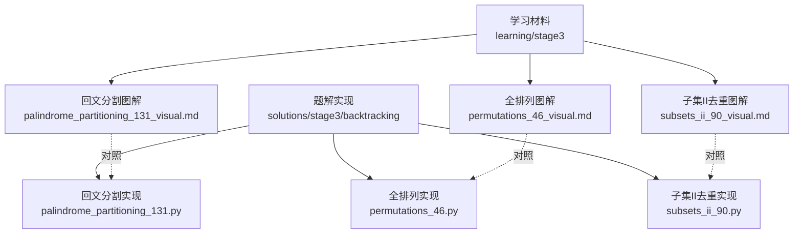
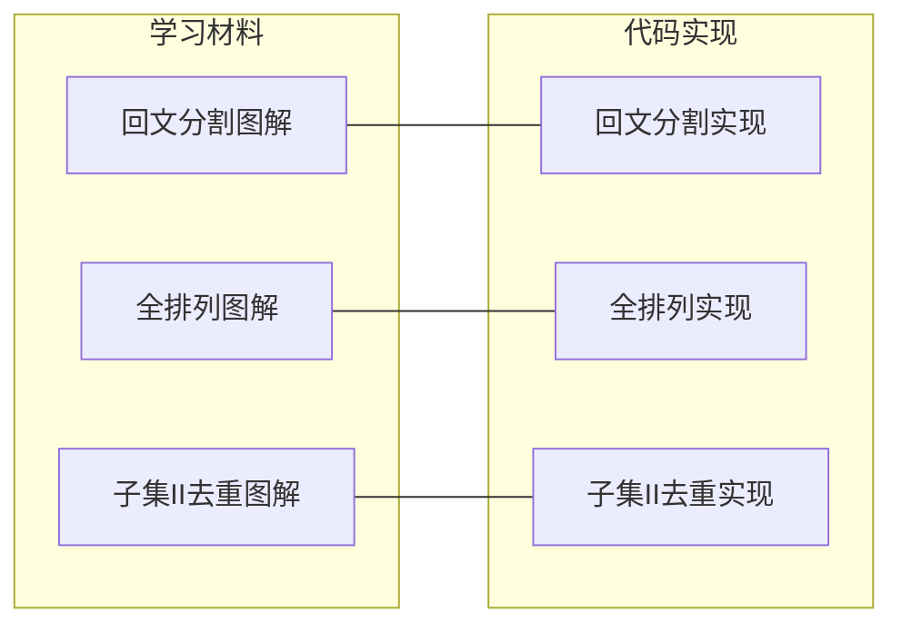
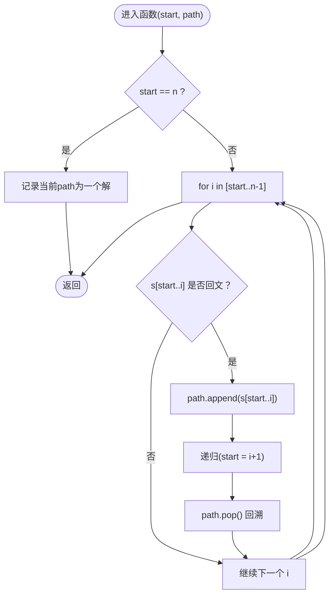
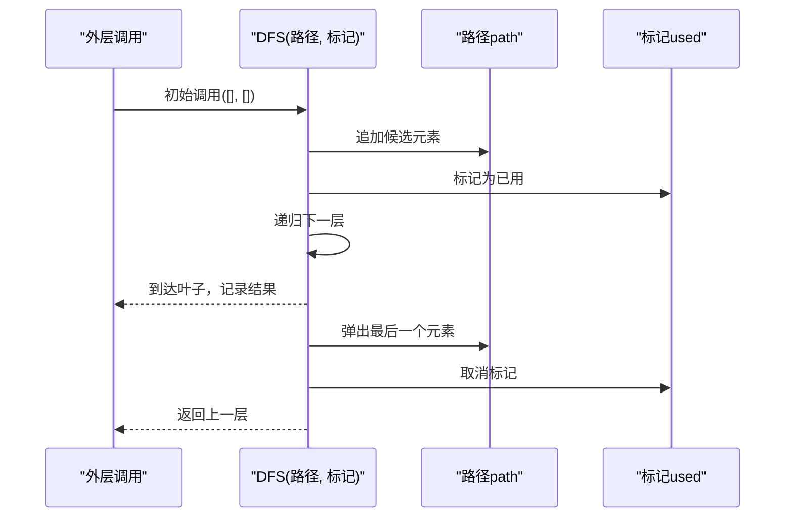
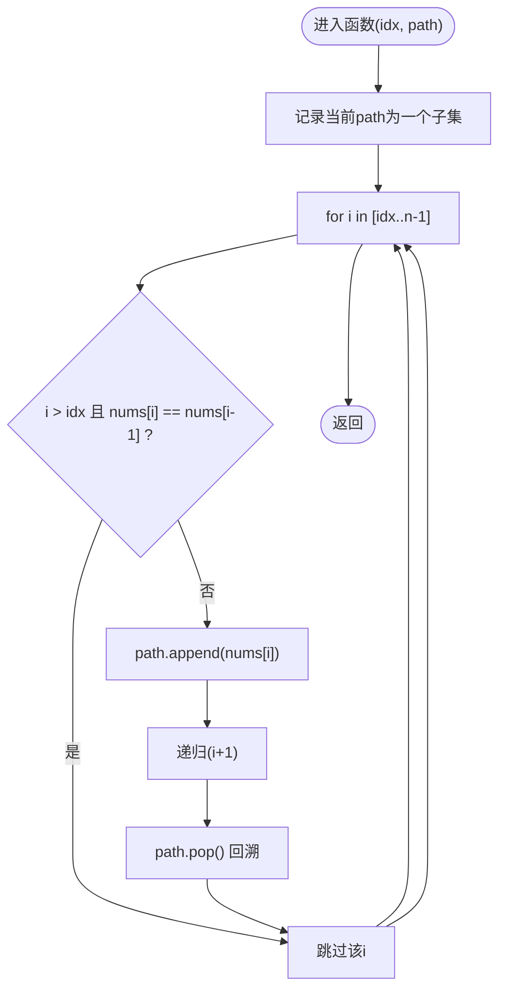
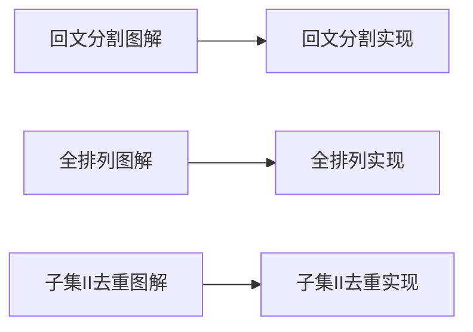

# 可视化学习辅助

<cite>
**本文引用的文件**   
- [learning/stage3/palindrome_partitioning_131_visual.md](file://learning/stage3/palindrome_partitioning_131_visual.md)
- [learning/stage3/permutations_46_visual.md](file://learning/stage3/permutations_46_visual.md)
- [learning/stage3/subsets_ii_90_visual.md](file://learning/stage3/subsets_ii_90_visual.md)
- [solutions/stage3/backtracking/palindrome_partitioning_131.py](file://solutions/stage3/backtracking/palindrome_partitioning_131.py)
- [solutions/stage3/backtracking/permutations_46.py](file://solutions/stage3/backtracking/permutations_46.py)
- [solutions/stage3/backtracking/subsets_ii_90.py](file://solutions/stage3/backtracking/subsets_ii_90.py)
</cite>

## 目录
1. [简介](#简介)
2. [项目结构](#项目结构)
3. [核心组件](#核心组件)
4. [架构总览](#架构总览)
5. [详细组件分析](#详细组件分析)
6. [依赖分析](#依赖分析)
7. [性能考虑](#性能考虑)
8. [故障排查指南](#故障排查指南)
9. [结论](#结论)
10. [附录](#附录)

## 简介
本可视化学习辅助文档聚焦于三类经典回溯问题：回文分割、全排列与子集II去重。通过图解方法，帮助学习者直观理解状态变化、决策过程与剪枝路径，并给出交互式学习与自绘图解的实践建议，最终将可视化理解与实际代码实现相结合，提升算法学习的效率与深度。

## 项目结构
仓库采用“学习材料 + 题解实现”的双轨组织方式：
- learning/stage3 下提供针对三个问题的可视化学习材料（图解、步骤说明等）
- solutions/stage3/backtracking 下提供对应问题的标准回溯实现

图表来源
- [learning/stage3/palindrome_partitioning_131_visual.md](file://learning/stage3/palindrome_partitioning_131_visual.md)
- [learning/stage3/permutations_46_visual.md](file://learning/stage3/permutations_46_visual.md)
- [learning/stage3/subsets_ii_90_visual.md](file://learning/stage3/subsets_ii_90_visual.md)
- [solutions/stage3/backtracking/palindrome_partitioning_131.py](file://solutions/stage3/backtracking/palindrome_partitioning_131.py)
- [solutions/stage3/backtracking/permutations_46.py](file://solutions/stage3/backtracking/permutations_46.py)
- [solutions/stage3/backtracking/subsets_ii_90.py](file://solutions/stage3/backtracking/subsets_ii_90.py)

章节来源
- [learning/stage3/palindrome_partitioning_131_visual.md](file://learning/stage3/palindrome_partitioning_131_visual.md)
- [learning/stage3/permutations_46_visual.md](file://learning/stage3/permutations_46_visual.md)
- [learning/stage3/subsets_ii_90_visual.md](file://learning/stage3/subsets_ii_90_visual.md)
- [solutions/stage3/backtracking/palindrome_partitioning_131.py](file://solutions/stage3/backtracking/palindrome_partitioning_131.py)
- [solutions/stage3/backtracking/permutations_46.py](file://solutions/stage3/backtracking/permutations_46.py)
- [solutions/stage3/backtracking/subsets_ii_90.py](file://solutions/stage3/backtracking/subsets_ii_90.py)

## 核心组件
- 回文分割可视化：以“区间选择 + 回文判定 + 回溯分支”为主线，展示每次切分后的状态与可行性判断。
- 全排列可视化：以“递归调用栈 + 已选集合/访问标记”为核心，呈现每一步的决策与回溯恢复。
- 子集II去重可视化：以“排序 + 同层去重剪枝”为关键，演示如何避免重复子集并压缩搜索空间。

章节来源
- [learning/stage3/palindrome_partitioning_131_visual.md](file://learning/stage3/palindrome_partitioning_131_visual.md)
- [learning/stage3/permutations_46_visual.md](file://learning/stage3/permutations_46_visual.md)
- [learning/stage3/subsets_ii_90_visual.md](file://learning/stage3/subsets_ii_90_visual.md)

## 架构总览
下图展示了“学习材料 ↔ 代码实现”的映射关系，便于在图解与源码之间快速定位与对照。

图表来源
- [learning/stage3/palindrome_partitioning_131_visual.md](file://learning/stage3/palindrome_partitioning_131_visual.md)
- [learning/stage3/permutations_46_visual.md](file://learning/stage3/permutations_46_visual.md)
- [learning/stage3/subsets_ii_90_visual.md](file://learning/stage3/subsets_ii_90_visual.md)
- [solutions/stage3/backtracking/palindrome_partitioning_131.py](file://solutions/stage3/backtracking/palindrome_partitioning_131.py)
- [solutions/stage3/backtracking/permutations_46.py](file://solutions/stage3/backtracking/permutations_46.py)
- [solutions/stage3/backtracking/subsets_ii_90.py](file://solutions/stage3/backtracking/subsets_ii_90.py)

## 详细组件分析

### 回文分割（Palindromic Partitioning）
- 目标：将字符串划分为若干子串，使得每个子串都是回文。
- 关键思想：从当前位置开始枚举所有可能的回文前缀，若为回文则加入当前路径并继续递归；否则跳过。
- 状态表示：
  - 当前起始位置 start
  - 当前路径 path（已确定的回文片段序列）
- 决策过程：
  - 对每个 i ∈ [start, n)，检查 s[start..i] 是否为回文
  - 若是：path.append(s[start..i])，递归处理 i+1，再回溯移除
  - 若否：直接跳过
- 终止条件：start == n，记录一次有效划分

图表来源
- [learning/stage3/palindrome_partitioning_131_visual.md](file://learning/stage3/palindrome_partitioning_131_visual.md)
- [solutions/stage3/backtracking/palindrome_partitioning_131.py](file://solutions/stage3/backtracking/palindrome_partitioning_131.py)

章节来源
- [learning/stage3/palindrome_partitioning_131_visual.md](file://learning/stage3/palindrome_partitioning_131_visual.md)
- [solutions/stage3/backtracking/palindrome_partitioning_131.py](file://solutions/stage3/backtracking/palindrome_partitioning_131.py)

### 全排列（Permutations）
- 目标：生成给定数组的所有排列。
- 关键思想：使用“已选集合/访问标记”控制每个元素在每个位置只能出现一次。
- 状态表示：
  - 当前路径 path
  - 访问标记 used（或等价结构）
- 决策过程：
  - 遍历所有索引 i
  - 若 i 未被使用：标记使用，path.append(nums[i])，递归下一层，然后回溯恢复
- 终止条件：len(path) == n，记录一个完整排列

图表来源
- [learning/stage3/permutations_46_visual.md](file://learning/stage3/permutations_46_visual.md)
- [solutions/stage3/backtracking/permutations_46.py](file://solutions/stage3/backtracking/permutations_46.py)

章节来源
- [learning/stage3/permutations_46_visual.md](file://learning/stage3/permutations_46_visual.md)
- [solutions/stage3/backtracking/permutations_46.py](file://solutions/stage3/backtracking/permutations_46.py)

### 子集II（Subsets II）去重
- 目标：生成包含重复元素的数组的所有不重复子集。
- 关键思想：先排序，然后在同一递归层级内跳过与前一个相同且未在本层使用的元素，从而避免重复子集。
- 状态表示：
  - 当前索引 idx
  - 当前路径 path
- 决策过程：
  - 记录当前 path 为一个子集
  - 从 idx 开始遍历 i
  - 若 i > idx 且 nums[i] == nums[i-1]，则跳过（同层去重）
  - 否则：path.append(nums[i])，递归 i+1，再回溯
- 终止条件：idx == n，自然结束

图表来源
- [learning/stage3/subsets_ii_90_visual.md](file://learning/stage3/subsets_ii_90_visual.md)
- [solutions/stage3/backtracking/subsets_ii_90.py](file://solutions/stage3/backtracking/subsets_ii_90.py)

章节来源
- [learning/stage3/subsets_ii_90_visual.md](file://learning/stage3/subsets_ii_90_visual.md)
- [solutions/stage3/backtracking/subsets_ii_90.py](file://solutions/stage3/backtracking/subsets_ii_90.py)

## 依赖分析
- 学习材料与实现一一对应，形成“图解 → 代码”的闭环：
  - 回文分割：图解中的“回文判定 + 回溯分支”与实现中的切片/双指针回文检查及递归结构一致
  - 全排列：图解中的“访问标记 + 路径维护”与实现中的 used 数组/集合逻辑一致
  - 子集II：图解中的“排序 + 同层去重”与实现中 i > idx 且 nums[i] == nums[i-1] 的剪枝一致

图表来源
- [learning/stage3/palindrome_partitioning_131_visual.md](file://learning/stage3/palindrome_partitioning_131_visual.md)
- [learning/stage3/permutations_46_visual.md](file://learning/stage3/permutations_46_visual.md)
- [learning/stage3/subsets_ii_90_visual.md](file://learning/stage3/subsets_ii_90_visual.md)
- [solutions/stage3/backtracking/palindrome_partitioning_131.py](file://solutions/stage3/backtracking/palindrome_partitioning_131.py)
- [solutions/stage3/backtracking/permutations_46.py](file://solutions/stage3/backtracking/permutations_46.py)
- [solutions/stage3/backtracking/subsets_ii_90.py](file://solutions/stage3/backtracking/subsets_ii_90.py)

章节来源
- [learning/stage3/palindrome_partitioning_131_visual.md](file://learning/stage3/palindrome_partitioning_131_visual.md)
- [learning/stage3/permutations_46_visual.md](file://learning/stage3/permutations_46_visual.md)
- [learning/stage3/subsets_ii_90_visual.md](file://learning/stage3/subsets_ii_90_visual.md)
- [solutions/stage3/backtracking/palindrome_partitioning_131.py](file://solutions/stage3/backtracking/palindrome_partitioning_131.py)
- [solutions/stage3/backtracking/permutations_46.py](file://solutions/stage3/backtracking/permutations_46.py)
- [solutions/stage3/backtracking/subsets_ii_90.py](file://solutions/stage3/backtracking/subsets_ii_90.py)

## 性能考虑
- 回文分割
  - 时间复杂度：最坏 O(n·2^n)，其中 n 为字符串长度；每次切分需回文判定
  - 优化方向：预处理回文表（DP），使回文判定降为 O(1)
- 全排列
  - 时间复杂度：O(n·n!)，输出规模决定下限
  - 优化方向：使用布尔数组代替哈希集合做 visited，降低常数开销
- 子集II去重
  - 时间复杂度：O(n·2^n)，排序 O(n log n)
  - 优化方向：同层去重剪枝显著减少无效分支

[本节为通用性能讨论，无需具体文件引用]

## 故障排查指南
- 回文分割常见问题
  - 忘记回溯导致路径污染
  - 回文判定边界错误（如单字符、空串）
  - 起始位置更新错误（应为 i+1）
- 全排列常见问题
  - 忘记标记/恢复 visited，导致重复使用元素
  - 终止条件写错（应为 len(path) == n）
- 子集II去重常见问题
  - 未先排序，导致同值相邻无法正确剪枝
  - 去重条件写错（必须 i > idx 且 nums[i] == nums[i-1]）

章节来源
- [learning/stage3/palindrome_partitioning_131_visual.md](file://learning/stage3/palindrome_partitioning_131_visual.md)
- [learning/stage3/permutations_46_visual.md](file://learning/stage3/permutations_46_visual.md)
- [learning/stage3/subsets_ii_90_visual.md](file://learning/stage3/subsets_ii_90_visual.md)

## 结论
通过将“图解流程”与“代码实现”紧密对齐，学习者可以：
- 更清晰地把握回溯的状态与决策
- 准确识别剪枝点与边界条件
- 在调试时快速定位到对应的图解节点
- 逐步建立自己的可视化笔记体系，提升长期学习效率

[本节为总结性内容，无需具体文件引用]

## 附录

### 交互式学习建议
- 逐帧回放：对照图解的每一步，在纸上画出当前状态（路径、索引、标记）
- 断点对照：在实现的关键位置设置断点，观察变量变化是否与图解一致
- 反向验证：从结果倒推，确认每一步决策的必要性与充分性
- 变体练习：修改输入或约束，预测图解变化，再运行代码验证

### 自绘图解方法与工具推荐
- 手绘法：使用方框表示状态，箭头表示转移，颜色标注“选择/撤销/剪枝”
- 白板/纸笔：适合小样例，强调“手脑并用”的记忆效果
- 数字化工具：流程图/时序图绘制工具，便于迭代与分享
- 模板建议：
  - 回文分割：状态节点 = (start, path)，边 = 选择某回文前缀
  - 全排列：状态节点 = (path, used)，边 = 选择一个未用元素
  - 子集II：状态节点 = (idx, path)，边 = 选择 nums[i] 并应用同层去重

### 将可视化理解与代码实现结合
- 建立“图解节点 ↔ 代码行号”的映射清单
- 在实现中添加注释，标注“对应图解第几步”
- 编写单元测试时，用小样例驱动，确保图解与输出一致
- 定期复盘：将易错点整理为“常见陷阱清单”，并在下次画图时重点标注