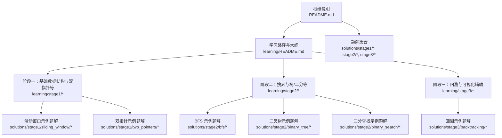
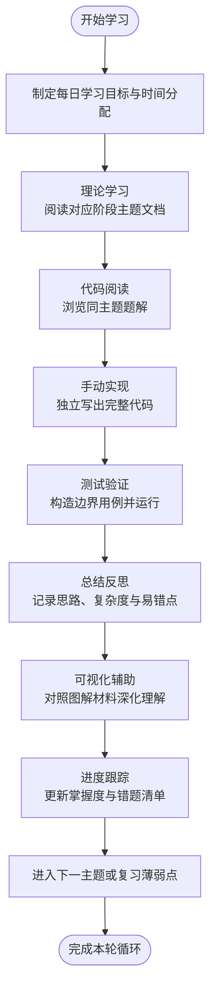
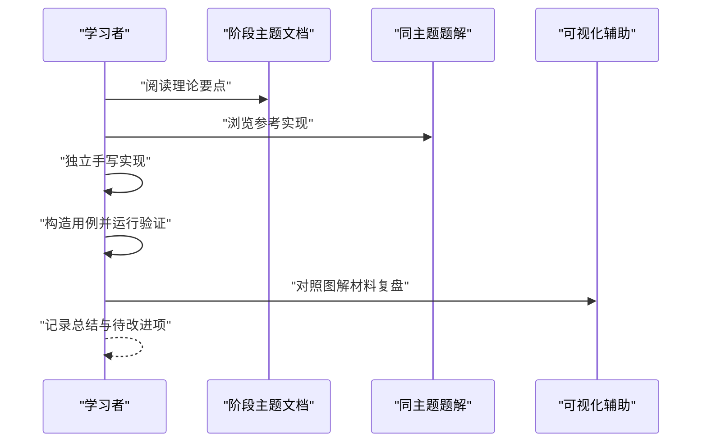
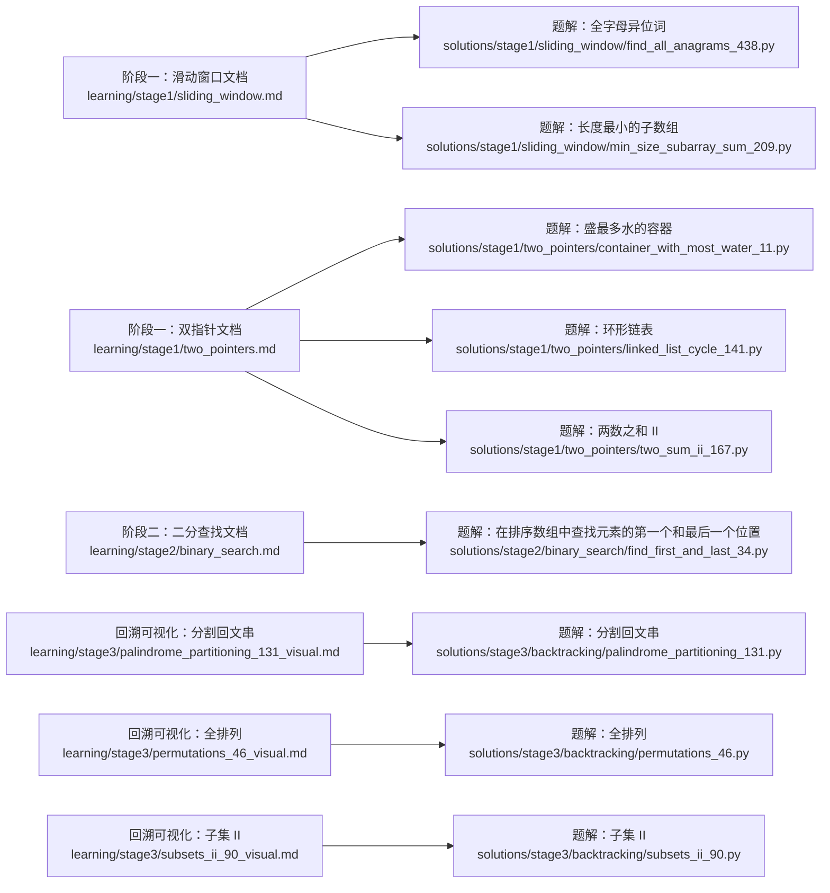

# 学习方法与进度管理

<cite>
**本文引用的文件**   
- [README.md](file://README.md)
- [learning/README.md](file://learning/README.md)
- [learning/syllabus.md](file://learning/syllabus.md)
- [learning/stage1/linked_list.md](file://learning/stage1/linked_list.md)
- [learning/stage1/sliding_window.md](file://learning/stage1/sliding_window.md)
- [learning/stage1/two_pointers.md](file://learning/stage1/two_pointers.md)
- [learning/stage2/binary_search.md](file://learning/stage2/binary_search.md)
- [learning/stage3/palindrome_partitioning_131_visual.md](file://learning/stage3/palindrome_partitioning_131_visual.md)
- [learning/stage3/permutations_46_visual.md](file://learning/stage3/permutations_46_visual.md)
- [learning/stage3/subsets_ii_90_visual.md](file://learning/stage3/subsets_ii_90_visual.md)
- [solutions/stage1/sliding_window/find_all_anagrams_438.py](file://solutions/stage1/sliding_window/find_all_anagrams_438.py)
- [solutions/stage1/sliding_window/min_size_subarray_sum_209.py](file://solutions/stage1/sliding_window/min_size_subarray_sum_209.py)
- [solutions/stage1/two_pointers/container_with_most_water_11.py](file://solutions/stage1/two_pointers/container_with_most_water_11.py)
- [solutions/stage1/two_pointers/linked_list_cycle_141.py](file://solutions/stage1/two_pointers/linked_list_cycle_141.py)
- [solutions/stage1/two_pointers/two_sum_ii_167.py](file://solutions/stage1/two_pointers/two_sum_ii_167.py)
- [solutions/stage2/bfs/level_order_102.py](file://solutions/stage2/bfs/level_order_102.py)
- [solutions/stage2/bfs/right_side_view_199.py](file://solutions/stage2/bfs/right_side_view_199.py)
- [solutions/stage2/bfs/zigzag_level_order_103.py](file://solutions/stage2/bfs/zigzag_level_order_103.py)
- [solutions/stage2/binary_search/find_first_and_last_34.py](file://solutions/stage2/binary_search/find_first_and_last_34.py)
- [solutions/stage2/binary_tree/count_nodes_222.py](file://solutions/stage2/binary_tree/count_nodes_222.py)
- [solutions/stage2/binary_tree/invert_tree_226.py](file://solutions/stage2/binary_tree/invert_tree_226.py)
- [solutions/stage2/binary_tree/max_depth_104.py](file://solutions/stage2/binary_tree/max_depth_104.py)
- [solutions/stage3/backtracking/combination_sum_ii_40.py](file://solutions/stage3/backtracking/combination_sum_ii_40.py)
- [solutions/stage3/backtracking/combinations_77.py](file://solutions/stage3/backtracking/combinations_77.py)
- [solutions/stage3/backtracking/palindrome_partitioning_131.py](file://solutions/stage3/backtracking/palindrome_partitioning_131.py)
- [solutions/stage3/backtracking/permutations_46.py](file://solutions/stage3/backtracking/permutations_46.py)
- [solutions/stage3/backtracking/subsets_78.py](file://solutions/stage3/backtracking/subsets_78.py)
- [solutions/stage3/backtracking/subsets_ii_90.py](file://solutions/stage3/backtracking/subsets_ii_90.py)
</cite>

## 目录
1. [引言](#引言)
2. [项目结构](#项目结构)
3. [核心组件](#核心组件)
4. [架构总览](#架构总览)
5. [详细组件分析](#详细组件分析)
6. [依赖分析](#依赖分析)
7. [性能考虑](#性能考虑)
8. [故障排查指南](#故障排查指南)
9. [结论](#结论)
10. [附录](#附录)

## 引言
本指南面向算法学习者，目标是提供一套系统化的学习方法与进度管理方案。围绕“理论学习→代码阅读→手动实现→测试验证→总结反思”的闭环流程，结合仓库中的分阶段学习材料与配套题解、可视化辅助材料，帮助学员制定可执行的学习计划、跟踪进度并进行自我评估。同时给出常见学习障碍的克服方法与心态调整建议，并提供不同背景与节奏下的个性化策略。

## 项目结构
仓库采用“学习材料 + 分阶段题解 + 可视化辅助”的组织方式：
- learning：按阶段划分的主题学习文档与可视化材料
- solutions：按阶段与主题组织的题解实现（Python）
- 根级 README：项目总体说明与导航

图示来源
- [learning/README.md](file://learning/README.md)
- [learning/syllabus.md](file://learning/syllabus.md)
- [solutions/stage1/sliding_window/find_all_anagrams_438.py](file://solutions/stage1/sliding_window/find_all_anagrams_438.py)
- [solutions/stage1/two_pointers/container_with_most_water_11.py](file://solutions/stage1/two_pointers/container_with_most_water_11.py)
- [solutions/stage2/bfs/level_order_102.py](file://solutions/stage2/bfs/level_order_102.py)
- [solutions/stage2/binary_tree/max_depth_104.py](file://solutions/stage2/binary_tree/max_depth_104.py)
- [solutions/stage2/binary_search/find_first_and_last_34.py](file://solutions/stage2/binary_search/find_first_and_last_34.py)
- [solutions/stage3/backtracking/permutations_46.py](file://solutions/stage3/backtracking/permutations_46.py)

章节来源
- [README.md](file://README.md)
- [learning/README.md](file://learning/README.md)
- [learning/syllabus.md](file://learning/syllabus.md)

## 核心组件
- 学习材料层（learning）
  - 阶段化主题文档：如链表、滑动窗口、双指针、二分查找、回溯等
  - 可视化辅助：针对复杂过程（如回溯展开）的图解材料，帮助建立直观理解
- 题解层（solutions）
  - 按阶段与主题组织，覆盖典型题型，便于对照学习与复盘
- 学习大纲与导航（learning/README.md、learning/syllabus.md）
  - 明确学习路径、阶段目标与推荐顺序

章节来源
- [learning/stage1/linked_list.md](file://learning/stage1/linked_list.md)
- [learning/stage1/sliding_window.md](file://learning/stage1/sliding_window.md)
- [learning/stage1/two_pointers.md](file://learning/stage1/two_pointers.md)
- [learning/stage2/binary_search.md](file://learning/stage2/binary_search.md)
- [learning/stage3/palindrome_partitioning_131_visual.md](file://learning/stage3/palindrome_partitioning_131_visual.md)
- [learning/stage3/permutations_46_visual.md](file://learning/stage3/permutations_46_visual.md)
- [learning/stage3/subsets_ii_90_visual.md](file://learning/stage3/subsets_ii_90_visual.md)

## 架构总览
下图展示“学习材料 → 题解 → 可视化辅助”的协同关系，以及“理论→阅读→实现→验证→反思”的学习闭环。

[此图为概念性流程图，无需图示来源]

## 详细组件分析

### 学习计划与时间分配
- 每日目标设定
  - 以“一个主题 + 2~3道代表性题目”为最小单元
  - 将时间划分为：理论学习（约30%）、代码阅读（约20%）、手动实现（约30%）、测试与复盘（约20%）
- 周度规划
  - 每周聚焦1个主题，周末进行综合复盘与错题重做
- 资源使用
  - 优先阅读对应阶段的主题文档，再对照题解与可视化材料

章节来源
- [learning/README.md](file://learning/README.md)
- [learning/syllabus.md](file://learning/syllabus.md)

### 算法学习流程（五步法）
- 理论学习：从阶段文档中提炼关键思想、适用场景与边界条件
- 代码阅读：先不写代码，尝试在脑中走查样例，定位关键步骤
- 手动实现：独立编码，强调可读性与鲁棒性
- 测试验证：准备常规用例与极端用例，确保通过
- 总结反思：记录思路、时间与复杂度，标注易错点与改进方向

[此图为概念性序列图，无需图示来源]

### 进度跟踪与自我评估
- 掌握度分级
  - 未接触 / 了解思路 / 能复现 / 能独立正确实现 / 能迁移到新题
- 量化指标
  - 每日完成题数、正确率、平均用时、复盘笔记数量
- 工具建议
  - 用表格或看板记录主题、题目、状态、用时、备注；定期回顾趋势

章节来源
- [learning/README.md](file://learning/README.md)

### 利用题解与可视化材料进行深度学习
- 题解使用原则
  - 先看题意与样例，再读题解；对比自己的思路差异，提取通用模式
- 可视化材料价值
  - 对回溯、递归树、窗口移动等动态过程进行可视化，有助于形成“心理模型”
- 实践建议
  - 每道题至少完成一次“不看题解的独立实现”，再用可视化材料校验关键分支

章节来源
- [learning/stage3/palindrome_partitioning_131_visual.md](file://learning/stage3/palindrome_partitioning_131_visual.md)
- [learning/stage3/permutations_46_visual.md](file://learning/stage3/permutations_46_visual.md)
- [learning/stage3/subsets_ii_90_visual.md](file://learning/stage3/subsets_ii_90_visual.md)

### 常见学习障碍与心态调整
- 卡壳与挫败感
  - 拆解问题、画图推演、先写伪代码再实现
- 遗忘与回退
  - 间隔重复与错题本；每周固定复习日
- 完美主义拖延
  - 以“完成优于完美”为原则，先跑通再优化
- 注意力分散
  - 番茄钟与任务切块，减少多任务切换

[本节为通用指导，无需章节来源]

### 个性化学习策略
- 零基础入门
  - 从阶段一的双指针与滑动窗口入手，配合可视化材料建立直觉
- 有基础但需巩固
  - 选择阶段二的树与二分，强化边界处理与不变式思维
- 冲刺面试
  - 以高频题型为主，压缩阅读时间，增加限时训练与复盘比重

[本节为通用指导，无需章节来源]

## 依赖分析
- 学习材料到题解的映射
  - 每个主题文档通常对应若干题解，便于“学-练-测”一体化
- 可视化材料到具体题型的映射
  - 针对回溯类问题提供图解，辅助理解搜索空间与剪枝

图示来源
- [learning/stage1/sliding_window.md](file://learning/stage1/sliding_window.md)
- [learning/stage1/two_pointers.md](file://learning/stage1/two_pointers.md)
- [learning/stage2/binary_search.md](file://learning/stage2/binary_search.md)
- [learning/stage3/palindrome_partitioning_131_visual.md](file://learning/stage3/palindrome_partitioning_131_visual.md)
- [learning/stage3/permutations_46_visual.md](file://learning/stage3/permutations_46_visual.md)
- [learning/stage3/subsets_ii_90_visual.md](file://learning/stage3/subsets_ii_90_visual.md)
- [solutions/stage1/sliding_window/find_all_anagrams_438.py](file://solutions/stage1/sliding_window/find_all_anagrams_438.py)
- [solutions/stage1/sliding_window/min_size_subarray_sum_209.py](file://solutions/stage1/sliding_window/min_size_subarray_sum_209.py)
- [solutions/stage1/two_pointers/container_with_most_water_11.py](file://solutions/stage1/two_pointers/container_with_most_water_11.py)
- [solutions/stage1/two_pointers/linked_list_cycle_141.py](file://solutions/stage1/two_pointers/linked_list_cycle_141.py)
- [solutions/stage1/two_pointers/two_sum_ii_167.py](file://solutions/stage1/two_pointers/two_sum_ii_167.py)
- [solutions/stage2/binary_search/find_first_and_last_34.py](file://solutions/stage2/binary_search/find_first_and_last_34.py)
- [solutions/stage3/backtracking/palindrome_partitioning_131.py](file://solutions/stage3/backtracking/palindrome_partitioning_131.py)
- [solutions/stage3/backtracking/permutations_46.py](file://solutions/stage3/backtracking/permutations_46.py)
- [solutions/stage3/backtracking/subsets_ii_90.py](file://solutions/stage3/backtracking/subsets_ii_90.py)

章节来源
- [learning/stage1/sliding_window.md](file://learning/stage1/sliding_window.md)
- [learning/stage1/two_pointers.md](file://learning/stage1/two_pointers.md)
- [learning/stage2/binary_search.md](file://learning/stage2/binary_search.md)
- [learning/stage3/palindrome_partitioning_131_visual.md](file://learning/stage3/palindrome_partitioning_131_visual.md)
- [learning/stage3/permutations_46_visual.md](file://learning/stage3/permutations_46_visual.md)
- [learning/stage3/subsets_ii_90_visual.md](file://learning/stage3/subsets_ii_90_visual.md)

## 性能考虑
- 学习节奏
  - 控制单次学习时长，避免疲劳导致错误率上升
- 练习密度
  - 以“少而精”为原则，重视复盘与迁移
- 反馈速度
  - 快速构造用例并验证，缩短“假设-验证”周期

[本节为通用指导，无需章节来源]

## 故障排查指南
- 无法启动学习
  - 先从阶段一的简单主题入手，降低认知负荷
- 反复出错
  - 回到题解的关键步骤，画出数据流或状态变化图
- 时间不够
  - 精简阅读时间，优先保证“独立实现+测试”的闭环

[本节为通用指导，无需章节来源]

## 结论
通过“主题化学习 + 五步闭环 + 可视化辅助 + 进度跟踪”，可以显著提升算法学习的效率与稳定性。建议以阶段为单位推进，持续记录与复盘，逐步构建稳定的解题心智模型与迁移能力。

[本节为总结性内容，无需章节来源]

## 附录
- 常用模板与清单
  - 每日计划表、错题本模板、复盘清单
- 推荐资源
  - 阶段文档、可视化材料、同主题题解

[本节为补充信息，无需章节来源]