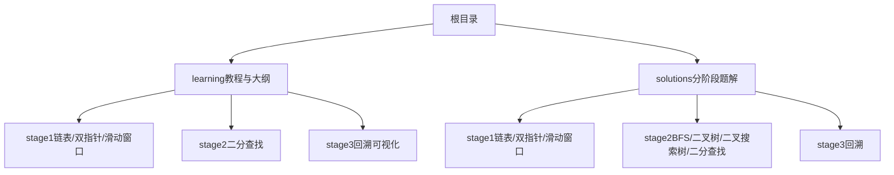
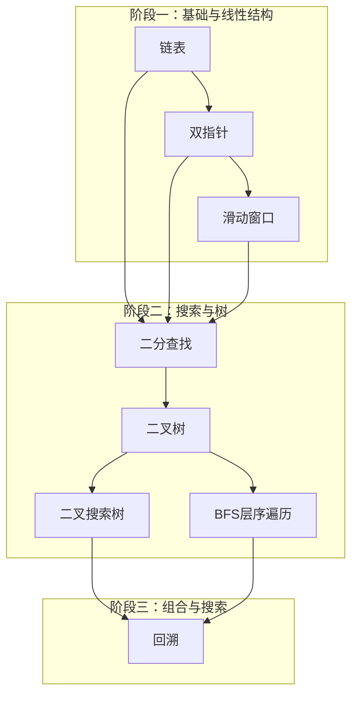
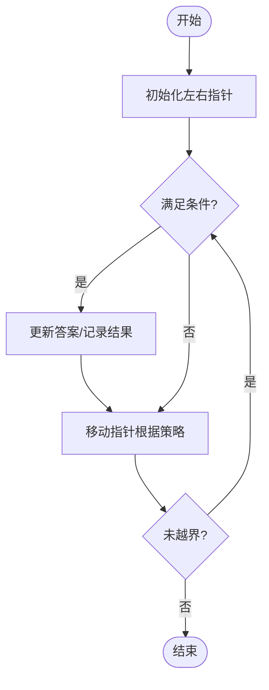
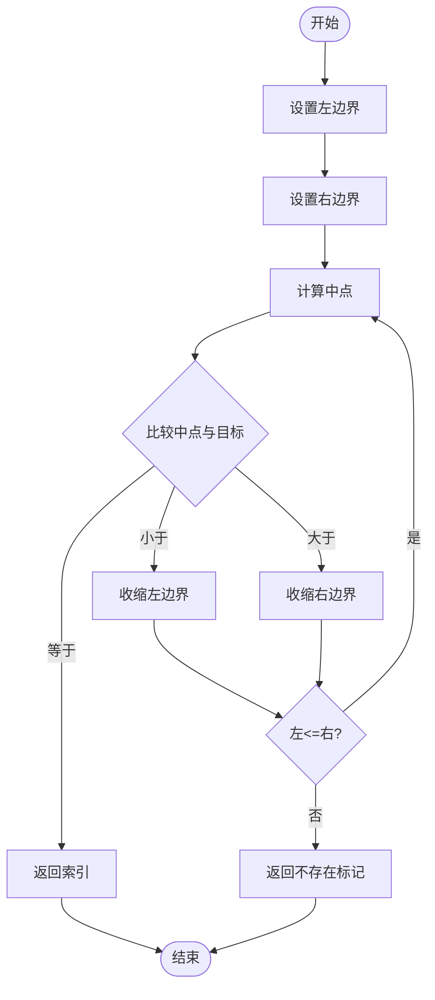
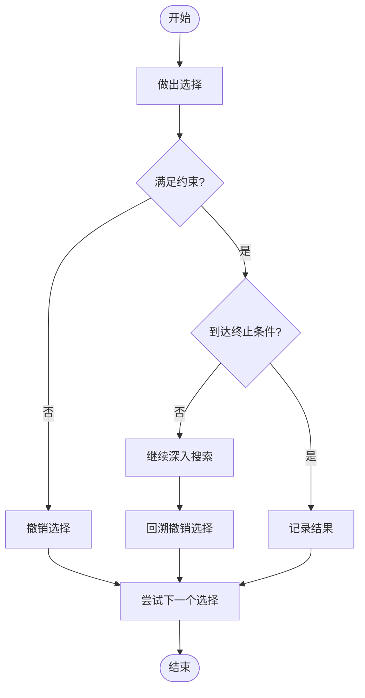
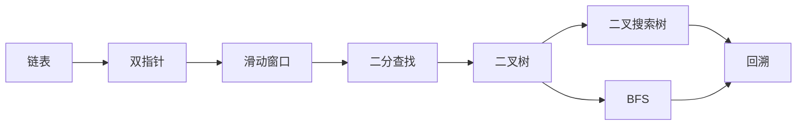

# 学习路径指南

<cite>
**本文引用的文件**   
- [README.md](file://README.md)
- [learning/README.md](file://learning/README.md)
- [learning/syllabus.md](file://learning/syllabus.md)
- [learning/stage1/linked_list.md](file://learning/stage1/linked_list.md)
- [learning/stage1/sliding_window.md](file://learning/stage1/sliding_window.md)
- [learning/stage1/two_pointers.md](file://learning/stage1/two_pointers.md)
- [learning/stage2/binary_search.md](file://learning/stage2/binary_search.md)
- [learning/stage3/palindrome_partitioning_131_visual.md](file://learning/stage3/palindrome_partitioning_131_visual.md)
- [learning/stage3/permutations_46_visual.md](file://learning/stage3/permutations_46_visual.md)
- [learning/stage3/subsets_ii_90_visual.md](file://learning/stage3/subsets_ii_90_visual.md)
- [solutions/stage1/linked_list/](file://solutions/stage1/linked_list/)
- [solutions/stage1/sliding_window/find_all_anagrams_438.py](file://solutions/stage1/sliding_window/find_all_anagrams_438.py)
- [solutions/stage1/sliding_window/min_size_subarray_sum_209.py](file://solutions/stage1/sliding_window/min_size_subarray_sum_209.py)
- [solutions/stage1/two_pointers/container_with_most_water_11.py](file://solutions/stage1/two_pointers/container_with_most_water_11.py)
- [solutions/stage1/two_pointers/linked_list_cycle_141.py](file://solutions/stage1/two_pointers/linked_list_cycle_141.py)
- [solutions/stage1/two_pointers/two_sum_ii_167.py](file://solutions/stage1/two_pointers/two_sum_ii_167.py)
- [solutions/stage2/bfs/level_order_102.py](file://solutions/stage2/bfs/level序_102.py)
- [solutions/stage2/bfs/right_side_view_199.py](file://solutions/stage2/bfs/right_side_view_199.py)
- [solutions/stage2/bfs/zigzag_level_order_103.py](file://solutions/stage2/bfs/zigzag_level_order_103.py)
- [solutions/stage2/binary_search/find_first_and_last_34.py](file://solutions/stage2/binary_search/find_first_and_last_34.py)
- [solutions/stage2/binary_search_tree/insert_into_bst_701.py](file://solutions/stage2/binary_search_tree/insert_into_bst_701.py)
- [solutions/stage2/binary_search_tree/min_diff_530.py](file://solutions/stage2/binary_search_tree/min_diff_530.py)
- [solutions/stage2/binary_search_tree/search_bst_700.py](file://solutions/stage2/binary_search_tree/search_bst_700.py)
- [solutions/stage2/binary_search_tree/validate_bst_98.py](file://solutions/stage2/binary_search_tree/validate_bst_98.py)
- [solutions/stage2/binary_tree/count_nodes_222.py](file://solutions/stage2/binary_tree/count_nodes_222.py)
- [solutions/stage2/binary_tree/invert_tree_226.py](file://solutions/stage2/binary_tree/invert_tree_226.py)
- [solutions/stage2/binary_tree/max_depth_104.py](file://solutions/stage2/binary_tree/max_depth_104.py)
- [solutions/stage3/backtracking/combination_sum_ii_40.py](file://solutions/stage3/backtracking/combination_sum_ii_40.py)
- [solutions/stage3/backtracking/combinations_77.py](file://solutions/stage3/backtracking/combinations_77.py)
- [solutions/stage3/backtracking/palindrome_partitioning_131.py](file://solutions/stage3/backtracking/palindrome_partitioning_131.py)
- [solutions/stage3/backtracking/permutations_46.py](file://solutions/stage3/backtracking/permutations_46.py)
- [solutions/stage3/backtracking/subsets_78.py](file://solutions/stage3/backtracking/subsets_78.py)
- [solutions/stage3/backtracking/subsets_ii_90.py](file://solutions/stage3/backtracking/subsets_ii_90.py)
</cite>

## 目录
1. [简介](#简介)
2. [项目结构](#项目结构)
3. [核心组件](#核心组件)
4. [架构总览](#架构总览)
5. [详细组件分析](#详细组件分析)
6. [依赖关系分析](#依赖关系分析)
7. [性能与复杂度要点](#性能与复杂度要点)
8. [故障排查指南](#故障排查指南)
9. [结论](#结论)
10. [附录](#附录)

## 简介
本指南面向希望系统掌握算法与数据结构的学员，基于仓库的三阶段学习体系，提供循序渐进的学习路线、学习目标、核心概念、掌握标准、时间规划、练习量建议、配套题解与可视化材料使用方法、进度跟踪与自我评估方法，以及针对不同背景学员的个性化建议。目标是帮助学习者从基础数据结构逐步过渡到高级算法，形成可执行、可度量、可复盘的学习闭环。

## 项目结构
仓库采用“教程 + 题解”的双轨组织方式：
- learning：按阶段划分的主题教程与可视化辅助材料
- solutions：按阶段与主题分类的参考实现（Python）

图示来源
- [learning/README.md](file://learning/README.md)
- [learning/syllabus.md](file://learning/syllabus.md)

章节来源
- [learning/README.md](file://learning/README.md)
- [learning/syllabus.md](file://learning/syllabus.md)

## 核心组件
- 阶段化课程：将学习划分为三个阶段，由浅入深，覆盖从基础数据结构到高级算法的关键主题
- 主题式教程：每个主题包含概念讲解、关键技巧与易错点提示
- 可视化辅助：在复杂算法（如回溯）中提供可视化材料，帮助理解状态空间与剪枝过程
- 配套题解：每道题目提供清晰实现与注释，便于对照与复盘
- 学习大纲：明确阶段目标、前置依赖与推荐顺序

章节来源
- [learning/README.md](file://learning/README.md)
- [learning/syllabus.md](file://learning/syllabus.md)

## 架构总览
下图展示三阶段学习的整体结构与主题依赖关系，强调先修与进阶关系，帮助制定学习顺序。

图示来源
- [learning/stage1/linked_list.md](file://learning/stage1/linked_list.md)
- [learning/stage1/two_pointers.md](file://learning/stage1/two_pointers.md)
- [learning/stage1/sliding_window.md](file://learning/stage1/sliding_window.md)
- [learning/stage2/binary_search.md](file://learning/stage2/binary_search.md)
- [solutions/stage2/binary_tree/](file://solutions/stage2/binary_tree/)
- [solutions/stage2/binary_search_tree/](file://solutions/stage2/binary_search_tree/)
- [solutions/stage2/bfs/](file://solutions/stage2/bfs/)
- [solutions/stage3/backtracking/](file://solutions/stage3/backtracking/)

## 详细组件分析

### 阶段一：基础与线性结构
- 学习目标
  - 掌握链表的基本操作与常见模式
  - 熟练运用双指针解决有序数组与链表问题
  - 理解并应用滑动窗口处理子串/子数组问题
- 核心概念
  - 链表：头尾指针、快慢指针、虚拟头节点
  - 双指针：对撞指针、同向指针、间隔指针
  - 滑动窗口：左右边界移动、窗口内统计、定长/变长窗口
- 掌握标准
  - 能独立写出无环/有环链表判定的正确实现
  - 能在 O(n) 时间内用双指针或滑动窗口完成典型题目
  - 能解释时间与空间复杂度，并给出边界条件处理思路
- 推荐练习量
  - 链表：至少 5 题
  - 双指针：至少 6 题
  - 滑动窗口：至少 6 题
- 配套题解路径
  - 链表：[solutions/stage1/linked_list/](file://solutions/stage1/linked_list/)
  - 双指针：[solutions/stage1/two_pointers/](file://solutions/stage1/two_pointers/)
  - 滑动窗口：[solutions/stage1/sliding_window/](file://solutions/stage1/sliding_window/)
- 可视化与辅助
  - 本阶段以线性结构为主，建议配合画图与调试器观察指针变化

章节来源
- [learning/stage1/linked_list.md](file://learning/stage1/linked_list.md)
- [learning/stage1/two_pointers.md](file://learning/stage1/two_pointers.md)
- [learning/stage1/sliding_window.md](file://learning/stage1/sliding_window.md)
- [solutions/stage1/linked_list/](file://solutions/stage1/linked_list/)
- [solutions/stage1/two_pointers/container_with_most_water_11.py](file://solutions/stage1/two_pointers/container_with_most_water_11.py)
- [solutions/stage1/two_pointers/linked_list_cycle_141.py](file://solutions/stage1/two_pointers/linked_list_cycle_141.py)
- [solutions/stage1/two_pointers/two_sum_ii_167.py](file://solutions/stage1/two_pointers/two_sum_ii_167.py)
- [solutions/stage1/sliding_window/find_all_anagrams_438.py](file://solutions/stage1/sliding_window/find_all_anagrams_438.py)
- [solutions/stage1/sliding_window/min_size_subarray_sum_209.py](file://solutions/stage1/sliding_window/min_size_subarray_sum_209.py)

#### 双指针流程示例（概念图）

### 阶段二：搜索与树
- 学习目标
  - 熟练掌握二分查找及其变体
  - 理解二叉树与二叉搜索树的性质与基本操作
  - 掌握 BFS 层序遍历模板与常见变形
- 核心概念
  - 二分查找：左闭右开/闭区间、边界收缩、寻找第一个/最后一个
  - 二叉树：递归/迭代遍历、深度、翻转、计数
  - 二叉搜索树：插入、搜索、验证、最小差值
  - BFS：队列模板、层级控制、方向扩展
- 掌握标准
  - 能在 O(log n) 时间内完成二分查找及边界定位
  - 能写出二叉树/二叉搜索树的基础操作，并分析递归深度
  - 能用 BFS 完成层序遍历及相关问题
- 推荐练习量
  - 二分查找：至少 5 题
  - 二叉树：至少 5 题
  - 二叉搜索树：至少 4 题
  - BFS：至少 3 题
- 配套题解路径
  - 二分查找：[solutions/stage2/binary_search/](file://solutions/stage2/binary_search/)
  - 二叉树：[solutions/stage2/binary_tree/](file://solutions/stage2/binary_tree/)
  - 二叉搜索树：[solutions/stage2/binary_search_tree/](file://solutions/stage2/binary_search_tree/)
  - BFS：[solutions/stage2/bfs/](file://solutions/stage2/bfs/)

章节来源
- [learning/stage2/binary_search.md](file://learning/stage2/binary_search.md)
- [solutions/stage2/binary_search/find_first_and_last_34.py](file://solutions/stage2/binary_search/find_first_and_last_34.py)
- [solutions/stage2/binary_tree/count_nodes_222.py](file://solutions/stage2/binary_tree/count_nodes_222.py)
- [solutions/stage2/binary_tree/invert_tree_226.py](file://solutions/stage2/binary_tree/invert_tree_226.py)
- [solutions/stage2/binary_tree/max_depth_104.py](file://solutions/stage2/binary_tree/max_depth_104.py)
- [solutions/stage2/binary_search_tree/insert_into_bst_701.py](file://solutions/stage2/binary_search_tree/insert_into_bst_701.py)
- [solutions/stage2/binary_search_tree/min_diff_530.py](file://solutions/stage2/binary_search_tree/min_diff_530.py)
- [solutions/stage2/binary_search_tree/search_bst_700.py](file://solutions/stage2/binary_search_tree/search_bst_700.py)
- [solutions/stage2/binary_search_tree/validate_bst_98.py](file://solutions/stage2/binary_search_tree/validate_bst_98.py)
- [solutions/stage2/bfs/level_order_102.py](file://solutions/stage2/bfs/level_order_102.py)
- [solutions/stage2/bfs/right_side_view_199.py](file://solutions/stage2/bfs/right_side_view_199.py)
- [solutions/stage2/bfs/zigzag_level_order_103.py](file://solutions/stage2/bfs/zigzag_level_order_103.py)

#### 二分查找流程示例（概念图）

### 阶段三：组合与搜索（回溯）
- 学习目标
  - 理解回溯的通用框架与剪枝思想
  - 能使用回溯求解排列、组合、子集、分割等经典问题
  - 借助可视化材料理解状态空间树与分支选择
- 核心概念
  - 回溯模板：选择、约束、撤销、终止条件
  - 去重策略：排序+跳过重复元素、集合判重
  - 剪枝优化：提前判断不可行分支
- 掌握标准
  - 能独立写出带剪枝的回溯实现，并说明复杂度
  - 能对比不同剪枝策略的效果
- 推荐练习量
  - 回溯：至少 6 题（含组合、子集、排列、分割）
- 配套题解路径
  - [solutions/stage3/backtracking/](file://solutions/stage3/backtracking/)
- 可视化辅助
  - 回溯可视化材料有助于直观理解搜索树与剪枝过程

章节来源
- [learning/stage3/palindrome_partitioning_131_visual.md](file://learning/stage3/palindrome_partitioning_131_visual.md)
- [learning/stage3/permutations_46_visual.md](file://learning/stage3/permutations_46_visual.md)
- [learning/stage3/subsets_ii_90_visual.md](file://learning/stage3/subsets_ii_90_visual.md)
- [solutions/stage3/backtracking/combination_sum_ii_40.py](file://solutions/stage3/backtracking/combination_sum_ii_40.py)
- [solutions/stage3/backtracking/combinations_77.py](file://solutions/stage3/backtracking/combinations_77.py)
- [solutions/stage3/backtracking/palindrome_partitioning_131.py](file://solutions/stage3/backtracking/palindrome_partitioning_131.py)
- [solutions/stage3/backtracking/permutations_46.py](file://solutions/stage3/backtracking/permutations_46.py)
- [solutions/stage3/backtracking/subsets_78.py](file://solutions/stage3/backtracking/subsets_78.py)
- [solutions/stage3/backtracking/subsets_ii_90.py](file://solutions/stage3/backtracking/subsets_ii_90.py)

#### 回溯流程示例（概念图）

## 依赖关系分析
- 阶段内依赖
  - 阶段一：链表 → 双指针 → 滑动窗口（后者常以前者为工具）
  - 阶段二：二分查找为独立技能；二叉树与二叉搜索树相互支撑；BFS 作为通用搜索模板
  - 阶段三：回溯建立在阶段二的搜索思维之上，结合剪枝与状态管理
- 跨阶段依赖
  - 阶段一的指针与窗口技巧为阶段二的二分与阶段三的回溯提供基础
  - 阶段二的树与搜索为阶段三的组合搜索提供抽象能力

图示来源
- [learning/stage1/linked_list.md](file://learning/stage1/linked_list.md)
- [learning/stage1/two_pointers.md](file://learning/stage1/two_pointers.md)
- [learning/stage1/sliding_window.md](file://learning/stage1/sliding_window.md)
- [learning/stage2/binary_search.md](file://learning/stage2/binary_search.md)
- [solutions/stage2/binary_tree/](file://solutions/stage2/binary_tree/)
- [solutions/stage2/binary_search_tree/](file://solutions/stage2/binary_search_tree/)
- [solutions/stage2/bfs/](file://solutions/stage2/bfs/)
- [solutions/stage3/backtracking/](file://solutions/stage3/backtracking/)

## 性能与复杂度要点
- 阶段一
  - 双指针与滑动窗口通常可实现 O(n) 时间、O(1) 额外空间
  - 链表原地操作避免额外空间开销
- 阶段二
  - 二分查找 O(log n)，注意边界收缩的正确性
  - 二叉树递归深度与树高相关，最坏 O(n)，平均 O(log n)
  - BFS 时间 O(V+E)，空间取决于队列最大宽度
- 阶段三
  - 回溯时间复杂度与解空间规模相关，需通过剪枝降低实际运行时间
  - 合理的数据预处理（如排序）可减少重复分支

## 故障排查指南
- 常见问题
  - 指针越界与死循环：检查边界条件与移动逻辑
  - 二分边界错误：统一区间定义（闭/开），确保收敛
  - 回溯重复解：确认去重策略是否生效（排序+跳过、集合判重）
  - BFS 层级混淆：使用层级计数器或队列长度控制
- 调试建议
  - 打印关键变量（指针位置、窗口范围、递归深度）
  - 使用小样例手工模拟执行流程
  - 对照题解差异，定位逻辑偏差

## 结论
本学习路径以“阶段化 + 主题化 + 可视化 + 题解”的方式构建，强调循序渐进与可量化反馈。建议按照阶段顺序推进，结合可视化材料与题解进行复盘，建立个人错题本与进度看板，持续迭代提升。

## 附录

### 学习时间规划建议
- 阶段一（约 3–4 周）
  - 每周 3–4 小时，总计 12–16 小时
  - 练习量：链表 5 题、双指针 6 题、滑动窗口 6 题
- 阶段二（约 4–5 周）
  - 每周 3–4 小时，总计 12–20 小时
  - 练习量：二分 5 题、二叉树 5 题、二叉搜索树 4 题、BFS 3 题
- 阶段三（约 4–5 周）
  - 每周 3–4 小时，总计 12–20 小时
  - 练习量：回溯 6 题以上（组合/子集/排列/分割）

### 配套材料使用方法
- 教程先行：先阅读对应主题的教程，理解核心模式与模板
- 可视化辅助：在回溯等复杂场景中，优先观看可视化材料，再动手实现
- 题解对照：独立完成后再对照题解，总结差异与优化点
- 复盘沉淀：记录关键思路、易错点与改进方案

### 进度跟踪与自我评估
- 进度看板
  - 列出主题与题目清单，标注已完成/进行中/待复习
  - 记录每题用时、错误类型与修正措施
- 自我评估标准
  - 阶段一：能稳定在 30 分钟内完成中等难度题目，且无需查阅模板
  - 阶段二：能独立推导二分边界，写出树与 BFS 的标准实现
  - 阶段三：能设计合理的剪枝策略，并在限定时间内输出正确解
- 周期复盘
  - 每周回顾错题与薄弱点，调整下周计划
  - 每月进行一次综合测试，检验迁移能力

### 个性化学习建议
- 零基础入门
  - 重点打牢阶段一，强化指针与窗口思维
  - 多用可视化与画图辅助理解
- 已有编程经验
  - 快速过一遍阶段一，进入阶段二强化搜索与树
  - 在阶段三注重剪枝设计与复杂度分析
- 面试导向
  - 聚焦高频题型与模板，压缩非核心内容
  - 增加限时训练与口头表达演练