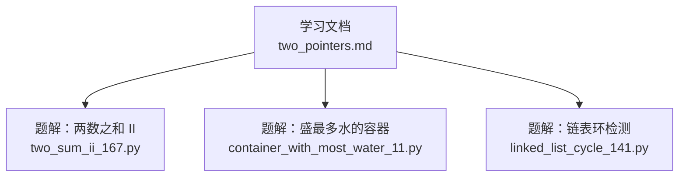
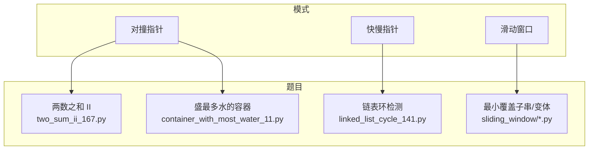
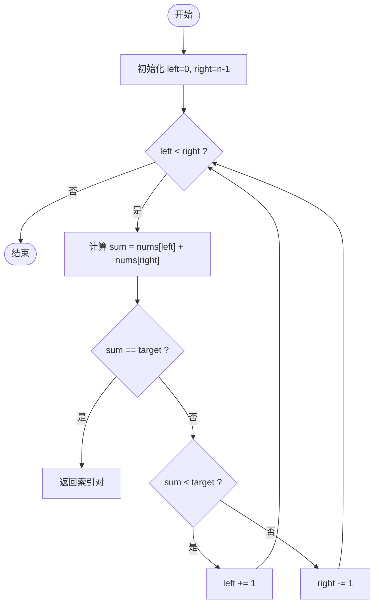
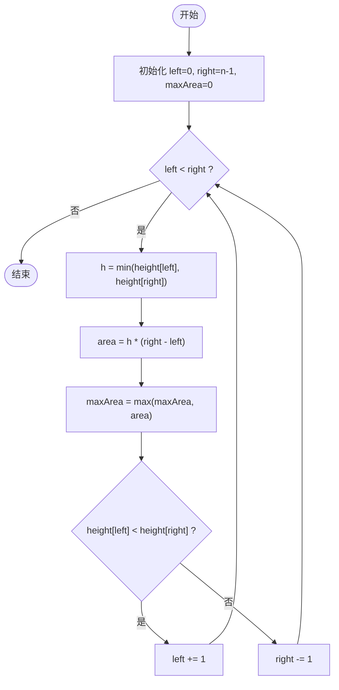
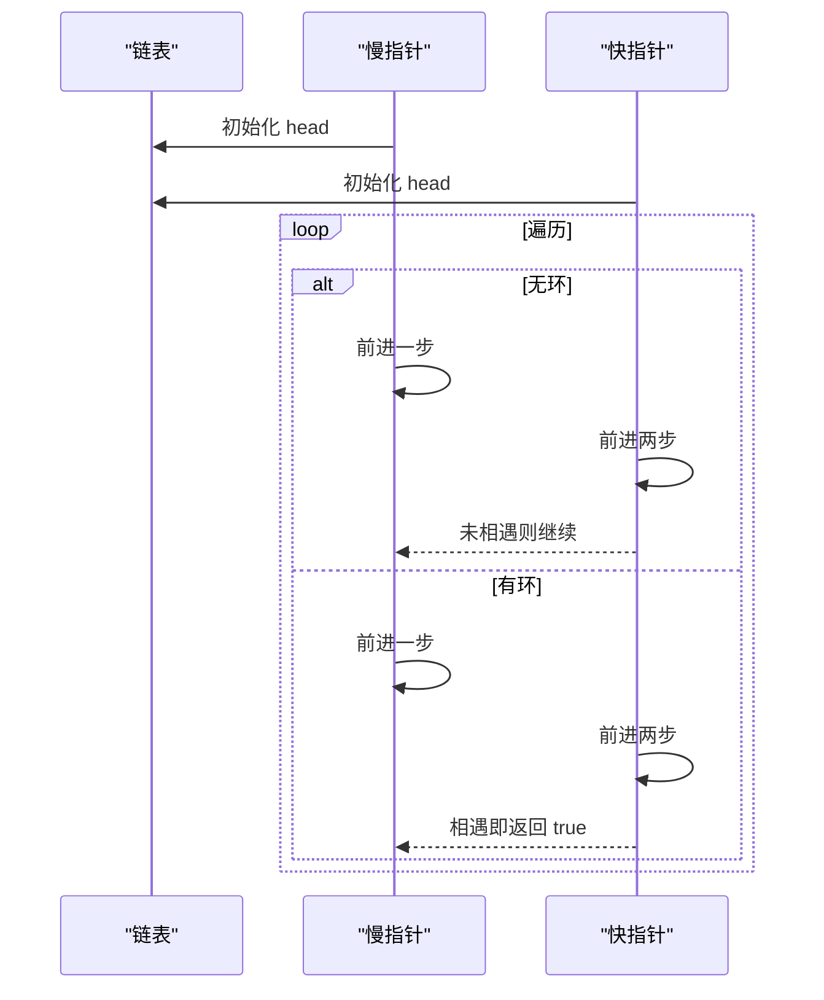
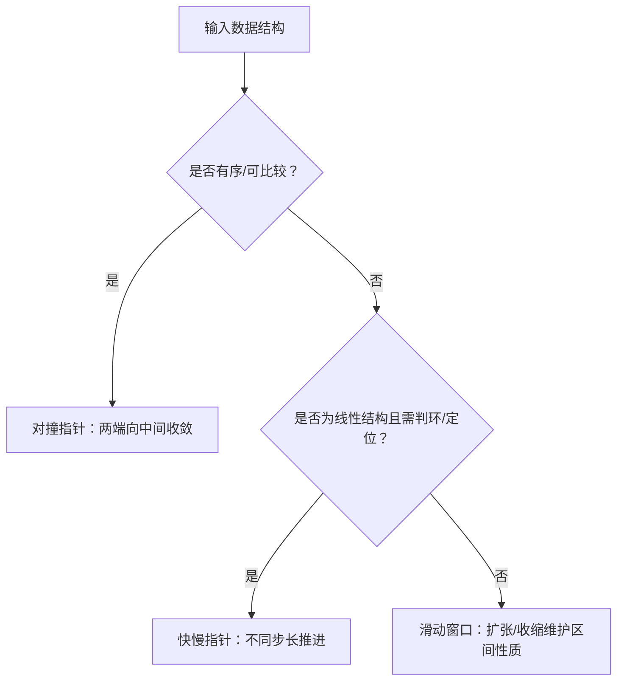
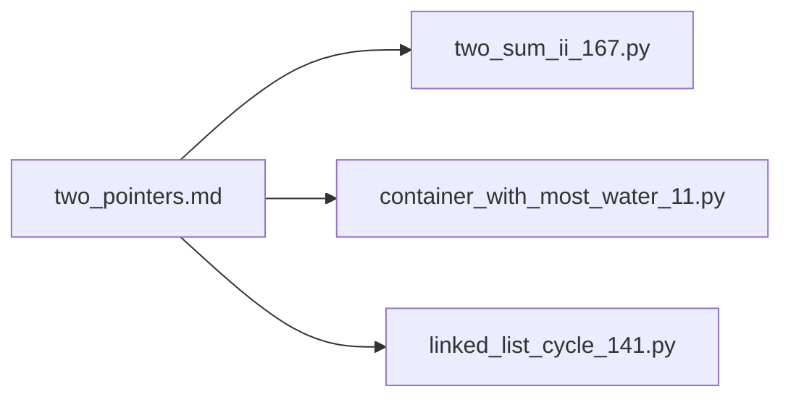

# 双指针技巧

<cite>
**本文引用的文件**   
- [learning/stage1/two_pointers.md](file://learning/stage1/two_pointers.md)
- [solutions/stage1/two_pointers/two_sum_ii_167.py](file://solutions/stage1/two_pointers/two_sum_ii_167.py)
- [solutions/stage1/two_pointers/container_with_most_water_11.py](file://solutions/stage1/two_pointers/container_with_most_water_11.py)
- [solutions/stage1/two_pointers/linked_list_cycle_141.py](file://solutions/stage1/two_pointers/linked_list_cycle_141.py)
</cite>

## 目录
1. [引言](#引言)
2. [项目结构](#项目结构)
3. [核心组件](#核心组件)
4. [架构总览](#架构总览)
5. [详细组件分析](#详细组件分析)
6. [依赖分析](#依赖分析)
7. [性能考虑](#性能考虑)
8. [故障排查指南](#故障排查指南)
9. [结论](#结论)
10. [附录](#附录)

## 引言
本指南聚焦“双指针”这一重要算法技巧，系统梳理其核心思想、常见模式与实战要点。内容覆盖：
- 对撞指针（两端向中间收敛）
- 快慢指针（同向或不同速推进）
- 滑动窗口（广义的双指针扩展）
并通过三道经典题目演示不同场景下的应用方法：两数之和 II、盛最多水的容器、链表环检测。每类模式均给出适用条件、实现要点、复杂度分析与边界处理建议，并总结常见陷阱与调试技巧，帮助读者高效掌握该技巧。

## 项目结构
仓库中与双指针相关的学习与实践材料分布如下：
- 学习文档：stage1 阶段包含 two_pointers 主题的学习笔记
- 题解代码：stage1 阶段的 two_pointers 目录下提供三题的 Python 实现

图表来源
- [learning/stage1/two_pointers.md](file://learning/stage1/two_pointers.md)
- [solutions/stage1/two_pointers/two_sum_ii_167.py](file://solutions/stage1/two_pointers/two_sum_ii_167.py)
- [solutions/stage1/two_pointers/container_with_most_water_11.py](file://solutions/stage1/two_pointers/container_with_most_water_11.py)
- [solutions/stage1/two_pointers/linked_list_cycle_141.py](file://solutions/stage1/two_pointers/linked_list_cycle_141.py)

章节来源
- [learning/stage1/two_pointers.md](file://learning/stage1/two_pointers.md)
- [solutions/stage1/two_pointers/two_sum_ii_167.py](file://solutions/stage1/two_pointers/two_sum_ii_167.py)
- [solutions/stage1/two_pointers/container_with_most_water_11.py](file://solutions/stage1/two_pointers/container_with_most_water_11.py)
- [solutions/stage1/two_pointers/linked_list_cycle_141.py](file://solutions/stage1/two_pointers/linked_list_cycle_141.py)

## 核心组件
本节从“模式—适用条件—实现要点—复杂度—边界与陷阱”五个维度，系统化讲解双指针的核心组件。

- 对撞指针
  - 适用条件：有序数组/字符串；需要寻找满足某种单调性质的配对或区间
  - 实现要点：左右指针初始化在两端，依据当前状态移动较优一侧，直到相遇
  - 复杂度：时间 O(n)，空间 O(1)
  - 边界与陷阱：相等元素的处理、重复答案去重、循环终止条件
  - 参考实现路径
    - [solutions/stage1/two_pointers/two_sum_ii_167.py](file://solutions/stage1/two_pointers/two_sum_ii_167.py)
    - [solutions/stage1/two_pointers/container_with_most_water_11.py](file://solutions/stage1/two_pointers/container_with_most_water_11.py)

- 快慢指针
  - 适用条件：链表判环、找中点、删除倒数第 k 个节点等
  - 实现要点：定义不同步长或不同起点，利用相对速度差构造相遇或定位
  - 复杂度：时间 O(n)，空间 O(1)
  - 边界与陷阱：空链/单节点、偶奇长度差异、循环不变式维护
  - 参考实现路径
    - [solutions/stage1/two_pointers/linked_list_cycle_141.py](file://solutions/stage1/two_pointers/linked_list_cycle_141.py)

- 滑动窗口（广义双指针）
  - 适用条件：子串/子数组的最值、计数、存在性问题
  - 实现要点：右指针扩张窗口，左指针收缩窗口，维护窗口内统计量
  - 复杂度：时间 O(n)，空间取决于统计结构
  - 边界与陷阱：窗口为空时的收缩、不合法状态的恢复、最小/最大窗口的更新时机
  - 参考路径（仓库其他位置）
    - [solutions/stage1/sliding_window/min_size_subarray_sum_209.py](file://solutions/stage1/sliding_window/min_size_subarray_sum_209.py)
    - [solutions/stage1/sliding_window/find_all_anagrams_438.py](file://solutions/stage1/sliding_window/find_all_anagrams_438.py)

章节来源
- [learning/stage1/two_pointers.md](file://learning/stage1/two_pointers.md)
- [solutions/stage1/two_pointers/two_sum_ii_167.py](file://solutions/stage1/two_pointers/two_sum_ii_167.py)
- [solutions/stage1/two_pointers/container_with_most_water_11.py](file://solutions/stage1/two_pointers/container_with_most_water_11.py)
- [solutions/stage1/two_pointers/linked_list_cycle_141.py](file://solutions/stage1/two_pointers/linked_list_cycle_141.py)

## 架构总览
下图展示三类典型双指针模式与其对应题目的关系，便于快速建立知识图谱。

图表来源
- [learning/stage1/two_pointers.md](file://learning/stage1/two_pointers.md)
- [solutions/stage1/two_pointers/two_sum_ii_167.py](file://solutions/stage1/two_pointers/two_sum_ii_167.py)
- [solutions/stage1/two_pointers/container_with_most_water_11.py](file://solutions/stage1/two_pointers/container_with_most_water_11.py)
- [solutions/stage1/two_pointers/linked_list_cycle_141.py](file://solutions/stage1/two_pointers/linked_list_cycle_141.py)
- [solutions/stage1/sliding_window/min_size_subarray_sum_209.py](file://solutions/stage1/sliding_window/min_size_subarray_sum_209.py)
- [solutions/stage1/sliding_window/find_all_anagrams_438.py](file://solutions/stage1/sliding_window/find_all_anagrams_438.py)

## 详细组件分析

### 对撞指针：两数之和 II
- 问题特征：有序数组中寻找两个数使其和为目标值
- 指针策略：左指针指向较小端，右指针指向较大端；根据当前和与目标的大小关系移动指针
- 关键不变式：若当前和小于目标，则左指针右移以增大和；若大于目标，则右指针左移以减小和
- 复杂度：时间 O(n)，空间 O(1)
- 边界与陷阱：多解去重（如需要）、初始指针范围、循环终止条件
- 流程图（基于实现思路）

图表来源
- [solutions/stage1/two_pointers/two_sum_ii_167.py](file://solutions/stage1/two_pointers/two_sum_ii_167.py)

章节来源
- [solutions/stage1/two_pointers/two_sum_ii_167.py](file://solutions/stage1/two_pointers/two_sum_ii_167.py)

### 对撞指针：盛最多水的容器
- 问题特征：选择两条垂线，使它们与 x 轴围成的面积最大
- 指针策略：短边决定容量上限，优先移动短边所在指针，尝试找到更高的边
- 关键不变式：每次移动较短边，不会错过更优解
- 复杂度：时间 O(n)，空间 O(1)
- 边界与陷阱：相等情况的移动方向、面积更新时机
- 流程图（基于实现思路）

图表来源
- [solutions/stage1/two_pointers/container_with_most_water_11.py](file://solutions/stage1/two_pointers/container_with_most_water_11.py)

章节来源
- [solutions/stage1/two_pointers/container_with_most_water_11.py](file://solutions/stage1/two_pointers/container_with_most_water_11.py)

### 快慢指针：链表环检测
- 问题特征：判断单向链表是否存在环
- 指针策略：慢指针每次走一步，快指针每次走两步；若存在环，二者必相遇
- 关键不变式：快慢指针距离每次缩小 1，最终相遇
- 复杂度：时间 O(n)，空间 O(1)
- 边界与陷阱：空链/单节点、偶奇长度差异、循环退出条件
- 序列图（基于实现思路）

图表来源
- [solutions/stage1/two_pointers/linked_list_cycle_141.py](file://solutions/stage1/two_pointers/linked_list_cycle_141.py)

章节来源
- [solutions/stage1/two_pointers/linked_list_cycle_141.py](file://solutions/stage1/two_pointers/linked_list_cycle_141.py)

### 概念性总览
下图为概念性流程，用于对比三种模式的决策逻辑，便于记忆与迁移。

[此图为概念性说明，无需图表来源]

## 依赖分析
- 学习文档与题解的关系：学习文档提供模式与要点，题解提供具体实现范式
- 模块耦合：各题解相互独立，仅共享“双指针”这一方法论
- 外部依赖：Python 标准库即可，无第三方依赖

图表来源
- [learning/stage1/two_pointers.md](file://learning/stage1/two_pointers.md)
- [solutions/stage1/two_pointers/two_sum_ii_167.py](file://solutions/stage1/two_pointers/two_sum_ii_167.py)
- [solutions/stage1/two_pointers/container_with_most_water_11.py](file://solutions/stage1/two_pointers/container_with_most_water_11.py)
- [solutions/stage1/two_pointers/linked_list_cycle_141.py](file://solutions/stage1/two_pointers/linked_list_cycle_141.py)

章节来源
- [learning/stage1/two_pointers.md](file://learning/stage1/two_pointers.md)
- [solutions/stage1/two_pointers/two_sum_ii_167.py](file://solutions/stage1/two_pointers/two_sum_ii_167.py)
- [solutions/stage1/two_pointers/container_with_most_water_11.py](file://solutions/stage1/two_pointers/container_with_most_water_11.py)
- [solutions/stage1/two_pointers/linked_list_cycle_141.py](file://solutions/stage1/two_pointers/linked_list_cycle_141.py)

## 性能考虑
- 时间复杂度：对撞指针与快慢指针均为 O(n)，适合一次扫描解决问题
- 空间复杂度：原地双指针通常为 O(1)，避免额外存储
- 优化建议：
  - 明确循环不变式，减少无效移动
  - 合理设置初始边界，避免越界
  - 使用局部变量缓存频繁访问的值，降低重复计算

## 故障排查指南
- 常见错误
  - 循环条件写错导致死循环或提前退出
  - 指针移动方向与题意相反
  - 忘记处理空输入或单元素情况
  - 更新最优解的时机不正确
- 调试技巧
  - 打印指针位置与关键变量，观察收敛过程
  - 用极小用例验证边界（空、单元素、全相等）
  - 将复杂分支拆分为函数，单独测试
- 参考路径
  - [solutions/stage1/two_pointers/two_sum_ii_167.py](file://solutions/stage1/two_pointers/two_sum_ii_167.py)
  - [solutions/stage1/two_pointers/container_with_most_water_11.py](file://solutions/stage1/two_pointers/container_with_most_water_11.py)
  - [solutions/stage1/two_pointers/linked_list_cycle_141.py](file://solutions/stage1/two_pointers/linked_list_cycle_141.py)

章节来源
- [solutions/stage1/two_pointers/two_sum_ii_167.py](file://solutions/stage1/two_pointers/two_sum_ii_167.py)
- [solutions/stage1/two_pointers/container_with_most_water_11.py](file://solutions/stage1/two_pointers/container_with_most_water_11.py)
- [solutions/stage1/two_pointers/linked_list_cycle_141.py](file://solutions/stage1/two_pointers/linked_list_cycle_141.py)

## 结论
双指针通过“控制两个指针的推进策略”，将许多看似复杂的搜索与判定问题简化为线性扫描。掌握对撞指针与快慢指针的核心不变式与边界处理，配合滑动窗口这一扩展模式，能够高效解决大量面试与竞赛题目。建议在理解模式的基础上，结合本题解路径进行对照练习，逐步提升直觉与稳定性。

## 附录
- 推荐练习顺序
  - 先做两数之和 II，巩固对撞指针的基本框架
  - 再做盛最多水的容器，体会“移动短边”的贪心正确性
  - 最后做链表环检测，熟悉快慢指针的相遇不变式
- 相关学习资源
  - [learning/stage1/two_pointers.md](file://learning/stage1/two_pointers.md)
  - [solutions/stage1/two_pointers/two_sum_ii_167.py](file://solutions/stage1/two_pointers/two_sum_ii_167.py)
  - [solutions/stage1/two_pointers/container_with_most_water_11.py](file://solutions/stage1/two_pointers/container_with_most_water_11.py)
  - [solutions/stage1/two_pointers/linked_list_cycle_141.py](file://solutions/stage1/two_pointers/linked_list_cycle_141.py)