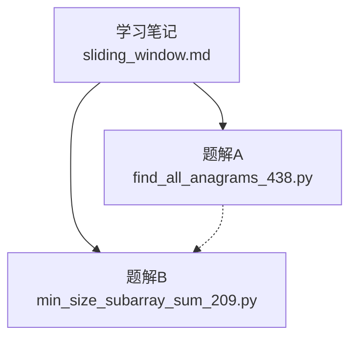
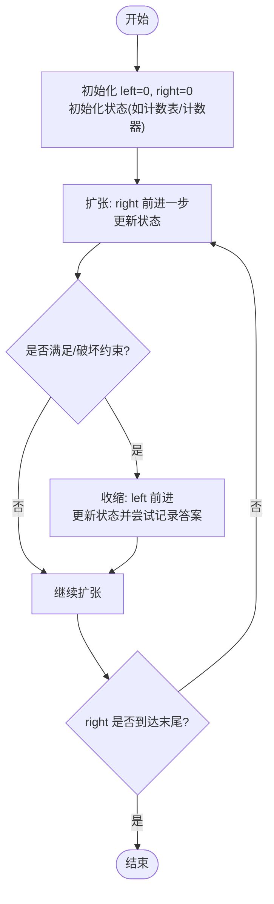
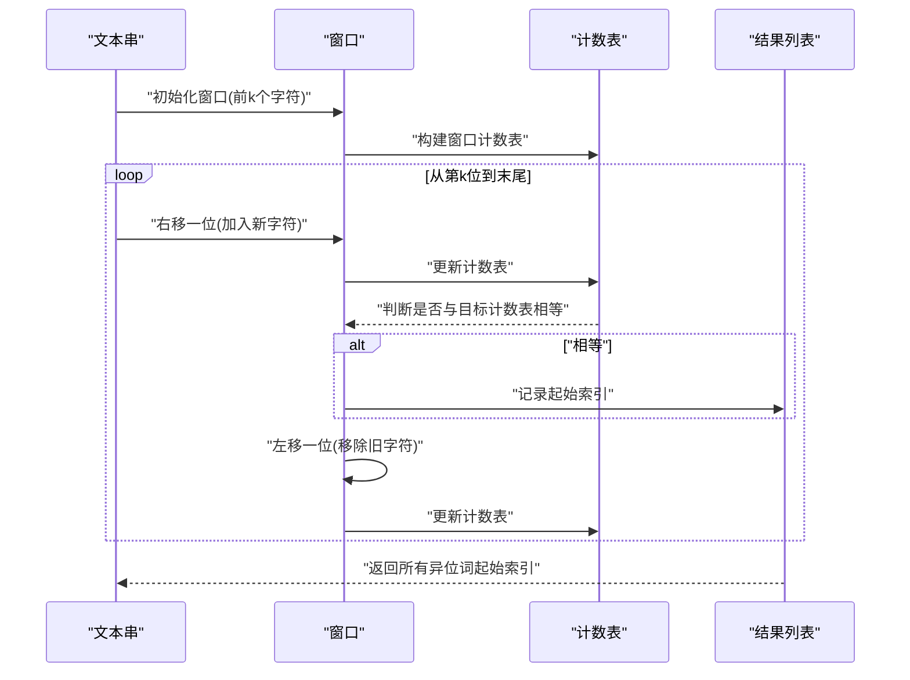
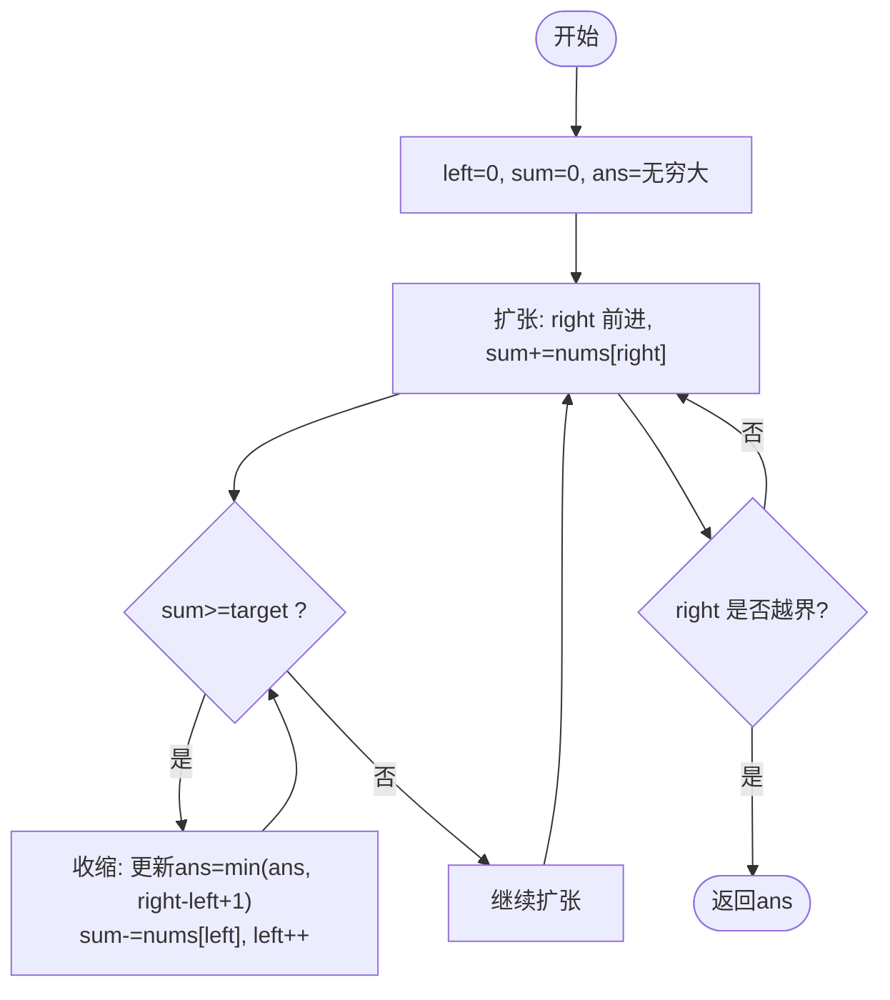
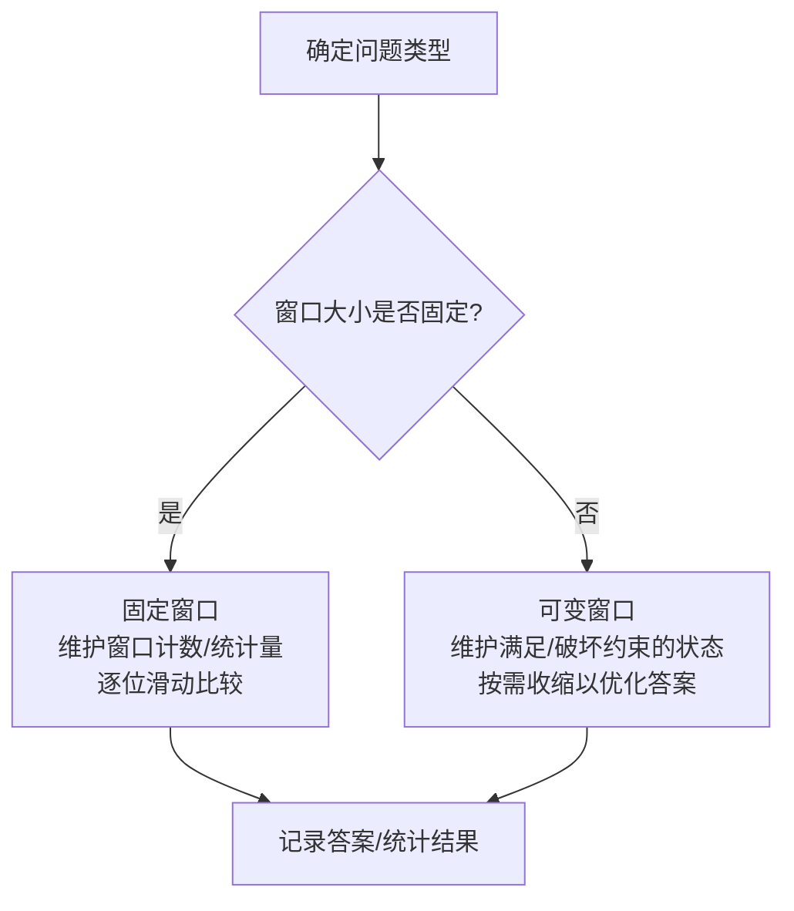
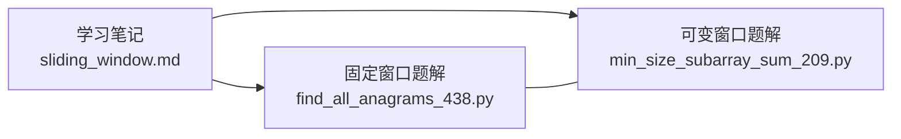

# 滑动窗口算法

<cite>
**本文引用的文件**   
- [learning/stage1/sliding_window.md](file://learning/stage1/sliding_window.md)
- [solutions/stage1/sliding_window/find_all_anagrams_438.py](file://solutions/stage1/sliding_window/find_all_anagrams_438.py)
- [solutions/stage1/sliding_window/min_size_subarray_sum_209.py](file://solutions/stage1/sliding_window/min_size_subarray_sum_209.py)
</cite>

## 目录
1. [简介](#简介)
2. [项目结构](#项目结构)
3. [核心组件](#核心组件)
4. [架构总览](#架构总览)
5. [详细组件分析](#详细组件分析)
6. [依赖分析](#依赖分析)
7. [性能考虑](#性能考虑)
8. [故障排查指南](#故障排查指南)
9. [结论](#结论)
10. [附录](#附录)

## 简介
本学习文档围绕“滑动窗口”这一重要算法模式，系统讲解其核心思想、窗口扩张与收缩策略、固定窗口与可变窗口的适用场景，并通过两道经典题目进行实战演练：
- 找到字符串中所有字母异位词（变位词）
- 长度最小的子数组

文档提供标准模板与解题框架，解释状态维护与优化技巧，并给出时间与空间复杂度分析，帮助初学者快速掌握并灵活运用该模式。

## 项目结构
仓库中与滑动窗口相关的资料包括：
- 学习笔记：learning/stage1/sliding_window.md
- 题解实现：
  - solutions/stage1/sliding_window/find_all_anagrams_438.py
  - solutions/stage1/sliding_window/min_size_subarray_sum_209.py

图表来源
- [learning/stage1/sliding_window.md](file://learning/stage1/sliding_window.md)
- [solutions/stage1/sliding_window/find_all_anagrams_438.py](file://solutions/stage1/sliding_window/find_all_anagrams_438.py)
- [solutions/stage1/sliding_window/min_size_subarray_sum_209.py](file://solutions/stage1/sliding_window/min_size_subarray_sum_209.py)

章节来源
- [learning/stage1/sliding_window.md](file://learning/stage1/sliding_window.md)
- [solutions/stage1/sliding_window/find_all_anagrams_438.py](file://solutions/stage1/sliding_window/find_all_anagrams_438.py)
- [solutions/stage1/sliding_window/min_size_subarray_sum_209.py](file://solutions/stage1/sliding_window/min_size_subarray_sum_209.py)

## 核心组件
- 窗口定义
  - 左指针 left、右指针 right 表示当前窗口边界
  - 窗口内状态通常用计数表/哈希表维护（如字符频次、元素出现次数等）
- 扩张与收缩
  - 扩张：移动 right 扩大窗口，更新状态
  - 收缩：当满足或破坏约束时移动 left 缩小窗口，更新状态并尝试记录答案
- 固定窗口 vs 可变窗口
  - 固定窗口：窗口大小不变，适合“长度为 k 的子串/子数组”类问题
  - 可变窗口：根据条件动态调整大小，适合“最短/最长满足条件的区间”类问题
- 状态维护要点
  - 明确“有效状态”的判定条件
  - 在扩张后及时检查是否需要收缩
  - 在收缩过程中正确更新答案（最小值/最大值/收集结果）

章节来源
- [learning/stage1/sliding_window.md](file://learning/stage1/sliding_window.md)

## 架构总览
下图展示了滑动窗口在两类典型问题中的通用流程：固定窗口与可变窗口。

图表来源
- [learning/stage1/sliding_window.md](file://learning/stage1/sliding_window.md)

## 详细组件分析

### 模板与框架
- 通用步骤
  - 初始化左右指针与状态容器
  - 循环扩张右指针，更新状态
  - 若满足/破坏约束，则收缩左指针，更新答案
  - 遍历结束后输出结果
- 常见状态容器
  - 定长数组（如小写字母计数）
  - 哈希表（键为元素，值为频次）
- 关键细节
  - 何时收缩：由问题约束决定（例如“不合法”、“超过目标”、“包含全部所需字符”等）
  - 何时记录答案：在每次合法窗口形成后更新（最小长度取 min，最大长度取 max，或收集索引）

章节来源
- [learning/stage1/sliding_window.md](file://learning/stage1/sliding_window.md)

### 题目一：找到字符串中所有字母异位词
- 问题类型：固定窗口（窗口大小等于目标串长度）
- 思路要点
  - 使用两个计数表：目标串频次表与当前窗口频次表
  - 窗口大小固定为目标串长度，逐位滑动比较
  - 相等即记录起始位置
- 复杂度
  - 时间：O(n)，n 为文本串长度
  - 空间：O(k)，k 为字符集大小（通常为常数）
- 参考实现路径
  - [solutions/stage1/sliding_window/find_all_anagrams_438.py](file://solutions/stage1/sliding_window/find_all_anagrams_438.py)

图表来源
- [solutions/stage1/sliding_window/find_all_anagrams_438.py](file://solutions/stage1/sliding_window/find_all_anagrams_438.py)

章节来源
- [solutions/stage1/sliding_window/find_all_anagrams_438.py](file://solutions/stage1/sliding_window/find_all_anagrams_438.py)

### 题目二：长度最小的子数组
- 问题类型：可变窗口（寻找最短满足条件的子数组）
- 思路要点
  - 维护窗口和 sum，扩张右指针累加
  - 当 sum 达到目标时，尝试收缩左指针以缩短窗口，同时更新最小长度
  - 直到 sum 不再满足条件，继续扩张
- 复杂度
  - 时间：O(n)，每个元素最多被加入和移除各一次
  - 空间：O(1)
- 参考实现路径
  - [solutions/stage1/sliding_window/min_size_subarray_sum_209.py](file://solutions/stage1/sliding_window/min_size_subarray_sum_209.py)

图表来源
- [solutions/stage1/sliding_window/min_size_subarray_sum_209.py](file://solutions/stage1/sliding_window/min_size_subarray_sum_209.py)

章节来源
- [solutions/stage1/sliding_window/min_size_subarray_sum_209.py](file://solutions/stage1/sliding_window/min_size_subarray_sum_209.py)

### 概念性总览
下图对比固定窗口与可变窗口的决策分支差异，便于理解何时选择哪种模式。

[此图为概念性流程图，无需代码来源]

## 依赖分析
- 模块关系
  - 学习笔记提供方法论与模板
  - 题解文件分别对应固定窗口与可变窗口两种范式
- 耦合与复用
  - 两者共享“双指针 + 状态维护”的核心骨架
  - 差异在于约束判定与收缩时机

图表来源
- [learning/stage1/sliding_window.md](file://learning/stage1/sliding_window.md)
- [solutions/stage1/sliding_window/find_all_anagrams_438.py](file://solutions/stage1/sliding_window/find_all_anagrams_438.py)
- [solutions/stage1/sliding_window/min_size_subarray_sum_209.py](file://solutions/stage1/sliding_window/min_size_subarray_sum_209.py)

章节来源
- [learning/stage1/sliding_window.md](file://learning/stage1/sliding_window.md)
- [solutions/stage1/sliding_window/find_all_anagrams_438.py](file://solutions/stage1/sliding_window/find_all_anagrams_438.py)
- [solutions/stage1/sliding_window/min_size_subarray_sum_209.py](file://solutions/stage1/sliding_window/min_size_subarray_sum_209.py)

## 性能考虑
- 时间复杂度
  - 固定窗口：O(n)，n 为输入长度
  - 可变窗口：O(n)，每个元素进出窗口各一次
- 空间复杂度
  - 固定窗口：O(k) 或 O(字符集大小)
  - 可变窗口：O(1) 或 O(字符集大小)
- 优化技巧
  - 使用定长数组替代哈希表以降低常数开销（当键空间有限且连续时）
  - 提前剪枝：在扩张阶段尽早判断不可能满足的条件
  - 增量更新状态：避免重复计算，仅对进出窗口的元素做 O(1) 更新

[本节为通用指导，无需具体文件来源]

## 故障排查指南
- 常见问题
  - 窗口收缩条件写反：导致错过最优解或死循环
  - 状态更新遗漏：忘记在 left 移动时移除旧元素的影响
  - 边界处理不当：空输入、无解情况未正确处理
- 调试建议
  - 打印窗口边界与关键状态变量
  - 用小规模样例逐步验证扩张/收缩逻辑
  - 将“满足约束”的判定抽象为独立函数，便于单元测试

[本节为通用指导，无需具体文件来源]

## 结论
滑动窗口通过“双指针 + 状态维护”将许多区间问题统一到统一的思考框架下。掌握固定窗口与可变窗口的判别准则、状态更新与收缩时机，即可高效解决大量字符串与数组区间问题。配合本题的两道代表题型，建议读者反复练习并总结自己的模板与套路。

[本节为总结性内容，无需具体文件来源]

## 附录
- 推荐练习清单（按难度递增）
  - 固定窗口：长度为 k 的子串/子数组相关问题
  - 可变窗口：最短/最长满足条件的区间问题
- 自检清单
  - 是否明确了“有效窗口”的判定条件？
  - 扩张后是否需要立即收缩？
  - 收缩时是否正确更新答案与状态？
  - 边界与无解情况是否覆盖？

[本节为补充信息，无需具体文件来源]