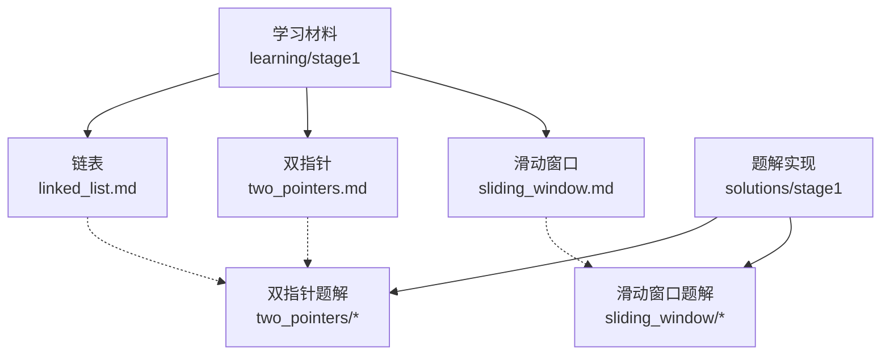
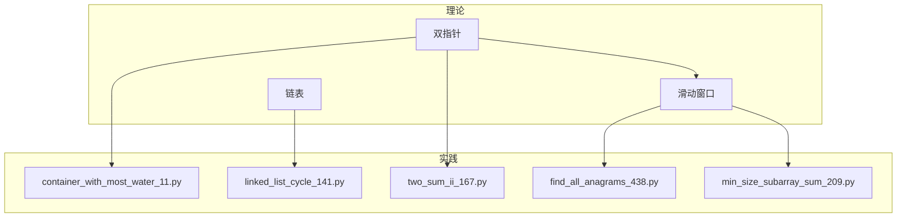
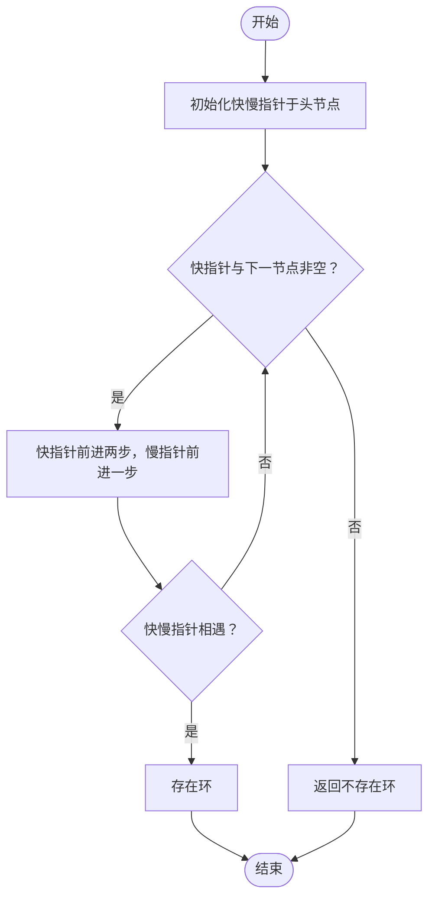
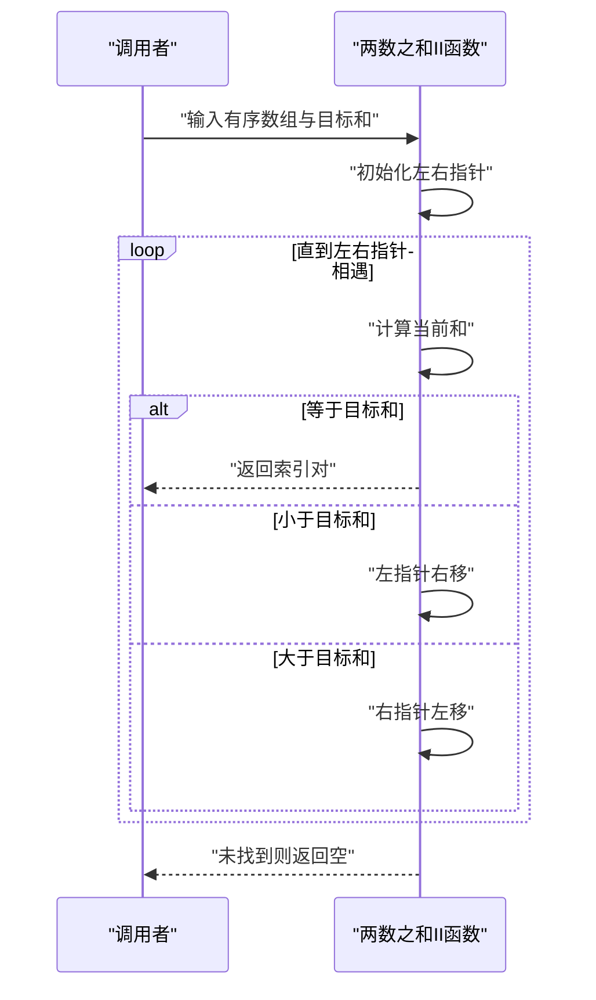
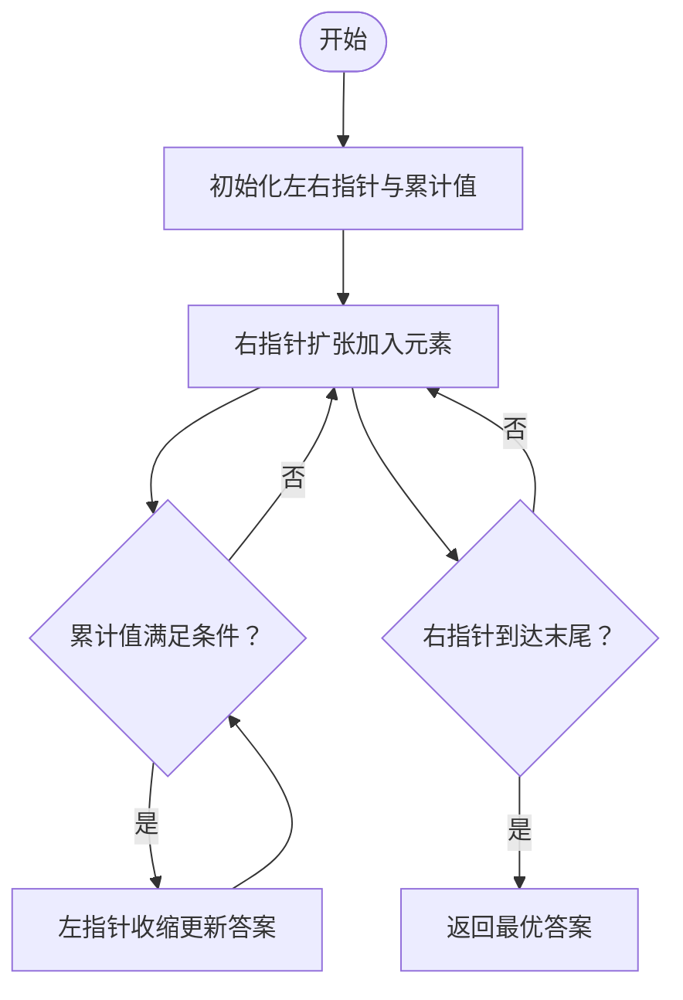
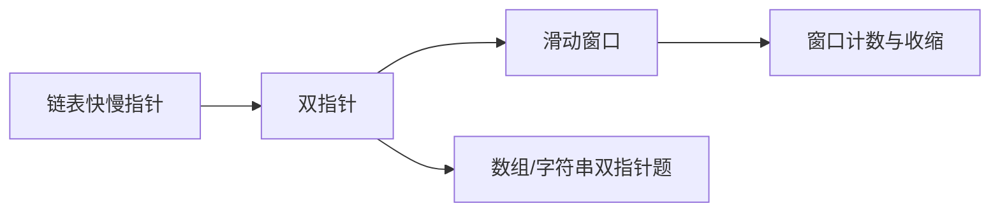
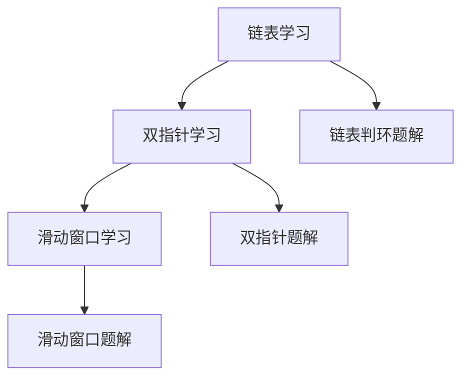

# 第一阶段：基础数据结构学习指南

<cite>
**本文引用的文件**   
- [learning/stage1/linked_list.md](file://learning/stage1/linked_list.md)
- [learning/stage1/two_pointers.md](file://learning/stage1/two_pointers.md)
- [learning/stage1/sliding_window.md](file://learning/stage1/sliding_window.md)
- [solutions/stage1/two_pointers/container_with_most_water_11.py](file://solutions/stage1/two_pointers/container_with_most_water_11.py)
- [solutions/stage1/two_pointers/linked_list_cycle_141.py](file://solutions/stage1/two_pointers/linked_list_cycle_141.py)
- [solutions/stage1/two_pointers/two_sum_ii_167.py](file://solutions/stage1/two_pointers/two_sum_ii_167.py)
- [solutions/stage1/sliding_window/find_all_anagrams_438.py](file://solutions/stage1/sliding_window/find_all_anagrams_438.py)
- [solutions/stage1/sliding_window/min_size_subarray_sum_209.py](file://solutions/stage1/sliding_window/min_size_subarray_sum_209.py)
</cite>

## 目录
1. [引言](#引言)
2. [项目结构](#项目结构)
3. [核心组件](#核心组件)
4. [架构总览](#架构总览)
5. [详细组件分析](#详细组件分析)
6. [依赖关系分析](#依赖关系分析)
7. [性能考虑](#性能考虑)
8. [故障排查指南](#故障排查指南)
9. [结论](#结论)
10. [附录](#附录)

## 引言
本指南聚焦第一阶段的基础数据结构与算法入门，围绕链表操作、双指针技巧与滑动窗口三大主题展开。目标是帮助初学者建立清晰的知识框架，掌握典型应用场景与解题模式，理解三者之间的内在联系与递进关系，并提供可执行的学习计划、练习建议与调试技巧，确保扎实掌握数据结构基础。

## 项目结构
仓库采用“学习材料 + 题解”的分层组织方式：
- learning/stage1：第一阶段的理论学习文档（链表、双指针、滑动窗口）
- solutions/stage1：对应主题的题解实现（Python），覆盖经典题目

图表来源
- [learning/stage1/linked_list.md](file://learning/stage1/linked_list.md)
- [learning/stage1/two_pointers.md](file://learning/stage1/two_pointers.md)
- [learning/stage1/sliding_window.md](file://learning/stage1/sliding_window.md)
- [solutions/stage1/two_pointers/container_with_most_water_11.py](file://solutions/stage1/two_pointers/container_with_most_water_11.py)
- [solutions/stage1/two_pointers/linked_list_cycle_141.py](file://solutions/stage1/two_pointers/linked_list_cycle_141.py)
- [solutions/stage1/two_pointers/two_sum_ii_167.py](file://solutions/stage1/two_pointers/two_sum_ii_167.py)
- [solutions/stage1/sliding_window/find_all_anagrams_438.py](file://solutions/stage1/sliding_window/find_all_anagrams_438.py)
- [solutions/stage1/sliding_window/min_size_subarray_sum_209.py](file://solutions/stage1/sliding_window/min_size_subarray_sum_209.py)

章节来源
- [learning/stage1/linked_list.md](file://learning/stage1/linked_list.md)
- [learning/stage1/two_pointers.md](file://learning/stage1/two_pointers.md)
- [learning/stage1/sliding_window.md](file://learning/stage1/sliding_window.md)
- [solutions/stage1/two_pointers/container_with_most_water_11.py](file://solutions/stage1/two_pointers/container_with_most_water_11.py)
- [solutions/stage1/two_pointers/linked_list_cycle_141.py](file://solutions/stage_pointers/linked_list_cycle_141.py)
- [solutions/stage1/two_pointers/two_sum_ii_167.py](file://solutions/stage1/two_pointers/two_sum_ii_167.py)
- [solutions/stage1/sliding_window/find_all_anagrams_438.py](file://solutions/stage1/sliding_window/find_all_anagrams_438.py)
- [solutions/stage1/sliding_window/min_size_subarray_sum_209.py](file://solutions/stage1/sliding_window/min_size_subarray_sum_209.py)

## 核心组件
- 链表操作
  - 理论基础：节点指针、头尾插入删除、虚拟头节点、快慢指针判环等
  - 典型场景：反转链表、合并有序链表、检测环、移除节点
  - 解题模式：设置哨兵节点、控制前后指针、循环不变式维护
- 双指针技巧
  - 理论基础：同向/相向指针、左右边界收缩、状态转移
  - 典型场景：两数之和 II、盛水容器、回文串判定、链表环入口
  - 解题模式：先排序再双指针、固定一端移动另一端、根据条件收缩区间
- 滑动窗口算法
  - 理论基础：左右端点表示窗口、窗口扩张与收缩、计数哈希表
  - 典型场景：最小覆盖子串、无重复字符的最长子串、定长/变长窗口问题
  - 解题模式：右指针扩张满足条件后左指针收缩更新答案

章节来源
- [learning/stage1/linked_list.md](file://learning/stage1/linked_list.md)
- [learning/stage1/two_pointers.md](file://learning/stage1/two_pointers.md)
- [learning/stage1/sliding_window.md](file://learning/stage1/sliding_window.md)

## 架构总览
从知识到实践的映射关系如下：学习材料提供概念与模式，题解展示具体实现路径；双指针是滑动窗口的思想基础，而链表中的快慢指针又是双指针的典型应用之一。

图表来源
- [learning/stage1/linked_list.md](file://learning/stage1/linked_list.md)
- [learning/stage1/two_pointers.md](file://learning/stage1/two_pointers.md)
- [learning/stage1/sliding_window.md](file://learning/stage1/sliding_window.md)
- [solutions/stage1/two_pointers/container_with_most_water_11.py](file://solutions/stage1/two_pointers/container_with_most_water_11.py)
- [solutions/stage1/two_pointers/linked_list_cycle_141.py](file://solutions/stage1/two_pointers/linked_list_cycle_141.py)
- [solutions/stage1/two_pointers/two_sum_ii_167.py](file://solutions/stage1/two_pointers/two_sum_ii_167.py)
- [solutions/stage1/sliding_window/find_all_anagrams_438.py](file://solutions/stage1/sliding_window/find_all_anagrams_438.py)
- [solutions/stage1/sliding_window/min_size_subarray_sum_209.py](file://solutions/stage1/sliding_window/min_size_subarray_sum_209.py)

## 详细组件分析

### 链表操作
- 学习目标
  - 掌握节点结构与基本操作（插入、删除、遍历）
  - 熟练使用虚拟头节点简化边界处理
  - 理解并实现常见模式：反转、合并、判环、找中点
- 关键要点
  - 循环不变式：在每一步操作前后保持的约束条件
  - 指针安全：空指针检查、避免悬垂指针
  - 空间优化：原地修改 vs 额外空间
- 典型题目与实践
  - 链表环检测：使用快慢指针判断是否存在环，并定位入口
    - 参考实现：[solutions/stage1/two_pointers/linked_list_cycle_141.py](file://solutions/stage1/two_pointers/linked_list_cycle_141.py)
- 时间规划
  - 预计时长：约 6–8 小时
  - 练习数量：建议完成 5–8 道基础题（含判环、反转、合并等）

章节来源
- [learning/stage1/linked_list.md](file://learning/stage1/linked_list.md)
- [solutions/stage1/two_pointers/linked_list_cycle_141.py](file://solutions/stage1/two_pointers/linked_list_cycle_141.py)

#### 链表判环流程（快慢指针）

图表来源
- [solutions/stage1/two_pointers/linked_list_cycle_141.py](file://solutions/stage1/two_pointers/linked_list_cycle_141.py)

### 双指针技巧
- 学习目标
  - 理解同向与相向双指针的使用场景
  - 掌握“先排序再双指针”的通用范式
  - 能将双指针迁移到链表判环、数组区间等问题
- 关键要点
  - 左右指针收缩策略：依据目标函数单调性决定移动方向
  - 去重与边界：排序后相邻元素去重、避免重复计算
  - 复杂度：通常 O(n) 或 O(n log n)（含排序）
- 典型题目与实践
  - 两数之和 II（已排序）：左右指针逼近目标和
    - 参考实现：[solutions/stage1/two_pointers/two_sum_ii_167.py](file://solutions/stage1/two_pointers/two_sum_ii_167.py)
  - 盛水最多的容器：按高度差收缩短边
    - 参考实现：[solutions/stage1/two_pointers/container_with_most_water_11.py](file://solutions/stage1/two_pointers/container_with_most_water_11.py)
- 时间规划
  - 预计时长：约 8–10 小时
  - 练习数量：建议完成 6–10 道题目（涵盖相向与同向）

章节来源
- [learning/stage1/two_pointers.md](file://learning/stage1/two_pointers.md)
- [solutions/stage1/two_pointers/two_sum_ii_167.py](file://solutions/stage1/two_pointers/two_sum_ii_167.py)
- [solutions/stage1/two_pointers/container_with_most_water_11.py](file://solutions/stage1/two_pointers/container_with_most_water_11.py)

#### 两数之和 II（相向双指针）序列图

图表来源
- [solutions/stage1/two_pointers/two_sum_ii_167.py](file://solutions/stage1/two_pointers/two_sum_ii_167.py)

### 滑动窗口算法
- 学习目标
  - 理解窗口扩张与收缩的时机与条件
  - 掌握计数哈希表维护窗口内状态
  - 能区分定长窗口与变长窗口两种模式
- 关键要点
  - 窗口合法性：何时停止扩张、何时开始收缩
  - 答案更新：在合法窗口上记录最优解
  - 复杂度：通常 O(n)，计数结构 O(1) 或 O(k)
- 典型题目与实践
  - 找到字符串中所有字母异位词：变长/定长窗口结合计数
    - 参考实现：[solutions/stage1/sliding_window/find_all_anagrams_438.py](file://solutions/stage1/sliding_window/find_all_anagrams_438.py)
  - 长度最小的子数组：变长窗口求最短合法区间
    - 参考实现：[solutions/stage1/sliding_window/min_size_subarray_sum_209.py](file://solutions/stage1/sliding_window/min_size_subarray_sum_209.py)
- 时间规划
  - 预计时长：约 8–10 小时
  - 练习数量：建议完成 6–10 道题目（覆盖定长与变长）

章节来源
- [learning/stage1/sliding_window.md](file://learning/stage1/sliding_window.md)
- [solutions/stage1/sliding_window/find_all_anagrams_438.py](file://solutions/stage1/sliding_window/find_all_anagrams_438.py)
- [solutions/stage1/sliding_window/min_size_subarray_sum_209.py](file://solutions/stage1/sliding_window/min_size_subarray_sum_209.py)

#### 变长窗口（最小长度子数组）流程图

图表来源
- [solutions/stage1/sliding_window/min_size_subarray_sum_209.py](file://solutions/stage1/sliding_window/min_size_subarray_sum_209.py)

### 概念总览：三者的内在联系与递进
- 链表中的快慢指针是双指针的特例，用于检测环、找中点等
- 双指针是滑动窗口的思想基础：通过左右指针控制区间
- 滑动窗口将“区间思维”系统化，配合计数结构解决更复杂的子串/子数组问题

图表来源
- [learning/stage1/linked_list.md](file://learning/stage1/linked_list.md)
- [learning/stage1/two_pointers.md](file://learning/stage1/two_pointers.md)
- [learning/stage1/sliding_window.md](file://learning/stage1/sliding_window.md)

## 依赖关系分析
- 知识依赖
  - 链表操作为后续复杂数据结构（栈、队列、图）打基础
  - 双指针为滑动窗口与二分查找提供思路铺垫
  - 滑动窗口为后续动态规划与区间类问题提供范式
- 代码依赖
  - 题解文件独立实现，但共享相同的模式与模板
  - 学习材料与题解一一对应，便于对照理解

图表来源
- [learning/stage1/linked_list.md](file://learning/stage1/linked_list.md)
- [learning/stage1/two_pointers.md](file://learning/stage1/two_pointers.md)
- [learning/stage1/sliding_window.md](file://learning/stage1/sliding_window.md)
- [solutions/stage1/two_pointers/linked_list_cycle_141.py](file://solutions/stage1/two_pointers/linked_list_cycle_141.py)
- [solutions/stage1/two_pointers/container_with_most_water_11.py](file://solutions/stage1/two_pointers/container_with_most_water_11.py)
- [solutions/stage1/two_pointers/two_sum_ii_167.py](file://solutions/stage1/two_pointers/two_sum_ii_167.py)
- [solutions/stage1/sliding_window/find_all_anagrams_438.py](file://solutions/stage1/sliding_window/find_all_anagrams_438.py)
- [solutions/stage1/sliding_window/min_size_subarray_sum_209.py](file://solutions/stage1/sliding_window/min_size_subarray_sum_209.py)

## 性能考虑
- 时间复杂度
  - 链表操作：O(n) 线性扫描为主，原地反转 O(1) 额外空间
  - 双指针：O(n) 或 O(n log n)（含排序）
  - 滑动窗口：O(n)，计数结构常数或较小开销
- 空间复杂度
  - 优先选择原地修改与常量额外空间
  - 滑动窗口中使用哈希表时注意键集大小上限
- 优化建议
  - 明确循环不变式，减少无效分支
  - 利用单调性与边界性质提前终止
  - 避免重复计算，必要时预处理（如前缀和、排序）

## 故障排查指南
- 链表常见问题
  - 空指针异常：进入循环前检查头节点是否为空
  - 死循环：快慢指针步长不一致或未正确推进
  - 断链：删除节点时忘记重新连接前后指针
- 双指针常见问题
  - 越界访问：左右指针移动时需检查边界
  - 遗漏情况：等于目标时的处理逻辑缺失
  - 重复结果：未进行去重导致输出冗余
- 滑动窗口常见问题
  - 窗口非法：收缩条件与更新答案的顺序错误
  - 计数不同步：入窗/出窗时计数增减不匹配
  - 答案未更新：仅在合法窗口时更新最优解
- 调试技巧
  - 打印关键变量：指针位置、窗口状态、计数表
  - 构造最小用例：验证边界与极端情况
  - 分步验证：将复杂逻辑拆分为小步骤逐一测试

章节来源
- [learning/stage1/linked_list.md](file://learning/stage1/linked_list.md)
- [learning/stage1/two_pointers.md](file://learning/stage1/two_pointers.md)
- [learning/stage1/sliding_window.md](file://learning/stage1/sliding_window.md)

## 结论
通过系统学习链表操作、双指针技巧与滑动窗口算法，初学者可以建立起“指针驱动”的核心能力。三者层层递进：从单链表的指针操控，到数组/字符串的双指针区间控制，再到窗口化的区间思维与计数维护。配合合理的练习量与调试方法，能够在较短时间内形成稳定的解题直觉与工程化实现能力。

## 附录
- 学习时间规划（建议）
  - 链表操作：6–8 小时，5–8 题
  - 双指针技巧：8–10 小时，6–10 题
  - 滑动窗口算法：8–10 小时，6–10 题
- 推荐练习清单（示例）
  - 链表：判环、反转、合并、删除节点
  - 双指针：两数之和 II、盛水容器、回文串、链表环入口
  - 滑动窗口：字母异位词、最小覆盖子串、长度最小子数组
- 实践建议
  - 先读学习材料，再对照题解复现
  - 每道题写出伪代码与不变式，再编码
  - 完成后总结模式与易错点，形成个人模板