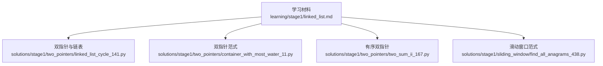
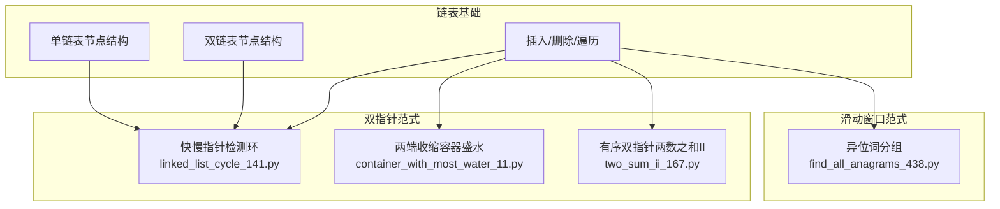
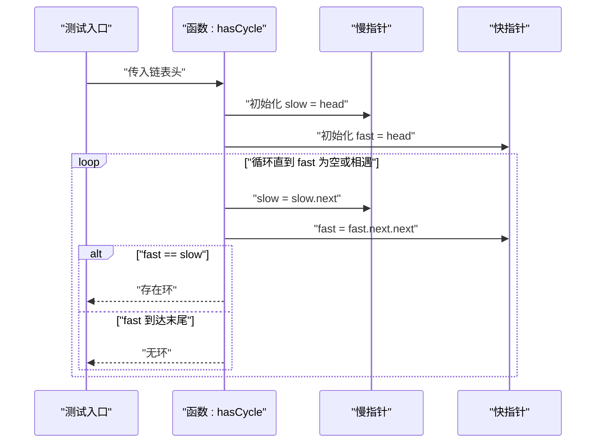
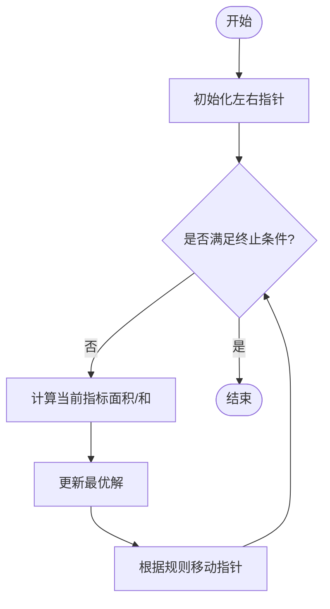
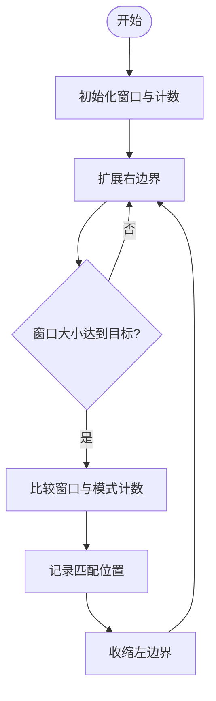
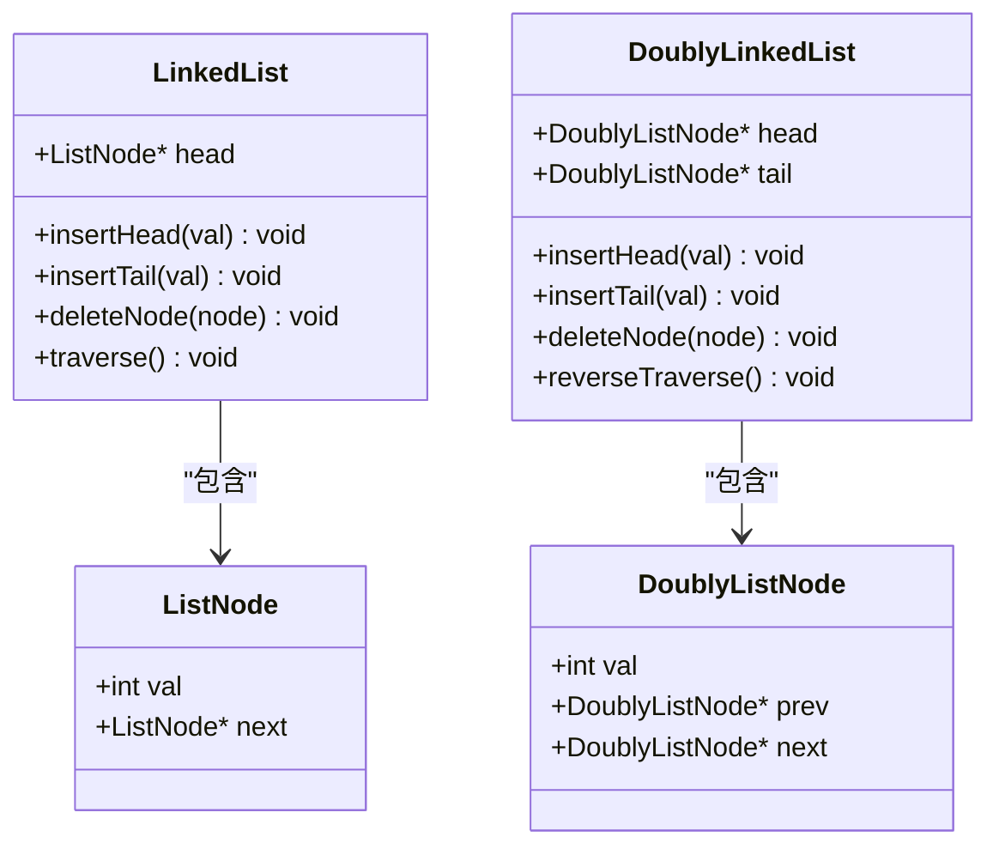
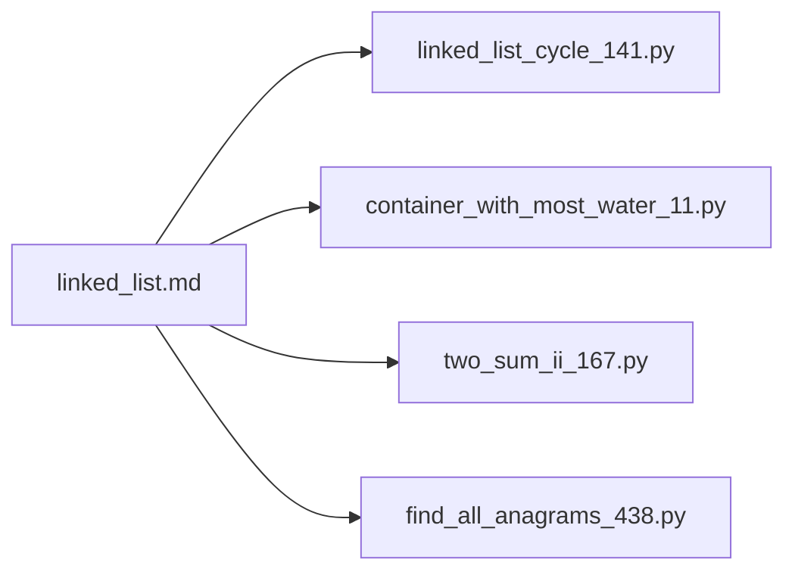

# 链表操作基础

<cite>
**本文引用的文件**   
- [learning/stage1/linked_list.md](file://learning/stage1/linked_list.md)
- [solutions/stage1/sliding_window/find_all_anagrams_438.py](file://solutions/stage1/sliding_window/find_all_anagrams_438.py)
- [solutions/stage1/two_pointers/container_with_most_water_11.py](file://solutions/stage1/two_pointers/container_with_most_water_11.py)
- [solutions/stage1/two_pointers/linked_list_cycle_141.py](file://solutions/stage1/two_pointers/linked_list_cycle_141.py)
- [solutions/stage1/two_pointers/two_sum_ii_167.py](file://solutions/stage1/two_pointers/two_sum_ii_167.py)
</cite>

## 目录
1. [简介](#简介)
2. [项目结构](#项目结构)
3. [核心组件](#核心组件)
4. [架构总览](#架构总览)
5. [详细组件分析](#详细组件分析)
6. [依赖分析](#依赖分析)
7. [性能考虑](#性能考虑)
8. [故障排查指南](#故障排查指南)
9. [结论](#结论)
10. [附录](#附录)

## 简介
本学习文档围绕“链表操作基础”展开，目标是帮助初学者系统掌握链表的理论基础、节点结构设计、基本操作（插入、删除、遍历），并对比单链表与双链表的区别与应用场景。文档同时提供常见操作的代码模板与最佳实践，解释链表与数组的优缺点及选择策略，并给出典型面试题解析与解题思路（如反转链表、检测环等）。为便于循序渐进学习，文末附有学习路径与实践建议。

## 项目结构
仓库中与链表学习直接相关的资料位于 learning 与 solutions 两个目录：
- learning/stage1/linked_list.md：链表入门学习资料，适合建立概念与框架认知。
- solutions/stage1/two_pointers/linked_list_cycle_141.py：使用快慢指针检测链表环的经典实现，体现双指针在链表上的应用。
- solutions/stage1/two_pointers/container_with_most_water_11.py：双指针思想的代表题，有助于理解“两端收缩”的策略迁移到链表场景。
- solutions/stage1/two_pointers/two_sum_ii_167.py：有序数组的双指针解法，可作为从数组到链表思维过渡的参考。
- solutions/stage1/sliding_window/find_all_anagrams_438.py：滑动窗口范式，虽非链表专属，但有助于理解“区间维护”的思想，可类比到链表子序列处理。

图表来源
- [learning/stage1/linked_list.md](file://learning/stage1/linked_list.md)
- [solutions/stage1/two_pointers/linked_list_cycle_141.py](file://solutions/stage1/two_pointers/linked_list_cycle_141.py)
- [solutions/stage1/two_pointers/container_with_most_water_11.py](file://solutions/stage1/two_pointers/container_with_most_water_11.py)
- [solutions/stage1/two_pointers/two_sum_ii_167.py](file://solutions/stage1/two_pointers/two_sum_ii_167.py)
- [solutions/stage1/sliding_window/find_all_anagrams_438.py](file://solutions/stage1/sliding_window/find_all_anagrams_438.py)

章节来源
- [learning/stage1/linked_list.md](file://learning/stage1/linked_list.md)
- [solutions/stage1/two_pointers/linked_list_cycle_141.py](file://solutions/stage1/two_pointers/linked_list_cycle_141.py)
- [solutions/stage1/two_pointers/container_with_most_water_11.py](file://solutions/stage1/two_pointers/container_with_most_water_11.py)
- [solutions/stage1/two_pointers/two_sum_ii_167.py](file://solutions/stage1/two_pointers/two_sum_ii_167.py)
- [solutions/stage1/sliding_window/find_all_anagrams_438.py](file://solutions/stage1/sliding_window/find_all_anagrams_438.py)

## 核心组件
本节聚焦链表的核心概念与操作要点，结合仓库中的学习材料与题目实现进行说明。

- 理论基础
  - 链表是一种线性数据结构，元素通过指针链接形成序列。
  - 单链表每个节点包含数据与指向下一个节点的指针；双链表额外包含指向前驱节点的指针。
  - 常用操作包括插入、删除、查找、遍历，时间复杂度因位置不同而异。

- 节点结构设计
  - 单链表节点：数据字段 + next 指针。
  - 双链表节点：数据字段 + prev 指针 + next 指针。
  - 设计要点：统一空指针语义、避免悬挂指针、注意边界条件（头尾节点）。

- 基本操作
  - 插入：头部插入 O(1)，尾部插入需维护尾指针或遍历至末尾 O(n)。
  - 删除：已知前驱时 O(1)，否则需先查找前驱 O(n)。
  - 遍历：从头到尾顺序访问 O(n)。
  - 查找：按值或按索引查找 O(n)。

- 单链表 vs 双链表
  - 单链表：空间开销小，适合单向遍历场景；不支持高效反向遍历。
  - 双链表：支持双向遍历与前驱删除，空间开销更大；适用于需要频繁前后移动或删除的场景。

- 链表与数组对比
  - 随机访问：数组 O(1)，链表 O(n)。
  - 插入/删除：数组中间插入/删除 O(n)，链表 O(1)（已知前驱）。
  - 缓存友好性：数组更优，链表较差。
  - 内存连续性：数组连续，链表分散。
  - 选择策略：读多写少且需随机访问选数组；频繁插入删除且无需随机访问选链表。

章节来源
- [learning/stage1/linked_list.md](file://learning/stage1/linked_list.md)

## 架构总览
下图展示“链表学习”与“双指针/滑动窗口”相关题目的关系，以及它们在算法范式上的映射。

图表来源
- [learning/stage1/linked_list.md](file://learning/stage1/linked_list.md)
- [solutions/stage1/two_pointers/linked_list_cycle_141.py](file://solutions/stage1/two_pointers/linked_list_cycle_141.py)
- [solutions/stage1/two_pointers/container_with_most_water_11.py](file://solutions/stage1/two_pointers/container_with_most_water_11.py)
- [solutions/stage1/two_pointers/two_sum_ii_167.py](file://solutions/stage1/two_pointers/two_sum_ii_167.py)
- [solutions/stage1/sliding_window/find_all_anagrams_438.py](file://solutions/stage1/sliding_window/find_all_anagrams_438.py)

## 详细组件分析

### 链表环检测（快慢指针）
- 目标：判断链表中是否存在环，若存在返回入环点或布尔结果（依题意）。
- 关键点：
  - 快指针每次走两步，慢指针每次走一步；若相遇则存在环。
  - 找到相遇点后，将一指针重置到头节点，两指针同速前进，再次相遇即为入环点。
- 复杂度：时间 O(n)，空间 O(1)。
- 参考实现：见 linked_list_cycle_141.py。

图表来源
- [solutions/stage1/two_pointers/linked_list_cycle_141.py](file://solutions/stage1/two_pointers/linked_list_cycle_141.py)

章节来源
- [solutions/stage1/two_pointers/linked_list_cycle_141.py](file://solutions/stage1/two_pointers/linked_list_cycle_141.py)

### 双指针范式迁移：容器盛水与两数之和 II
- 容器盛水（两端收缩）：
  - 左右指针从两端向中间移动，依据较短边决定收缩方向，以尝试获得更大的面积。
  - 时间 O(n)，空间 O(1)。
  - 参考实现：container_with_most_water_11.py。
- 两数之和 II（有序数组）：
  - 左右指针根据当前和与目标的大小关系移动，逐步逼近答案。
  - 时间 O(n)，空间 O(1)。
  - 参考实现：two_sum_ii_167.py。

图表来源
- [solutions/stage1/two_pointers/container_with_most_water_11.py](file://solutions/stage1/two_pointers/container_with_most_water_11.py)
- [solutions/stage1/two_pointers/two_sum_ii_167.py](file://solutions/stage1/two_pointers/two_sum_ii_167.py)

章节来源
- [solutions/stage1/two_pointers/container_with_most_water_11.py](file://solutions/stage1/two_pointers/container_with_most_water_11.py)
- [solutions/stage1/two_pointers/two_sum_ii_167.py](file://solutions/stage1/two_pointers/two_sum_ii_167.py)

### 滑动窗口范式：异位词分组
- 目标：在字符串中找出所有与给定模式串互为异位词的起始位置。
- 关键点：
  - 维护一个固定大小的窗口，统计字符频次，比较窗口与模式的频次表。
  - 时间 O(n)，空间取决于字符集大小。
- 参考实现：find_all_anagrams_438.py。

图表来源
- [solutions/stage1/sliding_window/find_all_anagrams_438.py](file://solutions/stage1/sliding_window/find_all_anagrams_438.py)

章节来源
- [solutions/stage1/sliding_window/find_all_anagrams_438.py](file://solutions/stage1/sliding_window/find_all_anagrams_438.py)

### 链表类图（概念示意）
以下类图用于帮助理解单链表与双链表的节点结构与关系（概念示意，不直接对应具体源码文件）。

[此图为概念示意，未直接映射到具体源码文件，故不提供图表来源]

## 依赖分析
- 学习材料对题目实现的指导关系：
  - linked_list.md 提供链表基础概念，支撑后续双指针与滑动窗口题目的理解。
  - linked_list_cycle_141.py 体现快慢指针在链表上的应用。
  - container_with_most_water_11.py 与 two_sum_ii_167.py 展示双指针范式的通用性与迁移能力。
  - find_all_anagrams_438.py 展示滑动窗口范式，可与链表子序列处理类比。

图表来源
- [learning/stage1/linked_list.md](file://learning/stage1/linked_list.md)
- [solutions/stage1/two_pointers/linked_list_cycle_141.py](file://solutions/stage1/two_pointers/linked_list_cycle_141.py)
- [solutions/stage1/two_pointers/container_with_most_water_11.py](file://solutions/stage1/two_pointers/container_with_most_water_11.py)
- [solutions/stage1/two_pointers/two_sum_ii_167.py](file://solutions/stage1/two_pointers/two_sum_ii_167.py)
- [solutions/stage1/sliding_window/find_all_anagrams_438.py](file://solutions/stage1/sliding_window/find_all_anagrams_438.py)

章节来源
- [learning/stage1/linked_list.md](file://learning/stage1/linked_list.md)
- [solutions/stage1/two_pointers/linked_list_cycle_141.py](file://solutions/stage1/two_pointers/linked_list_cycle_141.py)
- [solutions/stage1/two_pointers/container_with_most_water_11.py](file://solutions/stage1/two_pointers/container_with_most_water_11.py)
- [solutions/stage1/two_pointers/two_sum_ii_167.py](file://solutions/stage1/two_pointers/two_sum_ii_167.py)
- [solutions/stage1/sliding_window/find_all_anagrams_438.py](file://solutions/stage1/sliding_window/find_all_anagrams_438.py)

## 性能考虑
- 时间复杂度
  - 插入/删除：已知前驱时 O(1)，否则需查找前驱 O(n)。
  - 查找/遍历：O(n)。
  - 环检测：快慢指针 O(n)。
- 空间复杂度
  - 原地操作通常 O(1)，辅助结构（哈希表、栈）可能增加空间。
- 缓存与内存
  - 链表节点分散存储，缓存命中率低于数组；在大规模数据下需谨慎评估。
- 优化建议
  - 使用虚拟头节点简化边界处理。
  - 优先使用双指针减少重复遍历。
  - 合理选择单链表/双链表，权衡空间与功能需求。

[本节为通用性能讨论，不直接分析具体文件，故不提供章节来源]

## 故障排查指南
- 常见问题
  - 空指针异常：未检查 head 是否为空即访问 next。
  - 死循环：修改指针时未正确更新前驱/后继，导致环产生。
  - 越界：遍历时未判断指针是否为 None。
- 调试技巧
  - 打印关键指针状态（head、slow、fast、prev、curr）。
  - 使用断点观察指针变化轨迹。
  - 构造最小反例验证边界情况（空链表、单节点、环首/尾）。
- 参考定位
  - 环检测实现中，确保 fast 与 fast.next 判空，防止越界。
  - 双指针收缩逻辑中，确认移动条件与终止条件一致。

章节来源
- [solutions/stage1/two_pointers/linked_list_cycle_141.py](file://solutions/stage1/two_pointers/linked_list_cycle_141.py)
- [solutions/stage1/two_pointers/container_with_most_water_11.py](file://solutions/stage1/two_pointers/container_with_most_water_11.py)
- [solutions/stage1/two_pointers/two_sum_ii_167.py](file://solutions/stage1/two_pointers/two_sum_ii_167.py)

## 结论
链表作为基础数据结构，其核心价值在于灵活的插入与删除能力。通过掌握节点设计与基本操作，并结合双指针与滑动窗口等通用范式，可以有效解决大量面试与工程问题。建议在练习中注重边界条件与指针安全，逐步构建稳健的实现习惯。

[本节为总结性内容，不直接分析具体文件，故不提供章节来源]

## 附录
- 学习路径建议
  - 第一阶段：阅读 linked_list.md，理解单/双链表结构与基本操作。
  - 第二阶段：完成 linked_list_cycle_141.py，掌握快慢指针在链表中的应用。
  - 第三阶段：练习 container_with_most_water_11.py 与 two_sum_ii_167.py，体会双指针范式的迁移。
  - 第四阶段：研究 find_all_anagrams_438.py，理解滑动窗口思想，类比到链表子序列处理。
- 常见操作模板（路径指引）
  - 插入/删除/遍历：参考 linked_list.md 的概念与示例。
  - 环检测：参考 linked_list_cycle_141.py。
  - 双指针范式：参考 container_with_most_water_11.py 与 two_sum_ii_167.py。
  - 滑动窗口范式：参考 find_all_anagrams_438.py。

章节来源
- [learning/stage1/linked_list.md](file://learning/stage1/linked_list.md)
- [solutions/stage1/two_pointers/linked_list_cycle_141.py](file://solutions/stage1/two_pointers/linked_list_cycle_141.py)
- [solutions/stage1/two_pointers/container_with_most_water_11.py](file://solutions/stage1/two_pointers/container_with_most_water_11.py)
- [solutions/stage1/two_pointers/two_sum_ii_167.py](file://solutions/stage1/two_pointers/two_sum_ii_167.py)
- [solutions/stage1/sliding_window/find_all_anagrams_438.py](file://solutions/stage1/sliding_window/find_all_anagrams_438.py)