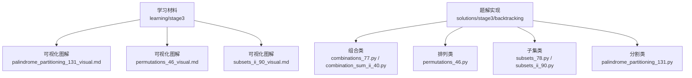
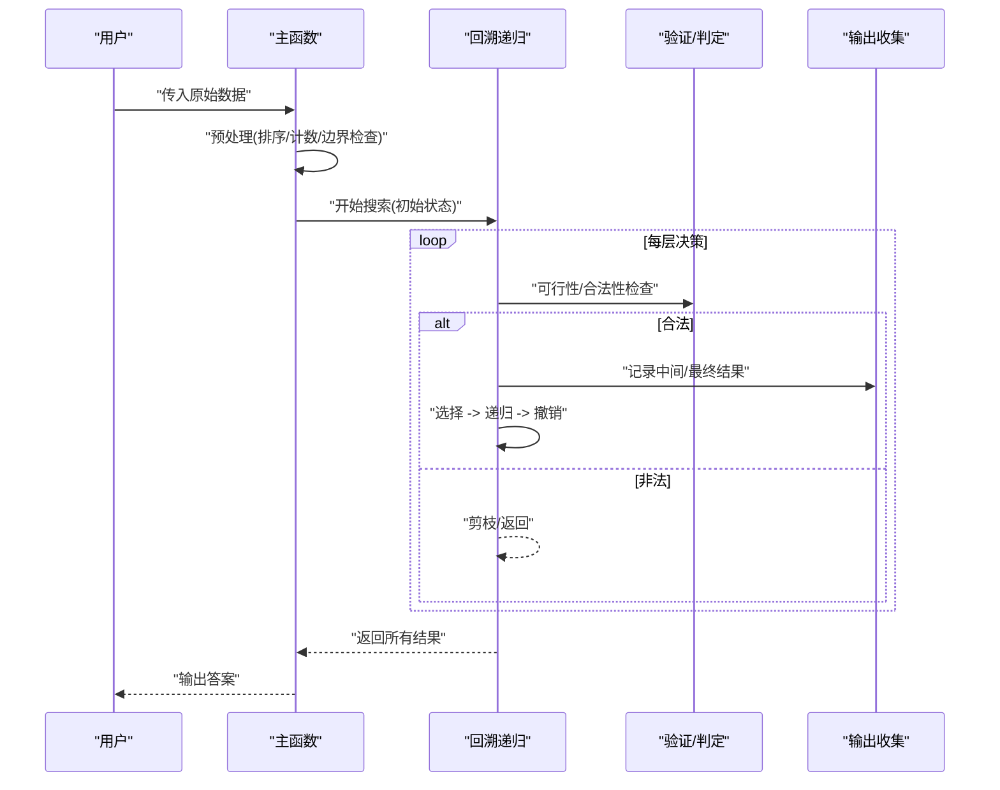
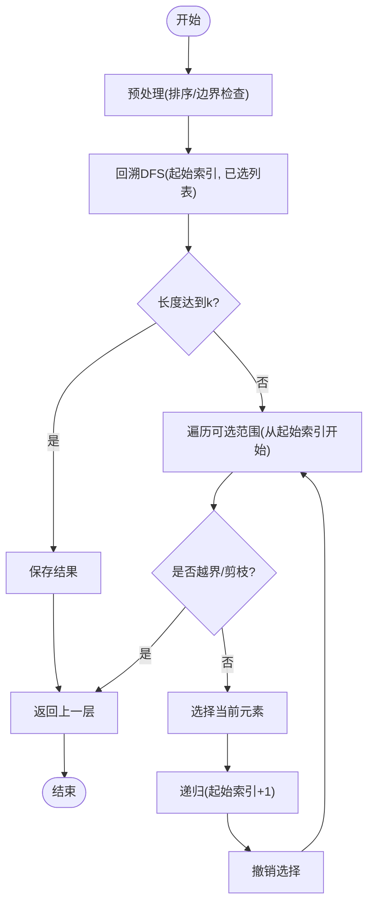
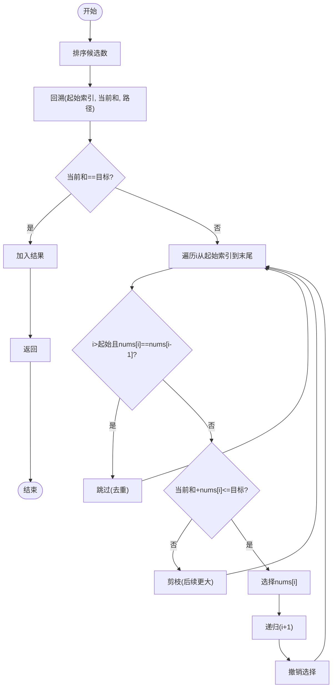
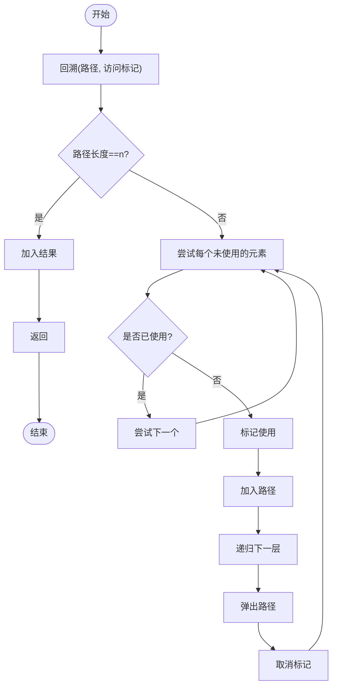
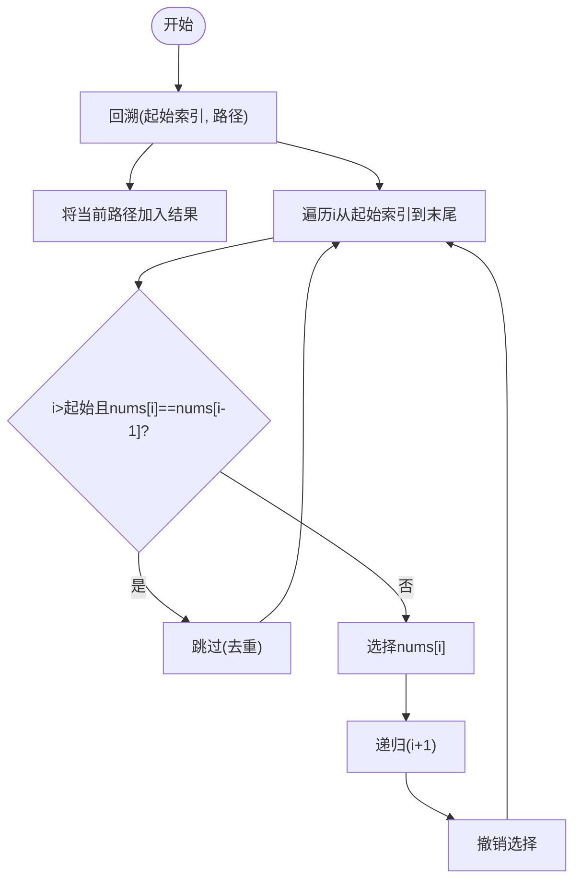
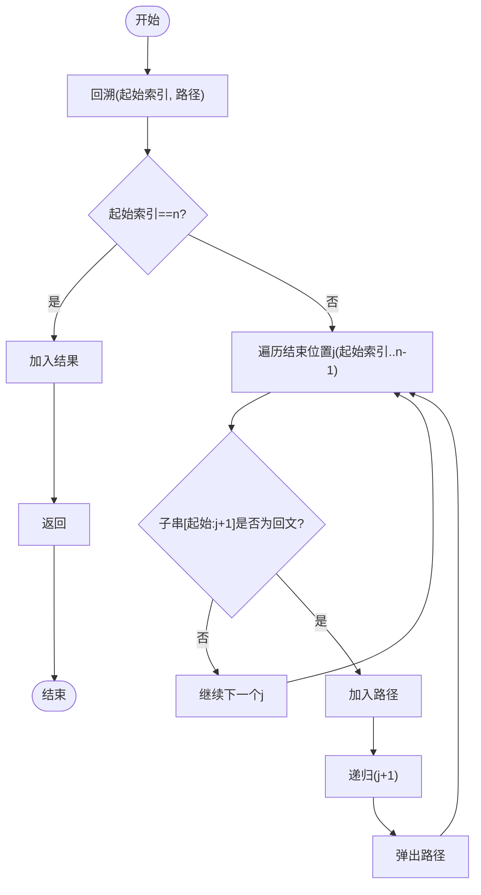
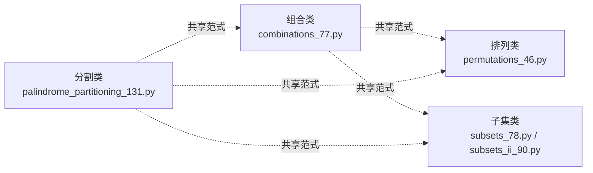

# 第三阶段：高级算法学习指南

<cite>
**本文引用的文件**   
- [learning/stage3/palindrome_partitioning_131_visual.md](file://learning/stage3/palindrome_partitioning_131_visual.md)
- [learning/stage3/permutations_46_visual.md](file://learning/stage3/permutations_46_visual.md)
- [learning/stage3/subsets_ii_90_visual.md](file://learning/stage3/subsets_ii_90_visual.md)
- [solutions/stage3/backtracking/combination_sum_ii_40.py](file://solutions/stage3/backtracking/combination_sum_ii_40.py)
- [solutions/stage3/backtracking/combinations_77.py](file://solutions/stage3/backtracking/combinations_77.py)
- [solutions/stage3/backtracking/palindrome_partitioning_131.py](file://solutions/stage3/backtracking/palindrome_partitioning_131.py)
- [solutions/stage3/backtracking/permutations_46.py](file://solutions/stage3/backtracking/permutations_46.py)
- [solutions/stage3/backtracking/subsets_78.py](file://solutions/stage3/backtracking/subsets_78.py)
- [solutions/stage3/backtracking/subsets_ii_90.py](file://solutions/stage3/backtracking/subsets_ii_90.py)
</cite>

## 目录
1. [引言](#引言)
2. [项目结构](#项目结构)
3. [核心组件](#核心组件)
4. [架构总览](#架构总览)
5. [详细组件分析](#详细组件分析)
6. [依赖分析](#依赖分析)
7. [性能考虑](#性能考虑)
8. [故障排查指南](#故障排查指南)
9. [结论](#结论)
10. [附录](#附录)

## 引言
本指南聚焦回溯算法的高级学习与实战，围绕“组合、排列、子集”三大经典问题族展开，系统讲解状态空间树构建与剪枝优化技术。通过可视化材料与实际题解对照，帮助读者从暴力枚举逐步过渡到高效回溯实现，掌握递归深度控制、状态恢复与去重处理等关键技术，并培养复杂问题的建模能力与面试解题策略。

## 项目结构
本项目按学习阶段组织内容：
- learning/stage3：提供回溯相关问题的可视化图解，辅助理解状态空间树与搜索过程。
- solutions/stage3/backtracking：对应的高频题型回溯实现，涵盖组合、排列、子集及其变体（含去重）。

图示来源
- [learning/stage3/palindrome_partitioning_131_visual.md](file://learning/stage3/palindrome_partitioning_131_visual.md)
- [learning/stage3/permutations_46_visual.md](file://learning/stage3/permutations_46_visual.md)
- [learning/stage3/subsets_ii_90_visual.md](file://learning/stage3/subsets_ii_90_visual.md)
- [solutions/stage3/backtracking/combinations_77.py](file://solutions/stage3/backtracking/combinations_77.py)
- [solutions/stage3/backtracking/combination_sum_ii_40.py](file://solutions/stage3/backtracking/combination_sum_ii_40.py)
- [solutions/stage3/backtracking/permutations_46.py](file://solutions/stage3/backtracking/permutations_46.py)
- [solutions/stage3/backtracking/subsets_78.py](file://solutions/stage3/backtracking/subsets_78.py)
- [solutions/stage3/backtracking/subsets_ii_90.py](file://solutions/stage3/backtracking/subsets_ii_90.py)
- [solutions/stage3/backtracking/palindrome_partitioning_131.py](file://solutions/stage3/backtracking/palindrome_partitioning_131.py)

章节来源
- [learning/stage3/palindrome_partitioning_131_visual.md](file://learning/stage3/palindrome_partitioning_131_visual.md)
- [learning/stage3/permutations_46_visual.md](file://learning/stage3/permutations_46_visual.md)
- [learning/stage3/subsets_ii_90_visual.md](file://learning/stage3/subsets_ii_90_visual.md)
- [solutions/stage3/backtracking/combinations_77.py](file://solutions/stage3/backtracking/combinations_77.py)
- [solutions/stage3/backtracking/combination_sum_ii_40.py](file://solutions/stage3/backtracking/combination_sum_ii_40.py)
- [solutions/stage3/backtracking/permutations_46.py](file://solutions/stage3/backtracking/permutations_46.py)
- [solutions/stage3/backtracking/subsets_78.py](file://solutions/stage3/backtracking/subsets_78.py)
- [solutions/stage3/backtracking/subsets_ii_90.py](file://solutions/stage3/backtracking/subsets_ii_90.py)
- [solutions/stage3/backtracking/palindrome_partitioning_131.py](file://solutions/stage3/backtracking/palindrome_partitioning_131.py)

## 核心组件
- 回溯通用骨架
  - 选择：在当前层做出决策（加入路径、标记使用、推进索引等）
  - 探索：递归进入下一层继续搜索
  - 撤销：返回前恢复状态（弹出路径、取消标记、回退索引）
  - 终止：满足目标条件时记录答案或提前返回
- 关键技巧
  - 递归深度控制：通过参数传递当前层信息（如起始索引、剩余容量）
  - 状态恢复：确保每次递归返回后状态与进入前一致
  - 去重策略：排序+跳过同层重复元素；或基于访问数组的有序选择
  - 剪枝优化：可行性剪枝（不满足约束）、最优性剪枝（不可能更优）

章节来源
- [solutions/stage3/backtracking/combinations_77.py](file://solutions/stage3/backtracking/combinations_77.py)
- [solutions/stage3/backtracking/combination_sum_ii_40.py](file://solutions/stage3/backtracking/combination_sum_ii_40.py)
- [solutions/stage3/backtracking/permutations_46.py](file://solutions/stage3/backtracking/permutations_46.py)
- [solutions/stage3/backtracking/subsets_78.py](file://solutions/stage3/backtracking/subsets_78.py)
- [solutions/stage3/backtracking/subsets_ii_90.py](file://solutions/stage3/backtracking/subsets_ii_90.py)
- [solutions/stage3/backtracking/palindrome_partitioning_131.py](file://solutions/stage3/backtracking/palindrome_partitioning_131.py)

## 架构总览
下图展示三类典型回溯问题的调用关系与数据流：输入预处理（排序/计数）→ 递归搜索 → 结果收集。

图示来源
- [solutions/stage3/backtracking/combinations_77.py](file://solutions/stage3/backtracking/combinations_77.py)
- [solutions/stage3/backtracking/combination_sum_ii_40.py](file://solutions/stage3/backtracking/combination_sum_ii_40.py)
- [solutions/stage3/backtracking/permutations_46.py](file://solutions/stage3/backtracking/permutations_46.py)
- [solutions/stage3/backtracking/subsets_78.py](file://solutions/stage3/backtracking/subsets_78.py)
- [solutions/stage3/backtracking/subsets_ii_90.py](file://solutions/stage3/backtracking/subsets_ii_90.py)
- [solutions/stage3/backtracking/palindrome_partitioning_131.py](file://solutions/stage3/backtracking/palindrome_partitioning_131.py)

## 详细组件分析

### 组合问题（Combinations）
- 问题特征
  - 从 n 个不同元素中选取 k 个，顺序无关
  - 通常以“起始索引”控制可选范围，避免重复组合
- 状态空间树
  - 每层代表一个位置的选择，分支为是否选择当前元素
  - 通过起始索引保证组合的字典序，天然去重
- 剪枝与优化
  - 剩余元素不足 k 时直接剪枝
  - 可结合“已选数量”进行早期终止
- 可视化参考
  - 参见组合问题的可视化图解，观察树的层次与分支

图示来源
- [solutions/stage3/backtracking/combinations_77.py](file://solutions/stage3/backtracking/combinations_77.py)

章节来源
- [solutions/stage3/backtracking/combinations_77.py](file://solutions/stage3/backtracking/combinations_77.py)
- [learning/stage3/permutations_46_visual.md](file://learning/stage3/permutations_46_visual.md)

### 组合总和 II（Combination Sum II）
- 问题特征
  - 候选数可能重复，每个数仅能使用一次，目标和固定
  - 需要去重：同一层内相同值只取一次
- 去重策略
  - 先排序，再在循环中判断“与前一个相同且不在父层使用”则跳过
- 剪枝策略
  - 若当前和超过目标，后续更大值可直接剪枝
- 复杂度要点
  - 时间复杂度受答案规模影响，最坏指数级；合理剪枝显著降低常数

图示来源
- [solutions/stage3/backtracking/combination_sum_ii_40.py](file://solutions/stage3/backtracking/combination_sum_ii_40.py)

章节来源
- [solutions/stage3/backtracking/combination_sum_ii_40.py](file://solutions/stage3/backtracking/combination_sum_ii_40.py)

### 排列问题（Permutations）
- 问题特征
  - 全排列，顺序有关，每个元素恰好使用一次
- 状态表示
  - 使用“访问数组/集合”记录已用元素，保证每个位置只能选未用元素
- 去重说明
  - 若输入无重复，无需额外去重；若有重复，需在同层跳过相同值
- 可视化参考
  - 参见排列问题的可视化图解，观察树的分叉与回溯路径

图示来源
- [solutions/stage3/backtracking/permutations_46.py](file://solutions/stage3/backtracking/permutations_46.py)

章节来源
- [solutions/stage3/backtracking/permutations_46.py](file://solutions/stage3/backtracking/permutations_46.py)
- [learning/stage3/permutations_46_visual.md](file://learning/stage3/permutations_46_visual.md)

### 子集问题（Subsets）
- 问题特征
  - 求所有子集，顺序无关，元素可重复或不可重复
- 模板差异
  - 无重复：标准“选或不选”或“按起始索引推进”
  - 有重复：先排序，再在同一层跳过相同值
- 剪枝
  - 一般不需要强剪枝，但可通过“剩余元素不足”快速返回

图示来源
- [solutions/stage3/backtracking/subsets_78.py](file://solutions/stage3/backtracking/subsets_78.py)
- [solutions/stage3/backtracking/subsets_ii_90.py](file://solutions/stage3/backtracking/subsets_ii_90.py)

章节来源
- [solutions/stage3/backtracking/subsets_78.py](file://solutions/stage3/backtracking/subsets_78.py)
- [solutions/stage3/backtracking/subsets_ii_90.py](file://solutions/stage3/backtracking/subsets_ii_90.py)
- [learning/stage3/subsets_ii_90_visual.md](file://learning/stage3/subsets_ii_90_visual.md)

### 分割回文串（Palindrome Partitioning）
- 问题特征
  - 将字符串分割成若干子串，使得每个子串都是回文
- 状态设计
  - 以“起始索引”驱动分割点，逐段切分并校验回文
- 剪枝
  - 非回文片段直接剪枝，减少无效分支
- 可视化参考
  - 参见分割回文串的可视化图解，观察切割点的选择与回溯

图示来源
- [solutions/stage3/backtracking/palindrome_partitioning_131.py](file://solutions/stage3/backtracking/palindrome_partitioning_131.py)

章节来源
- [solutions/stage3/backtracking/palindrome_partitioning_131.py](file://solutions/stage3/backtracking/palindrome_partitioning_131.py)
- [learning/stage3/palindrome_partitioning_131_visual.md](file://learning/stage3/palindrome_partitioning_131_visual.md)

## 依赖分析
- 模块内聚与耦合
  - 各题解独立实现，彼此无直接导入依赖，便于单独阅读与测试
  - 共同遵循“选择-探索-撤销-终止”的回溯范式，形成统一风格
- 外部依赖
  - 主要依赖语言内置数据结构（列表、集合、栈等），无第三方库
- 潜在风险
  - 大规模输入下指数级搜索可能导致超时，需严格剪枝与去重

图示来源
- [solutions/stage3/backtracking/combinations_77.py](file://solutions/stage3/backtracking/combinations_77.py)
- [solutions/stage3/backtracking/permutations_46.py](file://solutions/stage3/backtracking/permutations_46.py)
- [solutions/stage3/backtracking/subsets_78.py](file://solutions/stage3/backtracking/subsets_78.py)
- [solutions/stage3/backtracking/subsets_ii_90.py](file://solutions/stage3/backtracking/subsets_ii_90.py)
- [solutions/stage3/backtracking/palindrome_partitioning_131.py](file://solutions/stage3/backtracking/palindrome_partitioning_131.py)

章节来源
- [solutions/stage3/backtracking/combinations_77.py](file://solutions/stage3/backtracking/combinations_77.py)
- [solutions/stage3/backtracking/permutations_46.py](file://solutions/stage3/backtracking/permutations_46.py)
- [solutions/stage3/backtracking/subsets_78.py](file://solutions/stage3/backtracking/subsets_78.py)
- [solutions/stage3/backtracking/subsets_ii_90.py](file://solutions/stage3/backtracking/subsets_ii_90.py)
- [solutions/stage3/backtracking/palindrome_partitioning_131.py](file://solutions/stage3/backtracking/palindrome_partitioning_131.py)

## 性能考虑
- 时间复杂度
  - 组合/子集：O(C(n,k)) 或 O(2^n)，取决于是否允许重复与去重策略
  - 排列：O(n!)，存在重复时需额外去重开销
  - 分割回文：与回文判定次数及分割方案数量相关
- 空间复杂度
  - 递归栈深度 O(n)，结果存储与路径暂存占用线性空间
- 优化建议
  - 优先排序以便剪枝与去重
  - 尽早失败：在递归入口做可行性检查
  - 利用对称性与等价类合并（同层跳过重复）
  - 预计算回文表或使用中心扩展法加速判定

## 故障排查指南
- 常见问题
  - 重复结果：检查同层去重逻辑是否正确（排序+跳过条件）
  - 遗漏结果：确认是否在合适时机记录答案（子集通常在每层记录）
  - 死循环/栈溢出：检查递归终止条件与状态转移是否完备
  - 超时：定位热点分支，增加可行性/最优性剪枝
- 调试技巧
  - 打印关键状态（路径、起始索引、已选集合）
  - 缩小输入规模，手工模拟状态空间树
  - 对比可视化图解，定位偏差节点

章节来源
- [solutions/stage3/backtracking/combination_sum_ii_40.py](file://solutions/stage3/backtracking/combination_sum_ii_40.py)
- [solutions/stage3/backtracking/permutations_46.py](file://solutions/stage3/backtracking/permutations_46.py)
- [solutions/stage3/backtracking/subsets_ii_90.py](file://solutions/stage3/backtracking/subsets_ii_90.py)
- [solutions/stage3/backtracking/palindrome_partitioning_131.py](file://solutions/stage3/backtracking/palindrome_partitioning_131.py)

## 结论
回溯算法的核心在于“建模状态空间树 + 精准剪枝”。通过组合、排列、子集三大模板的反复训练，配合可视化理解与高频题型实践，可以显著提升对复杂问题的拆解与求解能力。建议在面试中优先明确：
- 状态如何表示与转移
- 何时记录答案
- 如何避免重复与提前剪枝
- 时间与空间代价的权衡

## 附录
- 学习路径建议
  - 先掌握组合模板，再迁移至子集与排列
  - 针对带约束的问题（如组合总和 II、分割回文）强化剪枝与去重
  - 借助可视化材料复盘执行轨迹，建立直觉
- 面试策略
  - 先写暴力枚举，再逐步添加剪枝与去重
  - 明确输入规模与答案规模，评估可行性
  - 准备常见陷阱清单（重复、越界、空输入、单元素）