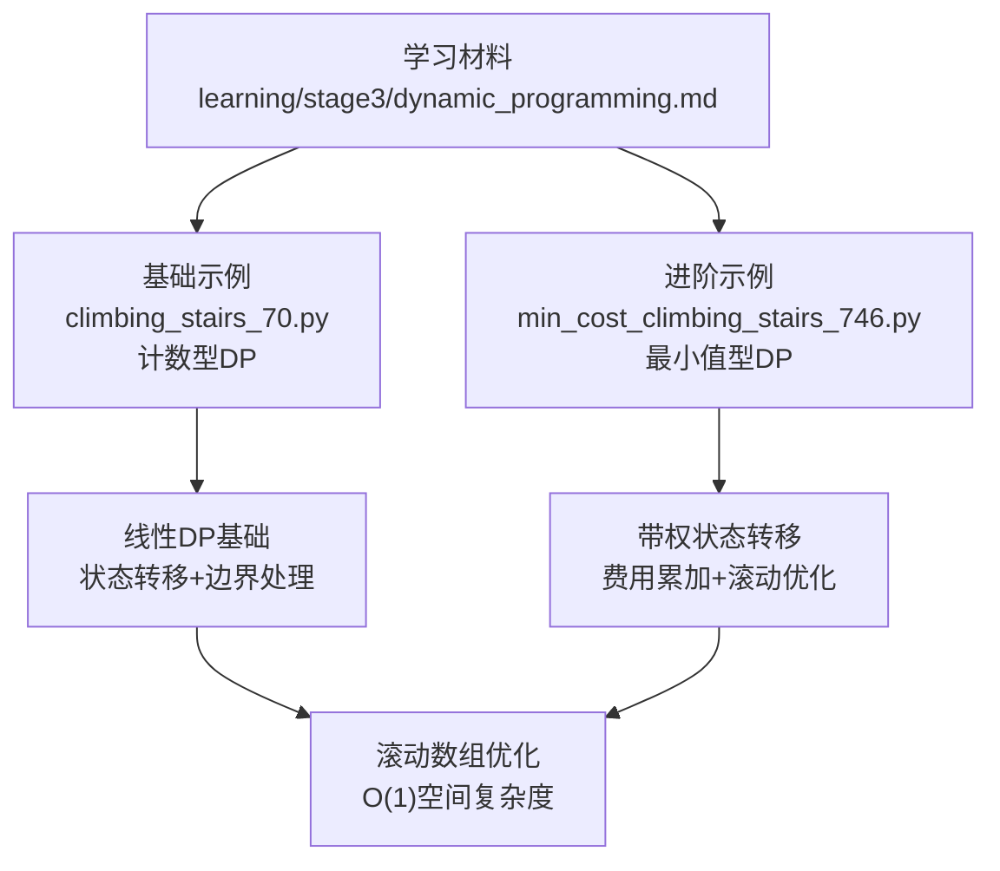
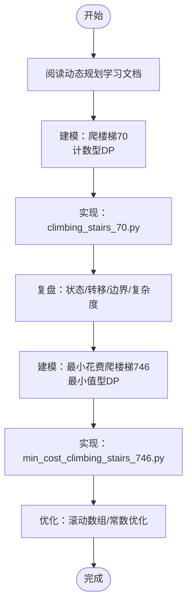
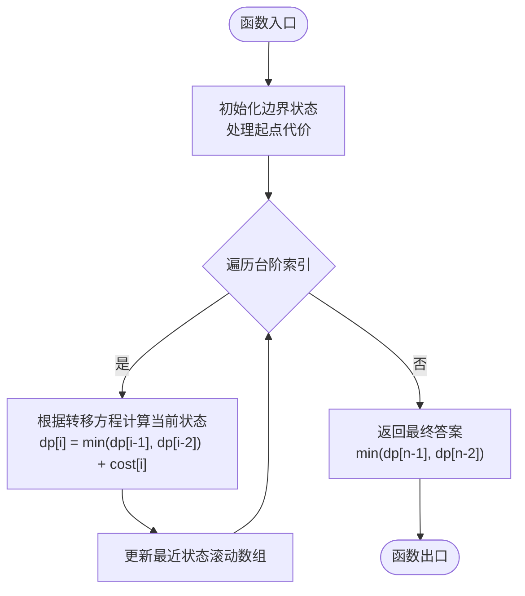

# 动态规划学习指南

<cite>
**本文引用的文件**   
- [learning/stage3/dynamic_programming.md](file://learning/stage3/dynamic_programming.md)
- [solutions/stage3/dp/climbing_stairs_70.py](file://solutions/stage3/dp/climbing_stairs_70.py)
- [solutions/stage3/dp/min_cost_climbing_stairs_746.py](file://solutions/stage3/dp/min_cost_climbing_stairs_746.py)
</cite>

## 更新摘要
**所做更改**   
- 新增最小花费爬楼梯（746）解决方案的详细算法分析和实现说明
- 完善了动态规划学习路径，涵盖计数型DP和最小值型DP两种类型
- 增强了问题解决方法论和故障排查指南
- 优化了架构图表，体现从基础到进阶的递进关系

## 目录
1. [简介](#简介)
2. [项目结构](#项目结构)
3. [核心组件](#核心组件)
4. [架构总览](#架构总览)
5. [详细组件分析](#详细组件分析)
6. [依赖分析](#依赖分析)
7. [性能考虑](#性能考虑)
8. [故障排查指南](#故障排查指南)
9. [结论](#结论)
10. [附录](#附录)

## 简介
本指南面向希望系统掌握动态规划（Dynamic Programming, DP）的读者，围绕"状态定义、转移方程、边界与初始化、计算顺序、空间优化"等关键要点展开。仓库提供了阶段三的学习文档与两道经典爬楼梯问题的实现，便于从理论到实践逐步深入。本次更新新增了最小花费爬楼梯（746）的完整解决方案，进一步完善了动态规划入门学习路径，涵盖了计数型和最小值型两种典型的DP问题类型。

## 项目结构
本项目按学习阶段组织内容：
- learning：各阶段学习材料，包含动态规划的入门与进阶文档
- solutions：对应阶段的题目实现，便于对照理解

图表来源
- [learning/stage3/dynamic_programming.md](file://learning/stage3/dynamic_programming.md)
- [solutions/stage3/dp/climbing_stairs_70.py](file://solutions/stage3/dp/climbing_stairs_70.py)
- [solutions/stage3/dp/min_cost_climbing_stairs_746.py](file://solutions/stage3/dp/min_cost_climbing_stairs_746.py)

章节来源
- [learning/stage3/dynamic_programming.md](file://learning/stage3/dynamic_programming.md)
- [solutions/stage3/dp/climbing_stairs_70.py](file://solutions/stage3/dp/climbing_stairs_70.py)
- [solutions/stage3/dp/min_cost_climbing_stairs_746.py](file://solutions/stage3/dp/min_cost_climbing_stairs_746.py)

## 核心组件
- 学习文档：系统化讲解动态规划的核心思想、建模步骤与常见套路
- 爬楼梯（70）：最基础的线性DP，用于练习"状态定义+转移方程+边界处理"，属于计数型DP问题
- 最小花费爬楼梯（746）：在基础模型上引入"费用/代价"，练习"带权状态转移"和"滚动数组优化"，属于最小值型DP问题

**更新** 新增了最小花费爬楼梯的详细分析，完善了从基础到进阶的学习路径，现在学习者可以完整体验计数型和最小值型两种DP类型

章节来源
- [learning/stage3/dynamic_programming.md](file://learning/stage3/dynamic_programming.md)
- [solutions/stage3/dp/climbing_stairs_70.py](file://solutions/stage3/dp/climbing_stairs_70.py)
- [solutions/stage3/dp/min_cost_climbing_stairs_746.py](file://solutions/stage3/dp/min_cost_climbing_stairs_746.py)

## 架构总览
下图展示了"学习文档 → 具体实现"的知识传递关系，以及两道题之间的递进关系。

图表来源
- [learning/stage3/dynamic_programming.md](file://learning/stage3/dynamic_programming.md)
- [solutions/stage3/dp/climbing_stairs_70.py](file://solutions/stage3/dp/climbing_stairs_70.py)
- [solutions/stage3/dp/min_cost_climbing_stairs_746.py](file://solutions/stage3/dp/min_cost_climbing_stairs_746.py)

## 详细组件分析

### 动态规划学习文档
- 目标：建立对动态规划的统一认知框架，包括问题特征识别、子问题划分、状态表示、转移策略、边界与初始化、计算顺序与空间优化
- 建议用法：先通读一遍建立整体印象，再结合两道题的实践进行对照验证

章节来源
- [learning/stage3/dynamic_programming.md](file://learning/stage3/dynamic_programming.md)

### 爬楼梯（70）- 计数型DP
- 典型特征：线性序列、无后效性、最优子结构，求方案总数
- 建模要点：
  - 状态定义：到达第 i 阶的方法数
  - 转移方程：由前两步的状态推导当前状态 dp[i] = dp[i-1] + dp[i-2]
  - 边界条件：dp[0]=1, dp[1]=1 的初始化处理
  - 计算顺序：从小到大迭代
  - 空间优化：仅保留最近两项即可，空间复杂度降至O(1)
- 学习价值：作为入门题，帮助巩固"自底向上"的DP范式和计数型问题的处理方法

章节来源
- [solutions/stage3/dp/climbing_stairs_70.py](file://solutions/stage3/dp/climbing_stairs_70.py)

### 最小花费爬楼梯（746）- 最小值型DP
- 典型特征：在基础爬楼梯模型上引入"每步代价"，求最小总代价
- 建模要点：
  - 状态定义：到达第 i 阶的最小累计代价
  - 转移方程：取从前一步或前两步转移的最小值，并加上当前台阶代价 dp[i] = min(dp[i-1], dp[i-2]) + cost[i]
  - 边界条件：起点处的代价处理和多源起点的特殊情况
  - 计算顺序：从小到大迭代
  - 空间优化：同样可压缩为常数空间
- 学习价值：练习"带权状态转移"与"多源起点"的处理方式，掌握最小值型DP的解题思路

**更新** 新增了详细的算法流程分析和优化策略说明

#### 算法流程（以最小花费爬楼梯为例）

图表来源
- [solutions/stage3/dp/min_cost_climbing_stairs_746.py](file://solutions/stage3/dp/min_cost_climbing_stairs_746.py)

章节来源
- [solutions/stage3/dp/min_cost_climbing_stairs_746.py](file://solutions/stage3/dp/min_cost_climbing_stairs_746.py)

## 依赖分析
- 学习文档与实现之间为"指导—实践"的关系，不存在代码层面的直接导入依赖
- 两道实现题相互独立，但存在知识上的递进关系：70 为基础计数型DP，746 为扩展的最小值型DP

图表来源
- [learning/stage3/dynamic_programming.md](file://learning/stage3/dynamic_programming.md)
- [solutions/stage3/dp/climbing_stairs_70.py](file://solutions/stage3/dp/climbing_stairs_70.py)
- [solutions/stage3/dp/min_cost_climbing_stairs_746.py](file://solutions/stage3/dp/min_cost_climbing_stairs_746.py)

## 性能考虑
- 时间复杂度：两题均为线性时间 O(n)，适合大规模输入
- 空间复杂度：通过滚动数组可将额外空间降至 O(1)
- 数值范围：注意累加代价可能溢出，必要时使用更大整数类型或语言提供的任意精度类型
- 边界处理：n=0/1 的情况需单独验证，避免越界或错误初始化
- 内存优化：对于超大规模输入，考虑流式处理和增量计算

[本节为通用指导，不直接分析具体文件]

## 故障排查指南
- 索引越界：检查循环起止与边界初始化是否覆盖所有必要位置
- 初始值错误：确认起点代价或方法数的初始设定是否符合题意
- 转移遗漏：确保考虑了所有合法的前驱状态（如前一步与前两步）
- 结果取值：明确答案是"到达最后一个台阶"还是"越过最后一个台阶"的最小代价
- 调试技巧：打印关键中间状态或断点观察状态变化，定位异常分支
- 类型混淆：区分计数型DP和最小值型DP的不同处理方式
- 边界情况：特别注意 n=0, n=1 等边界情况的处理

**更新** 增加了针对最小花费爬楼梯特有的调试注意事项和类型混淆的排查方法

章节来源
- [solutions/stage3/dp/climbing_stairs_70.py](file://solutions/stage3/dp/climbing_stairs_70.py)
- [solutions/stage3/dp/min_cost_climbing_stairs_746.py](file://solutions/stage3/dp/min_cost_climbing_stairs_746.py)

## 结论
通过"学习文档 + 两道递进式实现"的组合，可以快速建立动态规划的基础能力：正确建模、严谨边界、合理顺序与空间优化。随着最小花费爬楼梯的加入，学习者现在可以完整体验从基础计数型DP到带权最小值型DP的进阶过程，为后续学习更复杂的DP问题打下坚实基础。建议在掌握这两题后，继续拓展至背包、区间、树形等更多DP场景。

**更新** 随着最小花费爬楼梯的加入，学习者现在可以完整体验从基础DP到带权DP的进阶过程

[本节为总结性内容，不直接分析具体文件]

## 附录
- 推荐学习路径：先通读动态规划学习文档，再依次完成爬楼梯（70）与最小花费爬楼梯（746），最后尝试将滚动数组优化应用到每一步
- 自检清单：
  - 状态是否唯一且充分？
  - 转移是否覆盖所有合法前驱？
  - 边界是否完整且符合题意？
  - 计算顺序是否保证子问题已求解？
  - 空间是否可以进一步压缩？
  - 是否为计数型或最小值型DP，选择正确的转移策略？
- 常见问题：
  - 计数型DP：注意不要与最小值型DP混淆
  - 最小值型DP：注意初始化的无穷大设置
  - 边界处理：特别注意起点和终点的特殊处理

**更新** 新增了针对带权状态转移的专项检查项和常见问题分类

[本节为补充信息，不直接分析具体文件]