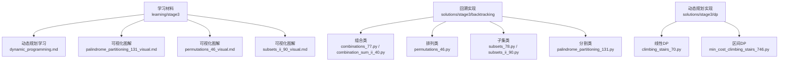
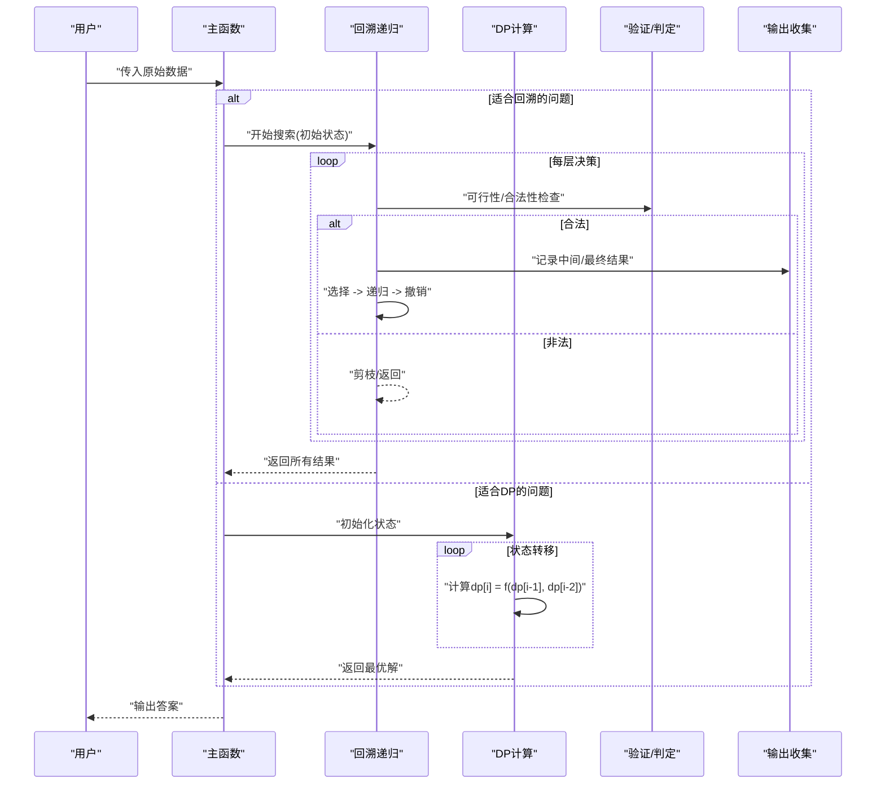
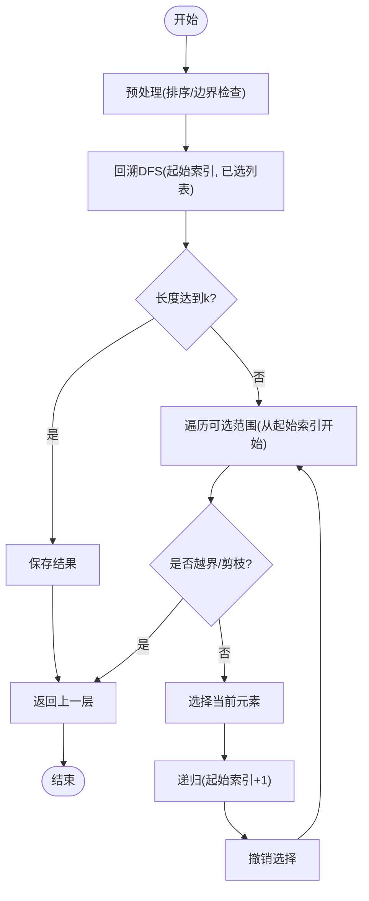
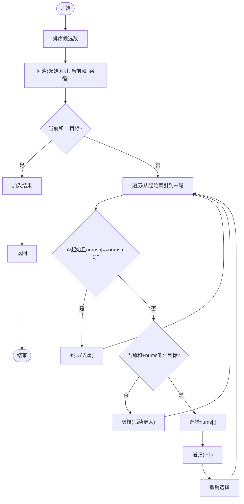
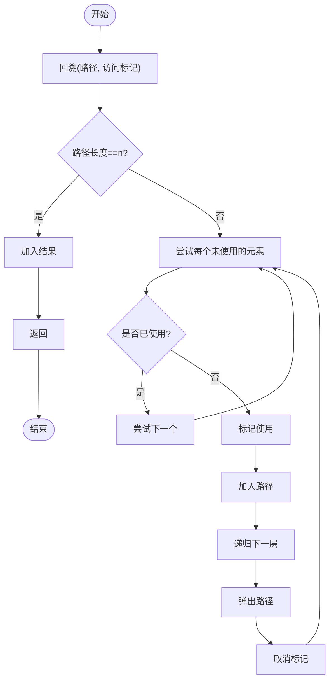
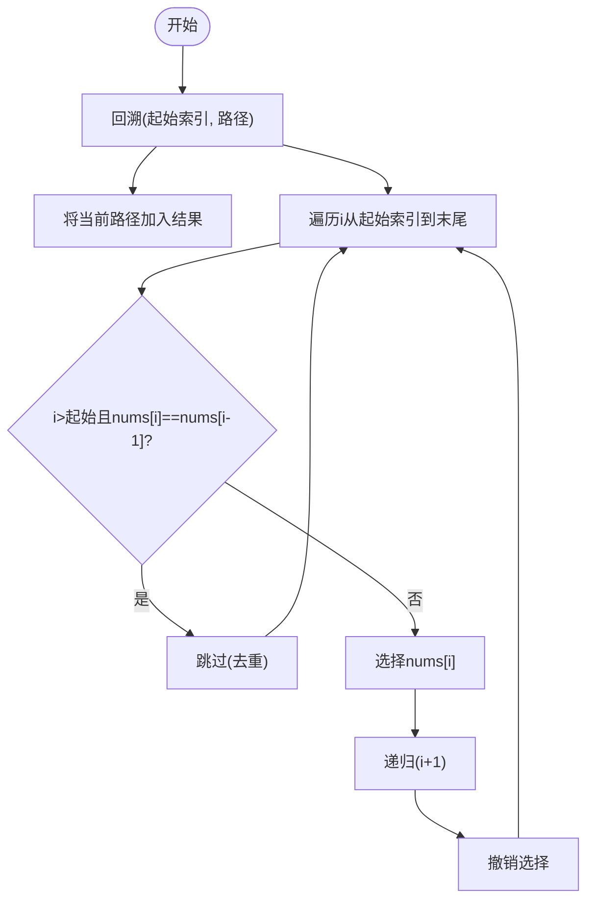
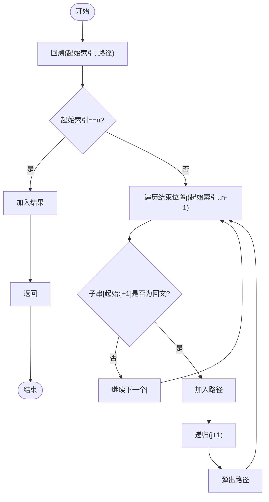
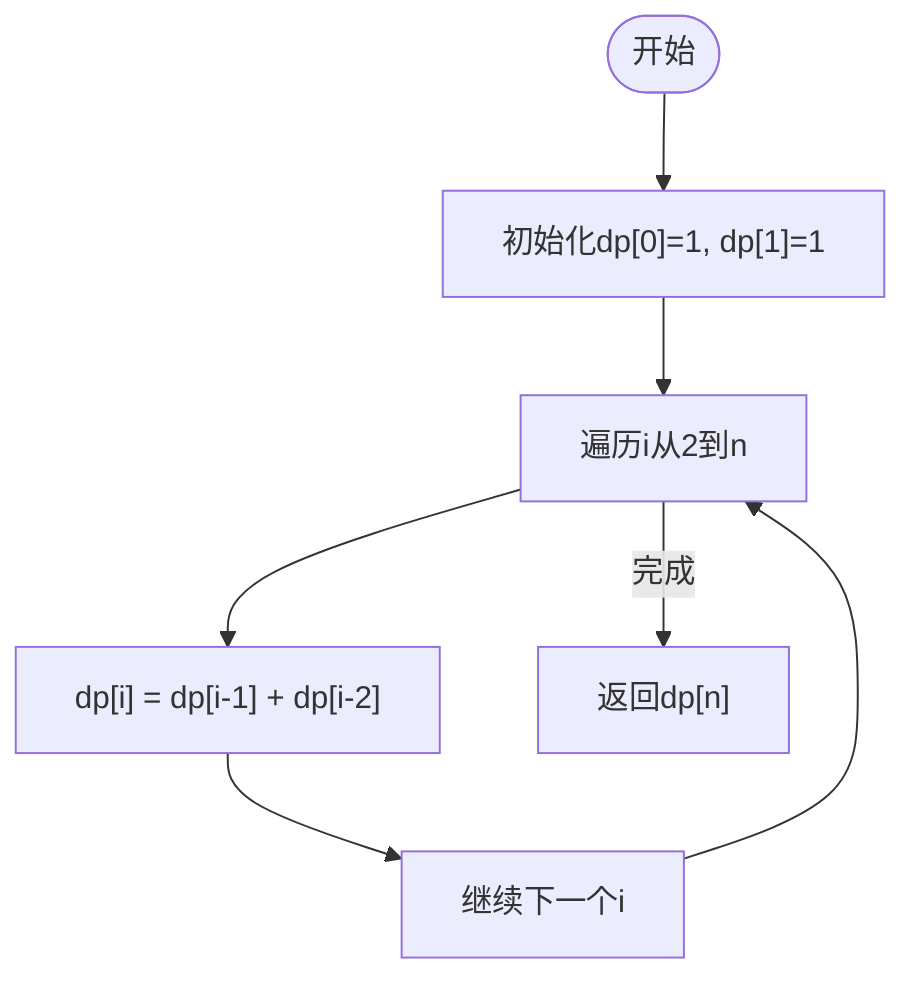
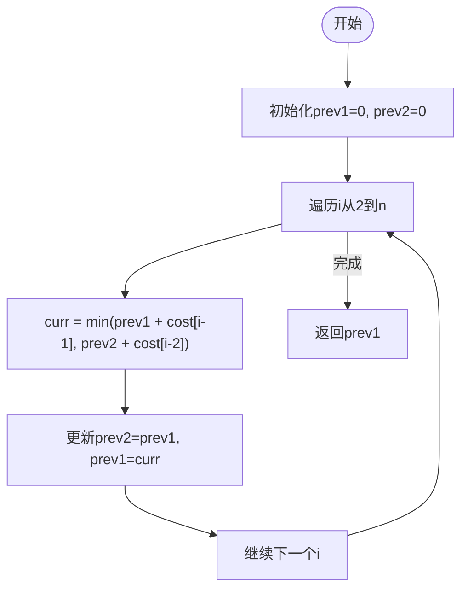
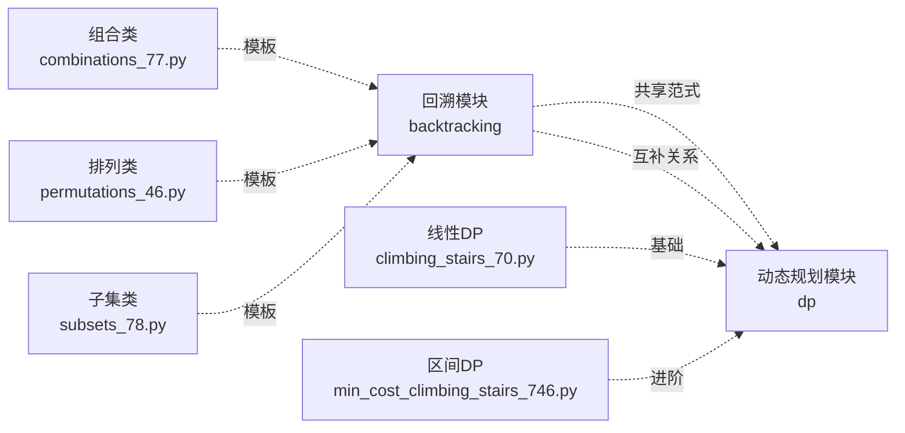

# 第三阶段：高级算法学习指南

<cite>
**本文引用的文件**   
- [learning/stage3/dynamic_programming.md](file://learning/stage3/dynamic_programming.md)
- [learning/stage3/palindrome_partitioning_131_visual.md](file://learning/stage3/palindrome_partitioning_131_visual.md)
- [learning/stage3/permutations_46_visual.md](file://learning/stage3/permutations_46_visual.md)
- [learning/stage3/subsets_ii_90_visual.md](file://learning/stage3/subsets_ii_90_visual.md)
- [solutions/stage3/backtracking/combination_sum_ii_40.py](file://solutions/stage3/backtracking/combination_sum_ii_40.py)
- [solutions/stage3/backtracking/combinations_77.py](file://solutions/stage3/backtracking/combinations_77.py)
- [solutions/stage3/backtracking/palindrome_partitioning_131.py](file://solutions/stage3/backtracking/palindrome_partitioning_131.py)
- [solutions/stage3/backtracking/permutations_46.py](file://solutions/stage3/backtracking/permutations_46.py)
- [solutions/stage3/backtracking/subsets_78.py](file://solutions/stage3/backtracking/subsets_78.py)
- [solutions/stage3/backtracking/subsets_ii_90.py](file://solutions/stage3/backtracking/subsets_ii_90.py)
- [solutions/stage3/dp/climbing_stairs_70.py](file://solutions/stage3/dp/climbing_stairs_70.py)
- [solutions/stage3/dp/min_cost_climbing_stairs_746.py](file://solutions/stage3/dp/min_cost_climbing_stairs_746.py)
</cite>

## 更新摘要
**所做更改**   
- 新增动态规划模块，整合到第三阶段高级算法学习路径中
- 添加动态规划核心概念、状态转移方程和空间优化技术
- 扩展项目结构以包含动态规划相关学习材料和题解
- 更新架构图表以反映回溯与动态规划的对比关系
- 增加动态规划问题的建模方法和解题策略

## 目录
1. [引言](#引言)
2. [项目结构](#项目结构)
3. [核心组件](#核心组件)
4. [架构总览](#架构总览)
5. [详细组件分析](#详细组件分析)
6. [依赖分析](#依赖分析)
7. [性能考虑](#性能考虑)
8. [故障排查指南](#故障排查指南)
9. [结论](#结论)
10. [附录](#附录)

## 引言
本指南聚焦高级算法学习与实战，涵盖回溯算法与动态规划两大核心主题。在回溯部分，围绕"组合、排列、子集"三大经典问题族展开，系统讲解状态空间树构建与剪枝优化技术；在动态规划部分，深入介绍状态定义、转移方程设计、空间优化等关键技术。通过可视化材料与实际题解对照，帮助读者从暴力枚举逐步过渡到高效实现，掌握复杂问题的建模能力与面试解题策略。

## 项目结构
本项目按学习阶段组织内容，第三阶段包含回溯算法和动态规划两个重要模块：
- learning/stage3：提供算法相关问题的可视化图解和学习材料
- solutions/stage3/backtracking：回溯算法的高频题型实现，涵盖组合、排列、子集及其变体
- solutions/stage3/dp：动态规划的经典问题实现，包括爬楼梯、最小花费爬楼梯等基础DP问题

**图示来源**
- [learning/stage3/dynamic_programming.md](file://learning/stage3/dynamic_programming.md)
- [learning/stage3/palindrome_partitioning_131_visual.md](file://learning/stage3/palindrome_partitioning_131_visual.md)
- [learning/stage3/permutations_46_visual.md](file://learning/stage3/permutations_46_visual.md)
- [learning/stage3/subsets_ii_90_visual.md](file://learning/stage3/subsets_ii_90_visual.md)
- [solutions/stage3/backtracking/combinations_77.py](file://solutions/stage3/backtracking/combinations_77.py)
- [solutions/stage3/backtracking/combination_sum_ii_40.py](file://solutions/stage3/backtracking/combination_sum_ii_40.py)
- [solutions/stage3/backtracking/permutations_46.py](file://solutions/stage3/backtracking/permutations_46.py)
- [solutions/stage3/backtracking/subsets_78.py](file://solutions/stage3/backtracking/subsets_78.py)
- [solutions/stage3/backtracking/subsets_ii_90.py](file://solutions/stage3/backtracking/subsets_ii_90.py)
- [solutions/stage3/backtracking/palindrome_partitioning_131.py](file://solutions/stage3/backtracking/palindrome_partitioning_131.py)
- [solutions/stage3/dp/climbing_stairs_70.py](file://solutions/stage3/dp/climbing_stairs_70.py)
- [solutions/stage3/dp/min_cost_climbing_stairs_746.py](file://solutions/stage3/dp/min_cost_climbing_stairs_746.py)

**章节来源**
- [learning/stage3/dynamic_programming.md](file://learning/stage3/dynamic_programming.md)
- [learning/stage3/palindrome_partitioning_131_visual.md](file://learning/stage3/palindrome_partitioning_131_visual.md)
- [learning/stage3/permutations_46_visual.md](file://learning/stage3/permutations_46_visual.md)
- [learning/stage3/subsets_ii_90_visual.md](file://learning/stage3/subsets_ii_90_visual.md)
- [solutions/stage3/backtracking/combinations_77.py](file://solutions/stage3/backtracking/combinations_77.py)
- [solutions/stage3/backtracking/combination_sum_ii_40.py](file://solutions/stage3/backtracking/combination_sum_ii_40.py)
- [solutions/stage3/backtracking/permutations_46.py](file://solutions/stage3/backtracking/permutations_46.py)
- [solutions/stage3/backtracking/subsets_78.py](file://solutions/stage3/backtracking/subsets_78.py)
- [solutions/stage3/backtracking/subsets_ii_90.py](file://solutions/stage3/backtracking/subsets_ii_90.py)
- [solutions/stage3/backtracking/palindrome_partitioning_131.py](file://solutions/stage3/backtracking/palindrome_partitioning_131.py)
- [solutions/stage3/dp/climbing_stairs_70.py](file://solutions/stage3/dp/climbing_stairs_70.py)
- [solutions/stage3/dp/min_cost_climbing_stairs_746.py](file://solutions/stage3/dp/min_cost_climbing_stairs_746.py)

## 核心组件

### 回溯算法核心
- 回溯通用骨架
  - 选择：在当前层做出决策（加入路径、标记使用、推进索引等）
  - 探索：递归进入下一层继续搜索
  - 撤销：返回前恢复状态（弹出路径、取消标记、回退索引）
  - 终止：满足目标条件时记录答案或提前返回
- 关键技巧
  - 递归深度控制：通过参数传递当前层信息（如起始索引、剩余容量）
  - 状态恢复：确保每次递归返回后状态与进入前一致
  - 去重策略：排序+跳过同层重复元素；或基于访问数组的有序选择
  - 剪枝优化：可行性剪枝（不满足约束）、最优性剪枝（不可能更优）

### 动态规划核心
- DP三要素
  - 状态定义：明确dp[i]的含义和取值范围
  - 状态转移：建立相邻状态间的递推关系
  - 边界条件：确定初始状态和终止条件
- 优化技术
  - 空间压缩：利用滚动数组减少空间复杂度
  - 记忆化搜索：自顶向下缓存已计算结果
  - 状态合并：合并冗余状态，提高计算效率

**章节来源**
- [solutions/stage3/backtracking/combinations_77.py](file://solutions/stage3/backtracking/combinations_77.py)
- [solutions/stage3/backtracking/combination_sum_ii_40.py](file://solutions/stage3/backtracking/combination_sum_ii_40.py)
- [solutions/stage3/backtracking/permutations_46.py](file://solutions/stage3/backtracking/permutations_46.py)
- [solutions/stage3/backtracking/subsets_78.py](file://solutions/stage3/backtracking/subsets_78.py)
- [solutions/stage3/backtracking/subsets_ii_90.py](file://solutions/stage3/backtracking/subsets_ii_90.py)
- [solutions/stage3/backtracking/palindrome_partitioning_131.py](file://solutions/stage3/backtracking/palindrome_partitioning_131.py)
- [solutions/stage3/dp/climbing_stairs_70.py](file://solutions/stage3/dp/climbing_stairs_70.py)
- [solutions/stage3/dp/min_cost_climbing_stairs_746.py](file://solutions/stage3/dp/min_cost_climbing_stairs_746.py)
- [learning/stage3/dynamic_programming.md](file://learning/stage3/dynamic_programming.md)

## 架构总览
下图展示回溯算法与动态规划两种不同求解思路的对比关系：

**图示来源**
- [solutions/stage3/backtracking/combinations_77.py](file://solutions/stage3/backtracking/combinations_77.py)
- [solutions/stage3/backtracking/combination_sum_ii_40.py](file://solutions/stage3/backtracking/combination_sum_ii_40.py)
- [solutions/stage3/backtracking/permutations_46.py](file://solutions/stage3/backtracking/permutations_46.py)
- [solutions/stage3/backtracking/subsets_78.py](file://solutions/stage3/backtracking/subsets_78.py)
- [solutions/stage3/backtracking/subsets_ii_90.py](file://solutions/stage3/backtracking/subsets_ii_90.py)
- [solutions/stage3/backtracking/palindrome_partitioning_131.py](file://solutions/stage3/backtracking/palindrome_partitioning_131.py)
- [solutions/stage3/dp/climbing_stairs_70.py](file://solutions/stage3/dp/climbing_stairs_70.py)
- [solutions/stage3/dp/min_cost_climbing_stairs_746.py](file://solutions/stage3/dp/min_cost_climbing_stairs_746.py)

## 详细组件分析

### 回溯算法详解

#### 组合问题（Combinations）
- 问题特征
  - 从 n 个不同元素中选取 k 个，顺序无关
  - 通常以"起始索引"控制可选范围，避免重复组合
- 状态空间树
  - 每层代表一个位置的选择，分支为是否选择当前元素
  - 通过起始索引保证组合的字典序，天然去重
- 剪枝与优化
  - 剩余元素不足 k 时直接剪枝
  - 可结合"已选数量"进行早期终止

**图示来源**
- [solutions/stage3/backtracking/combinations_77.py](file://solutions/stage3/backtracking/combinations_77.py)

**章节来源**
- [solutions/stage3/backtracking/combinations_77.py](file://solutions/stage3/backtracking/combinations_77.py)
- [learning/stage3/permutations_46_visual.md](file://learning/stage3/permutations_46_visual.md)

#### 组合总和 II（Combination Sum II）
- 问题特征
  - 候选数可能重复，每个数仅能使用一次，目标和固定
  - 需要去重：同一层内相同值只取一次
- 去重策略
  - 先排序，再在循环中判断"与前一个相同且不在父层使用"则跳过
- 剪枝策略
  - 若当前和超过目标，后续更大值可直接剪枝

**图示来源**
- [solutions/stage3/backtracking/combination_sum_ii_40.py](file://solutions/stage3/backtracking/combination_sum_ii_40.py)

**章节来源**
- [solutions/stage3/backtracking/combination_sum_ii_40.py](file://solutions/stage3/backtracking/combination_sum_ii_40.py)

#### 排列问题（Permutations）
- 问题特征
  - 全排列，顺序有关，每个元素恰好使用一次
- 状态表示
  - 使用"访问数组/集合"记录已用元素，保证每个位置只能选未用元素
- 去重说明
  - 若输入无重复，无需额外去重；若有重复，需在同层跳过相同值

**图示来源**
- [solutions/stage3/backtracking/permutations_46.py](file://solutions/stage3/backtracking/permutations_46.py)

**章节来源**
- [solutions/stage3/backtracking/permutations_46.py](file://solutions/stage3/backtracking/permutations_46.py)
- [learning/stage3/permutations_46_visual.md](file://learning/stage3/permutations_46_visual.md)

#### 子集问题（Subsets）
- 问题特征
  - 求所有子集，顺序无关，元素可重复或不可重复
- 模板差异
  - 无重复：标准"选或不选"或"按起始索引推进"
  - 有重复：先排序，再在同一层跳过相同值

**图示来源**
- [solutions/stage3/backtracking/subsets_78.py](file://solutions/stage3/backtracking/subsets_78.py)
- [solutions/stage3/backtracking/subsets_ii_90.py](file://solutions/stage3/backtracking/subsets_ii_90.py)

**章节来源**
- [solutions/stage3/backtracking/subsets_78.py](file://solutions/stage3/backtracking/subsets_78.py)
- [solutions/stage3/backtracking/subsets_ii_90.py](file://solutions/stage3/backtracking/subsets_ii_90.py)
- [learning/stage3/subsets_ii_90_visual.md](file://learning/stage3/subsets_ii_90_visual.md)

#### 分割回文串（Palindrome Partitioning）
- 问题特征
  - 将字符串分割成若干子串，使得每个子串都是回文
- 状态设计
  - 以"起始索引"驱动分割点，逐段切分并校验回文
- 剪枝
  - 非回文片段直接剪枝，减少无效分支

**图示来源**
- [solutions/stage3/backtracking/palindrome_partitioning_131.py](file://solutions/stage3/backtracking/palindrome_partitioning_131.py)

**章节来源**
- [solutions/stage3/backtracking/palindrome_partitioning_131.py](file://solutions/stage3/backtracking/palindrome_partitioning_131.py)
- [learning/stage3/palindrome_partitioning_131_visual.md](file://learning/stage3/palindrome_partitioning_131_visual.md)

### 动态规划详解

#### 爬楼梯问题（Climbing Stairs）
- 问题特征
  - 每次可以爬1或2个台阶，求爬到第n阶的不同方法数
- 状态定义
  - dp[i]表示爬到第i阶的方法数
- 状态转移
  - dp[i] = dp[i-1] + dp[i-2]（斐波那契数列）
- 边界条件
  - dp[0] = 1, dp[1] = 1

**图示来源**
- [solutions/stage3/dp/climbing_stairs_70.py](file://solutions/stage3/dp/climbing_stairs_70.py)

**章节来源**
- [solutions/stage3/dp/climbing_stairs_70.py](file://solutions/stage3/dp/climbing_stairs_70.py)

#### 最小花费爬楼梯（Min Cost Climbing Stairs）
- 问题特征
  - 每个台阶有对应花费，可以从第0或第1阶开始，求到达楼顶的最小花费
- 状态定义
  - dp[i]表示到达第i阶的最小花费
- 状态转移
  - dp[i] = min(dp[i-1] + cost[i-1], dp[i-2] + cost[i-2])
- 优化技巧
  - 只需维护前两个状态，空间复杂度可优化至O(1)

**图示来源**
- [solutions/stage3/dp/min_cost_climbing_stairs_746.py](file://solutions/stage3/dp/min_cost_climbing_stairs_746.py)

**章节来源**
- [solutions/stage3/dp/min_cost_climbing_stairs_746.py](file://solutions/stage3/dp/min_cost_climbing_stairs_746.py)

## 依赖分析
- 模块内聚与耦合
  - 各题解独立实现，彼此无直接导入依赖，便于单独阅读与测试
  - 共同遵循统一的算法范式，形成系统化学习体系
- 外部依赖
  - 主要依赖语言内置数据结构（列表、集合、栈等），无第三方库
- 潜在风险
  - 大规模输入下指数级搜索可能导致超时，需严格剪枝与去重
  - 动态规划需注意状态转移的正确性和边界条件的处理

**图示来源**
- [solutions/stage3/backtracking/combinations_77.py](file://solutions/stage3/backtracking/combinations_77.py)
- [solutions/stage3/backtracking/permutations_46.py](file://solutions/stage3/backtracking/permutations_46.py)
- [solutions/stage3/backtracking/subsets_78.py](file://solutions/stage3/backtracking/subsets_78.py)
- [solutions/stage3/dp/climbing_stairs_70.py](file://solutions/stage3/dp/climbing_stairs_70.py)
- [solutions/stage3/dp/min_cost_climbing_stairs_746.py](file://solutions/stage3/dp/min_cost_climbing_stairs_746.py)

**章节来源**
- [solutions/stage3/backtracking/combinations_77.py](file://solutions/stage3/backtracking/combinations_77.py)
- [solutions/stage3/backtracking/permutations_46.py](file://solutions/stage3/backtracking/permutations_46.py)
- [solutions/stage3/backtracking/subsets_78.py](file://solutions/stage3/backtracking/subsets_78.py)
- [solutions/stage3/backtracking/subsets_ii_90.py](file://solutions/stage3/backtracking/subsets_ii_90.py)
- [solutions/stage3/backtracking/palindrome_partitioning_131.py](file://solutions/stage3/backtracking/palindrome_partitioning_131.py)
- [solutions/stage3/dp/climbing_stairs_70.py](file://solutions/stage3/dp/climbing_stairs_70.py)
- [solutions/stage3/dp/min_cost_climbing_stairs_746.py](file://solutions/stage3/dp/min_cost_climbing_stairs_746.py)

## 性能考虑
- 时间复杂度
  - 回溯算法：O(C(n,k)) 或 O(n!)，取决于问题类型和剪枝效果
  - 动态规划：O(n) 或 O(n²)，取决于状态数量和转移复杂度
- 空间复杂度
  - 回溯：O(n) 递归栈深度，结果存储与路径暂存占用线性空间
  - 动态规划：O(n) 状态数组，可优化至O(1)滚动数组
- 优化建议
  - 回溯：优先排序以便剪枝与去重，尽早失败，利用对称性
  - 动态规划：识别重叠子问题，选择合适的状态表示，进行空间压缩

## 故障排查指南
- 常见问题
  - 回溯：重复结果、遗漏结果、死循环/栈溢出、超时
  - 动态规划：状态定义错误、转移方程不正确、边界条件遗漏、空间优化不当
- 调试技巧
  - 回溯：打印关键状态，缩小输入规模，对比可视化图解
  - 动态规划：手动模拟小规模案例，检查状态转移逻辑，验证边界条件

**章节来源**
- [solutions/stage3/backtracking/combination_sum_ii_40.py](file://solutions/stage3/backtracking/combination_sum_ii_40.py)
- [solutions/stage3/backtracking/permutations_46.py](file://solutions/stage3/backtracking/permutations_46.py)
- [solutions/stage3/backtracking/subsets_ii_90.py](file://solutions/stage3/backtracking/subsets_ii_90.py)
- [solutions/stage3/backtracking/palindrome_partitioning_131.py](file://solutions/stage3/backtracking/palindrome_partitioning_131.py)
- [solutions/stage3/dp/climbing_stairs_70.py](file://solutions/stage3/dp/climbing_stairs_70.py)
- [solutions/stage3/dp/min_cost_climbing_stairs_746.py](file://solutions/stage3/dp/min_cost_climbing_stairs_746.py)

## 结论
高级算法学习的核心在于"理解问题本质 + 选择合适的求解策略"。回溯算法适用于需要枚举所有可能解的问题，强调状态空间树的构建和剪枝优化；动态规划适用于具有重叠子问题和最优子结构性质的问题，强调状态定义和转移方程的设计。通过两大模块的系统学习和实践，配合可视化理解与高频题型训练，可以显著提升对复杂问题的拆解与求解能力。建议在面试中优先明确：
- 问题属于哪类算法范畴
- 状态如何表示与转移
- 何时记录答案或最优解
- 如何避免重复与提前剪枝
- 时间与空间代价的权衡

## 附录
- 学习路径建议
  - 先掌握回溯模板，再学习动态规划基础
  - 针对带约束的问题强化剪枝与去重技巧
  - 借助可视化材料复盘执行轨迹，建立直觉
  - 从简单DP问题入手，逐步过渡到复杂状态设计
- 面试策略
  - 先写暴力枚举，再逐步添加剪枝与优化
  - 明确输入规模与答案规模，评估可行性
  - 准备常见陷阱清单（重复、越界、空输入、单元素）
  - 动态规划问题要先分析状态转移，再考虑空间优化