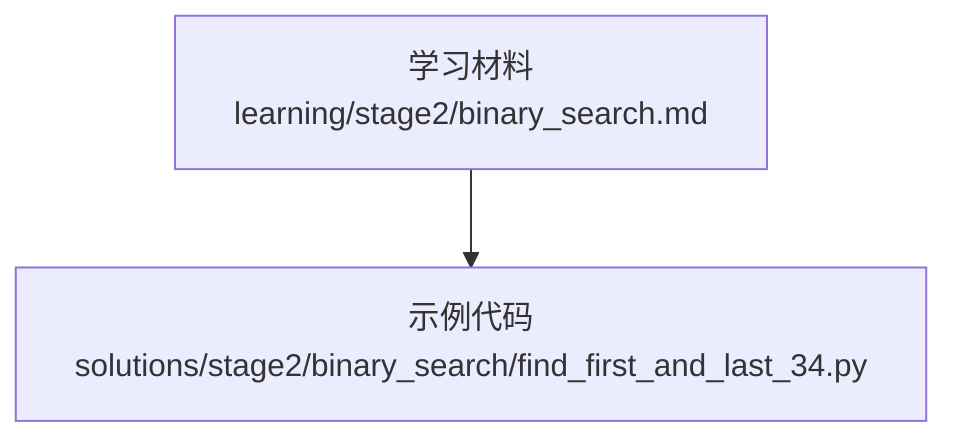
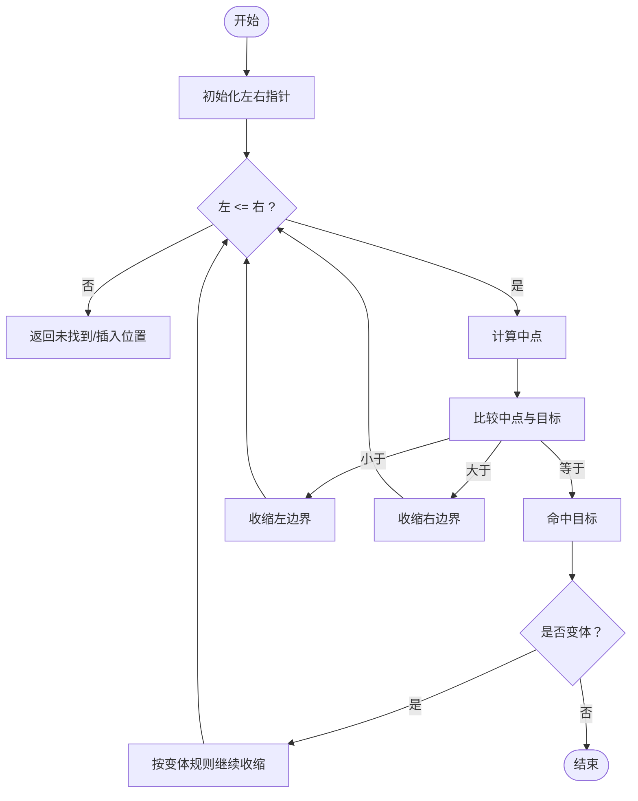
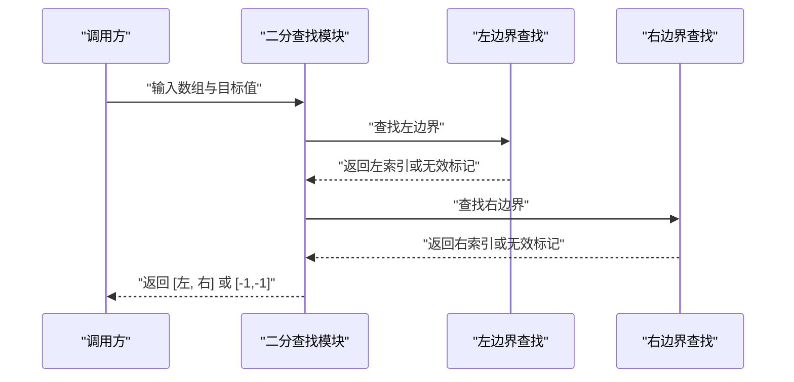
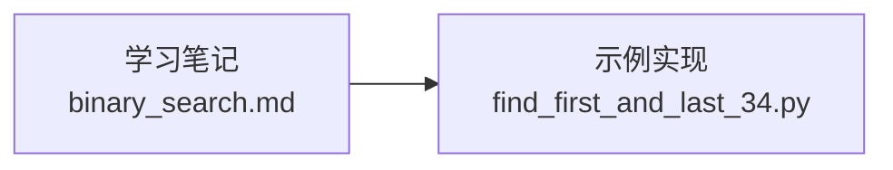

# 二分查找算法

<cite>
**本文引用的文件**   
- [learning/stage2/binary_search.md](file://learning/stage2/binary_search.md)
- [solutions/stage2/binary_search/find_first_and_last_34.py](file://solutions/stage2/binary_search/find_first_and_last_34.py)
</cite>

## 目录
1. [简介](#简介)
2. [项目结构](#项目结构)
3. [核心组件](#核心组件)
4. [架构总览](#架构总览)
5. [详细组件分析](#详细组件分析)
6. [依赖分析](#依赖分析)
7. [性能考虑](#性能考虑)
8. [故障排查指南](#故障排查指南)
9. [结论](#结论)
10. [附录](#附录)

## 简介
本学习文档围绕“二分查找”展开，目标是帮助读者建立稳定的思维模式与工程化实现能力。内容覆盖：
- 核心思想与适用条件
- 边界处理与循环不变式
- 标准模板与常见变体（第一个/最后一个元素、插入位置等）
- 时间复杂度 O(log n) 的推导与空间优化
- 左右指针移动逻辑与终止条件的严谨性
- 典型例题解析与常见错误规避
- 实战练习建议

## 项目结构
仓库中与二分查找相关的资料与示例如下：
- 学习笔记：learning/stage2/binary_search.md
- 示例实现：solutions/stage2/binary_search/find_first_and_last_34.py

图表来源
- [learning/stage2/binary_search.md](file://learning/stage2/binary_search.md)
- [solutions/stage2/binary_search/find_first_and_last_34.py](file://solutions/stage2/binary_search/find_first_and_last_34.py)

章节来源
- [learning/stage2/binary_search.md](file://learning/stage2/binary_search.md)
- [solutions/stage2/binary_search/find_first_and_last_34.py](file://solutions/stage2/binary_search/find_first_and_last_34.py)

## 核心组件
- 二分查找的核心组件包括：
  - 有序数据前提
  - 左右指针与中点计算
  - 比较与区间收缩策略
  - 循环不变式与终止条件
  - 结果判定与边界返回

- 关键要点：
  - 每次将搜索空间减半，保证对数级收敛
  - 明确“闭区间/半开区间”的选择并保持一致
  - 避免死循环：确保 mid 更新后区间严格缩小
  - 变体问题通过调整“相等时的处理”和“返回值”来统一

章节来源
- [learning/stage2/binary_search.md](file://learning/stage2/binary_search.md)

## 架构总览
下图展示了二分查找在“查找目标值”与“变体问题”中的通用流程与分支。

[此图为概念流程图，不直接映射具体源码文件]

## 详细组件分析

### 标准二分查找（查找目标值）
- 适用条件：数组已排序（升序或降序需一致），支持随机访问
- 区间选择：
  - 闭区间 [left, right]：循环条件 left <= right；mid 更新为 (left + right) // 2；当 target > nums[mid] 时 left = mid + 1；否则 right = mid - 1
  - 半开区间 [left, right)：循环条件 left < right；mid 更新为 left + (right - left) // 2；当 target > nums[mid] 时 left = mid + 1；否则 right = mid
- 循环不变式：目标若存在，必在当前区间内
- 终止条件：区间为空或找到目标
- 返回值：索引或“不存在”标记

章节来源
- [learning/stage2/binary_search.md](file://learning/stage2/binary_search.md)

### 变体一：查找第一个出现的位置（左边界）
- 思路：当 nums[mid] == target 时，不立即返回，而是继续向左收缩，使右边界逼近最左侧
- 关键点：
  - 使用闭区间或半开区间均可，但需保持与“相等时收缩方向”的一致性
  - 最终检查返回位置是否越界且对应值是否为目标
- 常见陷阱：
  - 忘记最终校验
  - 收缩方向与区间定义不一致导致死循环

章节来源
- [learning/stage2/binary_search.md](file://learning/stage2/binary_search.md)

### 变体二：查找最后一个出现的位置（右边界）
- 思路：当 nums[mid] == target 时，向右收缩，使左边界逼近最右侧
- 关键点：
  - 与左边界对称，注意 mid 更新方式与区间定义
  - 最终同样需要校验返回位置的合法性与值匹配
- 常见陷阱：
  - 更新 mid 时未加 1 导致死循环
  - 忽略越界检查

章节来源
- [learning/stage2/binary_search.md](file://learning/stage2/binary_search.md)

### 变体三：查找插入位置（下界）
- 目标：在有序数组中找到第一个不小于 target 的位置
- 思路：等价于“左边界”，但不要求 target 一定存在
- 关键点：
  - 循环结束后 left 即为插入位置
  - 无需额外校验，因为 left 天然落在 [0, n] 范围内
- 常见陷阱：
  - 混淆上界与下界
  - 区间定义与 mid 更新不一致

章节来源
- [learning/stage2/binary_search.md](file://learning/stage2/binary_search.md)

### 示例：查找目标值的第一个和最后一个位置
- 说明：该示例演示了如何在一次或两次二分中定位目标值的左右边界，从而得到目标值出现的完整区间
- 关注点：
  - 分别实现左边界与右边界的查找逻辑
  - 组合两个结果以得到答案
  - 处理不存在目标值的情况

章节来源
- [solutions/stage2/binary_search/find_first_and_last_34.py](file://solutions/stage2/binary_search/find_first_and_last_34.py)

#### 序列图：示例调用流程（概念示意）

[此图为概念流程图，不直接映射具体源码文件]

## 依赖分析
- 学习材料与示例的关系：
  - learning/stage2/binary_search.md 提供理论、模板与注意事项
  - solutions/stage2/binary_search/find_first_and_last_34.py 提供变体问题的参考实现
- 耦合关系：
  - 示例实现遵循笔记中的模板与边界处理约定
  - 两者共同构成“学-练”闭环

图表来源
- [learning/stage2/binary_search.md](file://learning/stage2/binary_search.md)
- [solutions/stage2/binary_search/find_first_and_last_34.py](file://solutions/stage2/binary_search/find_first_and_last_34.py)

章节来源
- [learning/stage2/binary_search.md](file://learning/stage2/binary_search.md)
- [solutions/stage2/binary_search/find_first_and_last_34.py](file://solutions/stage2/binary_search/find_first_and_last_34.py)

## 性能考虑
- 时间复杂度：O(log n)
  - 每轮将搜索空间减半，最多进行 log2(n) 次迭代
- 空间复杂度：O(1)
  - 仅使用常数个指针与变量
- 优化技巧：
  - 选择合适的区间定义并保持前后一致
  - 使用 mid = left + (right - left) // 2 避免溢出（在部分语言中尤为重要）
  - 优先使用半开区间以减少边界判断的歧义
  - 对于多查询场景，可结合预处理或数据结构（如前缀和、哈希表）降低整体复杂度

[本节为通用指导，不直接分析具体文件]

## 故障排查指南
- 常见问题与对策：
  - 死循环：检查 mid 更新后区间是否严格缩小；确认循环条件与区间定义一致
  - 越界访问：在返回结果前进行边界检查（尤其是变体问题）
  - 漏判相等：变体问题中“相等时”的处理决定收敛方向，务必与目标语义一致
  - 初始值设置：left/right 的初值应与区间定义匹配
  - 返回值语义：区分“是否存在”与“插入位置”的不同返回约定
- 调试建议：
  - 打印每轮的 left、right、mid 与比较结果
  - 构造最小反例验证边界情况（空数组、单元素、全相同元素、目标不在数组中等）

章节来源
- [learning/stage2/binary_search.md](file://learning/stage2/binary_search.md)

## 结论
二分查找的关键在于“明确的区间定义 + 严格的循环不变式 + 一致的收缩策略”。掌握标准模板后，通过微调“相等时的处理”和“返回值语义”，即可覆盖大多数变体问题。配合系统化的调试方法与边界用例，能够显著提升实现的稳定性与正确率。

[本节为总结性内容，不直接分析具体文件]

## 附录
- 推荐练习路径：
  - 先实现标准二分查找（闭区间与半开区间各写一遍）
  - 再实现左边界、右边界、插入位置三个变体
  - 最后用“查找第一个和最后一个位置”综合题串联左右边界
- 自检清单：
  - 区间定义是否自洽？
  - mid 更新是否会导致死循环？
  - 相等时的收缩方向是否符合题意？
  - 返回值是否需要额外校验？
  - 是否覆盖了空数组、单元素、重复元素等边界用例？

[本节为通用指导，不直接分析具体文件]