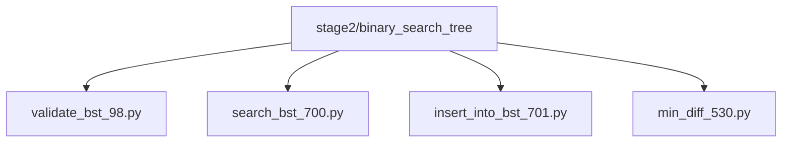
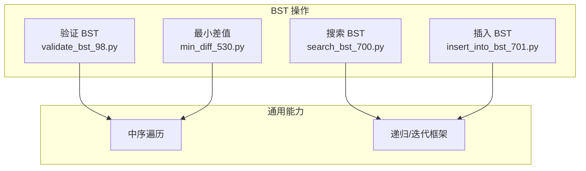
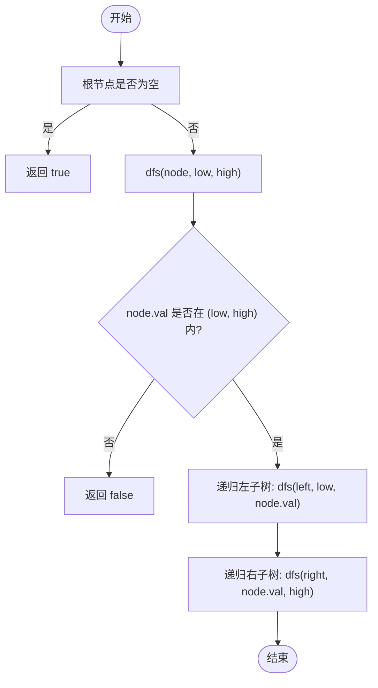
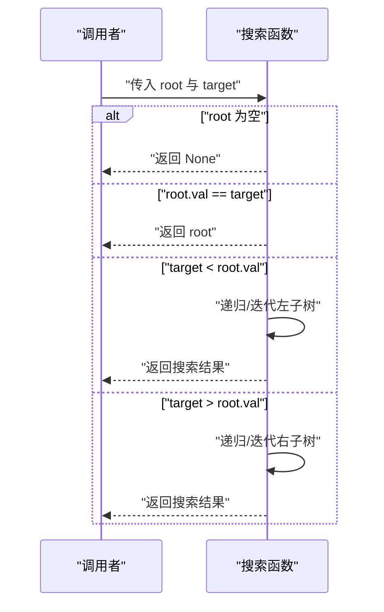
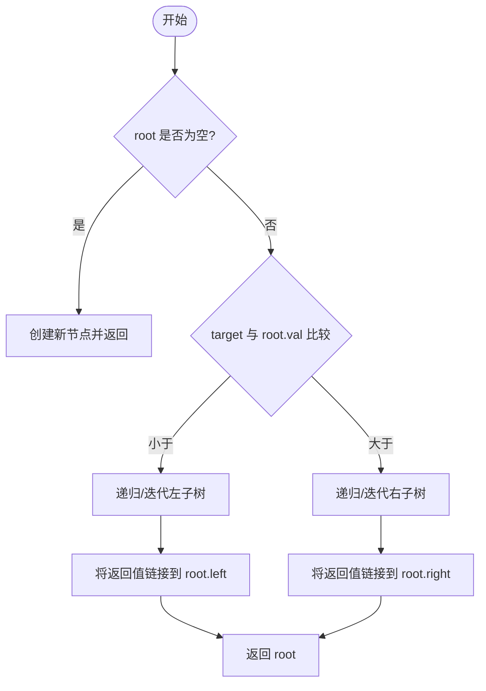
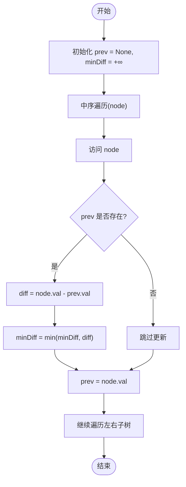
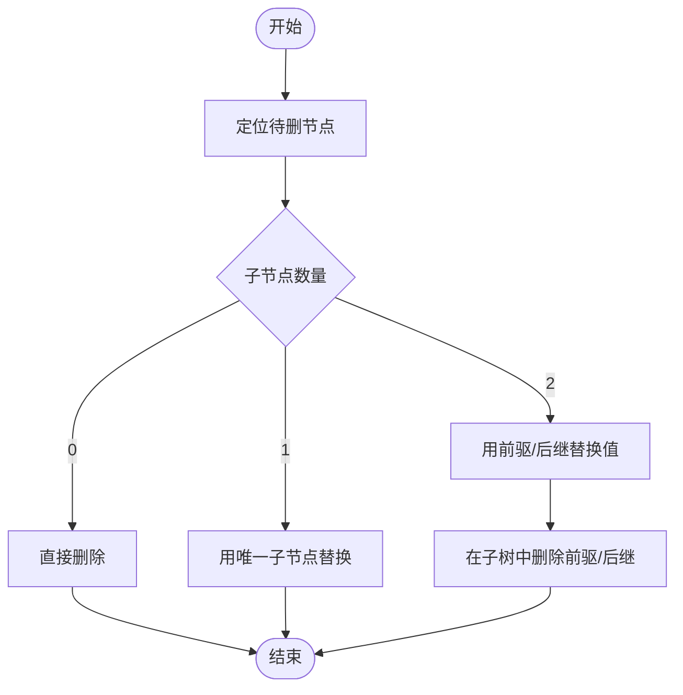
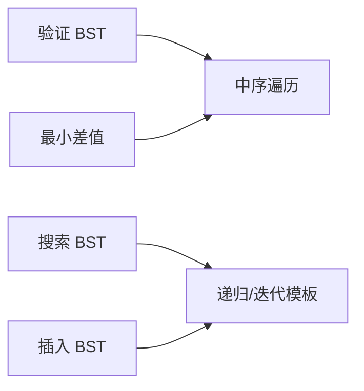

# 二叉搜索树操作

<cite>
**本文引用的文件**   
- [validate_bst_98.py](file://solutions/stage2/binary_search_tree/validate_bst_98.py)
- [search_bst_700.py](file://solutions/stage2/binary_search_tree/search_bst_700.py)
- [insert_into_bst_701.py](file://solutions/stage2/binary_search_tree/insert_into_bst_701.py)
- [min_diff_530.py](file://solutions/stage2/binary_search_tree/min_diff_530.py)
</cite>

## 目录
1. [简介](#简介)
2. [项目结构](#项目结构)
3. [核心组件](#核心组件)
4. [架构总览](#架构总览)
5. [详细组件分析](#详细组件分析)
6. [依赖分析](#依赖分析)
7. [性能考虑](#性能考虑)
8. [故障排查指南](#故障排查指南)
9. [结论](#结论)
10. [附录](#附录)

## 简介
本学习文档围绕二叉搜索树（BST）的核心操作展开，系统讲解其性质定义、有序性特点、验证方法、搜索与插入删除算法，并重点剖析最小差值计算与中序遍历的应用技巧。同时对比 BST 与其他树结构的差异与性能优势，通过递归与迭代两种实现方式的优缺点比较，帮助读者建立对有序数据结构与高效查找算法的扎实理解。

## 项目结构
仓库中与 BST 相关的代码集中在 stage2/binary_search_tree 目录下，包含以下典型题目实现：
- 验证 BST：validate_bst_98.py
- 搜索 BST：search_bst_700.py
- 插入到 BST：insert_into_bst_701.py
- 最小差值：min_diff_530.py

图表来源
- [validate_bst_98.py](file://solutions/stage2/binary_search_tree/validate_bst_98.py)
- [search_bst_700.py](file://solutions/stage2/binary_search_tree/search_bst_700.py)
- [insert_into_bst_701.py](file://solutions/stage2/binary_search_tree/insert_into_bst_701.py)
- [min_diff_530.py](file://solutions/stage2/binary_search_tree/min_diff_530.py)

章节来源
- [validate_bst_98.py](file://solutions/stage2/binary_search_tree/validate_bst_98.py)
- [search_bst_700.py](file://solutions/stage2/binary_search_tree/search_bst_700.py)
- [insert_into_bst_701.py](file://solutions/stage2/binary_search_tree/insert_into_bst_701.py)
- [min_diff_530.py](file://solutions/stage2/binary_search_tree/min_diff_530.py)

## 核心组件
- 节点定义：每个节点包含左子树、右子树与键值，遵循“左小右大”的有序约束。
- 验证模块：判断整棵树是否满足 BST 性质，常见思路包括上下界传递或中序遍历单调性检查。
- 搜索模块：根据目标值在左右子树间选择分支，直至命中或到达空节点。
- 插入模块：定位插入位置后创建新节点并链接，保持 BST 有序性。
- 删除模块：分情况处理（无子、单子、双子），双子情形通常以中序前驱或后继替代再删除。
- 最小差值：利用中序遍历得到递增序列，相邻元素的最小差即为答案。

章节来源
- [validate_bst_98.py](file://solutions/stage2/binary_search_tree/validate_bst_98.py)
- [search_bst_700.py](file://solutions/stage2/binary_search_tree/search_bst_700.py)
- [insert_into_bst_701.py](file://solutions/stage2/binary_search_tree/insert_into_bst_701.py)
- [min_diff_530.py](file://solutions/stage2/binary_search_tree/min_diff_530.py)

## 架构总览
下图展示了四个核心操作的调用关系与数据流向，体现 BST 的有序性与遍历特性如何被复用。

图表来源
- [validate_bst_98.py](file://solutions/stage2/binary_search_tree/validate_bst_98.py)
- [search_bst_700.py](file://solutions/stage2/binary_search_tree/search_bst_700.py)
- [insert_into_bst_701.py](file://solutions/stage2/binary_search_tree/insert_into_bst_701.py)
- [min_diff_530.py](file://solutions/stage2/binary_search_tree/min_diff_530.py)

## 详细组件分析

### 验证 BST（上下界法与中序法）
- 设计要点
  - 上下界法：为每个节点维护合法区间 (low, high)，递归时更新边界，确保所有祖先约束均被满足。
  - 中序法：BST 的中序遍历结果严格递增；可在遍历过程中维护上一个访问节点的值，检查单调性。
- 复杂度
  - 时间 O(n)，空间 O(h)（h 为树高）。
- 边界与陷阱
  - 整数边界需使用可扩展的无穷表示，避免越界误判。
  - 相等值的处理取决于具体约定（通常 BST 不允许重复或规定插入侧）。

图表来源
- [validate_bst_98.py](file://solutions/stage2/binary_search_tree/validate_bst_98.py)

章节来源
- [validate_bst_98.py](file://solutions/stage2/binary_search_tree/validate_bst_98.py)

### 搜索 BST（递归与迭代）
- 设计要点
  - 若当前节点为空，未找到；若等于目标，命中；小于则进入左子树，大于则进入右子树。
- 复杂度
  - 平均 O(log n)，最坏 O(n)（退化为链表）。
- 适用场景
  - 快速判定存在性、定位节点指针用于后续插入/删除。

图表来源
- [search_bst_700.py](file://solutions/stage2/binary_search_tree/search_bst_700.py)

章节来源
- [search_bst_700.py](file://solutions/stage2/binary_search_tree/search_bst_700.py)

### 插入到 BST（递归与迭代）
- 设计要点
  - 从根出发按大小比较决定方向，直到遇到空位，创建新节点并挂接。
  - 递归版本简洁直观；迭代版本可显式控制父指针与循环终止条件。
- 复杂度
  - 平均 O(log n)，最坏 O(n)。
- 注意事项
  - 插入后仍需维持 BST 性质；本题无需平衡调整。

图表来源
- [insert_into_bst_701.py](file://solutions/stage2/binary_search_tree/insert_into_bst_701.py)

章节来源
- [insert_into_bst_701.py](file://solutions/stage2/binary_search_tree/insert_into_bst_701.py)

### 最小差值（中序遍历应用）
- 设计要点
  - 利用 BST 中序遍历的递增性质，维护“上一个访问节点”的值，用当前值与前值的差更新全局最小差。
- 复杂度
  - 时间 O(n)，空间 O(h)。
- 变体与扩展
  - 可改为显式栈实现中序遍历，避免递归深度限制。

图表来源
- [min_diff_530.py](file://solutions/stage2/binary_search_tree/min_diff_530.py)

章节来源
- [min_diff_530.py](file://solutions/stage2/binary_search_tree/min_diff_530.py)

### 删除节点（概念性流程）
- 设计要点
  - 无子节点：直接删除。
  - 单子节点：用子节点替换当前节点。
  - 双子节点：用中序前驱或后继替代当前节点值，再在相应子树中删除该前驱/后继。
- 复杂度
  - 平均 O(log n)，最坏 O(n)。
- 注意
  - 需要正确维护父子指针，避免断链。

[此图为概念性流程图，不直接映射具体源码文件]

## 依赖分析
- 模块耦合
  - 搜索与插入共享“自上而下比较—选择分支”的控制流，便于统一为递归/迭代模板。
  - 验证与最小差值共享“中序遍历”这一通用能力，体现遍历抽象的价值。
- 外部依赖
  - 仅依赖语言内置数据结构与基础语法，无第三方库耦合。

图表来源
- [validate_bst_98.py](file://solutions/stage2/binary_search_tree/validate_bst_98.py)
- [search_bst_700.py](file://solutions/stage2/binary_search_tree/search_bst_700.py)
- [insert_into_bst_701.py](file://solutions/stage2/binary_search_tree/insert_into_bst_701.py)
- [min_diff_530.py](file://solutions/stage2/binary_search_tree/min_diff_530.py)

章节来源
- [validate_bst_98.py](file://solutions/stage2/binary_search_tree/validate_bst_98.py)
- [search_bst_700.py](file://solutions/stage2/binary_search_tree/search_bst_700.py)
- [insert_into_bst_701.py](file://solutions/stage2/binary_search_tree/insert_into_bst_701.py)
- [min_diff_530.py](file://solutions/stage2/binary_search_tree/min_diff_530.py)

## 性能考虑
- 时间复杂度
  - 搜索/插入/删除：平均 O(log n)，最坏 O(n)。
  - 验证/最小差值：O(n)。
- 空间复杂度
  - 递归深度 O(h)，h 为树高；退化时 h=n。
- 平衡性
  - 普通 BST 可能退化为链表，导致性能下降。实际工程中常采用 AVL、红黑树等自平衡结构保证 O(log n) 操作。
- 实践建议
  - 大规模动态数据优先选择自平衡树或索引结构。
  - 批量构建时可先排序再构造近似平衡的 BST，降低初始高度。

[本节提供一般性指导，不直接分析具体文件]

## 故障排查指南
- 验证失败
  - 检查上下界是否正确传递，避免仅比较父子节点而忽略祖先约束。
  - 中序法需确认严格递增（不含相等）是否符合题意。
- 搜索不到
  - 确认比较逻辑与目标值大小关系一致，避免边界遗漏。
- 插入异常
  - 递归返回与父指针链接顺序要正确；迭代需确保循环终止条件与空位检测无误。
- 最小差值错误
  - 确认 prev 初始化与首次赋值时机；注意整数溢出风险（必要时使用更大范围类型）。

章节来源
- [validate_bst_98.py](file://solutions/stage2/binary_search_tree/validate_bst_98.py)
- [search_bst_700.py](file://solutions/stage2/binary_search_tree/search_bst_700.py)
- [insert_into_bst_701.py](file://solutions/stage2/binary_search_tree/insert_into_bst_701.py)
- [min_diff_530.py](file://solutions/stage2/binary_search_tree/min_diff_530.py)

## 结论
通过对验证、搜索、插入、删除以及最小差值等关键操作的系统梳理，可以清晰看到 BST 的有序性如何贯穿各项操作。中序遍历作为通用工具，在验证与统计类问题中尤为强大。对于工程实践，应关注树的平衡性与极端输入带来的退化风险，必要时引入自平衡策略或改用更合适的索引结构。

[本节为总结性内容，不直接分析具体文件]

## 附录
- 递归 vs 迭代
  - 递归：代码简洁、易于表达分治思想；但存在栈深度限制。
  - 迭代：可控性强、避免栈溢出；需显式管理状态（如栈或父指针）。
- 与其他树结构的区别
  - 与普通二叉树：BST 具备有序性，支持高效查找/插入/删除。
  - 与堆：堆满足堆序而非全序，适合优先队列场景。
  - 与平衡树：AVL/红黑树在操作代价上更稳定，适合频繁增删改的场景。
- 实际应用注意事项
  - 数据分布影响性能，尽量保持相对随机或定期重建/重平衡。
  - 并发环境下需考虑锁粒度与一致性。
  - 持久化与序列化时需保留结构信息以便恢复。

[本节为概念性补充，不直接分析具体文件]