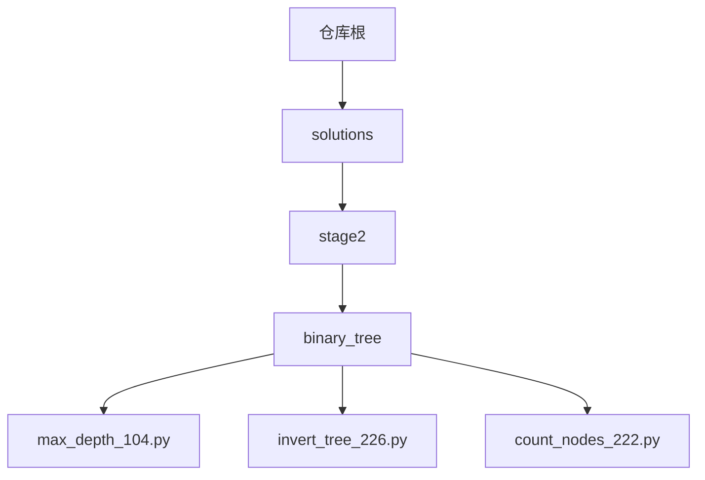
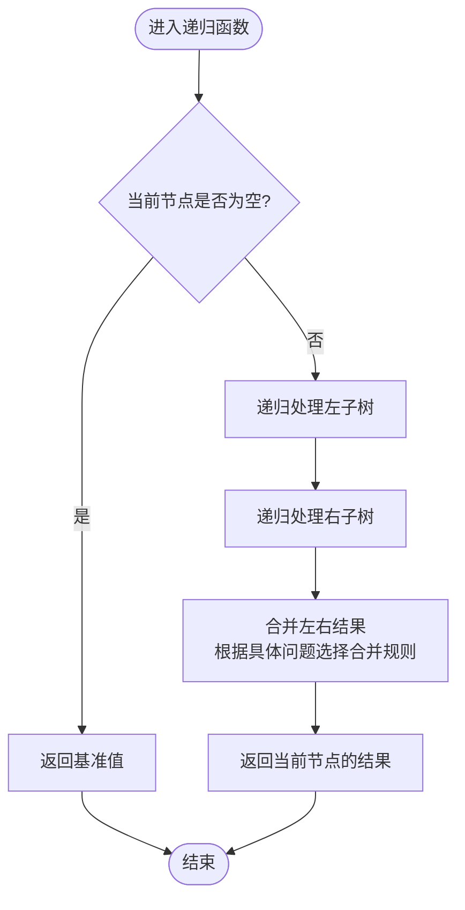
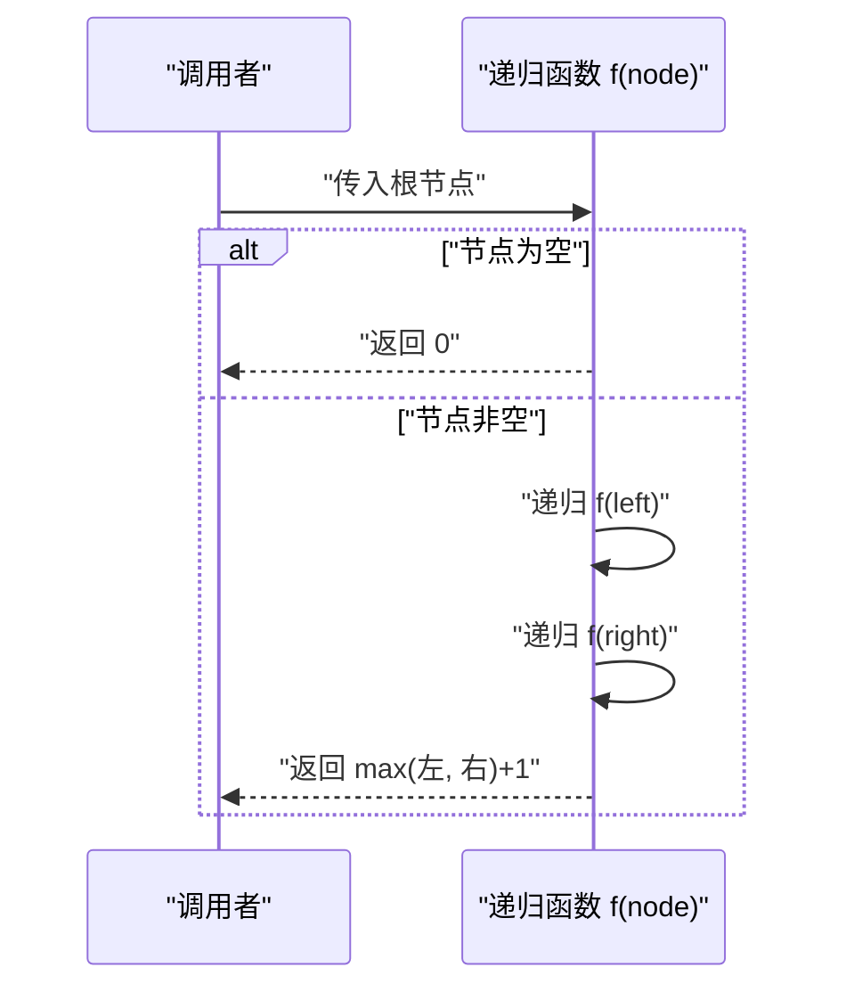
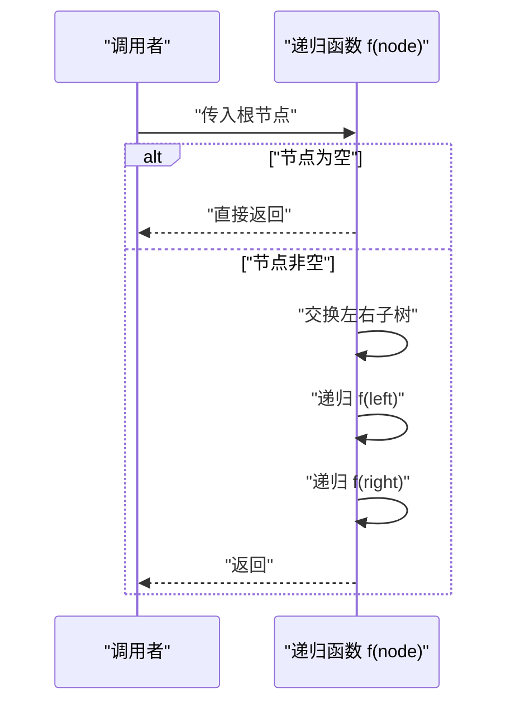
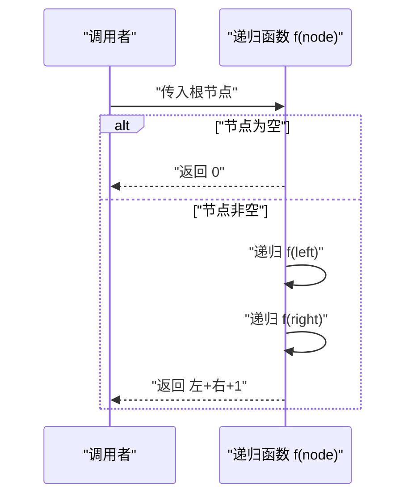
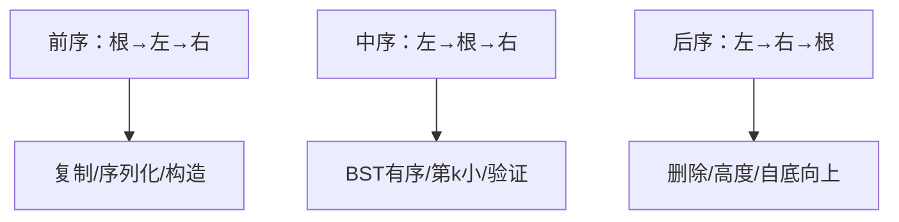
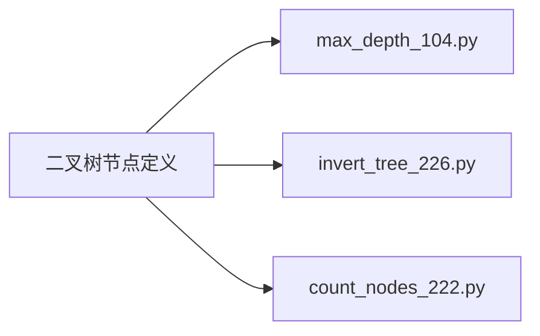

# 二叉树基础操作

<cite>
**本文引用的文件**   
- [solutions/stage2/binary_tree/max_depth_104.py](file://solutions/stage2/binary_tree/max_depth_104.py)
- [solutions/stage2/binary_tree/invert_tree_226.py](file://solutions/stage2/binary_tree/invert_tree_226.py)
- [solutions/stage2/binary_tree/count_nodes_222.py](file://solutions/stage2/binary_tree/count_nodes_222.py)
</cite>

## 目录
1. [简介](#简介)
2. [项目结构](#项目结构)
3. [核心组件](#核心组件)
4. [架构总览](#架构总览)
5. [详细组件分析](#详细组件分析)
6. [依赖分析](#依赖分析)
7. [性能考虑](#性能考虑)
8. [故障排查指南](#故障排查指南)
9. [结论](#结论)
10. [附录](#附录)

## 简介
本学习文档围绕二叉树的递归思维与基础操作展开，聚焦以下目标：
- 建立递归思维：自顶向下分解问题、明确子问题与合并结果。
- 掌握三大基本操作：最大深度、翻转整棵树、节点计数。
- 理解三种递归遍历（前序、中序、后序）及其典型应用场景。
- 提供通用解题模板与状态转移方程设计方法。
- 通过仓库中的具体实现路径，展示递归函数设计与参数传递技巧。
- 总结常见模式识别与性能优化策略，帮助学员构建扎实的树结构编程基础。

## 项目结构
仓库中与二叉树相关的实现集中在 stage2/binary_tree 目录下，包含三个经典问题的递归解法示例：
- 最大深度：max_depth_104.py
- 翻转二叉树：invert_tree_226.py
- 节点计数：count_nodes_222.py

图表来源
- [solutions/stage2/binary_tree/max_depth_104.py](file://solutions/stage2/binary_tree/max_depth_104.py)
- [solutions/stage2/binary_tree/invert_tree_226.py](file://solutions/stage2/binary_tree/invert_tree_226.py)
- [solutions/stage2/binary_tree/count_nodes_222.py](file://solutions/stage2/binary_tree/count_nodes_222.py)

章节来源
- [solutions/stage2/binary_tree/max_depth_104.py](file://solutions/stage2/binary_tree/max_depth_104.py)
- [solutions/stage2/binary_tree/invert_tree_226.py](file://solutions/stage2/binary_tree/invert_tree_226.py)
- [solutions/stage2/binary_tree/count_nodes_222.py](file://solutions/stage2/binary_tree/count_nodes_222.py)

## 核心组件
本节从“问题—思路—模板—要点”四个维度，梳理三大基础操作的实现思想与通用模板。为避免直接粘贴代码，所有关键实现均以“代码片段路径”形式给出，便于读者在仓库中定位并对照学习。

- 最大深度
  - 思路：后序遍历；对每个节点返回左右子树的最大深度加一。
  - 模板：定义函数 f(node)，返回以 node 为根的子树的最大深度；空节点返回 0；非空节点返回 max(f(left), f(right)) + 1。
  - 关键点：返回值即“状态”，合并规则为取最大值再加一。
  - 参考实现路径：[solutions/stage2/binary_tree/max_depth_104.py](file://solutions/stage2/binary_tree/max_depth_104.py)

- 翻转二叉树
  - 思路：前序或后序均可；交换当前节点的左右子树，再递归处理子树。
  - 模板：定义函数 f(node)，若为空则返回；否则交换左右子树，再分别调用 f(left)、f(right)。
  - 关键点：原地修改指针方向；先交换再递归或先递归再交换均可。
  - 参考实现路径：[solutions/stage2/binary_tree/invert_tree_226.py](file://solutions/stage2/binary_tree/invert_tree_226.py)

- 节点计数
  - 思路：后序遍历；返回左子树节点数 + 右子树节点数 + 1。
  - 模板：定义函数 f(node)，空节点返回 0；非空节点返回 f(left) + f(right) + 1。
  - 关键点：返回值即“状态”，合并规则为求和再加一。
  - 参考实现路径：[solutions/stage2/binary_tree/count_nodes_222.py](file://solutions/stage2/binary_tree/count_nodes_222.py)

章节来源
- [solutions/stage2/binary_tree/max_depth_104.py](file://solutions/stage2/binary_tree/max_depth_104.py)
- [solutions/stage2/binary_tree/invert_tree_226.py](file://solutions/stage2/binary_tree/invert_tree_226.py)
- [solutions/stage2/binary_tree/count_nodes_222.py](file://solutions/stage2/binary_tree/count_nodes_222.py)

## 架构总览
下图展示了三个基础操作在“递归函数—子问题—合并结果”层面的统一抽象。它们都遵循相同的递归范式：定义函数语义、确定终止条件、递归求解子问题、合并子问题结果。

图表来源
- [solutions/stage2/binary_tree/max_depth_104.py](file://solutions/stage2/binary_tree/max_depth_104.py)
- [solutions/stage2/binary_tree/invert_tree_226.py](file://solutions/stage2/binary_tree/invert_tree_226.py)
- [solutions/stage2/binary_tree/count_nodes_222.py](file://solutions/stage2/binary_tree/count_nodes_222.py)

## 详细组件分析

### 最大深度（max_depth）
- 递归语义：f(node) 表示以 node 为根的子树的最大深度。
- 终止条件：node 为空时返回 0。
- 状态转移：f(node) = max(f(left), f(right)) + 1。
- 复杂度：时间 O(n)，空间 O(h)（h 为树高）。
- 适用场景：任何需要“高度/深度”信息的题目，如判断平衡性、计算直径等。

图表来源
- [solutions/stage2/binary_tree/max_depth_104.py](file://solutions/stage2/binary_tree/max_depth_104.py)

章节来源
- [solutions/stage2/binary_tree/max_depth_104.py](file://solutions/stage2/binary_tree/max_depth_104.py)

### 翻转二叉树（invert_tree）
- 递归语义：f(node) 将 node 为根的子树进行翻转。
- 终止条件：node 为空时直接返回。
- 状态转移：交换左右子树指针，然后递归处理左右子树。
- 复杂度：时间 O(n)，空间 O(h)。
- 适用场景：镜像对称、路径反转、结构变换类问题。

图表来源
- [solutions/stage2/binary_tree/invert_tree_226.py](file://solutions/stage2/binary_tree/invert_tree_226.py)

章节来源
- [solutions/stage2/binary_tree/invert_tree_226.py](file://solutions/stage2/binary_tree/invert_tree_226.py)

### 节点计数（count_nodes）
- 递归语义：f(node) 返回以 node 为根的子树的节点总数。
- 终止条件：node 为空时返回 0。
- 状态转移：f(node) = f(left) + f(right) + 1。
- 复杂度：时间 O(n)，空间 O(h)。
- 适用场景：统计型问题、路径长度累加、信息汇总。

图表来源
- [solutions/stage2/binary_tree/count_nodes_222.py](file://solutions/stage2/binary_tree/count_nodes_222.py)

章节来源
- [solutions/stage2/binary_tree/count_nodes_222.py](file://solutions/stage2/binary_tree/count_nodes_222.py)

### 递归遍历的三种方式与应用
- 前序遍历（根—左—右）
  - 典型应用：复制树、序列化、构造树、表达式求值的前缀形式。
  - 模板要点：先访问根，再递归左、右。
- 中序遍历（左—根—右）
  - 典型应用：BST 的中序有序序列、查找第 k 小元素、验证 BST。
  - 模板要点：先递归左，再访问根，最后递归右。
- 后序遍历（左—右—根）
  - 典型应用：删除树、计算高度/深度、自底向上聚合信息。
  - 模板要点：先递归左、右，再访问根。

[此图为概念性流程图，不直接映射到具体源码文件]

## 依赖分析
三个实现均为独立模块，彼此无相互导入关系，仅共享“二叉树节点”这一数据结构约定。其依赖关系可抽象如下：

图表来源
- [solutions/stage2/binary_tree/max_depth_104.py](file://solutions/stage2/binary_tree/max_depth_104.py)
- [solutions/stage2/binary_tree/invert_tree_226.py](file://solutions/stage2/binary_tree/invert_tree_226.py)
- [solutions/stage2/binary_tree/count_nodes_222.py](file://solutions/stage2/binary_tree/count_nodes_222.py)

章节来源
- [solutions/stage2/binary_tree/max_depth_104.py](file://solutions/stage2/binary_tree/max_depth_104.py)
- [solutions/stage2/binary_tree/invert_tree_226.py](file://solutions/stage2/binary_tree/invert_tree_226.py)
- [solutions/stage2/binary_tree/count_nodes_222.py](file://solutions/stage2/binary_tree/count_nodes_222.py)

## 性能考虑
- 时间复杂度
  - 三者均访问每个节点一次，时间复杂度为 O(n)。
- 空间复杂度
  - 递归栈深度等于树高 h，最坏情况（链状）O(n)，平均情况 O(log n)。
- 优化建议
  - 避免重复计算：若需多次查询子树信息，可使用记忆化或自顶向下累积。
  - 迭代替代递归：当树极深导致栈溢出风险时，可用显式栈模拟递归。
  - 剪枝与提前返回：如判定性问题可在发现不满足条件时立即返回。

[本节为通用指导，无需特定文件引用]

## 故障排查指南
- 常见问题
  - 忘记处理空节点：会导致空指针异常或错误返回值。
  - 合并逻辑错误：例如最大深度误用加法而非取最大值。
  - 未正确更新指针：翻转树忘记交换左右子树或顺序错误。
- 调试技巧
  - 打印递归入口与出口，确认终止条件与返回值是否符合预期。
  - 用小规模样例逐步验证：单节点、只有左/右子树、完全二叉树等。
  - 使用边界测试：空树、退化链树、满二叉树。

[本节为通用指导，无需特定文件引用]

## 结论
通过最大深度、翻转二叉树与节点计数三个经典问题，可以系统建立二叉树递归思维：明确函数语义、设定终止条件、设计状态转移、合并子问题结果。配合前序、中序、后序三种遍历模板，能够覆盖大多数树形问题的求解路径。建议在练习中坚持“先写伪代码—再补全细节—最后优化”的流程，逐步提升对树结构的掌控力。

[本节为总结性内容，无需特定文件引用]

## 附录
- 通用递归模板（适用于多数树问题）
  - 定义函数语义：f(node) 表示什么？
  - 终止条件：node 为空时的返回值。
  - 递归步骤：分别求解 f(left)、f(right)。
  - 合并结果：根据题意组合左右结果得到当前节点答案。
- 参数传递技巧
  - 自顶向下：通过额外参数累计路径信息（如路径和、路径集合）。
  - 自底向上：通过返回值聚合子树信息（如高度、数量、布尔属性）。
- 常见模式识别
  - 高度/深度类：后序合并取最大值。
  - 存在性/判定类：短路逻辑，尽早返回。
  - 计数/求和类：后序合并做加法。
  - 结构变换类：前序或后序修改指针。

[本节为概念性补充，无需特定文件引用]