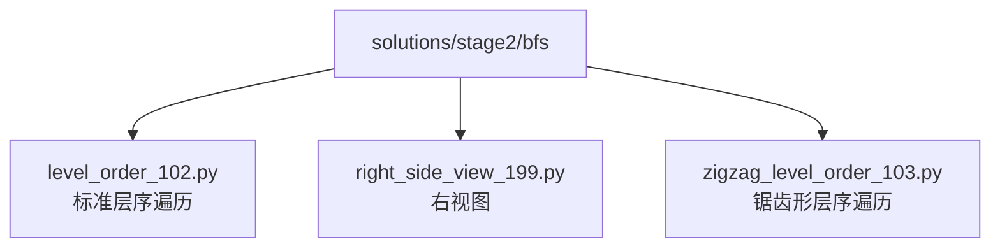
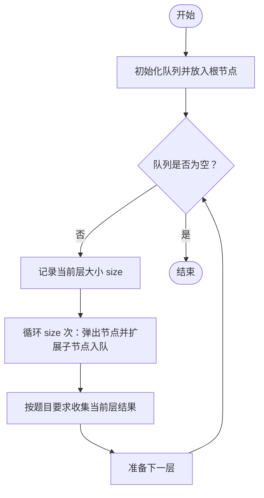
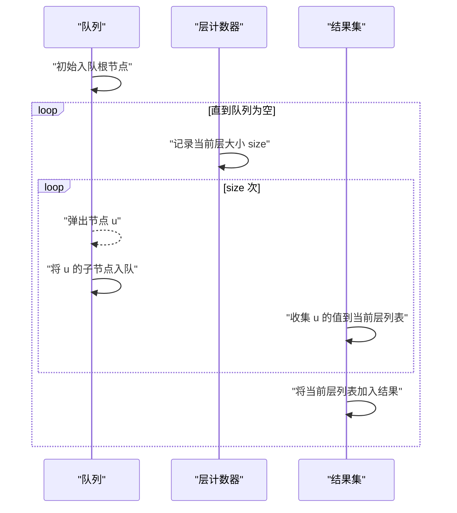
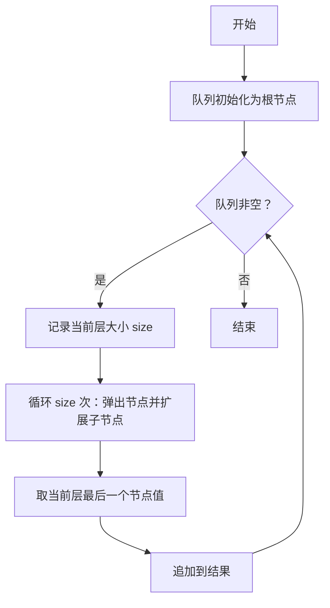
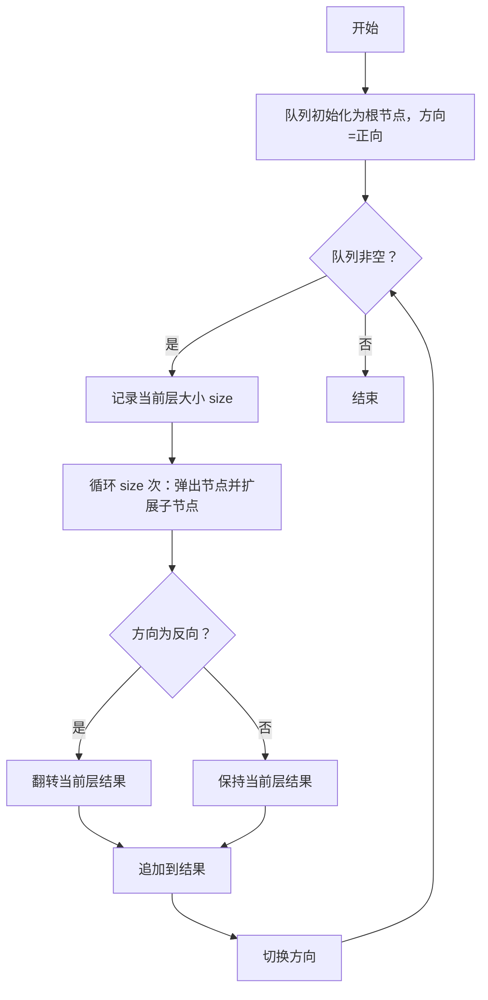
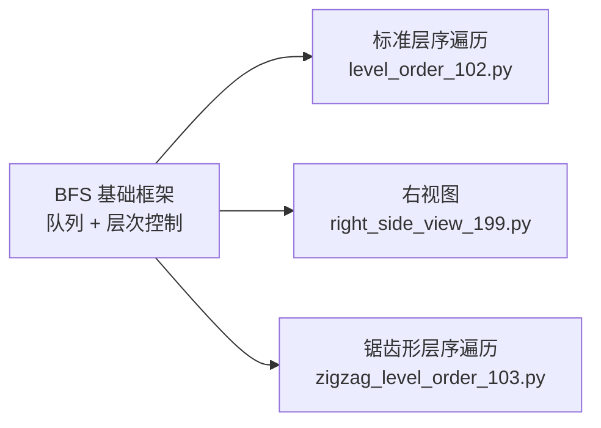

# 广度优先搜索(BFS)

<cite>
**本文引用的文件**   
- [solutions/stage2/bfs/level_order_102.py](file://solutions/stage2/bfs/level_order_102.py)
- [solutions/stage2/bfs/right_side_view_199.py](file://solutions/stage2/bfs/right_side_view_199.py)
- [solutions/stage2/bfs/zigzag_level_order_103.py](file://solutions/stage2/bfs/zigzag_level_order_103.py)
</cite>

## 目录
1. [简介](#简介)
2. [项目结构](#项目结构)
3. [核心组件](#核心组件)
4. [架构总览](#架构总览)
5. [详细组件分析](#详细组件分析)
6. [依赖关系分析](#依赖关系分析)
7. [性能与复杂度](#性能与复杂度)
8. [故障排查指南](#故障排查指南)
9. [结论](#结论)
10. [附录：BFS vs DFS 对比与选型](#附录bfs-vs-dfs-对比与选型)

## 简介
本学习文档围绕广度优先搜索（BFS）展开，系统讲解其核心思想、队列数据结构的应用、层次遍历的实现方法与状态管理技巧。重点覆盖以下场景：
- 标准层序遍历
- 锯齿形层序遍历
- 二叉树右视图
- 最短路径问题与连通分量检测等经典应用

通过仓库中的具体实现示例，帮助读者掌握队列操作、层次标记和结果收集的最佳实践，为图论与树的最优解法打下坚实基础。

## 项目结构
本项目在 solutions/stage2/bfs 目录下提供了三类典型 BFS 问题的 Python 实现，分别对应：
- 标准层序遍历
- 右视图
- 锯齿形层序遍历

图表来源
- [solutions/stage2/bfs/level_order_102.py](file://solutions/stage2/bfs/level_order_102.py)
- [solutions/stage2/bfs/right_side_view_199.py](file://solutions/stage2/bfs/right_side_view_199.py)
- [solutions/stage2/bfs/zigzag_level_order_103.py](file://solutions/stage2/bfs/zigzag_level_order_103.py)

章节来源
- [solutions/stage2/bfs/level_order_102.py](file://solutions/stage2/bfs/level_order_102.py)
- [solutions/stage2/bfs/right_side_view_199.py](file://solutions/stage2/bfs/right_side_view_199.py)
- [solutions/stage2/bfs/zigzag_level_order_103.py](file://solutions/stage2/bfs/zigzag_level_order_103.py)

## 核心组件
- 队列（Queue）：BFS 的核心数据结构，用于按“层”推进搜索。
- 层次边界标记：通过记录每层的节点数量或显式分层，确保在同一层内完成处理后再进入下一层。
- 结果收集策略：根据题目要求，在每层结束时收集当前层的结果（如整层列表、最右侧节点、方向反转等）。

章节来源
- [solutions/stage2/bfs/level_order_102.py](file://solutions/stage2/bfs/level_order_102.py)
- [solutions/stage2/bfs/right_side_view_199.py](file://solutions/stage2/bfs/right_side_view_199.py)
- [solutions/stage2/bfs/zigzag_level_order_103.py](file://solutions/stage2/bfs/zigzag_level_order_103.py)

## 架构总览
下图展示了三种 BFS 变体在“输入—处理—输出”层面的统一流程，以及它们之间的差异点。

图表来源
- [solutions/stage2/bfs/level_order_102.py](file://solutions/stage2/bfs/level_order_102.py)
- [solutions/stage2/bfs/right_side_view_199.py](file://solutions/stage2/bfs/right_side_view_199.py)
- [solutions/stage2/bfs/zigzag_level_order_103.py](file://solutions/stage2/bfs/zigzag_level_order_103.py)

## 详细组件分析

### 标准层序遍历（Level Order Traversal）
- 目标：逐层访问树的节点，返回每一层的节点值序列。
- 关键技巧：
  - 使用队列维护待访问节点。
  - 每层开始前记录当前层节点数 size，保证只处理当前层节点。
  - 将子节点依次入队，供下一层处理。
- 适用场景：需要按层组织数据、统计层级信息、计算最小层数等。

图表来源
- [solutions/stage2/bfs/level_order_102.py](file://solutions/stage2/bfs/level_order_102.py)

章节来源
- [solutions/stage2/bfs/level_order_102.py](file://solutions/stage2/bfs/level_order_102.py)

### 右视图（Right Side View）
- 目标：从右侧观察二叉树，返回每层最右侧可见的节点值。
- 关键技巧：
  - 同层遍历时，最后一个被处理的节点即为该层右视图节点。
  - 可在每层循环结束后，将当前层最后一个节点值追加到结果中。
- 适用场景：需要获取某一层特定位置的节点（如最左/最右/中间）。

图表来源
- [solutions/stage2/bfs/right_side_view_199.py](file://solutions/stage2/bfs/right_side_view_199.py)

章节来源
- [solutions/stage2/bfs/right_side_view_199.py](file://solutions/stage2/bfs/right_side_view_199.py)

### 锯齿形层序遍历（Zigzag Level Order）
- 目标：奇数层从左到右，偶数层从右到左（或相反），交替输出每层节点值。
- 关键技巧：
  - 在标准层序遍历基础上，增加一个方向标志位。
  - 当方向为反向时，对当前层结果进行翻转；否则保持原序。
- 适用场景：需要按层但改变每层顺序的题目。

图表来源
- [solutions/stage2/bfs/zigzag_level_order_103.py](file://solutions/stage2/bfs/zigzag_level_order_103.py)

章节来源
- [solutions/stage2/bfs/zigzag_level_order_103.py](file://solutions/stage2/bfs/zigzag_level_order_103.py)

## 依赖关系分析
三个实现均基于相同的 BFS 骨架：队列 + 层次控制 + 结果收集。它们的差异仅体现在“结果收集阶段”的策略上。

图表来源
- [solutions/stage2/bfs/level_order_102.py](file://solutions/stage2/bfs/level_order_102.py)
- [solutions/stage2/bfs/right_side_view_199.py](file://solutions/stage2/bfs/right_side_view_199.py)
- [solutions/stage2/bfs/zigzag_level_order_103.py](file://solutions/stage2/bfs/zigzag_level_order_103.py)

章节来源
- [solutions/stage2/bfs/level_order_102.py](file://solutions/stage2/bfs/level_order_102.py)
- [solutions/stage2/bfs/right_side_view_199.py](file://solutions/stage2/bfs/right_side_view_199.py)
- [solutions/stage2/bfs/zigzag_level_order_103.py](file://solutions/stage2/bfs/zigzag_level_order_103.py)

## 性能与复杂度
- 时间复杂度：O(N)，其中 N 为节点总数。每个节点最多入队和出队一次。
- 空间复杂度：O(W)，W 为树的最大宽度（即队列最大长度）。
- 优化建议：
  - 避免重复入队：在图中搜索时，使用已访问集合防止环导致的重复扩展。
  - 减少额外拷贝：在锯齿形遍历中，尽量就地翻转或使用双端队列优化。
  - 提前终止：若只需第 k 层或最短距离达到阈值，可提前结束。

[本节为通用指导，不直接分析具体文件]

## 故障排查指南
- 常见问题
  - 忘记记录每层大小导致跨层处理：检查是否在每层开始时固定了 size。
  - 未正确处理空树：入口需判断根节点是否为空。
  - 锯齿形遍历方向未切换：确认每次处理完一层后切换方向标志。
  - 右视图取错节点：应取每层最后一个节点，而非第一个。
- 调试建议
  - 打印每层节点序列以验证层次划分是否正确。
  - 在锯齿形遍历中打印方向标志变化过程。
  - 对于图的最短路径，打印已访问集合以避免死循环。

[本节为通用指导，不直接分析具体文件]

## 结论
BFS 通过队列实现“由近及远”的层次推进，天然适合求解最短路径与连通性问题。通过对“层次边界标记”和“结果收集策略”的灵活组合，可以高效解决标准层序遍历、右视图、锯齿形层序遍历等多种变体。掌握这些模式后，读者可进一步迁移至图的 BFS 应用，如无权图最短路径、岛屿计数、单词接龙等。

[本节为总结性内容，不直接分析具体文件]

## 附录：BFS vs DFS 对比与选型
- 选择原则
  - 选 BFS：求无权图/树的最短路径、按层处理、需要“最近”语义的场景。
  - 选 DFS：需要深度探索、回溯构造解、拓扑排序（配合栈/递归）、内存占用更可控（无宽队列）的场景。
- 复杂度对比
  - 两者在最坏情况下均为 O(N) 时间与 O(H) 或 O(W) 空间（H 为高度，W 为宽度）。
- 典型应用
  - BFS：最短路径、连通分量、层序相关题目。
  - DFS：路径存在性、全排列/组合、子集枚举、二分图判定等。

[本节为概念性内容，不直接分析具体文件]