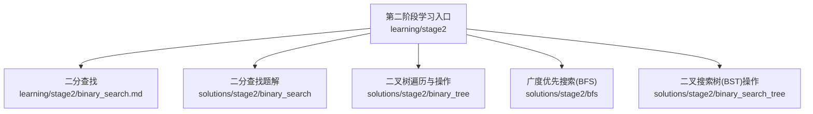
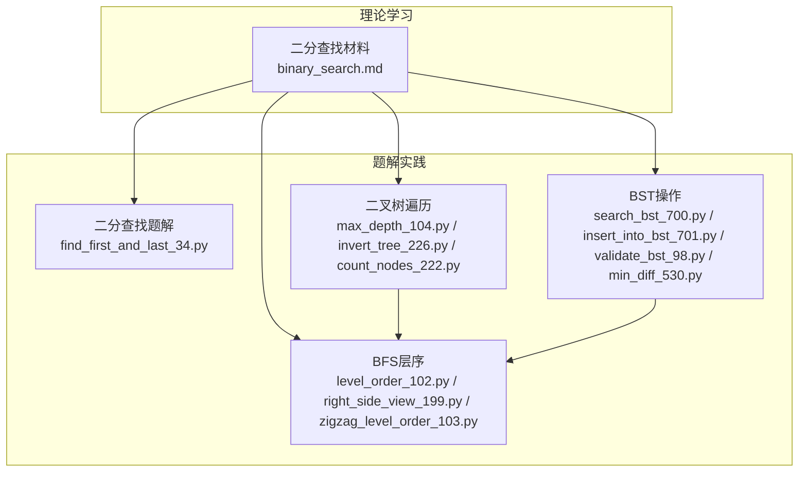
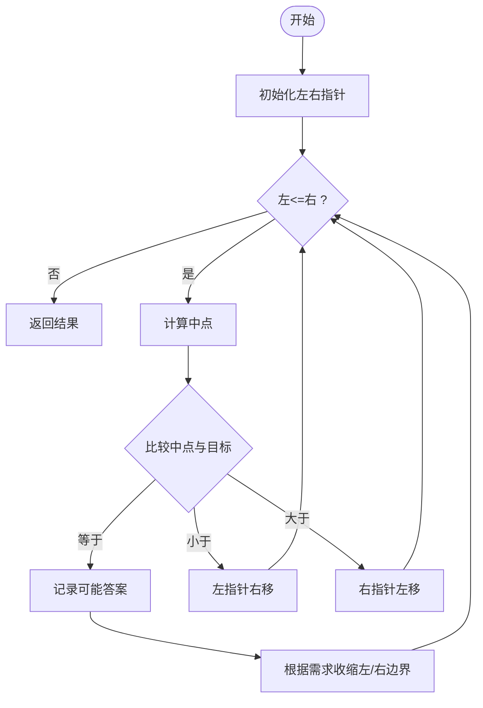
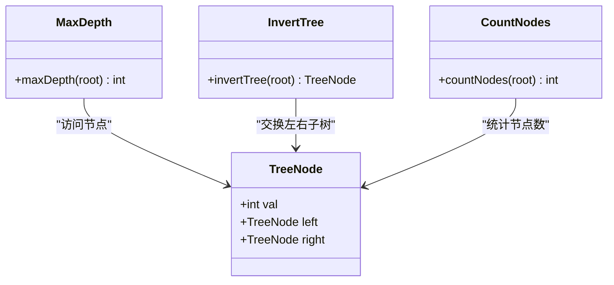
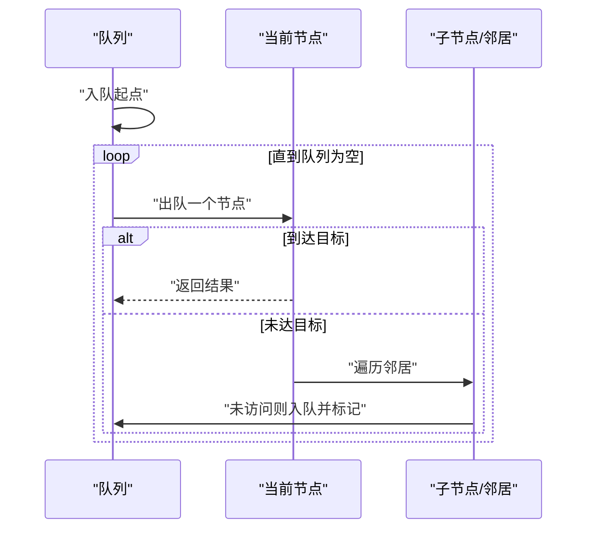
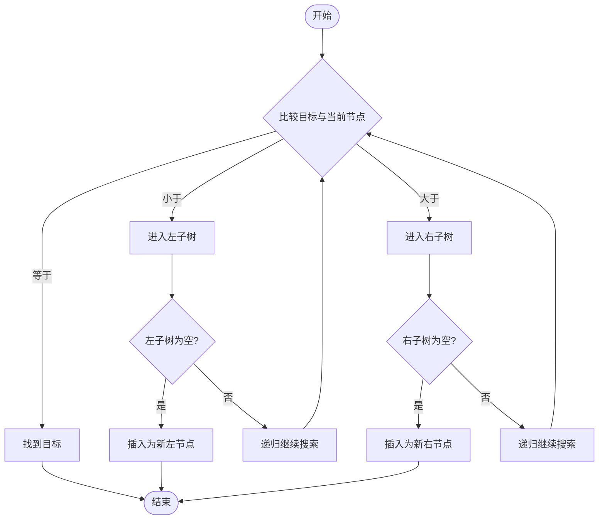
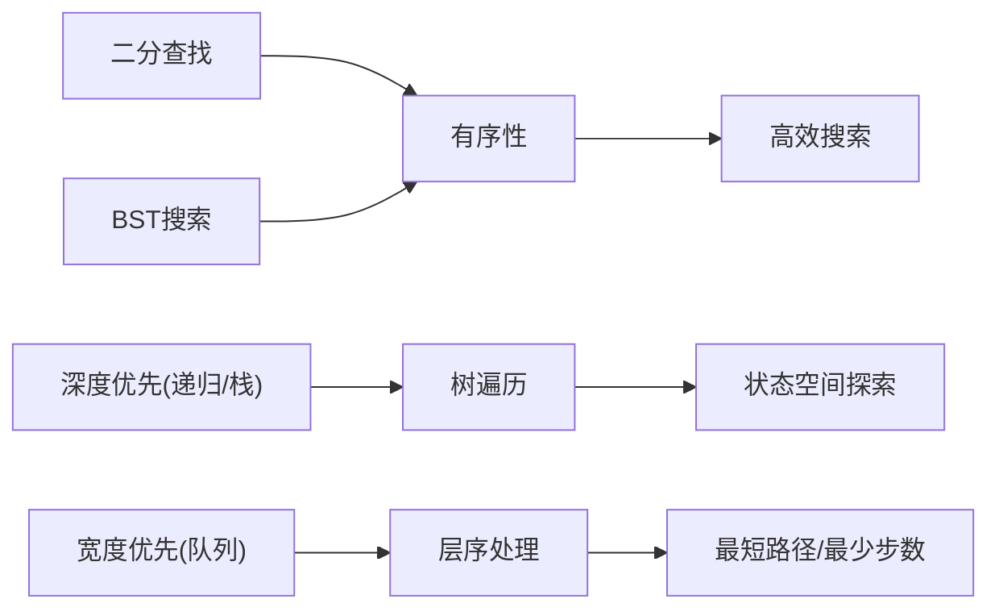
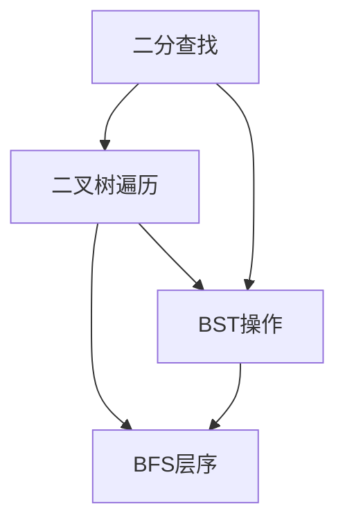

# 第二阶段：搜索算法学习指南

<cite>
**本文档引用的文件**   
- [learning/stage2/binary_search.md](file://learning/stage2/binary_search.md)
- [solutions/stage2/binary_search/find_first_and_last_34.py](file://solutions/stage2/binary_search/find_first_and_last_34.py)
- [solutions/stage2/binary_tree/max_depth_104.py](file://solutions/stage2/binary_tree/max_depth_104.py)
- [solutions/stage2/binary_tree/invert_tree_226.py](file://solutions/stage2/binary_tree/invert_tree_226.py)
- [solutions/stage2/binary_tree/count_nodes_222.py](file://solutions/stage2/binary_tree/count_nodes_222.py)
- [solutions/stage2/bfs/level_order_102.py](file://solutions/stage2/bfs/level_order_102.py)
- [solutions/stage2/bfs/right_side_view_199.py](file://solutions/stage2/bfs/right_side_view_199.py)
- [solutions/stage2/bfs/zigzag_level_order_103.py](file://solutions/stage2/bfs/zigzag_level_order_103.py)
- [solutions/stage2/binary_search_tree/search_bst_700.py](file://solutions/stage2/binary_search_tree/search_bst_700.py)
- [solutions/stage2/binary_search_tree/insert_into_bst_701.py](file://solutions/stage2/binary_search_tree/insert_into_bst_701.py)
- [solutions/stage2/binary_search_tree/validate_bst_98.py](file://solutions/stage2/binary_search_tree/validate_bst_98.py)
- [solutions/stage2/binary_search_tree/min_diff_530.py](file://solutions/stage2/binary_search_tree/min_diff_530.py)
</cite>

## 目录
1. [引言](#引言)
2. [项目结构](#项目结构)
3. [核心组件](#核心组件)
4. [架构总览](#架构总览)
5. [详细组件分析](#详细组件分析)
6. [依赖关系分析](#依赖关系分析)
7. [性能考量](#性能考量)
8. [故障排查指南](#故障排查指南)
9. [结论](#结论)
10. [附录](#附录)

## 引言
本指南聚焦第二阶段搜索算法学习，围绕二分查找、二叉树遍历、广度优先搜索（BFS）与二叉搜索树（BST）操作展开。内容涵盖适用条件、时间复杂度分析与实现要点，提供从简单到复杂的渐进式学习路径，帮助建立递归思维与状态空间搜索理解，并通过典型例题解析与代码实现指导，说明各算法之间的关系与转换方法，最后给出练习策略与性能优化技巧。

## 项目结构
本仓库按阶段组织学习内容与实践题解。第二阶段包含以下关键目录与文件：
- learning/stage2：二分查找的学习材料
- solutions/stage2/binary_search：二分查找题解
- solutions/stage2/binary_tree：二叉树遍历与基本操作题解
- solutions/stage2/bfs：BFS层序遍历相关题解
- solutions/stage2/binary_search_tree：BST搜索、插入、验证与最小差值等题解

**图表来源** 
- [learning/stage2/binary_search.md](file://learning/stage2/binary_search.md)
- [solutions/stage2/binary_search/find_first_and_last_34.py](file://solutions/stage2/binary_search/find_first_and_last_34.py)
- [solutions/stage2/binary_tree/max_depth_104.py](file://solutions/stage2/binary_tree/max_depth_104.py)
- [solutions/stage2/bfs/level_order_102.py](file://solutions/stage2/bfs/level_order_102.py)
- [solutions/stage2/binary_search_tree/search_bst_700.py](file://solutions/stage2/binary_search_tree/search_bst_700.py)

**章节来源**
- [learning/stage2/binary_search.md](file://learning/stage2/binary_search.md)

## 核心组件
- 二分查找：在有序序列中快速定位目标或边界，关键在于区间定义、循环不变量与边界收敛。
- 二叉树遍历：前序、中序、后序与层序遍历是基础，递归与迭代两种范式需掌握。
- 广度优先搜索（BFS）：以队列为核心进行层次扩展，适用于最短路径、层序处理等问题。
- 二叉搜索树（BST）：利用左小右大的性质进行搜索、插入、删除与范围查询，常结合中序遍历得到有序序列。

**章节来源**
- [learning/stage2/binary_search.md](file://learning/stage2/binary_search.md)
- [solutions/stage2/binary_search/find_first_and_last_34.py](file://solutions/stage2/binary_search/find_first_and_last_34.py)
- [solutions/stage2/binary_tree/max_depth_104.py](file://solutions/stage2/binary_tree/max_depth_104.py)
- [solutions/stage2/bfs/level_order_102.py](file://solutions/stage2/bfs/level_order_102.py)
- [solutions/stage2/binary_search_tree/search_bst_700.py](file://solutions/stage2/binary_search_tree/search_bst_700.py)

## 架构总览
下图展示第二阶段各模块之间的学习与解题关系，体现“理论材料 → 题解实践”的闭环。

**图表来源** 
- [learning/stage2/binary_search.md](file://learning/stage2/binary_search.md)
- [solutions/stage2/binary_search/find_first_and_last_34.py](file://solutions/stage2/binary_search/find_first_and_last_34.py)
- [solutions/stage2/binary_tree/max_depth_104.py](file://solutions/stage2/binary_tree/max_depth_104.py)
- [solutions/stage2/binary_tree/invert_tree_226.py](file://solutions/stage2/binary_tree/invert_tree_226.py)
- [solutions/stage2/binary_tree/count_nodes_222.py](file://solutions/stage2/binary_tree/count_nodes_222.py)
- [solutions/stage2/bfs/level_order_102.py](file://solutions/stage2/bfs/level_order_102.py)
- [solutions/stage2/bfs/right_side_view_199.py](file://solutions/stage2/bfs/right_side_view_199.py)
- [solutions/stage2/bfs/zigzag_level_order_103.py](file://solutions/stage2/bfs/zigzag_level_order_103.py)
- [solutions/stage2/binary_search_tree/search_bst_700.py](file://solutions/stage2/binary_search_tree/search_bst_700.py)
- [solutions/stage2/binary_search_tree/insert_into_bst_701.py](file://solutions/stage2/binary_search_tree/insert_into_bst_701.py)
- [solutions/stage2/binary_search_tree/validate_bst_98.py](file://solutions/stage2/binary_search_tree/validate_bst_98.py)
- [solutions/stage2/binary_search_tree/min_diff_530.py](file://solutions/stage2/binary_search_tree/min_diff_530.py)

## 详细组件分析

### 二分查找
- 适用条件：数据有序或可转化为单调性；需要高效定位目标或边界。
- 时间复杂度：O(log n)，空间复杂度：O(1)（迭代）或 O(log n)（递归）。
- 实现要点：
  - 明确区间定义（闭区间/半开区间），保持循环不变量。
  - 处理重复元素时，关注“左边界/右边界”模板。
  - 避免死循环：更新左右指针时需向收敛方向移动。
- 典型问题：查找第一个和最后一个位置。

**图表来源** 
- [solutions/stage2/binary_search/find_first_and_last_34.py](file://solutions/stage2/binary_search/find_first_and_last_34.py)

**章节来源**
- [learning/stage2/binary_search.md](file://learning/stage2/binary_search.md)
- [solutions/stage2/binary_search/find_first_and_last_34.py](file://solutions/stage2/binary_search/find_first_and_last_34.py)

### 二叉树遍历与基本操作
- 适用场景：树的深度、翻转、节点计数、路径收集等。
- 时间复杂度：O(n)，空间复杂度：O(h)（h为树高，递归栈或显式栈/队列）。
- 实现要点：
  - 递归三要素：终止条件、子问题分解、合并结果。
  - 迭代实现使用栈模拟前/后序，队列模拟层序。
  - 注意空节点与单分支节点的边界情况。

**图表来源** 
- [solutions/stage2/binary_tree/max_depth_104.py](file://solutions/stage2/binary_tree/max_depth_104.py)
- [solutions/stage2/binary_tree/invert_tree_226.py](file://solutions/stage2/binary_tree/invert_tree_226.py)
- [solutions/stage2/binary_tree/count_nodes_222.py](file://solutions/stage2/binary_tree/count_nodes_222.py)

**章节来源**
- [solutions/stage2/binary_tree/max_depth_104.py](file://solutions/stage2/binary_tree/max_depth_104.py)
- [solutions/stage2/binary_tree/invert_tree_226.py](file://solutions/stage2/binary_tree/invert_tree_226.py)
- [solutions/stage2/binary_tree/count_nodes_222.py](file://solutions/stage2/binary_tree/count_nodes_222.py)

### 广度优先搜索（BFS）
- 适用场景：无权图的最短路径、层序遍历、可达性、拓扑排序等。
- 时间复杂度：O(V+E)（V为顶点数，E为边数），空间复杂度：O(V)。
- 实现要点：
  - 使用队列维护待扩展节点，标记已访问避免重复。
  - 层序处理时，每层固定队列长度，便于分层输出或统计。
  - 遇到目标即返回，保证最短路径最优性。

**图表来源** 
- [solutions/stage2/bfs/level_order_102.py](file://solutions/stage2/bfs/level_order_102.py)
- [solutions/stage2/bfs/right_side_view_199.py](file://solutions/stage2/bfs/right_side_view_199.py)
- [solutions/stage2/bfs/zigzag_level_order_103.py](file://solutions/stage2/bfs/zigzag_level_order_103.py)

**章节来源**
- [solutions/stage2/bfs/level_order_102.py](file://solutions/stage2/bfs/level_order_102.py)
- [solutions/stage2/bfs/right_side_view_199.py](file://solutions/stage2/bfs/right_side_view_199.py)
- [solutions/stage2/bfs/zigzag_level_order_103.py](file://solutions/stage2/bfs/zigzag_level_order_103.py)

### 二叉搜索树（BST）操作
- 适用场景：有序数据的快速检索、插入、删除、范围查询、最近邻等。
- 时间复杂度：平均O(log n)，最坏O(n)（退化为链表）。
- 实现要点：
  - 搜索：依据大小关系决定向左或向右。
  - 插入：找到合适位置后链接新节点。
  - 验证：确保每个节点满足左小右大约束（可使用上下界或中序递增检查）。
  - 最小差值：中序遍历相邻节点差的最小值。

**图表来源** 
- [solutions/stage2/binary_search_tree/search_bst_700.py](file://solutions/stage2/binary_search_tree/search_bst_700.py)
- [solutions/stage2/binary_search_tree/insert_into_bst_701.py](file://solutions/stage2/binary_search_tree/insert_into_bst_701.py)
- [solutions/stage2/binary_search_tree/validate_bst_98.py](file://solutions/stage2/binary_search_tree/validate_bst_98.py)
- [solutions/stage2/binary_search_tree/min_diff_530.py](file://solutions/stage2/binary_search_tree/min_diff_530.py)

**章节来源**
- [solutions/stage2/binary_search_tree/search_bst_700.py](file://solutions/stage2/binary_search_tree/search_bst_700.py)
- [solutions/stage2/binary_search_tree/insert_into_bst_701.py](file://solutions/stage2/binary_search_tree/insert_into_bst_701.py)
- [solutions/stage2/binary_search_tree/validate_bst_98.py](file://solutions/stage2/binary_search_tree/validate_bst_98.py)
- [solutions/stage2/binary_search_tree/min_diff_530.py](file://solutions/stage2/binary_search_tree/min_diff_530.py)

### 概念总览
- 二分查找与BST搜索都依赖“有序性”，但前者作用于线性数组，后者作用于树结构。
- 二叉树遍历与BFS分别对应“深度优先”和“宽度优先”的状态空间探索方式。
- 递归与迭代可以相互转换：递归天然表达DFS，迭代借助栈/队列表达DFS/BFS。

[本图为概念性图示，不直接映射具体源码文件]

## 依赖关系分析
第二阶段各模块之间通过“有序性”“层次扩展”“递归/迭代”等思想相互关联，形成从线性到树再到图的递进学习路径。

**图表来源** 
- [learning/stage2/binary_search.md](file://learning/stage2/binary_search.md)
- [solutions/stage2/binary_search/find_first_and_last_34.py](file://solutions/stage2/binary_search/find_first_and_last_34.py)
- [solutions/stage2/binary_tree/max_depth_104.py](file://solutions/stage2/binary_tree/max_depth_104.py)
- [solutions/stage2/bfs/level_order_102.py](file://solutions/stage2/bfs/level_order_102.py)
- [solutions/stage2/binary_search_tree/search_bst_700.py](file://solutions/stage2/binary_search_tree/search_bst_700.py)

**章节来源**
- [learning/stage2/binary_search.md](file://learning/stage2/binary_search.md)
- [solutions/stage2/binary_search/find_first_and_last_34.py](file://solutions/stage2/binary_search/find_first_and_last_34.py)
- [solutions/stage2/binary_tree/max_depth_104.py](file://solutions/stage2/binary_tree/max_depth_104.py)
- [solutions/stage2/bfs/level_order_102.py](file://solutions/stage2/bfs/level_order_102.py)
- [solutions/stage2/binary_search_tree/search_bst_700.py](file://solutions/stage2/binary_search_tree/search_bst_700.py)

## 性能考量
- 二分查找：
  - 选择正确的区间模板，避免越界与死循环。
  - 对重复元素问题，采用“左边界/右边界”模板减少分支判断。
- 二叉树遍历：
  - 递归简洁但可能栈溢出，极端情况下考虑迭代改写。
  - 利用尾递归思想或显式栈控制内存占用。
- BFS：
  - 使用集合或布尔数组标记已访问，防止重复入队。
  - 分层处理时固定队列长度，避免额外数据结构开销。
- BST：
  - 退化时退化为链表，必要时进行平衡化（如AVL/红黑树）。
  - 范围查询可利用中序遍历的有序性，提前剪枝。

[本节为通用性能建议，不直接分析具体文件]

## 故障排查指南
- 二分查找常见问题：
  - 边界更新错误导致死循环或遗漏答案。
  - 重复元素处理不当，无法正确收敛到目标边界。
- 二叉树遍历常见问题：
  - 忘记处理空节点导致空指针异常。
  - 递归合并逻辑错误，结果不正确。
- BFS常见问题：
  - 未标记已访问导致无限循环或超时。
  - 分层输出时队列长度更新时机错误。
- BST常见问题：
  - 验证BST时仅比较父子节点，忽略祖先约束。
  - 插入/删除时指针链接错误导致树结构破坏。

**章节来源**
- [solutions/stage2/binary_search/find_first_and_last_34.py](file://solutions/stage2/binary_search/find_first_and_last_34.py)
- [solutions/stage2/binary_tree/max_depth_104.py](file://solutions/stage2/binary_tree/max_depth_104.py)
- [solutions/stage2/bfs/level_order_102.py](file://solutions/stage2/bfs/level_order_102.py)
- [solutions/stage2/binary_search_tree/validate_bst_98.py](file://solutions/stage2/binary_search_tree/validate_bst_98.py)

## 结论
第二阶段围绕“有序性”与“层次扩展”两大主线，构建从线性到树再到图的状态空间搜索体系。通过二分查找、二叉树遍历、BFS与BST操作的系统学习，学员可掌握递归思维与迭代实现，理解不同搜索策略的适用场景与性能特征，并在实践中逐步提升问题解决能力。

[本节为总结性内容，不直接分析具体文件]

## 附录
- 渐进式学习路径建议：
  - 入门：二分查找基础模板与边界处理
  - 进阶：二叉树前/中/后序与层序遍历
  - 应用：BFS最短路径与层序变体
  - 综合：BST搜索、插入、验证与范围查询
- 练习策略：
  - 先手写伪代码，再编码实现
  - 针对边界用例设计测试集
  - 对比递归与迭代实现，评估空间复杂度
- 性能优化技巧：
  - 合理选择数据结构（数组、栈、队列、集合）
  - 利用单调性与有序性进行剪枝
  - 避免重复计算与冗余状态

[本节为通用建议，不直接分析具体文件]