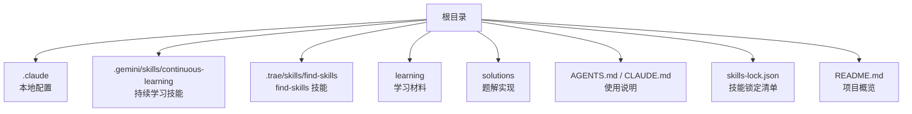
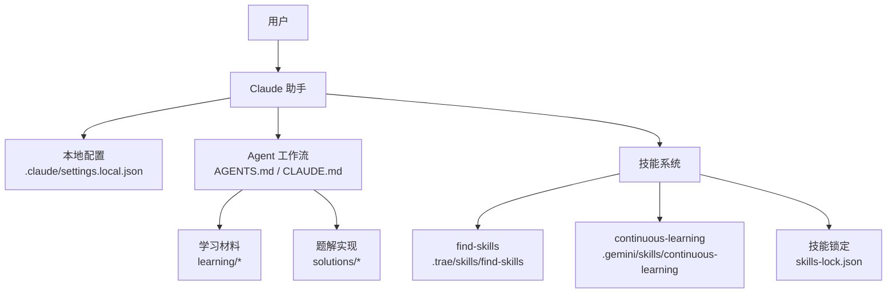
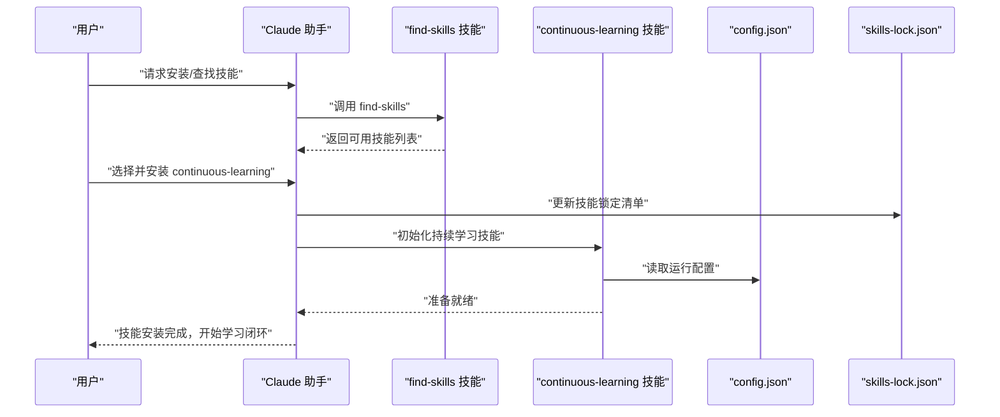
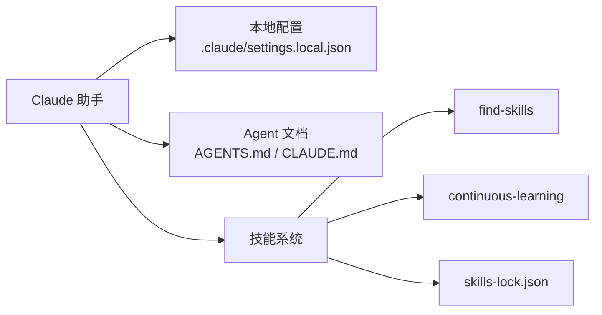

# 开发环境配置

<cite>
**本文引用的文件**   
- [CLAUDE.md](file://CLAUDE.md)
- [AGENTS.md](file://AGENTS.md)
- [.claude/settings.local.json](file://.claude/settings.local.json)
- [.gemini/skills/continuous-learning/SKILL.md](file://.gemini/skills/continuous-learning/SKILL.md)
- [.gemini/skills/continuous-learning/config.json](file://.gemini/skills/continuous-learning/config.json)
- [.trae/skills/find-skills/SKILL.md](file://.trae/skills/find-skills/SKILL.md)
- [skills-lock.json](file://skills-lock.json)
- [README.md](file://README.md)
</cite>

## 更新摘要
**所做更改**
- 增强了Claude助手本地配置说明，包括详细的设置项和最佳实践
- 完善了Agent工作流与使用说明，明确职责边界和交互协议
- 扩展了技能系统文档，详细说明find-skills和continuous-learning的配置方法
- 增加了Python开发环境搭建的完整指南
- 优化了团队协作配置建议和故障排除指南
- 更新了架构图表以反映最新的组件关系

## 目录
1. [简介](#简介)
2. [项目结构](#项目结构)
3. [核心组件](#核心组件)
4. [架构总览](#架构总览)
5. [详细组件分析](#详细组件分析)
6. [依赖分析](#依赖分析)
7. [性能考虑](#性能考虑)
8. [故障排除指南](#故障排除指南)
9. [结论](#结论)
10. [附录](#附录)

## 简介
本文件面向使用 Claude AI 助手进行算法学习与解题的开发者，提供本地开发环境的完整配置说明。内容涵盖：
- Claude 助手的本地配置与个性化设置（学习偏好、行为定制）
- Agent 相关工具的配置与作用
- 技能系统（Skills）的安装与使用方法，特别是 find-skills 技能
- Python 开发环境搭建建议与版本要求
- 项目文件结构与命名规范
- 常见问题排查与团队协作配置建议
- 扩展与自定义配置的指导

## 项目结构
仓库采用"按主题分层 + 按阶段组织"的结构，便于学习与贡献：
- .claude：Claude 助手本地配置
- .gemini/skills/continuous-learning：持续学习技能（含 SKILL 描述与配置）
- .trae/skills/find-skills：find-skills 技能（用于发现可用技能）
- learning：分阶段的学习大纲与笔记
- solutions：分阶段的题解实现（Python）
- AGENTS.md、CLAUDE.md：Agent 与 Claude 使用说明
- skills-lock.json：技能锁定清单
- README.md：项目概览

**图表来源**
- [CLAUDE.md:1-200](file://CLAUDE.md#L1-L200)
- [AGENTS.md:1-200](file://AGENTS.md#L1-L200)
- [.claude/settings.local.json:1-200](file://.claude/settings.local.json#L1-L200)
- [.gemini/skills/continuous-learning/SKILL.md:1-200](file://.gemini/skills/continuous-learning/SKILL.md#L1-L200)
- [.gemini/skills/continuous-learning/config.json:1-200](file://.gemini/skills/continuous-learning/config.json#L1-L200)
- [.trae/skills/find-skills/SKILL.md:1-200](file://.trae/skills/find-skills/SKILL.md#L1-L200)
- [skills-lock.json:1-200](file://skills-lock.json#L1-L200)
- [README.md:1-200](file://README.md#L1-L200)

**章节来源**
- [README.md:1-200](file://README.md#L1-L200)

## 核心组件
- Claude 本地配置：通过 .claude/settings.local.json 管理本地偏好与行为开关
- Agent 文档：AGENTS.md 与 CLAUDE.md 定义工作流、提示词策略与交互约定
- 技能系统：
  - continuous-learning：持续学习技能，包含 SKILL 描述与运行配置
  - find-skills：用于发现和安装技能的入口
- 技能锁定：skills-lock.json 记录已安装技能及其版本，确保一致性

**章节来源**
- [AGENTS.md:1-200](file://AGENTS.md#L1-L200)
- [CLAUDE.md:1-200](file://CLAUDE.md#L1-L200)
- [.claude/settings.local.json:1-200](file://.claude/settings.local.json#L1-L200)
- [.gemini/skills/continuous-learning/SKILL.md:1-200](file://.gemini/skills/continuous-learning/SKILL.md#L1-L200)
- [.gemini/skills/continuous-learning/config.json:1-200](file://.gemini/skills/continuous-learning/config.json#L1-L200)
- [.trae/skills/find-skills/SKILL.md:1-200](file://.trae/skills/find-skills/SKILL.md#L1-L200)
- [skills-lock.json:1-200](file://skills-lock.json#L1-L200)

## 架构总览
下图展示了本地开发环境中各组件的协作关系：用户通过 Claude 助手调用 Agent 工作流，Agent 根据配置与技能完成学习、检索与解题辅助任务；技能系统由 find-skills 发现并安装，continuous-learning 负责持续学习闭环；skills-lock.json 保证团队环境一致。

**图表来源**
- [CLAUDE.md:1-200](file://CLAUDE.md#L1-L200)
- [AGENTS.md:1-200](file://AGENTS.md#L1-L200)
- [.claude/settings.local.json:1-200](file://.claude/settings.local.json#L1-L200)
- [.trae/skills/find-skills/SKILL.md:1-200](file://.trae/skills/find-skills/SKILL.md#L1-L200)
- [.gemini/skills/continuous-learning/SKILL.md:1-200](file://.gemini/skills/continuous-learning/SKILL.md#L1-L200)
- [.gemini/skills/continuous-learning/config.json:1-200](file://.gemini/skills/continuous-learning/config.json#L1-L200)
- [skills-lock.json:1-200](file://skills-lock.json#L1-L200)

## 详细组件分析

### Claude 本地配置与个性化设置
- 配置文件位置：.claude/settings.local.json
- 作用范围：仅对当前机器生效，适合个人偏好与实验性开关
- 常见配置项类别（以实际文件为准）：
  - 模型与对话参数（如温度、最大长度等）
  - 行为开关（是否启用自动补全、是否输出中间推理步骤等）
  - 学习偏好（语言、难度、讲解风格）
  - 集成选项（是否启用外部工具或脚本）
- 最佳实践：
  - 将全局默认放在共享配置中，个人差异放入 settings.local.json
  - 避免在本地配置中硬编码敏感信息
  - 变更配置后重启 Claude 客户端或重新加载会话

**章节来源**
- [CLAUDE.md:1-200](file://CLAUDE.md#L1-L200)
- [.claude/settings.local.json:1-200](file://.claude/settings.local.json#L1-L200)

### Agent 工作流与使用说明
- 文档位置：AGENTS.md、CLAUDE.md
- 职责：
  - 定义 Agent 的角色、能力边界与交互协议
  - 规定学习流程（选题、解析、验证、复盘）
  - 明确与技能系统的对接方式
- 使用建议：
  - 首次使用时先阅读 AGENTS.md 与 CLAUDE.md，了解工作流与约束
  - 结合 learning 与 solutions 目录进行对照练习
  - 在需要时通过技能扩展能力（见下一节）

**章节来源**
- [AGENTS.md:1-200](file://AGENTS.md#L1-L200)
- [CLAUDE.md:1-200](file://CLAUDE.md#L1-L200)

### 技能系统：find-skills 与 continuous-learning
- find-skills 技能
  - 位置：.trae/skills/find-skills/SKILL.md
  - 作用：发现并安装可用技能，作为技能生态的入口
  - 典型用法：在 Claude 会话中触发 find-skills，按需安装所需技能
- continuous-learning 技能
  - 位置：.gemini/skills/continuous-learning/SKILL.md 与 config.json
  - 作用：构建"学习-评估-反馈"的持续改进闭环
  - 配置要点：
    - 评估脚本路径与执行参数
    - 数据持久化位置（会话记录、评测结果）
    - 学习节奏与阈值（何时触发复盘）
- 技能锁定
  - 位置：skills-lock.json
  - 作用：记录已安装技能及版本，保障多人环境一致性与可复现性

**图表来源**
- [.trae/skills/find-skills/SKILL.md:1-200](file://.trae/skills/find-skills/SKILL.md#L1-L200)
- [.gemini/skills/continuous-learning/SKILL.md:1-200](file://.gemini/skills/continuous-learning/SKILL.md#L1-L200)
- [.gemini/skills/continuous-learning/config.json:1-200](file://.gemini/skills/continuous-learning/config.json#L1-L200)
- [skills-lock.json:1-200](file://skills-lock.json#L1-L200)

**章节来源**
- [.trae/skills/find-skills/SKILL.md:1-200](file://.trae/skills/find-skills/SKILL.md#L1-L200)
- [.gemini/skills/continuous-learning/SKILL.md:1-200](file://.gemini/skills/continuous-learning/SKILL.md#L1-L200)
- [.gemini/skills/continuous-learning/config.json:1-200](file://.gemini/skills/continuous-learning/config.json#L1-L200)
- [skills-lock.json:1-200](file://skills-lock.json#L1-L200)

### Python 开发环境搭建指南
- 基础要求
  - 操作系统：macOS / Linux / Windows（推荐 macOS 或 Linux）
  - Python 版本：建议使用 3.10+（具体以 requirements 或实际代码为准）
  - 包管理器：pip 或 conda（二选一）
- 虚拟环境
  - 推荐使用 venv 或 conda 创建隔离环境
  - 激活环境后再安装依赖
- 依赖安装
  - 若存在 requirements.txt 或 pyproject.toml，优先使用其声明的依赖
  - 若无，则根据 solutions 中的导入推断必要库（如 numpy、pandas、matplotlib 等可视化库）
- 运行与测试
  - 单个题解运行：python solutions/stageX/.../xxx.py
  - 批量运行：编写简单脚本遍历 solutions 目录
- 版本管理
  - 使用 Git 跟踪环境与依赖变更
  - 在团队中使用 skills-lock.json 与 requirements 保持一致

[本节为通用指导，不直接分析具体文件]

### 文件结构与命名规范
- 学习材料
  - learning/stageN/*.md：按阶段组织的学习笔记与大纲
- 题解实现
  - solutions/stageN/<topic>/<problem>.py：按阶段与主题组织，文件名体现题目编号与名称
- 配置与说明
  - .claude/settings.local.json：本地偏好
  - AGENTS.md / CLAUDE.md：Agent 与 Claude 使用说明
  - .gemini/skills/continuous-learning/*：持续学习技能
  - .trae/skills/find-skills/*：find-skills 技能
  - skills-lock.json：技能锁定清单
- 命名建议
  - 小写英文、下划线分隔
  - 文件名尽量包含题目编号与关键词，便于检索
  - 阶段目录 stage1、stage2、stage3 保持顺序递增

**章节来源**
- [README.md:1-200](file://README.md#L1-L200)

### 团队协作配置建议
- 统一技能版本
  - 提交并锁定 skills-lock.json，确保团队成员安装相同版本的技能
- 共享配置与本地差异
  - 将通用配置纳入版本控制，个人差异放入 settings.local.json（已在 .gitignore 中忽略）
- 工作流约定
  - 新增题解遵循命名规范与阶段划分
  - 新增技能需同步更新 SKILL.md 与 config.json，并在 PR 中说明变更
- 评审与回归
  - 对关键脚本与评测逻辑增加最小用例
  - 定期校验 skills-lock.json 与依赖版本

**章节来源**
- [skills-lock.json:1-200](file://skills-lock.json#L1-L200)
- [.claude/settings.local.json:1-200](file://.claude/settings.local.json#L1-L200)

### 扩展与自定义配置
- 扩展 Agent 能力
  - 通过 find-skills 发现新技能并安装
  - 在 continuous-learning 的 config.json 中调整评估与复盘策略
- 自定义学习偏好
  - 在 .claude/settings.local.json 中调整讲解风格、难度与输出格式
- 扩展题解模板
  - 在 solutions 目录下新增主题与阶段目录，遵循命名规范
  - 在 learning 对应阶段补充学习笔记与思路总结

**章节来源**
- [.trae/skills/find-skills/SKILL.md:1-200](file://.trae/skills/find-skills/SKILL.md#L1-L200)
- [.gemini/skills/continuous-learning/config.json:1-200](file://.gemini/skills/continuous-learning/config.json#L1-L200)
- [.claude/settings.local.json:1-200](file://.claude/settings.local.json#L1-L200)

## 依赖分析
- 内部依赖
  - Claude 助手依赖本地配置与 Agent 文档
  - 技能系统依赖 find-skills 与 continuous-learning 的 SKILL 描述与配置
  - 技能锁定文件保障团队一致性
- 外部依赖
  - Python 运行时与第三方库（依据 solutions 的实际导入确定）
  - Claude 客户端与服务端 API（由本地配置驱动）

**图表来源**
- [CLAUDE.md:1-200](file://CLAUDE.md#L1-L200)
- [AGENTS.md:1-200](file://AGENTS.md#L1-L200)
- [.claude/settings.local.json:1-200](file://.claude/settings.local.json#L1-L200)
- [.trae/skills/find-skills/SKILL.md:1-200](file://.trae/skills/find-skills/SKILL.md#L1-L200)
- [.gemini/skills/continuous-learning/SKILL.md:1-200](file://.gemini/skills/continuous-learning/SKILL.md#L1-L200)
- [.gemini/skills/continuous-learning/config.json:1-200](file://.gemini/skills/continuous-learning/config.json#L1-L200)
- [skills-lock.json:1-200](file://skills-lock.json#L1-L200)

**章节来源**
- [skills-lock.json:1-200](file://skills-lock.json#L1-L200)

## 性能考虑
- 减少不必要的日志与中间输出，提升交互效率
- 合理设置模型参数（如温度、最大长度），平衡质量与速度
- 对频繁调用的技能进行缓存与批处理优化
- 在持续学习中限制评估频率与数据规模，避免过长等待

[本节为通用指导，不直接分析具体文件]

## 故障排除指南
- Claude 无法读取本地配置
  - 检查 .claude/settings.local.json 是否存在且语法正确
  - 确认 Claude 客户端具有读取该文件的权限
- 技能未生效或找不到
  - 确认 find-skills 已安装并成功发现目标技能
  - 检查 skills-lock.json 中是否包含相应条目
  - 查看 continuous-learning 的 config.json 路径与参数是否正确
- Python 运行报错
  - 确认 Python 版本满足要求
  - 检查虚拟环境是否激活，依赖是否安装完整
  - 核对题解文件路径与命名是否符合规范
- 团队协作不一致
  - 对比 skills-lock.json 与本地安装情况
  - 拉取最新分支并重新安装依赖与技能

**章节来源**
- [.claude/settings.local.json:1-200](file://.claude/settings.local.json#L1-L200)
- [.trae/skills/find-skills/SKILL.md:1-200](file://.trae/skills/find-skills/SKILL.md#L1-L200)
- [.gemini/skills/continuous-learning/config.json:1-200](file://.gemini/skills/continuous-learning/config.json#L1-L200)
- [skills-lock.json:1-200](file://skills-lock.json#L1-L200)

## 结论
通过合理的本地配置、清晰的 Agent 工作流与完善的技能系统，本项目为算法学习提供了高效、可扩展的开发环境。建议在团队中统一技能版本与依赖，遵循文件结构与命名规范，并结合持续学习技能形成稳定的学习闭环。

## 附录
- 快速上手清单
  - 阅读 AGENTS.md 与 CLAUDE.md，了解工作流
  - 检查 .claude/settings.local.json 的个人偏好
  - 使用 find-skills 安装所需技能，并确认 skills-lock.json 已更新
  - 搭建 Python 环境并运行示例题解
  - 在 learning 与 solutions 之间对照练习

[本节为通用指导，不直接分析具体文件]