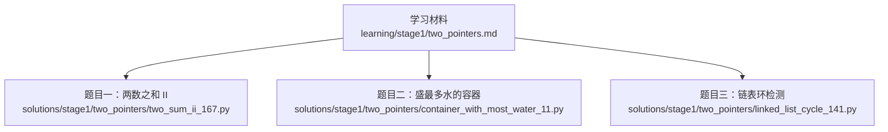
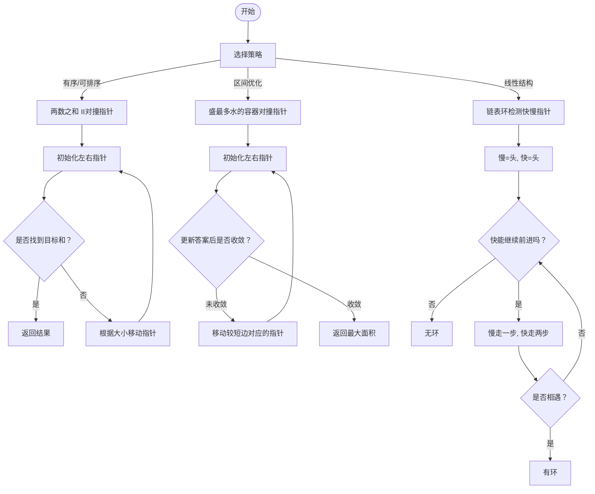
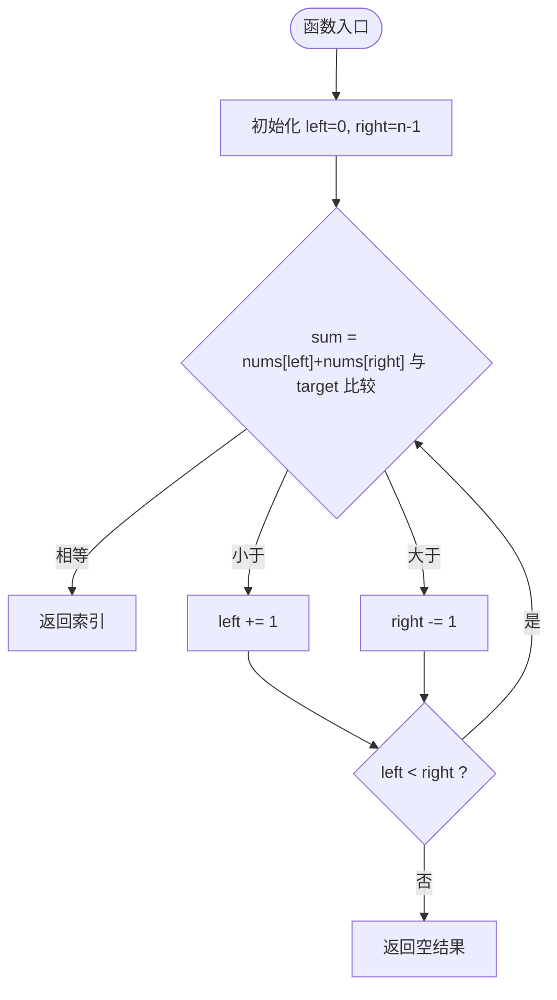
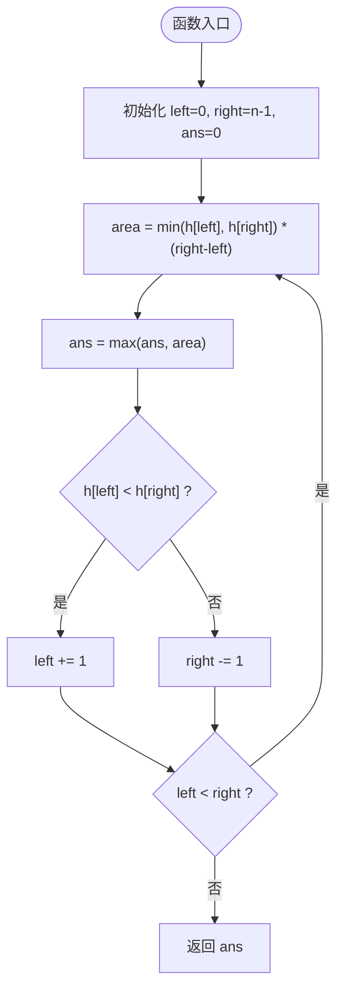
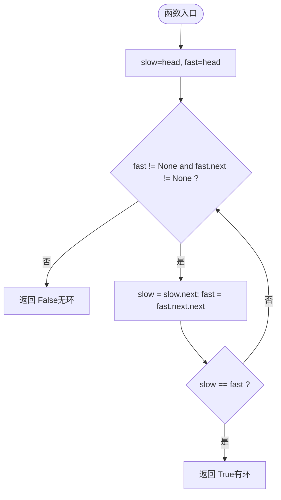
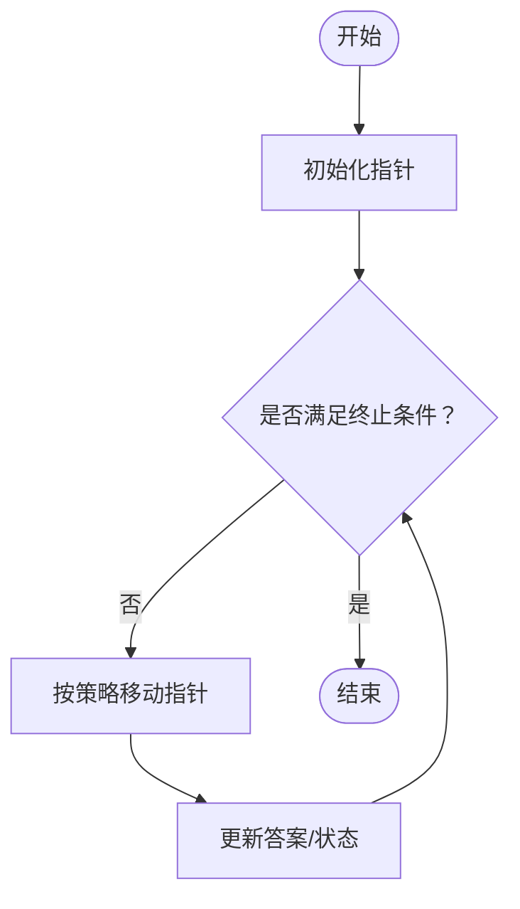
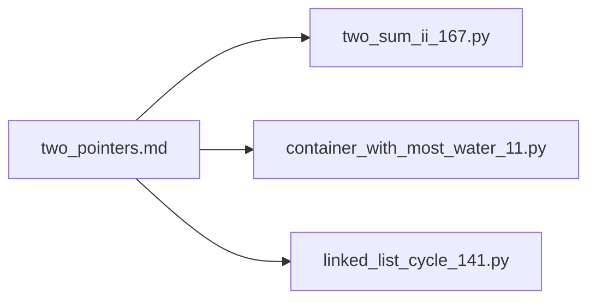

# 双指针技巧

<cite>
**本文引用的文件**   
- [two_pointers.md](file://learning/stage1/two_pointers.md)
- [container_with_most_water_11.py](file://solutions/stage1/two_pointers/container_with_most_water_11.py)
- [linked_list_cycle_141.py](file://solutions/stage1/two_pointers/linked_list_cycle_141.py)
- [two_sum_ii_167.py](file://solutions/stage1/two_pointers/two_sum_ii_167.py)
</cite>

## 目录
1. [简介](#简介)
2. [项目结构](#项目结构)
3. [核心组件](#核心组件)
4. [架构总览](#架构总览)
5. [详细组件分析](#详细组件分析)
6. [依赖分析](#依赖分析)
7. [性能考虑](#性能考虑)
8. [故障排查指南](#故障排查指南)
9. [结论](#结论)
10. [附录](#附录)

## 简介
本学习文档围绕“双指针”这一经典算法技巧展开，系统讲解其核心思想、适用场景与实现模式。内容覆盖：
- 对撞指针（左右指针向中间靠拢）
- 快慢指针（不同步速的指针用于检测环或寻找中点等）
- 典型题目：两数之和 II（有序数组）、盛最多水的容器、链表环检测
- 复杂度分析与暴力解法对比
- 常见错误与调试技巧

目标是通过循序渐进的学习路径，帮助读者掌握双指针的使用模式，并能在实际题目中灵活应用。

## 项目结构
仓库中与双指针相关的材料主要分布在以下位置：
- 学习材料：learning/stage1/two_pointers.md
- 代码实现：solutions/stage1/two_pointers/ 下的三题 Python 实现

图表来源
- [two_pointers.md](file://learning/stage1/two_pointers.md)
- [two_sum_ii_167.py](file://solutions/stage1/two_pointers/two_sum_ii_167.py)
- [container_with_most_water_11.py](file://solutions/stage1/two_pointers/container_with_most_water_11.py)
- [linked_list_cycle_141.py](file://solutions/stage1/two_pointers/linked_list_cycle_141.py)

章节来源
- [two_pointers.md](file://learning/stage1/two_pointers.md)
- [two_sum_ii_167.py](file://solutions/stage1/two_pointers/two_sum_ii_167.py)
- [container_with_most_water_11.py](file://solutions/stage1/two_pointers/container_with_most_water_11.py)
- [linked_list_cycle_141.py](file://solutions/stage1/two_pointers/linked_list_cycle_141.py)

## 核心组件
本节从概念层面梳理双指针的两大常用策略及其适用条件：
- 对撞指针
  - 适用条件：输入通常有序或可排序；需要查找满足某种单调性质的组合（如和为定值、面积最大等）。
  - 移动规则：根据当前状态决定左指针右移或右指针左移，逐步缩小搜索空间。
  - 终止条件：左右指针相遇或越界。
- 快慢指针
  - 适用条件：线性结构（数组、链表）上存在“循环”或“相对速度差”的场景（如环检测、找中点、去重等）。
  - 移动规则：慢指针每次走一步，快指针每次走两步；若存在环，二者必相遇。
  - 终止条件：快指针到达末尾或快慢指针相遇。

章节来源
- [two_pointers.md](file://learning/stage1/two_pointers.md)

## 架构总览
下图展示了双指针在三种典型问题中的整体流程关系：

图表来源
- [two_sum_ii_167.py](file://solutions/stage1/two_pointers/two_sum_ii_167.py)
- [container_with_most_water_11.py](file://solutions/stage1/two_pointers/container_with_most_water_11.py)
- [linked_list_cycle_141.py](file://solutions/stage1/two_pointers/linked_list_cycle_141.py)

## 详细组件分析

### 两数之和 II（对撞指针）
- 问题特征：给定有序数组和目标值，寻找两个数使其和为目标值。
- 策略要点：
  - 初始化左指针指向首元素，右指针指向尾元素。
  - 计算当前和并与目标比较：
    - 等于目标：直接返回结果。
    - 小于目标：左指针右移以增大和。
    - 大于目标：右指针左移以减小和。
  - 终止条件：左右指针相遇仍未找到则无解。
- 复杂度：
  - 时间复杂度：O(n)，每个元素最多被访问一次。
  - 空间复杂度：O(1)，仅使用常数级额外空间。
- 与暴力解法对比：
  - 暴力枚举所有二元组为 O(n^2)，对撞指针将二次扫描降为线性扫描。

图表来源
- [two_sum_ii_167.py](file://solutions/stage1/two_pointers/two_sum_ii_167.py)

章节来源
- [two_sum_ii_167.py](file://solutions/stage1/two_pointers/two_sum_ii_167.py)

### 盛最多水的容器（对撞指针）
- 问题特征：给定非负整数数组表示垂线高度，求两条线与 x 轴构成的最大容器面积。
- 策略要点：
  - 初始化左右指针分别指向两端。
  - 计算当前面积并更新最大值。
  - 移动较短边对应的指针（因为面积受限于短边，移动长边不可能得到更大面积）。
  - 终止条件：左右指针相遇。
- 复杂度：
  - 时间复杂度：O(n)。
  - 空间复杂度：O(1)。
- 与暴力解法对比：
  - 暴力枚举所有线段对为 O(n^2)；对撞指针通过贪心剪枝将复杂度降至 O(n)。

图表来源
- [container_with_most_water_11.py](file://solutions/stage1/two_pointers/container_with_most_water_11.py)

章节来源
- [container_with_most_water_11.py](file://solutions/stage1/two_pointers/container_with_most_water_11.py)

### 链表环检测（快慢指针）
- 问题特征：判断单链表中是否存在环。
- 策略要点：
  - 初始化慢指针 slow=head，快指针 fast=head。
  - 每轮迭代：slow 前进一步，fast 前进两步。
  - 若 fast 或 fast.next 为空，说明无环；若 slow == fast，说明有环。
- 复杂度：
  - 时间复杂度：O(n)。
  - 空间复杂度：O(1)。
- 与暴力解法对比：
  - 哈希表记录已访问节点需 O(n) 空间；快慢指针无需额外空间。

图表来源
- [linked_list_cycle_141.py](file://solutions/stage1/two_pointers/linked_list_cycle_141.py)

章节来源
- [linked_list_cycle_141.py](file://solutions/stage1/two_pointers/linked_list_cycle_141.py)

### 概念性总览
下图给出一个不绑定具体源码的双指针通用工作流，便于理解思路迁移：

[此图为概念流程图，不映射到具体源文件，故不提供图表来源]

## 依赖分析
- 模块内聚性
  - 三个题目各自独立，逻辑清晰，职责单一，符合“一题一文件”的高内聚设计。
- 外部依赖
  - 均为纯 Python 实现，未引入第三方库，耦合度低，易于移植与测试。
- 潜在循环依赖
  - 各文件之间无相互引用，不存在循环依赖风险。

图表来源
- [two_pointers.md](file://learning/stage1/two_pointers.md)
- [two_sum_ii_167.py](file://solutions/stage1/two_pointers/two_sum_ii_167.py)
- [container_with_most_water_11.py](file://solutions/stage1/two_pointers/container_with_most_water_11.py)
- [linked_list_cycle_141.py](file://solutions/stage1/two_pointers/linked_list_cycle_141.py)

章节来源
- [two_pointers.md](file://learning/stage1/two_pointers.md)
- [two_sum_ii_167.py](file://solutions/stage1/two_pointers/two_sum_ii_167.py)
- [container_with_most_water_11.py](file://solutions/stage1/two_pointers/container_with_most_water_11.py)
- [linked_list_cycle_141.py](file://solutions/stage1/two_pointers/linked_list_cycle_141.py)

## 性能考虑
- 时间复杂度
  - 对撞指针：O(n)，相比暴力 O(n^2) 显著优化。
  - 快慢指针：O(n)，相比哈希法 O(n) 但空间更优。
- 空间复杂度
  - 对撞指针与快慢指针均 O(1)，适合大规模数据与内存受限场景。
- 边界与稳定性
  - 注意空输入、单元素、全相同元素等边界情况。
  - 对撞指针的移动方向必须保证不会遗漏最优解（例如“盛水容器”只移动短边）。

[本节提供一般性指导，不直接分析具体文件，故不提供章节来源]

## 故障排查指南
- 对撞指针常见问题
  - 指针移动方向错误导致错过答案（如两数之和中比较逻辑写反）。
  - 终止条件不当导致死循环或越界（应确保 left < right 或 left <= right 的正确语义）。
  - 重复元素处理不当（必要时需跳过重复项以避免重复解）。
- 快慢指针常见问题
  - 快指针判空不完整（需同时检查 fast 与 fast.next）。
  - 初始位置设置错误（通常都从 head 开始）。
  - 误判环的存在（务必在移动后再判断是否相遇）。
- 调试技巧
  - 打印关键变量（指针位置、当前和/面积、快慢指针是否相遇）。
  - 构造最小反例验证边界（空、单元素、全部相等、严格递增/递减）。
  - 用单元测试覆盖典型用例与极端用例。

章节来源
- [two_sum_ii_167.py](file://solutions/stage1/two_pointers/two_sum_ii_167.py)
- [container_with_most_water_11.py](file://solutions/stage1/two_pointers/container_with_most_water_11.py)
- [linked_list_cycle_141.py](file://solutions/stage1/two_pointers/linked_list_cycle_141.py)

## 结论
双指针是一种高效且优雅的算法范式。通过对撞指针与快慢指针两种策略，可以在大量问题上将复杂度从平方级降至线性级，并在空间上保持常数开销。掌握其适用条件、移动规则与终止条件，是提升解题效率的关键。建议结合本题集反复练习，形成稳定的思维模板。

[本节为总结性内容，不直接分析具体文件，故不提供章节来源]

## 附录
- 学习建议
  - 先理解题意与约束，再选择合适策略（有序选对撞，线性结构选快慢）。
  - 明确不变量与单调性，确保指针移动不会遗漏最优解。
  - 编写单元测试，覆盖边界与异常路径。
- 扩展阅读
  - 滑动窗口、二分查找等技巧可与双指针结合使用，进一步提升解题能力。

[本节为扩展性内容，不直接分析具体文件，故不提供章节来源]