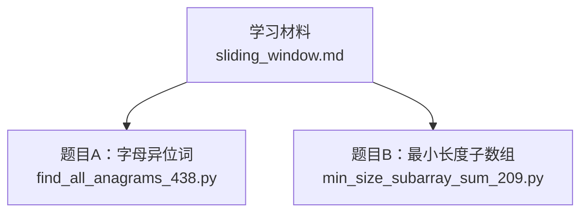
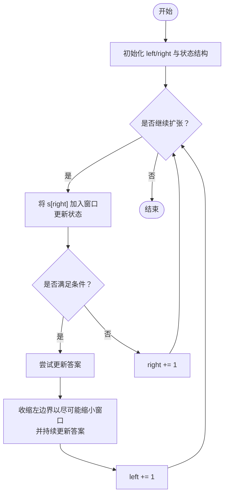
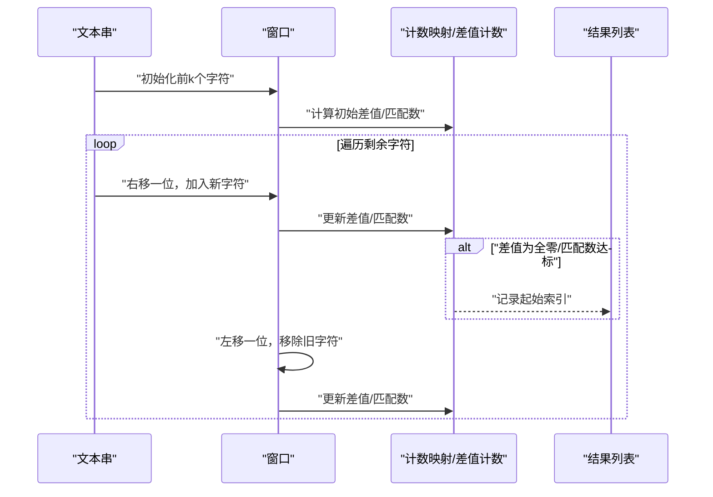
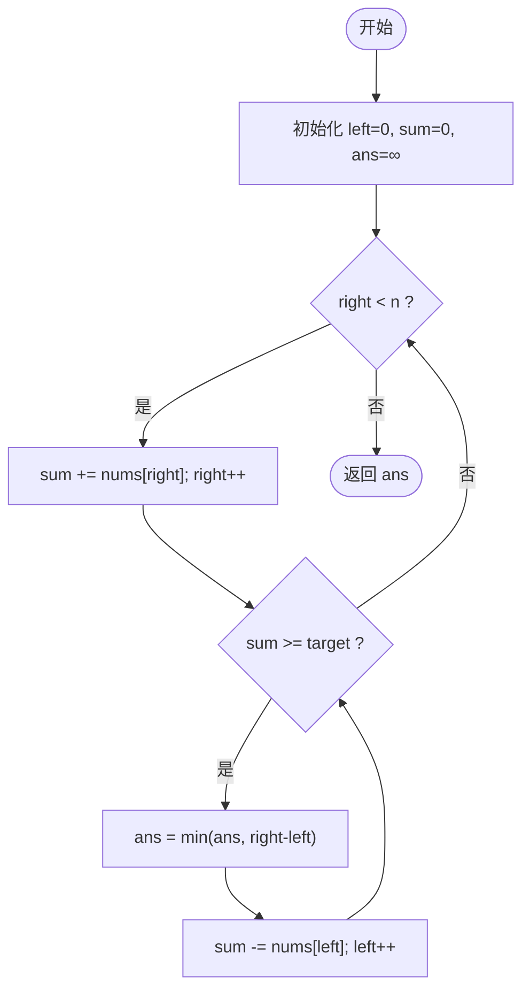
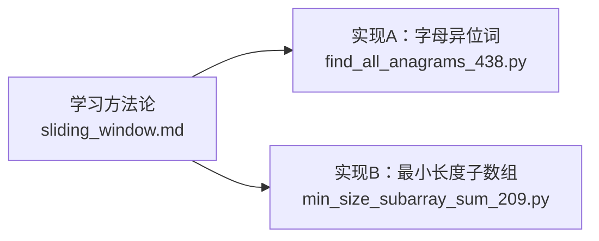

# 滑动窗口算法

<cite>
**本文引用的文件**   
- [learning/stage1/sliding_window.md](file://learning/stage1/sliding_window.md)
- [solutions/stage1/sliding_window/find_all_anagrams_438.py](file://solutions/stage1/sliding_window/find_all_anagrams_438.py)
- [solutions/stage1/sliding_window/min_size_subarray_sum_209.py](file://solutions/stage1/sliding_window/min_size_subarray_sum_209.py)
</cite>

## 目录
1. [简介](#简介)
2. [项目结构](#项目结构)
3. [核心组件](#核心组件)
4. [架构总览](#架构总览)
5. [详细组件分析](#详细组件分析)
6. [依赖分析](#依赖分析)
7. [性能考虑](#性能考虑)
8. [故障排查指南](#故障排查指南)
9. [结论](#结论)
10. [附录](#附录)

## 简介
本章节面向初学者与进阶者，系统讲解“滑动窗口”这一经典双指针技巧。内容涵盖：
- 滑动窗口的核心思想与适用场景
- 固定窗口与可变窗口的区别与选择策略
- 两道典型题的完整思路与实现要点：
  - 寻找字符串中所有字母异位词（字符统计方法）
  - 最小长度子数组（双指针优化策略）
- 时间/空间复杂度分析与暴力解法对比
- 通用模板与解题套路，帮助快速识别与应用

## 项目结构
仓库中与滑动窗口相关的学习材料与代码位于 stage1 阶段：
- 学习材料：learning/stage1/sliding_window.md
- 题目实现：
  - solutions/stage1/sliding_window/find_all_anagrams_438.py
  - solutions/stage1/sliding_window/min_size_subarray_sum_209.py

图表来源
- [learning/stage1/sliding_window.md](file://learning/stage1/sliding_window.md)
- [solutions/stage1/sliding_window/find_all_anagrams_438.py](file://solutions/stage1/sliding_window/find_all_anagrams_438.py)
- [solutions/stage1/sliding_window/min_size_subarray_sum_209.py](file://solutions/stage1/sliding_window/min_size_subarray_sum_209.py)

章节来源
- [learning/stage1/sliding_window.md](file://learning/stage1/sliding_window.md)
- [solutions/stage1/sliding_window/find_all_anagrams_438.py](file://solutions/stage1/sliding_window/find_all_anagrams_438.py)
- [solutions/stage1/sliding_window/min_size_subarray_sum_209.py](file://solutions/stage1/sliding_window/min_size_subarray_sum_209.py)

## 核心组件
本节聚焦两类窗口问题及其关键组件：
- 固定窗口：窗口大小不变，常用于“等长子串/子数组”的统计或比较
- 可变窗口：窗口大小可伸缩，常用于“满足某条件的最短/最长区间”

通用组件包括：
- 左右指针（left, right）控制窗口边界
- 状态维护结构（如哈希表、计数器、累加和、计数变量等）
- 扩张与收缩条件判断
- 答案更新逻辑（记录最优解）

章节来源
- [learning/stage1/sliding_window.md](file://learning/stage1/sliding_window.md)

## 架构总览
下图展示了两道典型题目的整体流程与交互关系：输入数据经“窗口扩张/收缩”驱动的状态机处理，最终输出答案。

图表来源
- [solutions/stage1/sliding_window/find_all_anagrams_438.py](file://solutions/stage1/sliding_window/find_all_anagrams_438.py)
- [solutions/stage1/sliding_window/min_size_subarray_sum_209.py](file://solutions/stage1/sliding_window/min_size_subarray_sum_209.py)

## 详细组件分析

### 题目A：寻找字符串中所有字母异位词（固定窗口）
- 问题类型：固定窗口（窗口大小等于目标串长度）
- 核心思想：使用两个计数映射（或差值计数）维护“当前窗口”与“目标串”的字符频次差异；当差异为全零时，说明当前窗口是目标串的异位词
- 关键点：
  - 初始构建目标串频次表
  - 先填充前 k 个字符形成第一个窗口
  - 右指针每次移动一位，加入新字符；左指针随之移动一位，移除旧字符
  - 用 O(1) 的方式维护“匹配数”或“差值计数”，避免每次全量比较
- 复杂度：
  - 时间：O(n)，n 为文本串长度
  - 空间：O(k) 或 O(Σ)，Σ 为字符集大小（通常常数）

图表来源
- [solutions/stage1/sliding_window/find_all_anagrams_438.py](file://solutions/stage1/sliding_window/find_all_anagrams_438.py)

章节来源
- [solutions/stage1/sliding_window/find_all_anagrams_438.py](file://solutions/stage1/sliding_window/find_all_anagrams_438.py)

### 题目B：最小长度子数组（可变窗口）
- 问题类型：可变窗口（求满足条件的最短子数组）
- 核心思想：右指针不断扩张窗口，直到满足“区间和≥目标值”；随后尽量收缩左指针，同时维护最小长度
- 关键点：
  - 维护区间和（或相关状态）
  - 扩张条件：未越界且尚未满足条件
  - 收缩条件：已满足条件，尝试缩小窗口并更新答案
- 复杂度：
  - 时间：O(n)，每个元素最多被加入/移出一次
  - 空间：O(1)

图表来源
- [solutions/stage1/sliding_window/min_size_subarray_sum_209.py](file://solutions/stage1/sliding_window/min_size_subarray_sum_209.py)

章节来源
- [solutions/stage1/sliding_window/min_size_subarray_sum_209.py](file://solutions/stage1/sliding_window/min_size_subarray_sum_209.py)

### 通用模板与解题套路
- 固定窗口模板
  - 确定窗口大小 k
  - 预处理前 k 个元素，建立初始状态
  - 从第 k+1 个元素起，每次右移一位，加入新元素并移除最左元素，更新状态
  - 在状态满足要求时更新答案
- 可变窗口模板
  - 初始化 left=0，状态为空
  - 循环扩张 right，加入元素并更新状态
  - 当状态满足条件时，进入收缩阶段：
    - 更新答案
    - 尝试收缩 left，移除元素并更新状态，直到不再满足条件
  - 重复直至 right 到达末尾
- 常见状态维护方式
  - 哈希表/数组计数（字符频次、出现次数）
  - 差值计数（减少比较成本）
  - 单调队列/栈（用于滑动窗口最值）
  - 累加和/前缀和（用于区间和问题）
- 条件判断与答案更新
  - 明确“何时扩张”“何时收缩”
  - 保证收缩不会遗漏更优解（通常是在满足条件的前提下尽可能收缩）

章节来源
- [learning/stage1/sliding_window.md](file://learning/stage1/sliding_window.md)

## 依赖分析
- 模块内聚性
  - 学习材料提供方法论与模板，题目实现作为具体落地示例，二者耦合度低但互补性强
- 外部依赖
  - 仅依赖标准库数据结构（如字典/数组），无第三方依赖
- 潜在风险
  - 状态维护不当可能导致漏解或超时
  - 边界条件（空输入、不满足条件）需单独处理

图表来源
- [learning/stage1/sliding_window.md](file://learning/stage1/sliding_window.md)
- [solutions/stage1/sliding_window/find_all_anagrams_438.py](file://solutions/stage1/sliding_window/find_all_anagrams_438.py)
- [solutions/stage1/sliding_window/min_size_subarray_sum_209.py](file://solutions/stage1/sliding_window/min_size_subarray_sum_209.py)

章节来源
- [learning/stage1/sliding_window.md](file://learning/stage1/sliding_window.md)
- [solutions/stage1/sliding_window/find_all_anagrams_438.py](file://solutions/stage1/sliding_window/find_all_anagrams_438.py)
- [solutions/stage1/sliding_window/min_size_subarray_sum_209.py](file://solutions/stage1/sliding_window/min_size_subarray_sum_209.py)

## 性能考虑
- 时间复杂度
  - 固定窗口：O(n)，每个位置仅参与常数次操作
  - 可变窗口：O(n)，左右指针各至多移动 n 次
- 空间复杂度
  - 固定窗口：O(k) 或 O(Σ)
  - 可变窗口：O(1) 或 O(Σ)（取决于状态结构）
- 与暴力解法对比
  - 暴力枚举子串/子数组通常为 O(n^2) 或更高
  - 滑动窗口通过“增量更新状态”避免重复计算，显著降低复杂度
- 优化建议
  - 优先使用差值计数或“匹配数”变量，避免每次全量比较
  - 对字符集较大的情况，使用定长数组替代哈希表以提升常数性能
  - 注意提前剪枝与边界检查，减少无效迭代

[本节为通用指导，无需列出具体文件来源]

## 故障排查指南
- 常见问题
  - 忘记更新收缩后的状态，导致答案错误
  - 窗口边界处理不当（如 left 越界或 right 越界）
  - 初始窗口未正确构建（固定窗口）
  - 不满足条件时的分支缺失（可变窗口）
- 调试建议
  - 打印窗口边界与关键状态变量
  - 构造小样例逐步验证扩张/收缩路径
  - 针对边界用例（空串、全相同字符、无解）进行回归测试

章节来源
- [learning/stage1/sliding_window.md](file://learning/stage1/sliding_window.md)

## 结论
滑动窗口通过“窗口扩张—条件判断—窗口收缩”的范式，将许多区间类问题从 O(n^2) 降至 O(n)。掌握固定窗口与可变窗口的不同侧重点，配合合适的状态维护结构，即可高效解决大量字符串与数组区间问题。建议结合通用模板与本题两例反复练习，形成稳定的解题直觉。

[本节为总结性内容，无需列出具体文件来源]

## 附录
- 实战清单
  - 固定窗口：等长子串/子数组的统计与比较
  - 可变窗口：最短/最长满足条件的区间
- 扩展阅读
  - 单调队列在滑动窗口最值中的应用
  - 双指针与滑动窗口的组合用法

[本节为概念性补充，无需列出具体文件来源]