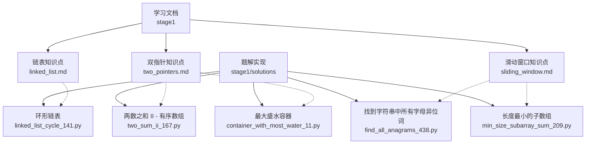
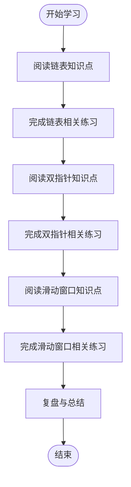
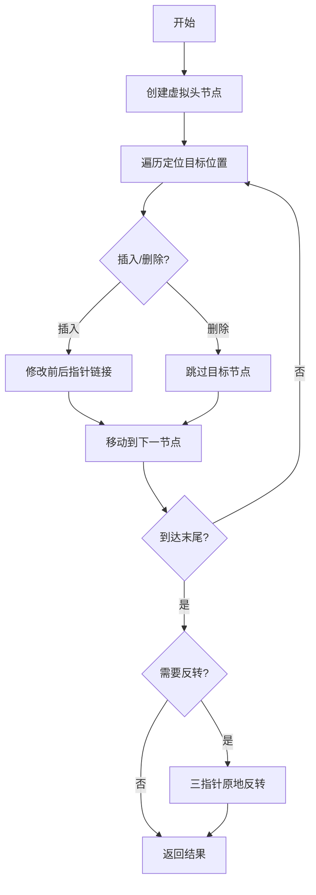
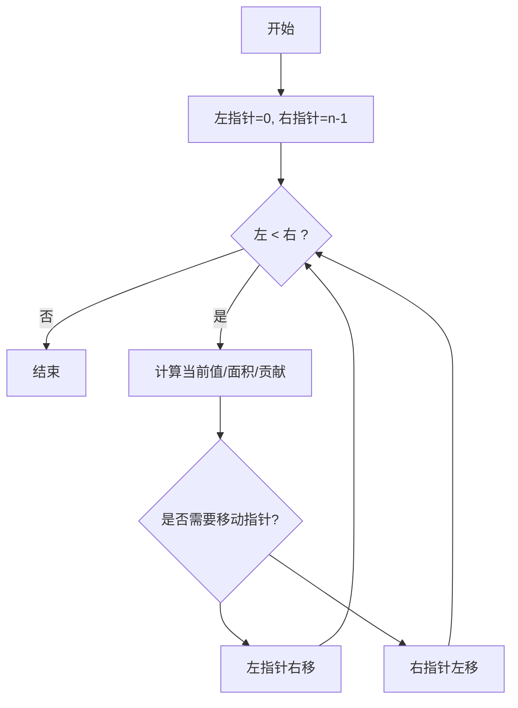
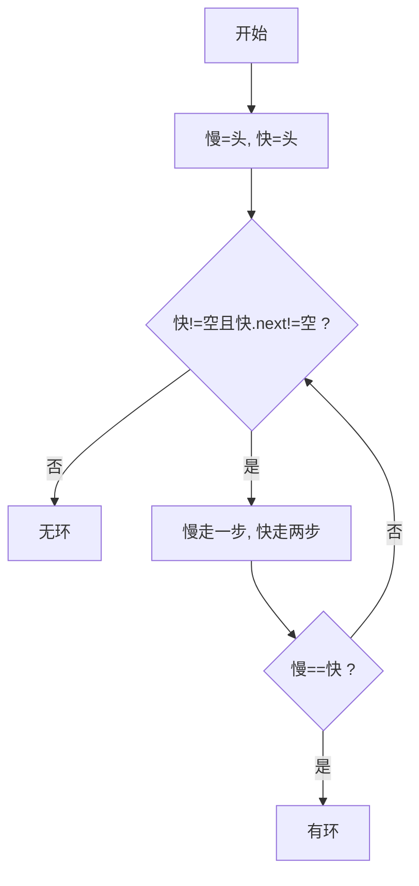
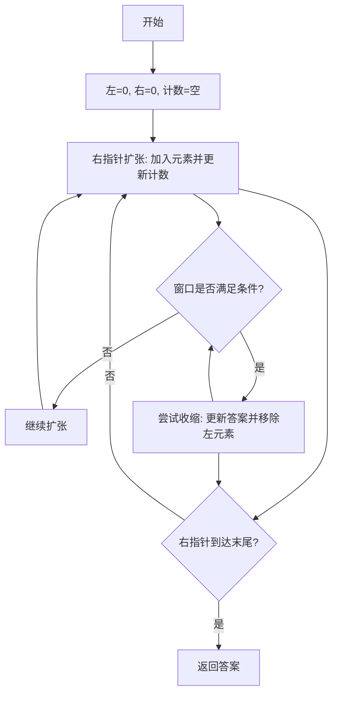
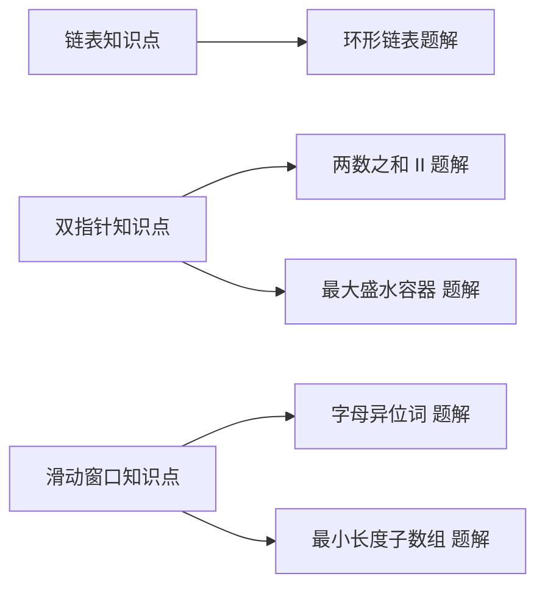

# 第一阶段：基础数据结构

<cite>
**本文引用的文件**   
- [learning/stage1/linked_list.md](file://learning/stage1/linked_list.md)
- [learning/stage1/two_pointers.md](file://learning/stage1/two_pointers.md)
- [learning/stage1/sliding_window.md](file://learning/stage1/sliding_window.md)
- [solutions/stage1/linked_list/](file://solutions/stage1/linked_list/)
- [solutions/stage1/two_pointers/container_with_most_water_11.py](file://solutions/stage1/two_pointers/container_with_most_water_11.py)
- [solutions/stage1/two_pointers/linked_list_cycle_141.py](file://solutions/stage1/two_pointers/linked_list_cycle_141.py)
- [solutions/stage1/two_pointers/two_sum_ii_167.py](file://solutions/stage1/two_pointers/two_sum_ii_167.py)
- [solutions/stage1/sliding_window/find_all_anagrams_438.py](file://solutions/stage1/sliding_window/find_all_anagrams_438.py)
- [solutions/stage1/sliding_window/min_size_subarray_sum_209.py](file://solutions/stage1/sliding_window/min_size_subarray_sum_209.py)
</cite>

## 目录
1. [引言](#引言)
2. [项目结构](#项目结构)
3. [核心组件](#核心组件)
4. [架构总览](#架构总览)
5. [详细组件分析](#详细组件分析)
6. [依赖分析](#依赖分析)
7. [性能考虑](#性能考虑)
8. [故障排查指南](#故障排查指南)
9. [结论](#结论)
10. [附录](#附录)

## 引言
本阶段聚焦“基础数据结构与常用算法技巧”，围绕链表、双指针与滑动窗口三大主题，系统讲解概念、模式与实战。目标包括：
- 掌握链表节点插入、删除、反转等核心操作模式
- 理解并熟练运用对撞指针与快慢指针策略
- 掌握滑动窗口的固定窗口与可变窗口范式
- 结合具体题目进行思路拆解、复杂度分析与编码练习
- 提供常见错误分析与调试技巧，帮助建立扎实的编程基础

## 项目结构
仓库按学习阶段组织，第一阶段包含知识点文档与对应题解：
- learning/stage1：链表、双指针、滑动窗口的知识文档
- solutions/stage1：对应题型的Python实现（两数之和II、环形链表、最大盛水容器、最小覆盖子串变体、长度最小的子数组）

图表来源
- [learning/stage1/linked_list.md](file://learning/stage1/linked_list.md)
- [learning/stage1/two_pointers.md](file://learning/stage1/two_pointers.md)
- [learning/stage1/sliding_window.md](file://learning/stage1/sliding_window.md)
- [solutions/stage1/two_pointers/two_sum_ii_167.py](file://solutions/stage1/two_pointers/two_sum_ii_167.py)
- [solutions/stage1/two_pointers/linked_list_cycle_141.py](file://solutions/stage1/two_pointers/linked_list_cycle_141.py)
- [solutions/stage1/two_pointers/container_with_most_water_11.py](file://solutions/stage1/two_pointers/container_with_most_water_11.py)
- [solutions/stage1/sliding_window/find_all_anagrams_438.py](file://solutions/stage1/sliding_window/find_all_anagrams_438.py)
- [solutions/stage1/sliding_window/min_size_subarray_sum_209.py](file://solutions/stage1/sliding_window/min_size_subarray_sum_209.py)

章节来源
- [learning/stage1/linked_list.md](file://learning/stage1/linked_list.md)
- [learning/stage1/two_pointers.md](file://learning/stage1/two_pointers.md)
- [learning/stage1/sliding_window.md](file://learning/stage1/sliding_window.md)
- [solutions/stage1/two_pointers/two_sum_ii_167.py](file://solutions/stage1/two_pointers/two_sum_ii_167.py)
- [solutions/stage1/two_pointers/linked_list_cycle_141.py](file://solutions/stage1/two_pointers/linked_list_cycle_141.py)
- [solutions/stage1/two_pointers/container_with_most_water_11.py](file://solutions/stage1/two_pointers/container_with_most_water_11.py)
- [solutions/stage1/sliding_window/find_all_anagrams_438.py](file://solutions/stage1/sliding_window/find_all_anagrams_438.py)
- [solutions/stage1/sliding_window/min_size_subarray_sum_209.py](file://solutions/stage1/sliding_window/min_size_subarray_sum_209.py)

## 核心组件
- 链表
  - 典型操作：头插/尾插、指定位置插入与删除、虚拟头节点、原地反转、合并有序链表、环检测与入口点
  - 关键技巧：虚拟头节点简化边界处理；快慢指针判环；三指针反转
- 双指针
  - 对撞指针：适用于有序数组的两数之和、接雨水类问题
  - 快慢指针：用于环检测、找中点、倒数第K个节点
- 滑动窗口
  - 固定窗口：统计长度为K的窗口内的信息（如均值、频次）
  - 可变窗口：根据条件收缩/扩张窗口（如最小覆盖子串、和大于等于目标的最短子数组）

章节来源
- [learning/stage1/linked_list.md](file://learning/stage1/linked_list.md)
- [learning/stage1/two_pointers.md](file://learning/stage1/two_pointers.md)
- [learning/stage1/sliding_window.md](file://learning/stage1/sliding_window.md)

## 架构总览
从“知识点文档”到“题解实现”的学习路径如下：
- 先阅读对应主题的知识点文档，理解模式与边界
- 再对照题解代码，观察模式落地细节（变量命名、循环不变式、状态更新顺序）
- 最后自行复现并扩展变种题

[此图为概念性流程图，不直接映射具体源码文件]

## 详细组件分析

### 链表专题
- 核心模式
  - 虚拟头节点：统一处理头部插入/删除
  - 原地反转：三指针迭代法，注意保存后继指针
  - 环检测：快慢指针相遇即存在环；进一步求入口点
  - 合并有序链表：递归或迭代归并
- 复杂度
  - 插入/删除：O(1)（已知前驱），查找前驱需遍历 O(n)
  - 反转：时间 O(n)，空间 O(1)
  - 环检测：时间 O(n)，空间 O(1)
- 易错点
  - 忘记更新后继指针导致断链
  - 未使用虚拟头节点导致空链表或单节点边界复杂
  - 反转时指针顺序错误造成环或丢失节点
- 练习建议
  - 在纸上画出指针变化过程，逐步验证循环不变式
  - 用样例驱动调试：空链表、单节点、全相等元素、含环

章节来源
- [learning/stage1/linked_list.md](file://learning/stage1/linked_list.md)

#### 链表操作模式图（概念示意）

[此图为概念性流程图，不直接映射具体源码文件]

### 双指针专题
- 对撞指针
  - 适用场景：有序数组的两数之和、回文判断、接雨水
  - 要点：左右指针向中间移动，依据当前值大小决定移动方向
- 快慢指针
  - 适用场景：环检测、找中点、倒数第K个节点
  - 要点：快指针每次走两步，慢指针每次走一步；相遇即有环
- 复杂度
  - 对撞指针：时间 O(n)，空间 O(1)
  - 快慢指针：时间 O(n)，空间 O(1)
- 易错点
  - 循环终止条件写错导致越界或死循环
  - 快慢指针步长不一致或未初始化正确
- 练习建议
  - 先用小样例手动模拟指针移动轨迹
  - 关注边界：空输入、单元素、全部相同元素

章节来源
- [learning/stage1/two_pointers.md](file://learning/stage1/two_pointers.md)

#### 对撞指针流程（概念示意）

[此图为概念性流程图，不直接映射具体源码文件]

#### 快慢指针判环流程（概念示意）

[此图为概念性流程图，不直接映射具体源码文件]

### 滑动窗口专题
- 固定窗口
  - 特点：窗口大小固定为K，整体向右平移
  - 应用：定长子数组的最大值/平均值、定长窗口内频次统计
- 可变窗口
  - 特点：窗口大小随条件动态伸缩
  - 应用：最小覆盖子串、和大于等于目标的最短子数组
- 复杂度
  - 通常时间 O(n)，空间取决于计数结构（哈希表/数组）
- 易错点
  - 窗口收缩条件与答案更新时机混淆
  - 计数结构更新顺序错误导致状态不一致
- 练习建议
  - 明确“加入一个元素”和“移除一个元素”的状态转移
  - 将“满足条件的判定”抽象成函数，便于复用

章节来源
- [learning/stage1/sliding_window.md](file://learning/stage1/sliding_window.md)

#### 可变窗口流程（概念示意）

[此图为概念性流程图，不直接映射具体源码文件]

## 依赖分析
- 知识点与题解的对应关系
  - 链表知识点 → 环形链表题解（快慢指针判环）
  - 双指针知识点 → 两数之和II（对撞指针）、最大盛水容器（对撞指针）
  - 滑动窗口知识点 → 找到所有字母异位词（固定/可变窗口频次统计）、长度最小的子数组（可变窗口）

图表来源
- [learning/stage1/linked_list.md](file://learning/stage1/linked_list.md)
- [learning/stage1/two_pointers.md](file://learning/stage1/two_pointers.md)
- [learning/stage1/sliding_window.md](file://learning/stage1/sliding_window.md)
- [solutions/stage1/two_pointers/linked_list_cycle_141.py](file://solutions/stage1/two_pointers/linked_list_cycle_141.py)
- [solutions/stage1/two_pointers/two_sum_ii_167.py](file://solutions/stage1/two_pointers/two_sum_ii_167.py)
- [solutions/stage1/two_pointers/container_with_most_water_11.py](file://solutions/stage1/two_pointers/container_with_most_water_11.py)
- [solutions/stage1/sliding_window/find_all_anagrams_438.py](file://solutions/stage1/sliding_window/find_all_anagrams_438.py)
- [solutions/stage1/sliding_window/min_size_subarray_sum_209.py](file://solutions/stage1/sliding_window/min_size_subarray_sum_209.py)

章节来源
- [learning/stage1/linked_list.md](file://learning/stage1/linked_list.md)
- [learning/stage1/two_pointers.md](file://learning/stage1/two_pointers.md)
- [learning/stage1/sliding_window.md](file://learning/stage1/sliding_window.md)
- [solutions/stage1/two_pointers/linked_list_cycle_141.py](file://solutions/stage1/two_pointers/linked_list_cycle_141.py)
- [solutions/stage1/two_pointers/two_sum_ii_167.py](file://solutions/stage1/two_pointers/two_sum_ii_167.py)
- [solutions/stage1/two_pointers/container_with_most_water_11.py](file://solutions/stage1/two_pointers/container_with_most_water_11.py)
- [solutions/stage1/sliding_window/find_all_anagrams_438.py](file://solutions/stage1/sliding_window/find_all_anagrams_438.py)
- [solutions/stage1/sliding_window/min_size_subarray_sum_209.py](file://solutions/stage1/sliding_window/min_size_subarray_sum_209.py)

## 性能考虑
- 时间复杂度
  - 链表操作多为线性扫描，尽量利用虚拟头节点减少分支
  - 双指针与滑动窗口通常为 O(n)，避免嵌套循环导致 O(n^2)
- 空间复杂度
  - 优先原地操作，必要时使用哈希表记录频次或索引
- 优化建议
  - 预处理：排序、去重、前缀和（视题型而定）
  - 提前剪枝：当不可能更优时立即退出
  - 缓存中间结果：避免重复计算

[本节为通用指导，不直接分析具体文件]

## 故障排查指南
- 链表
  - 现象：出现环或断链
  - 排查：打印每一步的前驱/后继指针；确认插入/删除后是否更新了必要链接
- 双指针
  - 现象：越界或死循环
  - 排查：检查循环终止条件；确保指针移动方向与题意一致
- 滑动窗口
  - 现象：答案偏大/偏小或不更新
  - 排查：核对“加入/移除”操作的顺序；确认“满足条件”的判断逻辑与答案更新时机

章节来源
- [learning/stage1/linked_list.md](file://learning/stage1/linked_list.md)
- [learning/stage1/two_pointers.md](file://learning/stage1/two_pointers.md)
- [learning/stage1/sliding_window.md](file://learning/stage1/sliding_window.md)

## 结论
通过本阶段学习，应能：
- 熟练使用虚拟头节点、三指针反转、快慢指针等链表技巧
- 在对撞指针与快慢指针之间做出正确选择，并写出稳健的循环不变式
- 掌握滑动窗口的固定/可变范式，准确维护窗口状态与答案
- 具备独立分析复杂度、设计测试用例与调试的能力

[本节为总结性内容，不直接分析具体文件]

## 附录
- 推荐练习清单（按主题）
  - 链表：插入/删除、反转、合并有序链表、环检测与入口点
  - 双指针：两数之和II、最大盛水容器、回文相关、倒数第K个节点
  - 滑动窗口：字母异位词分组/匹配、最小覆盖子串、最短无序子数组
- 调试技巧
  - 小样例驱动：构造空、单元素、重复元素、极端值
  - 可视化：在草稿上画指针/窗口变化轨迹
  - 断点与日志：输出关键状态（左右指针、窗口计数、答案）

[本节为补充说明，不直接分析具体文件]