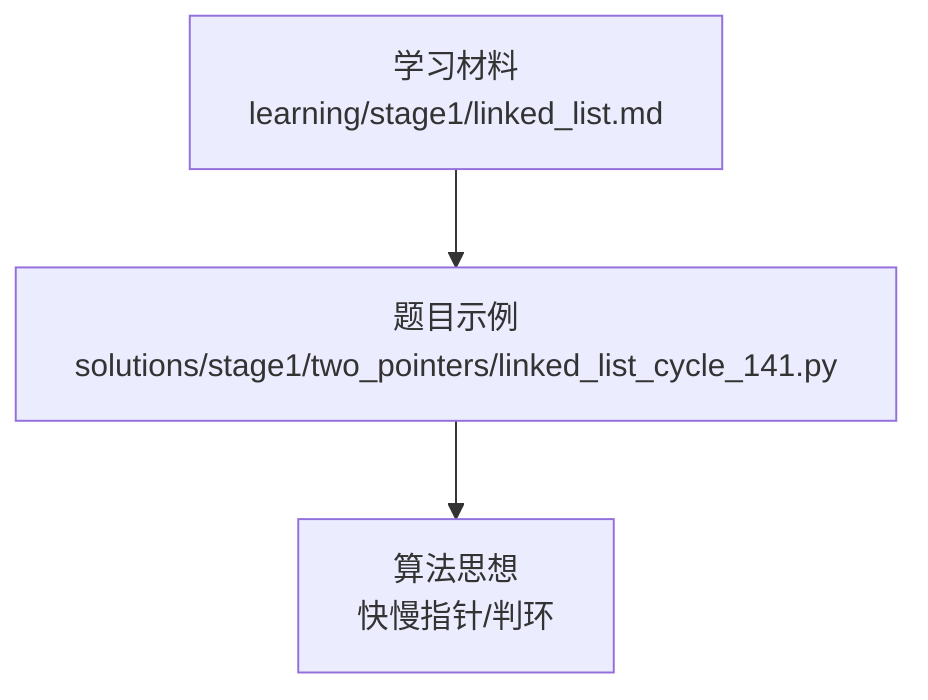
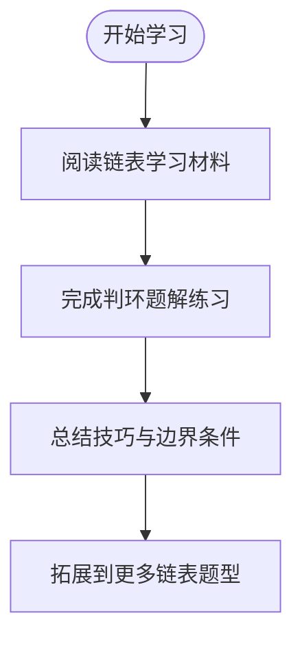
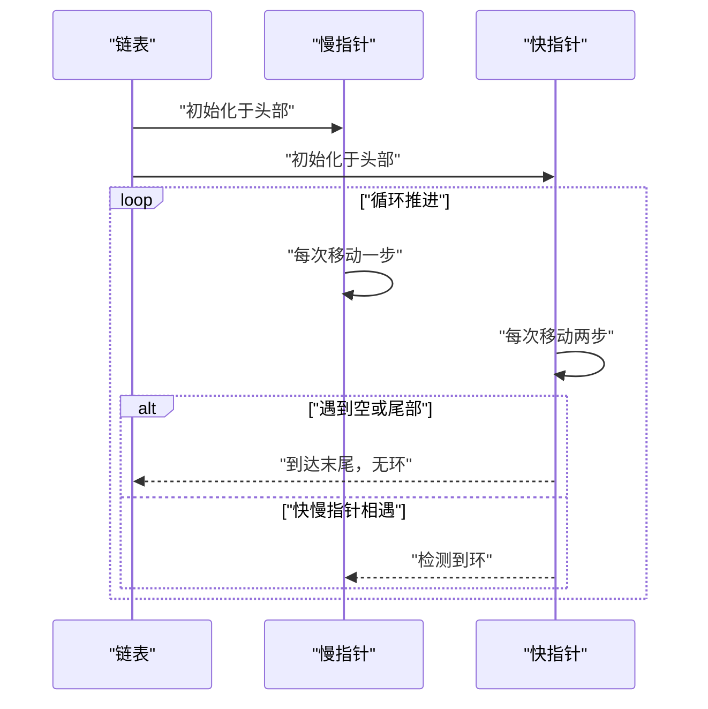
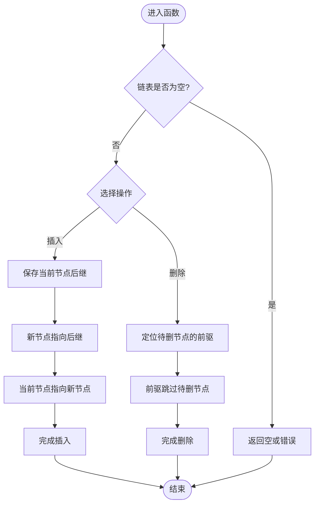
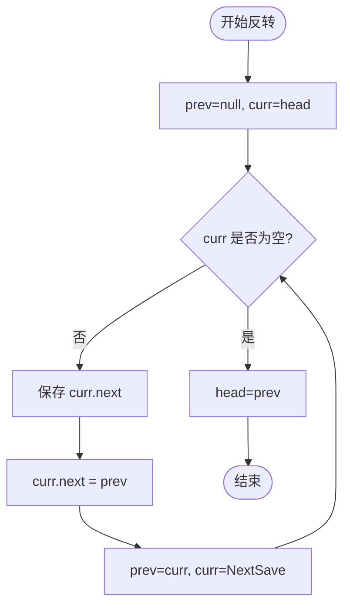
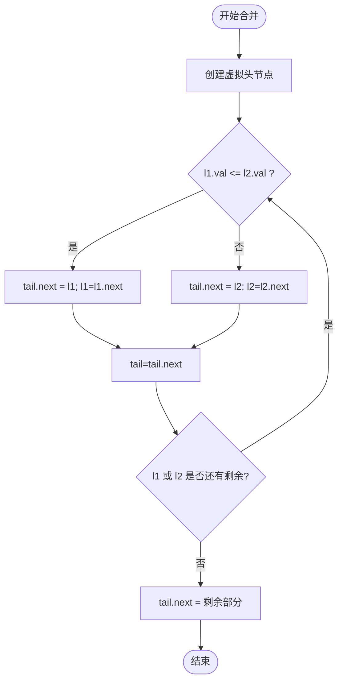

# 链表操作基础

<cite>
**本文引用的文件**   
- [learning/stage1/linked_list.md](file://learning/stage1/linked_list.md)
- [solutions/stage1/two_pointers/linked_list_cycle_141.py](file://solutions/stage1/two_pointers/linked_list_cycle_141.py)
</cite>

## 目录
1. [简介](#简介)
2. [项目结构](#项目结构)
3. [核心组件](#核心组件)
4. [架构总览](#架构总览)
5. [详细组件分析](#详细组件分析)
6. [依赖分析](#依赖分析)
7. [性能考虑](#性能考虑)
8. [故障排查指南](#故障排查指南)
9. [结论](#结论)
10. [附录](#附录)

## 简介
本学习文档围绕“链表操作”展开，目标是帮助读者建立扎实的链表基础与实战能力。内容涵盖：
- 链表的基本概念与数据结构特点（单链表、双链表）
- 常见操作模式：插入、删除、反转、合并等
- 时间复杂度与空间复杂度分析，以及与数组的对比
- Python 实现要点与边界条件处理
- 经典题型思路与技巧（以环检测为例）

## 项目结构
仓库中与链表学习相关的资料主要位于 learning 与 solutions 两个目录：
- learning/stage1/linked_list.md：链表学习的系统性材料
- solutions/stage1/two_pointers/linked_list_cycle_141.py：使用快慢指针判断链表是否有环的经典题解

图表来源
- [learning/stage1/linked_list.md](file://learning/stage1/linked_list.md)
- [solutions/stage1/two_pointers/linked_list_cycle_141.py](file://solutions/stage1/two_pointers/linked_list_cycle_141.py)

章节来源
- [learning/stage1/linked_list.md](file://learning/stage1/linked_list.md)
- [solutions/stage1/two_pointers/linked_list_cycle_141.py](file://solutions/stage1/two_pointers/linked_list_cycle_141.py)

## 核心组件
本节聚焦链表的核心知识点与典型操作模式，结合仓库中的学习材料与题解进行梳理。

- 基本概念
  - 节点由数据域与指针域组成；单链表仅含后继指针，双链表包含前驱与后继指针
  - 头指针用于定位链表起点；尾节点的后继为空
- 常见操作模式
  - 插入：在指定位置前/后插入新节点，注意更新前后指针关系
  - 删除：找到目标节点并调整其前后节点的指针，释放内存或置空引用
  - 反转：迭代或递归方式翻转指针方向，注意保存下一个节点
  - 合并：将两条有序链表合并为一条有序链表，保持相对顺序
- 复杂度与数组对比
  - 随机访问：链表 O(n)，数组 O(1)
  - 插入/删除：链表 O(1)（已知节点），数组平均 O(n)
  - 空间：链表额外存储指针，数组连续内存更紧凑
- Python 实现要点
  - 使用类定义节点，属性包括值与 next 指针
  - 常用技巧：虚拟头节点、快慢指针、双指针、哨兵节点
  - 边界条件：空链表、单节点、头尾节点、环的存在与否

章节来源
- [learning/stage1/linked_list.md](file://learning/stage1/linked_list.md)

## 架构总览
从学习路径看，仓库采用“理论材料 + 题解实践”的结构：
- 学习材料提供系统化的知识框架
- 题解通过具体题目巩固关键技巧（如快慢指针）

图表来源
- [learning/stage1/linked_list.md](file://learning/stage1/linked_list.md)
- [solutions/stage1/two_pointers/linked_list_cycle_141.py](file://solutions/stage1/two_pointers/linked_list_cycle_141.py)

## 详细组件分析

### 链表基本结构与操作模式
- 单链表
  - 节点结构：值 + 后继指针
  - 典型操作：遍历、查找、插入、删除、反转
- 双链表
  - 节点结构：值 + 前驱指针 + 后继指针
  - 优势：双向遍历、高效删除（已知节点）
- 操作模式要点
  - 虚拟头节点：简化对头部的插入/删除逻辑
  - 快慢指针：常用于寻找中点、检测环、回文判断
  - 双指针：常用于两数之和、合并链表等

章节来源
- [learning/stage1/linked_list.md](file://learning/stage1/linked_list.md)

### 判环问题（快慢指针）
该题解展示了如何使用快慢指针检测链表中是否存在环，是链表题中最经典的技巧之一。

图表来源
- [solutions/stage1/two_pointers/linked_list_cycle_141.py](file://solutions/stage1/two_pointers/linked_list_cycle_141.py)

章节来源
- [solutions/stage1/two_pointers/linked_list_cycle_141.py](file://solutions/stage1/two_pointers/linked_list_cycle_141.py)

### 插入与删除流程
以下流程图概括了“在已知节点后插入”和“删除已知节点”的关键步骤，适用于单链表场景。

[此图为通用流程示意，不直接映射到具体源码文件]

### 反转与合并流程
- 反转（迭代法）
  - 维护三个指针：prev、curr、next
  - 逐步将 curr 的 next 指向 prev，然后整体右移
- 合并（有序链表）
  - 使用虚拟头节点
  - 比较两链表当前节点值，较小者接入结果链表，对应指针前进

[此图为通用流程示意，不直接映射到具体源码文件]

[此图为通用流程示意，不直接映射到具体源码文件]

## 依赖分析
- 学习材料作为知识输入，指导题解实践
- 题解代码体现具体算法技巧（如快慢指针）
- 两者形成“学-练-总结”的闭环

图表来源
- [learning/stage1/linked_list.md](file://learning/stage1/linked_list.md)
- [solutions/stage1/two_pointers/linked_list_cycle_141.py](file://solutions/stage1/two_pointers/linked_list_cycle_141.py)

章节来源
- [learning/stage1/linked_list.md](file://learning/stage1/linked_list.md)
- [solutions/stage1/two_pointers/linked_list_cycle_141.py](file://solutions/stage1/two_pointers/linked_list_cycle_141.py)

## 性能考虑
- 时间复杂度
  - 遍历相关操作通常为 O(n)
  - 插入/删除在已知节点时为 O(1)，但查找目标节点可能为 O(n)
  - 判环使用快慢指针为 O(n)
- 空间复杂度
  - 原地操作一般为 O(1)
  - 递归实现可能引入 O(h) 栈空间（h 为链表高度）
- 与数组对比
  - 随机访问：数组 O(1)，链表 O(n)
  - 插入/删除：链表在已知位置 O(1)，数组平均 O(n)
  - 缓存友好性：数组优于链表

[本节为通用指导，不直接分析具体文件]

## 故障排查指南
- 常见问题
  - 忘记更新指针导致断链
  - 未处理空链表或单节点情况
  - 快慢指针初始位置或步长设置不当
  - 反转时未保存下一个节点导致丢失后续
- 调试建议
  - 打印中间状态或使用可视化辅助
  - 增加边界用例测试（空、单节点、环、尾部）
  - 逐步验证指针变化是否符合预期

章节来源
- [learning/stage1/linked_list.md](file://learning/stage1/linked_list.md)
- [solutions/stage1/two_pointers/linked_list_cycle_141.py](file://solutions/stage1/two_pointers/linked_list_cycle_141.py)

## 结论
通过系统学习链表基础知识并结合判环题解的实践，可以掌握链表的核心操作与常用技巧。建议在后续学习中继续扩展至更多经典题型（如反转、合并、回文、排序等），并通过大量练习巩固边界条件处理与复杂度分析能力。

[本节为总结性内容，不直接分析具体文件]

## 附录
- 推荐练习清单（基于仓库现有资源）
  - 判环：参考 linked_list_cycle_141.py
  - 其他链表题型可结合学习材料逐步拓展
- 学习路径建议
  - 先理解单链表与双链表差异
  - 再掌握插入、删除、反转、合并等基础操作
  - 最后通过快慢指针、双指针等技巧解决综合题

[本节为补充信息，不直接分析具体文件]