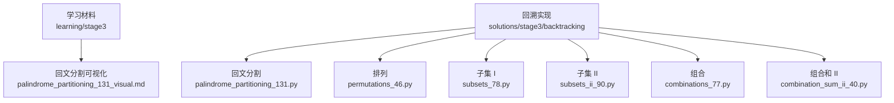
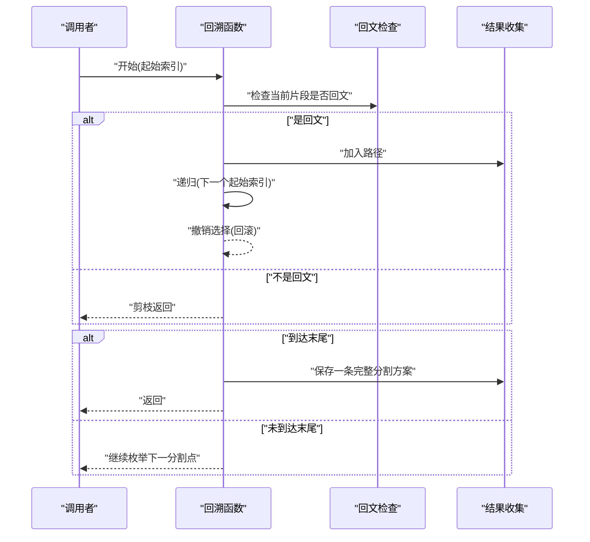
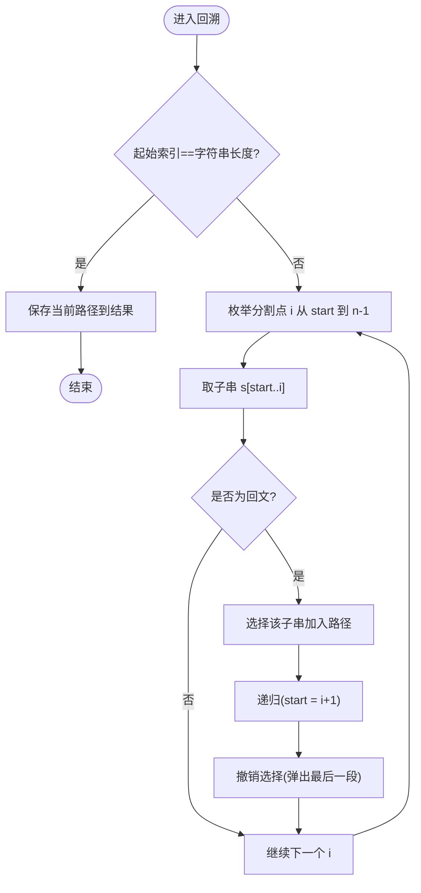
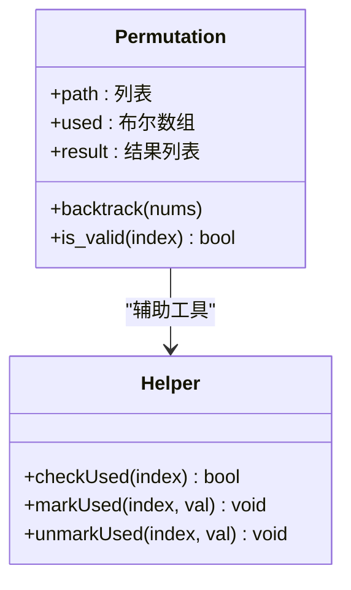
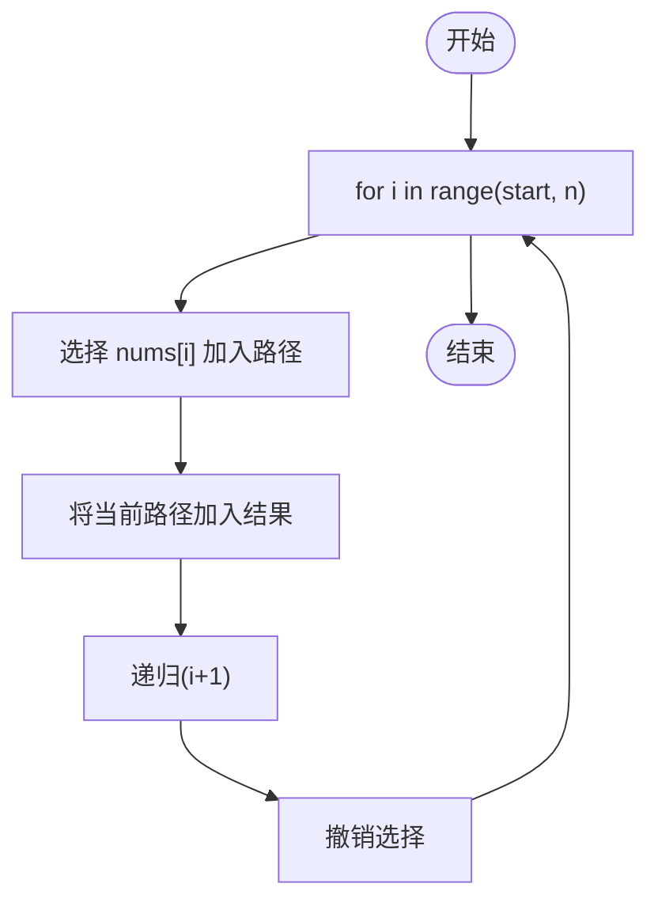
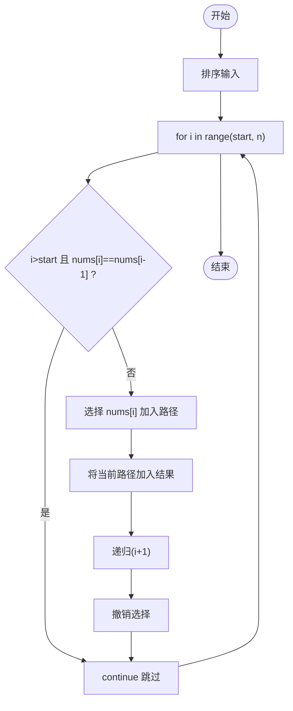
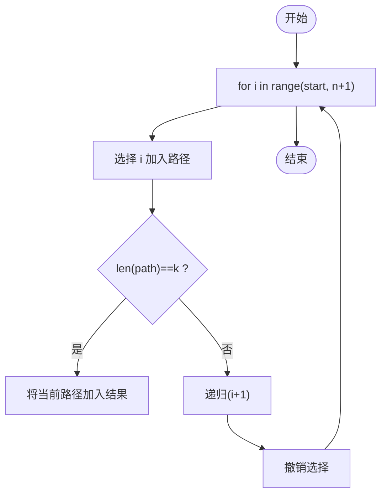
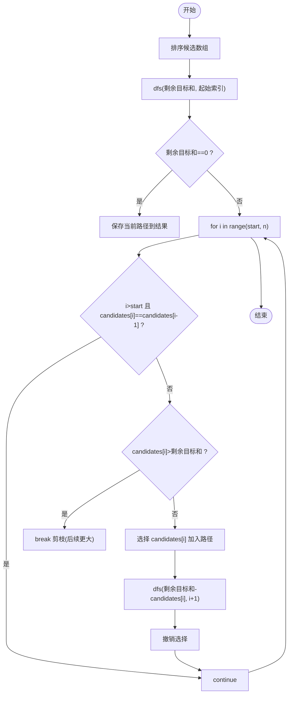
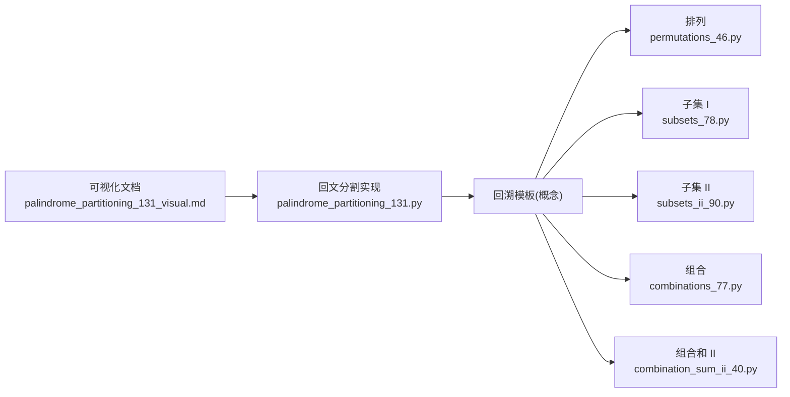

# 回溯算法基础

<cite>
**本文引用的文件**   
- [palindrome_partitioning_131.py](file://solutions/stage3/backtracking/palindrome_partitioning_131.py)
- [permutations_46.py](file://solutions/stage3/backtracking/permutations_46.py)
- [subsets_78.py](file://solutions/stage3/backtracking/subsets_78.py)
- [subsets_ii_90.py](file://solutions/stage3/backtracking/subsets_ii_90.py)
- [combinations_77.py](file://solutions/stage3/backtracking/combinations_77.py)
- [combination_sum_ii_40.py](file://solutions/stage3/backtracking/combination_sum_ii_40.py)
- [palindrome_partitioning_131_visual.md](file://learning/stage3/palindrome_partitioning_131_visual.md)
</cite>

## 目录
1. [简介](#简介)
2. [项目结构](#项目结构)
3. [核心组件](#核心组件)
4. [架构总览](#架构总览)
5. [详细组件分析](#详细组件分析)
6. [依赖分析](#依赖分析)
7. [性能考虑](#性能考虑)
8. [故障排查指南](#故障排查指南)
9. [结论](#结论)
10. [附录](#附录)

## 简介
本章节面向初学者，系统讲解回溯算法的核心思想与实战方法。内容涵盖：
- 状态空间树的构建、选择列表的管理与约束条件的处理
- 回溯模板的编写要点：递归函数设计、终止条件判断、状态回滚操作
- 以“回文分割”问题为主线，展示回溯在实际问题中的应用模式
- 结合可视化材料，逐步演示执行过程与状态变化
- 复杂度分析与优化策略，以及常见陷阱与调试方法

## 项目结构
仓库按学习阶段组织，回溯相关内容集中在 stage3 的学习材料与解决方案中：
- learning/stage3：包含“回文分割”等问题的可视化学习文档
- solutions/stage3/backtracking：包含多道经典回溯题的实现（组合、子集、排列、分割等）

图表来源
- [palindrome_partitioning_131_visual.md](file://learning/stage3/palindrome_partitioning_131_visual.md)
- [palindrome_partitioning_131.py](file://solutions/stage3/backtracking/palindrome_partitioning_131.py)
- [permutations_46.py](file://solutions/stage3/backtracking/permutations_46.py)
- [subsets_78.py](file://solutions/stage3/backtracking/subsets_78.py)
- [subsets_ii_90.py](file://solutions/stage3/backtracking/subsets_ii_90.py)
- [combinations_77.py](file://solutions/stage3/backtracking/combinations_77.py)
- [combination_sum_ii_40.py](file://solutions/stage3/backtracking/combination_sum_ii_40.py)

章节来源
- [palindrome_partitioning_131_visual.md](file://learning/stage3/palindrome_partitioning_131_visual.md)
- [palindrome_partitioning_131.py](file://solutions/stage3/backtracking/palindrome_partitioning_131.py)
- [permutations_46.py](file://solutions/stage3/backtracking/permutations_46.py)
- [subsets_78.py](file://solutions/stage3/backtracking/subsets_78.py)
- [subsets_ii_90.py](file://solutions/stage3/backtracking/subsets_ii_90.py)
- [combinations_77.py](file://solutions/stage3/backtracking/combinations_77.py)
- [combination_sum_ii_40.py](file://solutions/stage3/backtracking/combination_sum_ii_40.py)

## 核心组件
本节从“模板—套路—实践”的角度梳理回溯的关键构件：
- 状态空间树：将问题抽象为“在每一步做选择”，所有可能选择构成一棵树
- 选择列表：当前步骤可做的候选集合，通常由索引或剩余元素决定
- 约束条件：剪枝依据，用于提前排除无效分支
- 路径记录：维护当前已做出的选择序列
- 递归函数四要素：参数定义、终止条件、选择枚举、状态回滚

这些构件贯穿所有回溯题目，是后续具体实现的骨架。

章节来源
- [palindrome_partitioning_131.py](file://solutions/stage3/backtracking/palindrome_partitioning_131.py)
- [permutations_46.py](file://solutions/stage3/backtracking/permutations_46.py)
- [subsets_78.py](file://solutions/stage3/backtracking/subsets_78.py)
- [subsets_ii_90.py](file://solutions/stage3/backtracking/subsets_ii_90.py)
- [combinations_77.py](file://solutions/stage3/backtracking/combinations_77.py)
- [combination_sum_ii_40.py](file://solutions/stage3/backtracking/combination_sum_ii_40.py)

## 架构总览
下图展示了“回文分割”的回溯流程：从起始位置出发，尝试所有可能的分割点；若当前片段满足回文约束，则继续深入；否则剪枝；到达末尾时收集结果；返回时撤销选择。

图表来源
- [palindrome_partitioning_131.py](file://solutions/stage3/backtracking/palindrome_partitioning_131.py)

## 详细组件分析

### 回文分割（Palindromic Partitioning）
- 目标：将字符串分割成若干子串，使得每个子串都是回文
- 状态空间树：根为空路径，每层表示一个分割点，边表示选择一个回文前缀
- 选择列表：从当前位置到末尾的所有前缀
- 约束条件：所选前缀必须是回文
- 终止条件：起始索引等于字符串长度，说明已完整分割
- 状态回滚：在递归返回后移除最后一段，恢复路径

图表来源
- [palindrome_partitioning_131.py](file://solutions/stage3/backtracking/palindrome_partitioning_131.py)

章节来源
- [palindrome_partitioning_131.py](file://solutions/stage3/backtracking/palindrome_partitioning_131.py)
- [palindrome_partitioning_131_visual.md](file://learning/stage3/palindrome_partitioning_131_visual.md)

### 排列（Permutations）
- 目标：生成给定数组的全排列
- 选择列表：未被使用的元素
- 约束条件：同一元素在同一路径中只能使用一次
- 终止条件：路径长度等于数组长度
- 状态回滚：递归返回后标记元素为未使用并弹出路径

图表来源
- [permutations_46.py](file://solutions/stage3/backtracking/permutations_46.py)

章节来源
- [permutations_46.py](file://solutions/stage3/backtracking/permutations_46.py)

### 子集 I（Subsets）
- 目标：生成给定数组的所有子集
- 选择列表：从当前索引开始的后续元素
- 约束条件：无额外约束，但需保证不重复选择同一位置的元素
- 终止条件：遍历完可选范围（也可在每层直接收集路径）
- 状态回滚：递归返回后弹出当前元素

图表来源
- [subsets_78.py](file://solutions/stage3/backtracking/subsets_78.py)

章节来源
- [subsets_78.py](file://solutions/stage3/backtracking/subsets_78.py)

### 子集 II（Subsets II，含重复元素）
- 目标：生成去重后的所有子集
- 关键技巧：排序后跳过同层重复元素，避免重复子集
- 选择列表：从当前索引开始的后续元素
- 约束条件：同层相同值只选一次
- 状态回滚：与子集 I 一致

图表来源
- [subsets_ii_90.py](file://solutions/stage3/backtracking/subsets_ii_90.py)

章节来源
- [subsets_ii_90.py](file://solutions/stage3/backtracking/subsets_ii_90.py)

### 组合（Combinations）
- 目标：从 1..n 中选取 k 个数的所有组合
- 选择列表：从当前数字到 n
- 约束条件：组合长度为 k
- 终止条件：路径长度等于 k
- 状态回滚：递归返回后弹出当前数字

图表来源
- [combinations_77.py](file://solutions/stage3/backtracking/combinations_77.py)

章节来源
- [combinations_77.py](file://solutions/stage3/backtracking/combinations_77.py)

### 组合和 II（Combination Sum II，含重复元素与上限）
- 目标：从候选数组中选择若干数使其和为目标值，每个数只能用一次，且解集不能重复
- 关键技巧：排序后跳过同层重复元素；根据剩余目标和进行剪枝
- 选择列表：从当前索引开始的后续元素
- 约束条件：和不超过目标；同层去重
- 终止条件：和等于目标（记录解），或超过目标（剪枝）
- 状态回滚：递归返回后减去当前值并弹出路径

图表来源
- [combination_sum_ii_40.py](file://solutions/stage3/backtracking/combination_sum_ii_40.py)

章节来源
- [combination_sum_ii_40.py](file://solutions/stage3/backtracking/combination_sum_ii_40.py)

## 依赖分析
- 模块内聚性：各题目实现相对独立，仅共享“回溯模板”思想
- 外部依赖：标准库（如用于回文检查的工具函数或内置方法）
- 耦合关系：可视化文档与对应实现一一对应，便于对照理解

图表来源
- [palindrome_partitioning_131_visual.md](file://learning/stage3/palindrome_partitioning_131_visual.md)
- [palindrome_partitioning_131.py](file://solutions/stage3/backtracking/palindrome_partitioning_131.py)
- [permutations_46.py](file://solutions/stage3/backtracking/permutations_46.py)
- [subsets_78.py](file://solutions/stage3/backtracking/subsets_78.py)
- [subsets_ii_90.py](file://solutions/stage3/backtracking/subsets_ii_90.py)
- [combinations_77.py](file://solutions/stage3/backtracking/combinations_77.py)
- [combination_sum_ii_40.py](file://solutions/stage3/backtracking/combination_sum_ii_40.py)

章节来源
- [palindrome_partitioning_131_visual.md](file://learning/stage3/palindrome_partitioning_131_visual.md)
- [palindrome_partitioning_131.py](file://solutions/stage3/backtracking/palindrome_partitioning_131.py)
- [permutations_46.py](file://solutions/stage3/backtracking/permutations_46.py)
- [subsets_78.py](file://solutions/stage3/backtracking/subsets_78.py)
- [subsets_ii_90.py](file://solutions/stage3/backtracking/subsets_ii_90.py)
- [combinations_77.py](file://solutions/stage3/backtracking/combinations_77.py)
- [combination_sum_ii_40.py](file://solutions/stage3/backtracking/combination_sum_ii_40.py)

## 性能考虑
- 时间复杂度
  - 回文分割：最坏 O(n·2^n)，其中 n 为字符串长度；每次递归最多产生两个分支（切或不切），回文检查带来线性开销
  - 排列：O(n·n!)，共 n! 种排列，每种复制路径需要 O(n)
  - 子集：O(n·2^n)，共 2^n 个子集，复制路径需要 O(n)
  - 组合：O(C(n,k)·k)，C(n,k) 为组合数，每条路径长度 k
  - 组合和 II：受目标和与剪枝影响，上界约为 O(2^n·n)
- 空间复杂度
  - 递归栈深度：O(n)
  - 结果存储：取决于输出规模，通常为 O(n·答案数量)
- 优化策略
  - 预处理：对回文分割可使用中心扩展法或动态规划预计算回文表，降低每次检查的开销
  - 剪枝：在组合和问题中，先排序并在选择前判断剩余和是否足够，尽早 break
  - 去重：在存在重复元素的场景中，通过排序与“同层跳过”避免重复分支
  - 路径拷贝：仅在必要时复制路径，减少不必要的内存分配

[本节为通用指导，无需特定文件引用]

## 故障排查指南
- 常见问题
  - 忘记状态回滚：导致路径污染，出现错误结果
  - 终止条件缺失或错误：造成无限递归或漏解
  - 重复解未处理：在含重复元素的问题中未做同层去重
  - 越界访问：索引边界判断不当
  - 过度复制：频繁复制路径导致超时
- 调试建议
  - 打印日志：在递归入口、选择前后、回滚处打印关键状态
  - 缩小样例：用最小输入验证逻辑正确性
  - 断点跟踪：观察递归树展开顺序与剪枝生效时机
  - 单元测试：针对回文检查、去重逻辑单独验证

[本节为通用指导，无需特定文件引用]

## 结论
回溯是一种“试错—回退—再试”的系统化搜索策略。掌握其模板与思维模式后，面对组合、子集、排列、分割等问题都能快速建模与实现。关键在于：
- 明确状态与选择
- 设计清晰的终止条件
- 做好状态回滚
- 善用剪枝与去重提升效率

[本节为总结性内容，无需特定文件引用]

## 附录
- 可视化学习资源
  - 回文分割可视化文档可用于对照理解递归树展开与剪枝过程
- 相关题目清单
  - 回文分割、排列、子集 I/II、组合、组合和 II

章节来源
- [palindrome_partitioning_131_visual.md](file://learning/stage3/palindrome_partitioning_131_visual.md)
- [palindrome_partitioning_131.py](file://solutions/stage3/backtracking/palindrome_partitioning_131.py)
- [permutations_46.py](file://solutions/stage3/backtracking/permutations_46.py)
- [subsets_78.py](file://solutions/stage3/backtracking/subsets_78.py)
- [subsets_ii_90.py](file://solutions/stage3/backtracking/subsets_ii_90.py)
- [combinations_77.py](file://solutions/stage3/backtracking/combinations_77.py)
- [combination_sum_ii_40.py](file://solutions/stage3/backtracking/combination_sum_ii_40.py)