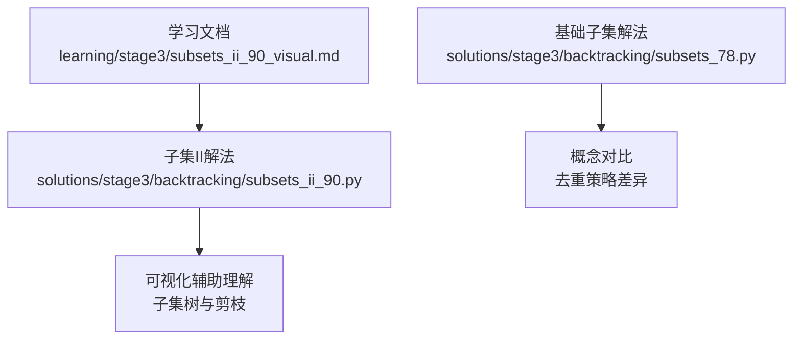
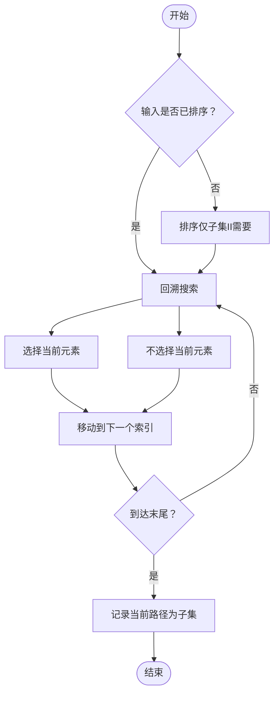
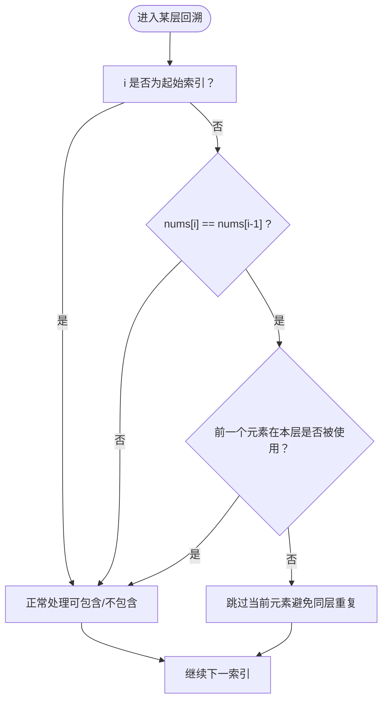
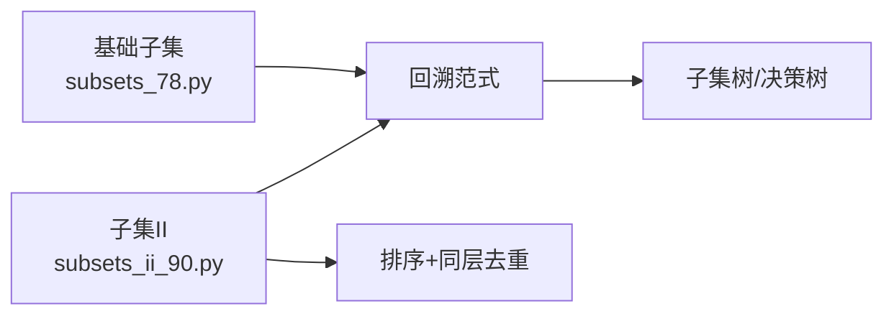

# 子集问题求解

<cite>
**本文引用的文件**   
- [subsets_78.py](file://solutions/stage3/backtracking/subsets_78.py)
- [subsets_ii_90.py](file://solutions/stage3/backtracking/subsets_ii_90.py)
- [subsets_ii_90_visual.md](file://learning/stage3/subsets_ii_90_visual.md)
</cite>

## 目录
1. [引言](#引言)
2. [项目结构](#项目结构)
3. [核心组件](#核心组件)
4. [架构总览](#架构总览)
5. [详细组件分析](#详细组件分析)
6. [依赖分析](#依赖分析)
7. [性能考虑](#性能考虑)
8. [故障排查指南](#故障排查指南)
9. [结论](#结论)
10. [附录](#附录)

## 引言
本学习文档围绕“子集问题”展开，系统讲解子集枚举算法的设计思路与实现细节。内容涵盖：
- 如何选择是否包含当前元素（选择/不选择的分支）
- 如何避免重复子集（排序+跳过同层重复）
- 位运算技巧在子集生成中的应用（二进制掩码与子集的对应关系）
- 通过可视化材料直观展示子集树结构与遍历过程
- 剪枝优化策略（提前终止、条件判断）
- 不同解法的时间与空间复杂度分析与调优建议
- 子集算法在数据挖掘、特征选择等领域的实际应用

## 项目结构
本项目将“回溯/组合类”问题的解法与可视化材料组织在 stage3 目录下，其中与子集相关的核心文件如下：
- 基础子集（无重复元素）：solutions/stage3/backtracking/subsets_78.py
- 含重复元素的子集 II：solutions/stage3/backtracking/subsets_ii_90.py
- 子集 II 的可视化说明：learning/stage3/subsets_ii_90_visual.md

图表来源
- [subsets_78.py](file://solutions/stage3/backtracking/subsets_78.py)
- [subsets_ii_90.py](file://solutions/stage3/backtracking/subsets_ii_90.py)
- [subsets_ii_90_visual.md](file://learning/stage3/subsets_ii_90_visual.md)

章节来源
- [subsets_78.py](file://solutions/stage3/backtracking/subsets_78.py)
- [subsets_ii_90.py](file://solutions/stage3/backtracking/subsets_ii_90.py)
- [subsets_ii_90_visual.md](file://learning/stage3/subsets_ii_90_visual.md)

## 核心组件
- 基础子集（无重复元素）
  - 目标：给定一个不含重复数字的数组，返回其所有可能的子集（幂集）。
  - 典型方法：回溯（选择/不选择）、迭代扩展、位运算枚举。
  - 关键点：每个位置都有“选或不选”两个分支；无需额外去重逻辑。
- 子集 II（含重复元素）
  - 目标：给定可能包含重复数字的数组，返回所有不重复的子集。
  - 典型方法：先排序，再在回溯中按“同层跳过重复值”的策略去重。
  - 关键点：排序后，若当前元素与前一个元素相同且前一个元素在本层未被使用，则跳过以避免重复。

章节来源
- [subsets_78.py](file://solutions/stage3/backtracking/subsets_78.py)
- [subsets_ii_90.py](file://solutions/stage3/backtracking/subsets_ii_90.py)

## 架构总览
从算法视角看，两类子集问题共享同一套“决策树”框架：在每个索引处做二元决策（包含/不包含），并在到达叶子时记录结果。差异在于“去重约束”。

图表来源
- [subsets_78.py](file://solutions/stage3/backtracking/subsets_78.py)
- [subsets_ii_90.py](file://solutions/stage3/backtracking/subsets_ii_90.py)

## 详细组件分析

### 基础子集（无重复元素）
- 设计思路
  - 采用回溯框架：对每个位置 i，递归地尝试“包含 nums[i]”和“不包含 nums[i]”两条分支。
  - 当索引到达数组末尾时，将当前路径加入结果集。
- 关键实现要点
  - 维护一个临时路径列表，进入分支前追加元素，回溯时弹出。
  - 每次到达叶子节点时复制当前路径并加入结果，避免引用共享导致覆盖。
- 复杂度
  - 时间复杂度：O(n·2^n)，共有 2^n 个子集，每个子集构造耗时 O(n)。
  - 空间复杂度：O(n) 用于递归栈与路径存储（不计输出）。
- 代码片段路径
  - [回溯模板入口与主循环](file://solutions/stage3/backtracking/subsets_78.py)
  - [选择/不选择分支与回溯恢复](file://solutions/stage3/backtracking/subsets_78.py)
  - [到达叶子记录结果](file://solutions/stage3/backtracking/subsets_78.py)

章节来源
- [subsets_78.py](file://solutions/stage3/backtracking/subsets_78.py)

#### 位运算视角（概念性补充）
- 思想：用长度为 n 的二进制数表示子集，第 i 位为 1 表示包含 nums[i]，为 0 表示不包含。
- 适用场景：n 较小（如 n ≤ 20）时可直接枚举 0..2^n-1 的所有掩码。
- 复杂度：同样为 O(n·2^n) 时间与 O(n) 额外空间（不计输出）。
- 注意：该部分为通用知识补充，不对应具体源码行号。

### 子集 II（含重复元素）
- 设计思路
  - 先对输入排序，使相同元素相邻。
  - 在回溯过程中，若遇到与前一元素相同的值，且前一元素在当前层未被使用，则跳过，从而避免同层重复分支。
- 关键实现要点
  - 排序：保证相同元素连续，便于判定“同层重复”。
  - 去重条件：i > start 且 nums[i] == nums[i-1] 且 not used[i-1]（或等价的状态表达）。
  - 路径管理：与基础子集一致，进入分支追加，回溯时回滚。
- 复杂度
  - 时间复杂度：最坏仍为 O(n·2^n)，但大量重复分支被剪掉，实际运行更快。
  - 空间复杂度：O(n) 用于递归栈与路径存储（不计输出）。
- 代码片段路径
  - [排序与主函数入口](file://solutions/stage3/backtracking/subsets_ii_90.py)
  - [回溯函数与去重条件](file://solutions/stage3/backtracking/subsets_ii_90.py)
  - [选择/不选择分支与回溯恢复](file://solutions/stage3/backtracking/subsets_ii_90.py)
  - [到达叶子记录结果](file://solutions/stage3/backtracking/subsets_ii_90.py)

章节来源
- [subsets_ii_90.py](file://solutions/stage3/backtracking/subsets_ii_90.py)

#### 去重流程（流程图）

图表来源
- [subsets_ii_90.py](file://solutions/stage3/backtracking/subsets_ii_90.py)

### 可视化辅助：子集树与遍历
- 子集树结构
  - 根节点为空集，每层代表一个决策点（是否包含当前元素）。
  - 左分支通常表示“包含”，右分支表示“不包含”（或相反约定均可）。
- 遍历顺序
  - 深度优先遍历（DFS）：先深入一条路径到底，再回溯探索其他分支。
- 可视化参考
  - 参见可视化文档中对子集树的绘制与步骤说明，有助于理解“选择/不选择”的分支与“到达叶子记录结果”的时机。

章节来源
- [subsets_ii_90_visual.md](file://learning/stage3/subsets_ii_90_visual.md)

## 依赖分析
- 模块内聚与耦合
  - 基础子集与子集 II 共享同一回溯范式，差异集中在“是否排序”和“同层去重条件”。
  - 两者均不依赖外部库，属于纯算法实现，耦合度低、内聚度高。
- 外部依赖
  - 无第三方依赖，仅使用语言内置数据结构（列表、排序等）。

图表来源
- [subsets_78.py](file://solutions/stage3/backtracking/subsets_78.py)
- [subsets_ii_90.py](file://solutions/stage3/backtracking/subsets_ii_90.py)

## 性能考虑
- 时间复杂度
  - 基础子集：O(n·2^n)
  - 子集 II：最坏 O(n·2^n)，但通过排序与同层去重显著减少无效分支。
- 空间复杂度
  - 递归栈与路径：O(n)
  - 输出规模：O(2^n·n)（不计入额外空间）
- 优化建议
  - 优先使用回溯而非显式构建完整子集树，避免不必要的中间对象。
  - 对于含重复元素的输入，务必先排序，确保去重条件稳定有效。
  - 在路径追加/回滚时使用原地操作，避免频繁拷贝。
  - 当 n 较小时，位运算枚举可作为替代方案，常数因子更小。

[本节为通用性能指导，不直接分析具体文件]

## 故障排查指南
- 常见错误
  - 未排序导致去重失败：在子集 II 中忘记排序，会导致相同元素不相邻，无法正确跳过重复。
  - 去重条件写错：漏判“同层未使用”的条件，可能导致遗漏合法子集或误删。
  - 路径未深拷贝：在记录结果时直接保存路径引用，后续回溯会覆盖已有结果。
- 定位建议
  - 打印关键状态：在回溯入口处打印当前索引、路径与决策方向，观察分支是否正确。
  - 逐步验证去重条件：针对含重复输入的样例，手动模拟“同层跳过”的逻辑。
  - 对照可视化材料：结合子集树图，核对每一步是否符合预期。

章节来源
- [subsets_ii_90_visual.md](file://learning/stage3/subsets_ii_90_visual.md)
- [subsets_ii_90.py](file://solutions/stage3/backtracking/subsets_ii_90.py)

## 结论
- 基础子集问题展示了回溯的基本范式：在每个位置做二元决策，到达叶子记录结果。
- 子集 II 在此基础上引入“排序+同层去重”的经典策略，有效避免重复子集。
- 位运算提供了另一种等价的枚举视角，适合小规模输入的快速实现。
- 通过可视化材料与流程图，可以直观理解子集树的结构与遍历过程，帮助调试与优化。

[本节为总结性内容，不直接分析具体文件]

## 附录
- 实践建议
  - 先从基础子集入手，熟练掌握回溯模板与路径管理。
  - 再过渡到子集 II，重点练习“同层去重”的判断条件。
  - 最后尝试位运算版本，体会不同实现风格的优缺点。
- 应用场景
  - 数据挖掘：候选项集生成、频繁模式挖掘中的子集枚举。
  - 特征选择：在有限特征集合上枚举子集进行模型评估。
  - 组合优化：作为启发式搜索或精确算法的子程序。

[本节为拓展内容，不直接分析具体文件]