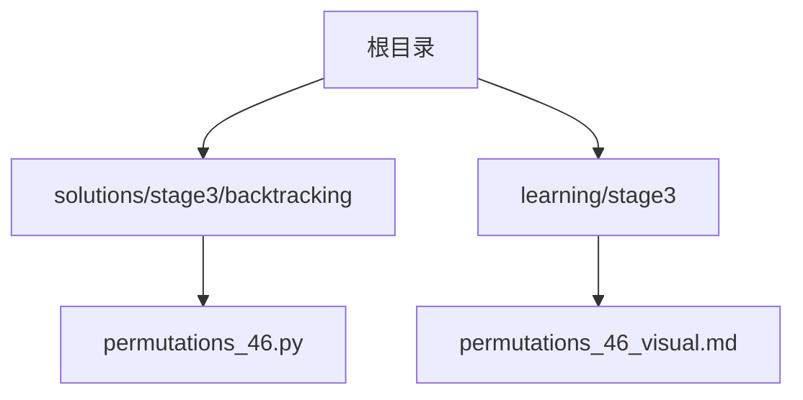
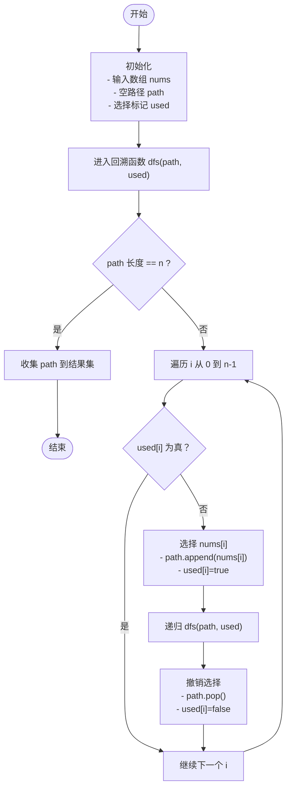
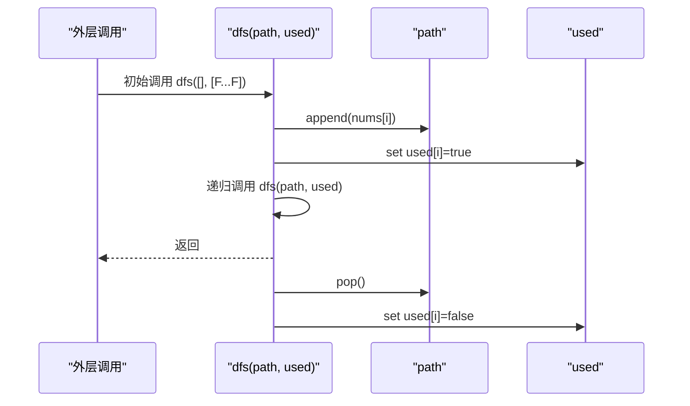
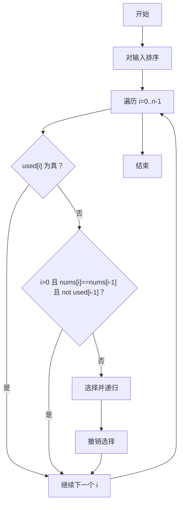
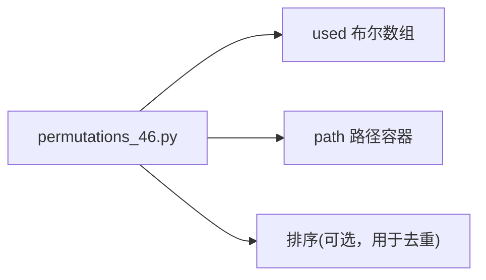

# 排列问题求解

<cite>
**本文引用的文件**   
- [permutations_46.py](file://solutions/stage3/backtracking/permutations_46.py)
- [permutations_46_visual.md](file://learning/stage3/permutations_46_visual.md)
</cite>

## 目录
1. [引言](#引言)
2. [项目结构](#项目结构)
3. [核心组件](#核心组件)
4. [架构总览](#架构总览)
5. [详细组件分析](#详细组件分析)
6. [依赖分析](#依赖分析)
7. [性能考虑](#性能考虑)
8. [故障排查指南](#故障排查指南)
9. [结论](#结论)
10. [附录](#附录)

## 引言
本学习文档围绕“排列问题”展开，系统讲解全排列生成算法的实现原理与工程实践。内容涵盖：
- 回溯算法在排列问题中的应用模式
- 元素选择标记、路径记录与状态恢复机制
- 重复元素的处理策略（排序去重与位置标记）
- 递归调用栈的可视化理解
- 不同实现方法的性能差异与优化建议
- 实际工程应用场景（如密码生成、任务调度等）

## 项目结构
本项目将“排列问题”的核心实现与可视化材料分别组织在以下位置：
- 代码实现：位于 stage3/backtracking 下的排列问题解法文件
- 可视化学习材料：位于 learning/stage3 下的排列问题可视化说明

图表来源
- [permutations_46.py](file://solutions/stage3/backtracking/permutations_46.py)
- [permutations_46_visual.md](file://learning/stage3/permutations_46_visual.md)

章节来源
- [permutations_46.py](file://solutions/stage3/backtracking/permutations_46.py)
- [permutations_46_visual.md](file://learning/stage3/permutations_46_visual.md)

## 核心组件
- 回溯框架：通过“选择—探索—撤销”的三步循环，遍历所有可能的排列路径
- 路径记录：维护一个当前路径容器，用于保存已选择的元素序列
- 选择标记：使用布尔数组或集合记录元素是否已被选择，避免重复使用
- 终止条件：当路径长度等于输入规模时，收集一次完整排列
- 去重策略：对含重复元素的输入，采用“先排序+跳过同层相同值”的策略保证结果唯一

章节来源
- [permutations_46.py](file://solutions/stage3/backtracking/permutations_46.py)

## 架构总览
下图展示了回溯生成全排列的整体流程与关键数据结构之间的关系。

图表来源
- [permutations_46.py](file://solutions/stage3/backtracking/permutations_46.py)

## 详细组件分析

### 回溯函数与状态管理
- 选择与标记
  - 使用布尔数组 used 记录每个索引是否被选中，确保同一位置不会在同一分支中重复使用
  - 每次选择前检查 used[i]，若为真则跳过
- 路径记录
  - 使用可变列表 path 记录当前路径；到达叶子节点时将 path 的副本加入结果集
- 状态恢复
  - 递归返回后执行“撤销选择”，将 path 弹出并将 used[i] 置回 false，保证后续分支正确性

图表来源
- [permutations_46.py](file://solutions/stage3/backtracking/permutations_46.py)

章节来源
- [permutations_46.py](file://solutions/stage3/backtracking/permutations_46.py)

### 重复元素处理策略
- 排序去重
  - 对输入进行排序，使相同元素相邻
  - 在同一递归层级内，若当前元素与前一个元素相同且前一个未被使用，则跳过，以避免同层重复分支
- 位置标记技巧
  - 使用 used 数组控制“全局不可重复使用”，配合排序后的“同层跳过”规则，既保证不重复使用，又避免同层重复组合

图表来源
- [permutations_46.py](file://solutions/stage3/backtracking/permutations_46.py)

章节来源
- [permutations_46.py](file://solutions/stage3/backtracking/permutations_46.py)

### 可视化辅助与递归栈变化
- 可视化材料提供了逐步演示过程，帮助理解：
  - 递归深度与路径长度的关系
  - 选择与撤销如何影响路径与标记数组
  - 剪枝（同层跳过）如何减少无效分支
- 建议结合可视化材料对照代码执行轨迹，观察调用栈的入栈与出栈过程

章节来源
- [permutations_46_visual.md](file://learning/stage3/permutations_46_visual.md)

### 复杂度与性能分析
- 时间复杂度
  - 全排列总数为 n!，每个排列构建成本 O(n)，整体 O(n·n!)
- 空间复杂度
  - 递归深度 O(n)，路径与标记数组 O(n)，结果存储 O(n·n!)
- 优化建议
  - 优先使用布尔数组 used 而非集合，降低哈希开销
  - 对含重复元素的输入，务必先排序再应用同层跳过规则
  - 仅在到达叶子节点时复制路径，避免频繁拷贝

章节来源
- [permutations_46.py](file://solutions/stage3/backtracking/permutations_46.py)

## 依赖分析
- 模块内依赖
  - 回溯函数依赖路径容器与选择标记两个核心数据结构
  - 去重逻辑依赖输入排序与同层跳过判断
- 外部依赖
  - 标准库中的列表/数组操作与排序工具

图表来源
- [permutations_46.py](file://solutions/stage3/backtracking/permutations_46.py)

章节来源
- [permutations_46.py](file://solutions/stage3/backtracking/permutations_46.py)

## 性能考虑
- 数据结构选择
  - 使用定长布尔数组作为选择标记，比集合更高效
- 剪枝策略
  - 同层跳过可显著减少重复分支，尤其在大量重复元素场景
- I/O 与结果收集
  - 仅在叶子节点追加结果，避免中间过程的额外拷贝
- 内存占用
  - 注意结果集可能非常大，必要时可采用流式输出或分批处理

[本节为通用指导，无需特定文件引用]

## 故障排查指南
- 常见问题
  - 忘记撤销选择：导致路径污染与错误结果
  - 未正确使用 used 标记：造成同一元素在同一分支中被重复使用
  - 重复元素未排序或未做同层跳过：产生重复排列
- 定位方法
  - 打印路径与标记数组的变化轨迹
  - 借助可视化材料对照递归树，定位异常分支
  - 针对小规模输入手工推演，验证边界情况

章节来源
- [permutations_46_visual.md](file://learning/stage3/permutations_46_visual.md)

## 结论
通过回溯算法的系统化实现与可视化辅助，可以清晰理解全排列生成的内在机制。掌握“选择—探索—撤销”的模式与“排序+同层跳过”的去重技巧，能够在保证正确性的同时提升效率。该模式广泛适用于需要枚举所有可能性的工程场景。

[本节为总结性内容，无需特定文件引用]

## 附录
- 实际工程应用场景
  - 密码生成：基于字符集的全排列可用于穷举弱口令检测（需结合安全策略与资源限制）
  - 任务调度：对有限任务集合的所有顺序进行枚举评估，寻找满足约束的最优或可行方案
  - 测试用例构造：对输入参数进行全排列以覆盖更多边界与组合场景
- 进一步阅读
  - 参考可视化材料中的步骤演示，结合具体输入手动模拟递归过程，加深理解

[本节为扩展性内容，无需特定文件引用]