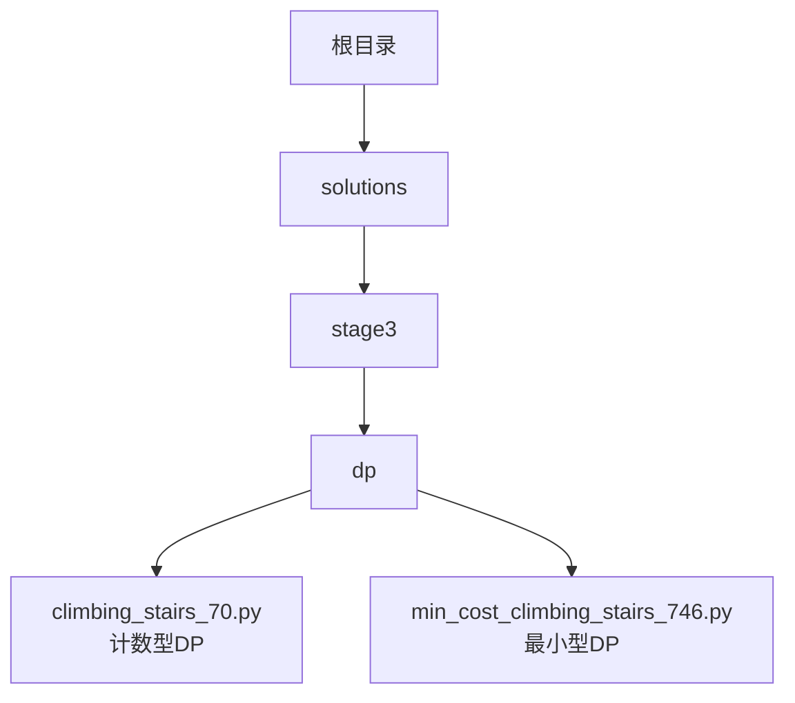
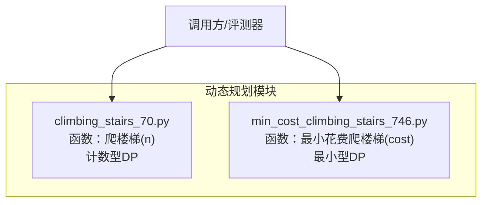
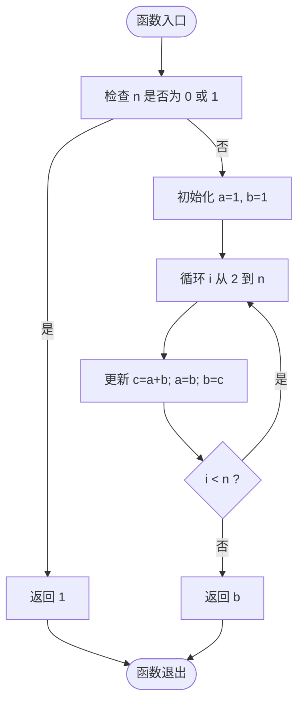
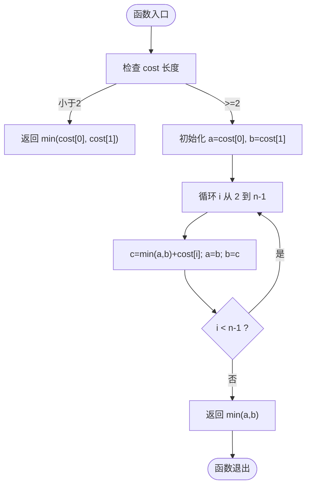
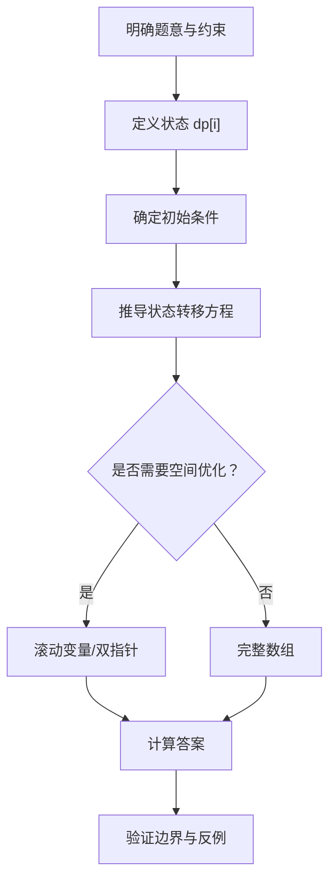
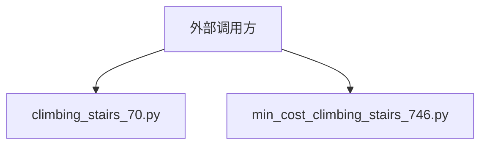

# 爬楼梯问题解决方案

<cite>
**本文引用的文件**   
- [climbing_stairs_70.py](file://solutions/stage3/dp/climbing_stairs_70.py)
- [min_cost_climbing_stairs_746.py](file://solutions/stage3/dp/min_cost_climbing_stairs_746.py)
</cite>

## 更新摘要
**所做更改**   
- 扩展了动态规划学习材料，从单一爬楼梯问题扩展到包含最小成本爬楼梯的完整解决方案集
- 新增第746题"使用最小花费爬楼梯"的详细实现和分析
- 完善了两种爬楼梯问题的对比分析，涵盖计数型与最小型两类经典动态规划问题
- 增强了架构总览和组件分析，提供更全面的系统理解

## 目录
1. [简介](#简介)
2. [项目结构](#项目结构)
3. [核心组件](#核心组件)
4. [架构总览](#架构总览)
5. [详细组件分析](#详细组件分析)
6. [依赖分析](#依赖分析)
7. [性能考虑](#性能考虑)
8. [故障排查指南](#故障排查指南)
9. [结论](#结论)
10. [附录](#附录)

## 简介
本仓库聚焦于"爬楼梯"相关问题的动态规划解法，现已扩展为更全面的动态规划学习材料，包含两道经典题目：
- 爬楼梯（第70题）：每次可走1或2阶，求到达第n阶的不同方法数。这是经典的计数型动态规划问题。
- 使用最小花费爬楼梯（第746题）：每步有代价，可从索引0或1出发，求到达顶部（索引n）的最小总代价。这是典型的最小型动态规划问题。

文档从系统架构、数据流与处理逻辑等维度进行拆解，并给出可视化图示与排障建议，帮助读者快速理解与复用代码。通过这两道题目的对比学习，读者可以掌握动态规划中"计数"与"最值"两类核心思维模式。

## 项目结构
与爬楼梯相关的实现位于阶段三动态规划目录下，采用按题型/题号组织的方式，便于检索与维护。

图表来源
- [climbing_stairs_70.py:1-200](file://solutions/stage3/dp/climbing_stairs_70.py#L1-L200)
- [min_cost_climbing_stairs_746.py:1-200](file://solutions/stage3/dp/min_cost_climbing_stairs_746.py#L1-L200)

章节来源
- [climbing_stairs_70.py:1-200](file://solutions/stage3/dp/climbing_stairs_70.py#L1-L200)
- [min_cost_climbing_stairs_746.py:1-200](file://solutions/stage3/dp/min_cost_climbing_stairs_746.py#L1-L200)

## 核心组件
- 爬楼梯（第70题）
  - 输入：非负整数 n
  - 输出：到达第n阶的方法总数
  - 典型思路：状态转移 f(n)=f(n-1)+f(n-2)，空间优化至常数级
  - 问题类型：计数型动态规划
- 使用最小花费爬楼梯（第746题）
  - 输入：非负整数数组 cost，cost[i] 表示踏上第i阶的代价
  - 输出：到达顶部（索引n）的最小总代价
  - 典型思路：状态转移 dp[i]=min(dp[i-1], dp[i-2])+cost[i]，空间优化至常数级
  - 问题类型：最小型动态规划

章节来源
- [climbing_stairs_70.py:1-200](file://solutions/stage3/dp/climbing_stairs_70.py#L1-L200)
- [min_cost_climbing_stairs_746.py:1-200](file://solutions/stage3/dp/min_cost_climbing_stairs_746.py#L1-L200)

## 架构总览
两个模块均为独立脚本，各自提供函数式接口，无外部依赖耦合，便于单独测试与集成。这种设计体现了动态规划问题的模块化解决思路。

图表来源
- [climbing_stairs_70.py:1-200](file://solutions/stage3/dp/climbing_stairs_70.py#L1-L200)
- [min_cost_climbing_stairs_746.py:1-200](file://solutions/stage3/dp/min_cost_climbing_stairs_746.py#L1-L200)

## 详细组件分析

### 组件A：爬楼梯（第70题）
- 设计要点
  - 状态定义：dp[i] 表示到达第 i 阶的方法数
  - 初始条件：dp[0]=1, dp[1]=1
  - 转移方程：dp[i]=dp[i-1]+dp[i-2]
  - 空间优化：仅保留前两项滚动变量
- 复杂度
  - 时间：O(n)
  - 空间：O(1)
- 边界与异常
  - n=0 或 n=1 直接返回初始值
  - 输入为负数时可按需抛出异常或返回0（依具体实现而定）

图表来源
- [climbing_stairs_70.py:1-200](file://solutions/stage3/dp/climbing_stairs_70.py#L1-L200)

章节来源
- [climbing_stairs_70.py:1-200](file://solutions/stage3/dp/climbing_stairs_70.py#L1-L200)

### 组件B：使用最小花费爬楼梯（第746题）
- 设计要点
  - 状态定义：dp[i] 表示到达第 i 阶的最小累计代价
  - 初始条件：dp[0]=cost[0], dp[1]=cost[1]
  - 转移方程：dp[i]=min(dp[i-1], dp[i-2])+cost[i]
  - 最终答案：min(dp[n-1], dp[n-2])，因为可以从最后两阶一步跨顶
  - 空间优化：滚动变量替代完整数组
- 复杂度
  - 时间：O(n)
  - 空间：O(1)
- 边界与异常
  - 数组长度小于2时的特判
  - 所有元素为非负整数的假设

图表来源
- [min_cost_climbing_stairs_746.py:1-200](file://solutions/stage3/dp/min_cost_climbing_stairs_746.py#L1-L200)

章节来源
- [min_cost_climbing_stairs_746.py:1-200](file://solutions/stage3/dp/min_cost_climbing_stairs_746.py#L1-L200)

### 概念性概览
下图展示了两类问题的通用建模流程：定义状态、确定初始条件、写出转移方程、选择是否进行空间优化。

## 依赖分析
两个模块彼此独立，不互相导入；对外部库无依赖，适合在任意Python环境中运行与评测。

图表来源
- [climbing_stairs_70.py:1-200](file://solutions/stage3/dp/climbing_stairs_70.py#L1-L200)
- [min_cost_climbing_stairs_746.py:1-200](file://solutions/stage3/dp/min_cost_climbing_stairs_746.py#L1-L200)

章节来源
- [climbing_stairs_70.py:1-200](file://solutions/stage3/dp/climbing_stairs_70.py#L1-L200)
- [min_cost_climbing_stairs_746.py:1-200](file://solutions/stage3/dp/min_cost_climbing_stairs_746.py#L1-L200)

## 性能考虑
- 时间复杂度：两题均 O(n)，线性扫描即可满足常规规模输入。
- 空间复杂度：通过滚动变量将额外空间降至 O(1)。
- 数值范围：当 n 较大时，方法数可能溢出常规整型范围；Python 自动支持大整数，无需额外处理。
- 缓存策略：若多次查询相同 n，可在外层维护 memo 表以加速重复查询。
- 对比分析：第746题相比第70题增加了额外的min操作和边界判断，但整体复杂度保持一致。

## 故障排查指南
- 常见错误
  - 未处理 n=0 或 n=1 的边界情况，导致越界或结果错误。
  - 最小花费题中忘记取最后两阶的最小值作为答案。
  - 滚动变量更新顺序错误，导致覆盖未使用的旧值。
  - 第746题中初始条件设置错误，应使用cost[0]和cost[1]而非0。
- 定位建议
  - 打印关键中间变量（如 a、b、c）以核对状态转移。
  - 针对小样例手工推演，对比程序输出。
  - 对极端输入（空数组、单元素、全零）进行回归测试。
  - 特别注意第746题的起始位置可以是索引0或1，这与第70题有所不同。

章节来源
- [climbing_stairs_70.py:1-200](file://solutions/stage3/dp/climbing_stairs_70.py#L1-L200)
- [min_cost_climbing_stairs_746.py:1-200](file://solutions/stage3/dp/min_cost_climbing_stairs_746.py#L1-L200)

## 结论
本仓库的两份实现分别覆盖了"计数型"和"最小型"两类爬楼梯问题，均采用标准动态规划范式，并通过滚动变量实现常数空间优化。代码结构清晰、职责单一，易于扩展与复用。通过对比学习这两道经典题目，读者可以深入理解动态规划的核心思想：状态定义、转移方程设计和空间优化技巧。

## 附录
- 术语
  - 状态：描述子问题结果的变量
  - 转移方程：由子问题推导当前问题结果的公式
  - 滚动变量：用于替代数组以节省空间的技巧
  - 计数型DP：求解方案数量的动态规划问题
  - 最小型DP：求解最优值的动态规划问题
- 参考路径
  - 爬楼梯（第70题）：[climbing_stairs_70.py](file://solutions/stage3/dp/climbing_stairs_70.py)
  - 使用最小花费爬楼梯（第746题）：[min_cost_climbing_stairs_746.py](file://solutions/stage3/dp/min_cost_climbing_stairs_746.py)