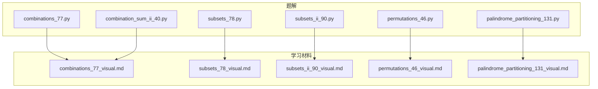
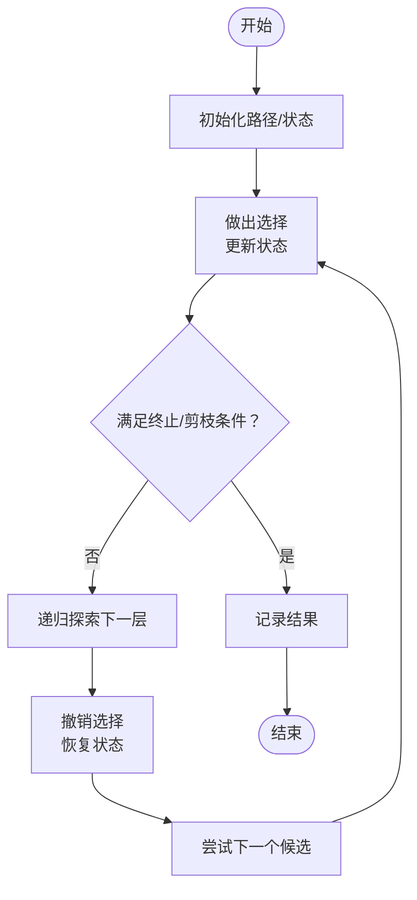
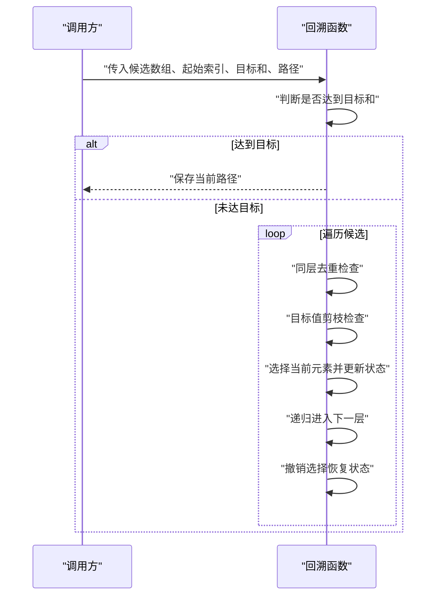
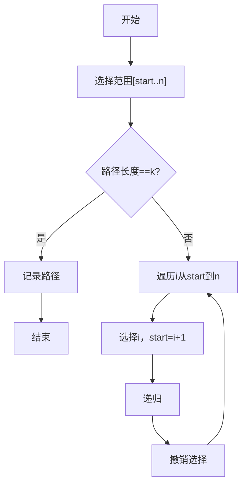
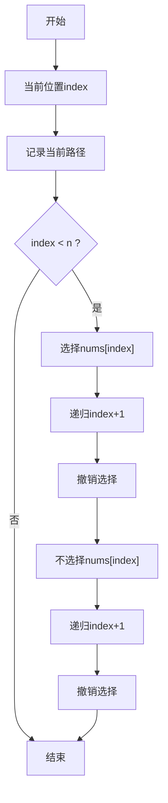
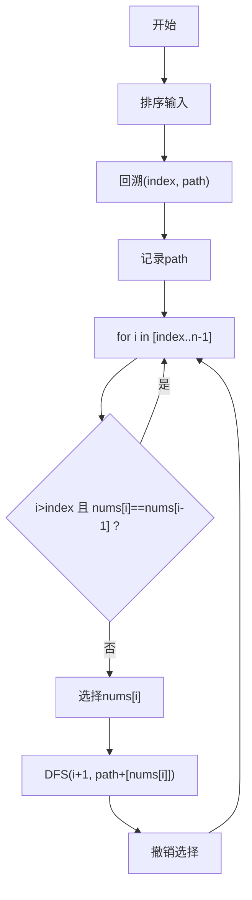
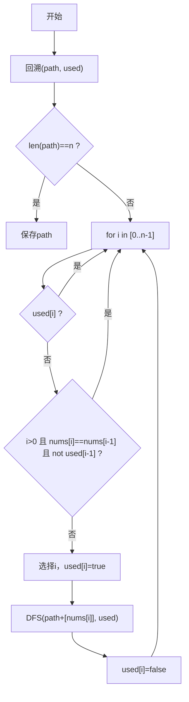
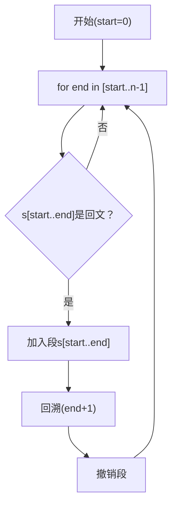
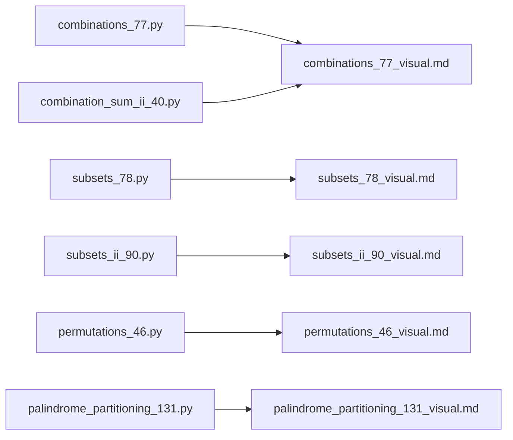

# 第三阶段：高级算法

<cite>
**本文引用的文件**   
- [solutions/stage3/backtracking/combinations_77.py](file://solutions/stage3/backtracking/combinations_77.py)
- [solutions/stage3/backtracking/subsets_78.py](file://solutions/stage3/backtracking/subsets_78.py)
- [solutions/stage3/backtracking/subsets_ii_90.py](file://solutions/stage3/backtracking/subsets_ii_90.py)
- [solutions/stage3/backtracking/permutations_46.py](file://solutions/stage3/backtracking/permutations_46.py)
- [solutions/stage3/backtracking/combination_sum_ii_40.py](file://solutions/stage3/backtracking/combination_sum_ii_40.py)
- [solutions/stage3/backtracking/palindrome_partitioning_131.py](file://solutions/stage3/backtracking/palindrome_partitioning_131.py)
- [learning/stage3/combinations_77_visual.md](file://learning/stage3/combinations_77_visual.md)
- [learning/stage3/subsets_78_visual.md](file://learning/stage3/subsets_78_visual.md)
- [learning/stage3/subsets_ii_90_visual.md](file://learning/stage3/subsets_ii_90_visual.md)
- [learning/stage3/permutations_46_visual.md](file://learning/stage3/permutations_46_visual.md)
- [learning/stage3/palindrome_partitioning_131_visual.md](file://learning/stage3/palindrome_partitioning_131_visual.md)
</cite>

## 目录
1. [引言](#引言)
2. [项目结构](#项目结构)
3. [核心组件](#核心组件)
4. [架构总览](#架构总览)
5. [详细组件分析](#详细组件分析)
6. [依赖分析](#依赖分析)
7. [性能考虑](#性能考虑)
8. [故障排查指南](#故障排查指南)
9. [结论](#结论)
10. [附录](#附录)

## 引言
本章节面向“第三阶段：高级算法”的学习者，聚焦回溯算法的系统化掌握。内容覆盖：
- 回溯的核心思想：状态空间树、递归思维与剪枝优化
- 组合问题：去重策略与复杂度分析
- 排列问题：重复元素处理与生成策略
- 子集问题：枚举方法与位运算技巧
- 分割与验证：回文分割的状态转移与约束检查
- 可视化辅助：通过配套学习材料理解执行过程与状态变化
- 工程实践：回溯在真实场景中的应用与最佳实践

## 项目结构
仓库采用“题解 + 学习材料”的双轨组织方式：
- solutions/stage3/backtracking：各经典回溯问题的 Python 实现
- learning/stage3：对应题目的可视化学习材料（Markdown）

图示来源
- [solutions/stage3/backtracking/combinations_77.py](file://solutions/stage3/backtracking/combinations_77.py)
- [solutions/stage3/backtracking/subsets_78.py](file://solutions/stage3/backtracking/subsets_78.py)
- [solutions/stage3/backtracking/subsets_ii_90.py](file://solutions/stage3/backtracking/subsets_ii_90.py)
- [solutions/stage3/backtracking/permutations_46.py](file://solutions/stage3/backtracking/permutations_46.py)
- [solutions/stage3/backtracking/combination_sum_ii_40.py](file://solutions/stage3/backtracking/combination_sum_ii_40.py)
- [solutions/stage3/backtracking/palindrome_partitioning_131.py](file://solutions/stage3/backtracking/palindrome_partitioning_131.py)
- [learning/stage3/combinations_77_visual.md](file://learning/stage3/combinations_77_visual.md)
- [learning/stage3/subsets_78_visual.md](file://learning/stage3/subsets_78_visual.md)
- [learning/stage3/subsets_ii_90_visual.md](file://learning/stage3/subsets_ii_90_visual.md)
- [learning/stage3/permutations_46_visual.md](file://learning/stage3/permutations_46_visual.md)
- [learning/stage3/palindrome_partitioning_131_visual.md](file://learning/stage3/palindrome_partitioning_131_visual.md)

章节来源
- [solutions/stage3/backtracking/combinations_77.py](file://solutions/stage3/backtracking/combinations_77.py)
- [solutions/stage3/backtracking/subsets_78.py](file://solutions/stage3/backtracking/subsets_78.py)
- [solutions/stage3/backtracking/subsets_ii_90.py](file://solutions/stage3/backtracking/subsets_ii_90.py)
- [solutions/stage3/backtracking/permutations_46.py](file://solutions/stage3/backtracking/permutations_46.py)
- [solutions/stage3/backtracking/combination_sum_ii_40.py](file://solutions/stage3/backtracking/combination_sum_ii_40.py)
- [solutions/stage3/backtracking/palindrome_partitioning_131.py](file://solutions/stage3/backtracking/palindrome_partitioning_131.py)
- [learning/stage3/combinations_77_visual.md](file://learning/stage3/combinations_77_visual.md)
- [learning/stage3/subsets_78_visual.md](file://learning/stage3/subsets_78_visual.md)
- [learning/stage3/subsets_ii_90_visual.md](file://learning/stage3/subsets_ii_90_visual.md)
- [learning/stage3/permutations_46_visual.md](file://learning/stage3/permutations_46_visual.md)
- [learning/stage3/palindrome_partitioning_131_visual.md](file://learning/stage3/palindrome_partitioning_131_visual.md)

## 核心组件
- 组合问题（组合总和 II、组合）：排序 + 索引递增选择 + 同层去重剪枝；目标值剪枝
- 子集问题（子集 II）：排序 + 同层去重；可选加入当前元素或不加入的分支
- 排列问题（全排列）：使用 visited 标记或交换法；重复元素需额外去重
- 分割问题（回文分割）：按起始位置切分，校验子串是否为回文，再递归

章节来源
- [solutions/stage3/backtracking/combinations_77.py](file://solutions/stage3/backtracking/combinations_77.py)
- [solutions/stage3/backtracking/subsets_78.py](file://solutions/stage3/backtracking/subsets_78.py)
- [solutions/stage3/backtracking/subsets_ii_90.py](file://solutions/stage3/backtracking/subsets_ii_90.py)
- [solutions/stage3/backtracking/permutations_46.py](file://solutions/stage3/backtracking/permutations_46.py)
- [solutions/stage3/backtracking/combination_sum_ii_40.py](file://solutions/stage3/backtracking/combination_sum_ii_40.py)
- [solutions/stage3/backtracking/palindrome_partitioning_131.py](file://solutions/stage3/backtracking/palindrome_partitioning_131.py)

## 架构总览
回溯框架由“选择—探索—撤销”三要素构成，配合剪枝条件形成高效搜索。下图展示通用回溯流程与各题解模块的关系。

图示来源
- [solutions/stage3/backtracking/combinations_77.py](file://solutions/stage3/backtracking/combinations_77.py)
- [solutions/stage3/backtracking/subsets_78.py](file://solutions/stage3/backtracking/subsets_78.py)
- [solutions/stage3/backtracking/subsets_ii_90.py](file://solutions/stage3/backtracking/subsets_ii_90.py)
- [solutions/stage3/backtracking/permutations_46.py](file://solutions/stage3/backtracking/permutations_46.py)
- [solutions/stage3/backtracking/combination_sum_ii_40.py](file://solutions/stage3/backtracking/combination_sum_ii_40.py)
- [solutions/stage3/backtracking/palindrome_partitioning_131.py](file://solutions/stage3/backtracking/palindrome_partitioning_131.py)

## 详细组件分析

### 组合问题：组合总和 II（去重与目标值剪枝）
- 关键思路
  - 先对候选数组排序，便于同层去重与提前剪枝
  - 使用 start 索引保证每个元素在同一组合中仅用一次
  - 同层去重：若当前元素与前一个相同且前一个未被使用于同一层，则跳过
  - 目标值剪枝：当剩余目标和小于 0 时直接返回
- 复杂度
  - 时间：最坏 O(2^n)，实际受剪枝影响显著降低
  - 空间：递归深度 O(n)，结果不计入空间复杂度
- 可视化参考
  - 参见学习材料中的状态树与剪枝示意

图示来源
- [solutions/stage3/backtracking/combination_sum_ii_40.py](file://solutions/stage3/backtracking/combination_sum_ii_40.py)

章节来源
- [solutions/stage3/backtracking/combination_sum_ii_40.py](file://solutions/stage3/backtracking/combination_sum_ii_40.py)

### 组合问题：组合（基础组合）
- 关键思路
  - 从 n 个数中选 k 个，start 控制选择范围
  - 路径长度等于 k 时记录结果
  - 可结合上界剪枝减少无效分支
- 复杂度
  - 时间：O(C(n,k))
  - 空间：O(k) 递归栈
- 可视化参考
  - 参见学习材料中的组合树展开

图示来源
- [solutions/stage3/backtracking/combinations_77.py](file://solutions/stage3/backtracking/combinations_77.py)

章节来源
- [solutions/stage3/backtracking/combinations_77.py](file://solutions/stage3/backtracking/combinations_77.py)

### 子集问题：子集（无重复）
- 关键思路
  - 每个位置可选择“加入”或“不加入”，形成二叉决策树
  - 每层将当前路径加入结果集合
- 复杂度
  - 时间：O(2^n)
  - 空间：O(n) 递归栈
- 可视化参考
  - 参见学习材料中的子集树

图示来源
- [solutions/stage3/backtracking/subsets_78.py](file://solutions/stage3/backtracking/subsets_78.py)

章节来源
- [solutions/stage3/backtracking/subsets_78.py](file://solutions/stage3/backtracking/subsets_78.py)

### 子集问题：子集 II（含重复元素）
- 关键思路
  - 先排序，再在同层跳过与前一个相同且未被使用的元素
  - 其余与子集一致
- 复杂度
  - 时间：O(2^n)，去重后有效分支减少
  - 空间：O(n)
- 可视化参考
  - 参见学习材料中的去重分支对比

图示来源
- [solutions/stage3/backtracking/subsets_ii_90.py](file://solutions/stage3/backtracking/subsets_ii_90.py)

章节来源
- [solutions/stage3/backtracking/subsets_ii_90.py](file://solutions/stage3/backtracking/subsets_ii_90.py)

### 排列问题：全排列（含重复元素）
- 关键思路
  - 使用 visited 标记已选元素；同层去重需保证“前一个相同元素在本层未被使用”
  - 也可用交换法原地生成，但去重要谨慎处理
- 复杂度
  - 时间：O(n·n!)
  - 空间：O(n)
- 可视化参考
  - 参见学习材料中的排列树与去重点

图示来源
- [solutions/stage3/backtracking/permutations_46.py](file://solutions/stage3/backtracking/permutations_46.py)

章节来源
- [solutions/stage3/backtracking/permutations_46.py](file://solutions/stage3/backtracking/permutations_46.py)

### 分割问题：回文分割
- 关键思路
  - 以起始位置为状态，尝试所有可能的切割点
  - 每次切出的子串必须为回文才继续递归
  - 可用双指针或预计算表加速回文判断
- 复杂度
  - 时间：最坏指数级，取决于回文约束强度
  - 空间：O(n) 递归栈
- 可视化参考
  - 参见学习材料中的分割树与回文校验

图示来源
- [solutions/stage3/backtracking/palindrome_partitioning_131.py](file://solutions/stage3/backtracking/palindrome_partitioning_131.py)

章节来源
- [solutions/stage3/backtracking/palindrome_partitioning_131.py](file://solutions/stage3/backtracking/palindrome_partitioning_131.py)

## 依赖分析
- 模块内聚性
  - 每个题解文件自包含单一问题的回溯实现，职责清晰
- 外部依赖
  - 主要依赖标准库（如列表操作），无第三方包耦合
- 学习材料与题解的映射
  - 学习材料提供可视化解释，帮助理解状态空间与剪枝效果

图示来源
- [solutions/stage3/backtracking/combinations_77.py](file://solutions/stage3/backtracking/combinations_77.py)
- [solutions/stage3/backtracking/subsets_78.py](file://solutions/stage3/backtracking/subsets_78.py)
- [solutions/stage3/backtracking/subsets_ii_90.py](file://solutions/stage3/backtracking/subsets_ii_90.py)
- [solutions/stage3/backtracking/permutations_46.py](file://solutions/stage3/backtracking/permutations_46.py)
- [solutions/stage3/backtracking/combination_sum_ii_40.py](file://solutions/stage3/backtracking/combination_sum_ii_40.py)
- [solutions/stage3/backtracking/palindrome_partitioning_131.py](file://solutions/stage3/backtracking/palindrome_partitioning_131.py)
- [learning/stage3/combinations_77_visual.md](file://learning/stage3/combinations_77_visual.md)
- [learning/stage3/subsets_78_visual.md](file://learning/stage3/subsets_78_visual.md)
- [learning/stage3/subsets_ii_90_visual.md](file://learning/stage3/subsets_ii_90_visual.md)
- [learning/stage3/permutations_46_visual.md](file://learning/stage3/permutations_46_visual.md)
- [learning/stage3/palindrome_partitioning_131_visual.md](file://learning/stage3/palindrome_partitioning_131_visual.md)

## 性能考虑
- 剪枝优先
  - 排序后利用单调性进行上界/下界剪枝（如目标和剪枝）
  - 同层去重避免重复分支
- 状态设计
  - 明确“选择—探索—撤销”的最小状态集，避免冗余拷贝
- 预处理
  - 回文判断可预计算二维表，将单次判断降至 O(1)
- 输出规模
  - 注意结果数量本身可能呈指数级，评估内存与时间开销

[本节为通用指导，无需具体文件引用]

## 故障排查指南
- 常见错误
  - 忘记撤销选择导致路径污染
  - 同层去重条件写错（应基于“前一个相同元素在本层未被使用”）
  - 未排序导致去重失效
- 调试建议
  - 打印当前路径与选择索引，观察状态变化
  - 在小规模输入上逐步验证剪枝逻辑
  - 对照学习材料的可视化步骤定位异常分支

章节来源
- [solutions/stage3/backtracking/combination_sum_ii_40.py](file://solutions/stage3/backtracking/combination_sum_ii_40.py)
- [solutions/stage3/backtracking/subsets_ii_90.py](file://solutions/stage3/backtracking/subsets_ii_90.py)
- [solutions/stage3/backtracking/permutations_46.py](file://solutions/stage3/backtracking/permutations_46.py)
- [solutions/stage3/backtracking/palindrome_partitioning_131.py](file://solutions/stage3/backtracking/palindrome_partitioning_131.py)

## 结论
回溯算法的关键在于：
- 正确建模状态空间树
- 精准设计剪枝条件
- 严格遵循“选择—探索—撤销”模式
通过本题解与可视化材料，学习者可以系统掌握组合、子集、排列与分割等典型回溯范式，并在工程中灵活应用。

[本节为总结性内容，无需具体文件引用]

## 附录
- 可视化学习材料清单
  - 组合：[combinations_77_visual.md](file://learning/stage3/combinations_77_visual.md)
  - 子集：[subsets_78_visual.md](file://learning/stage3/subsets_78_visual.md)
  - 子集 II：[subsets_ii_90_visual.md](file://learning/stage3/subsets_ii_90_visual.md)
  - 排列：[permutations_46_visual.md](file://learning/stage3/permutations_46_visual.md)
  - 回文分割：[palindrome_partitioning_131_visual.md](file://learning/stage3/palindrome_partitioning_131_visual.md)