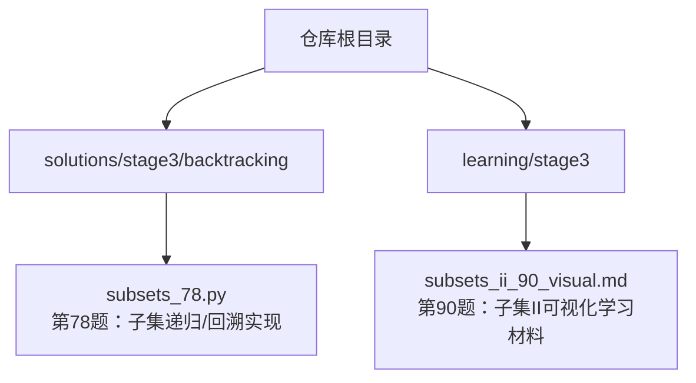
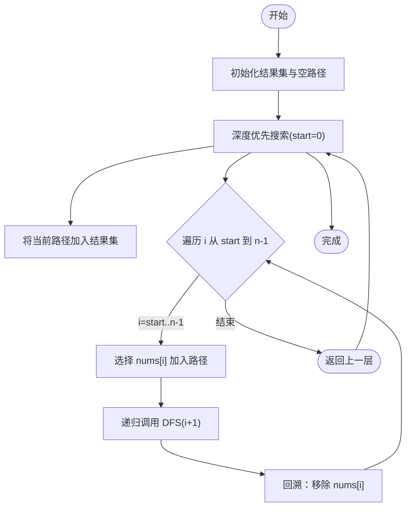
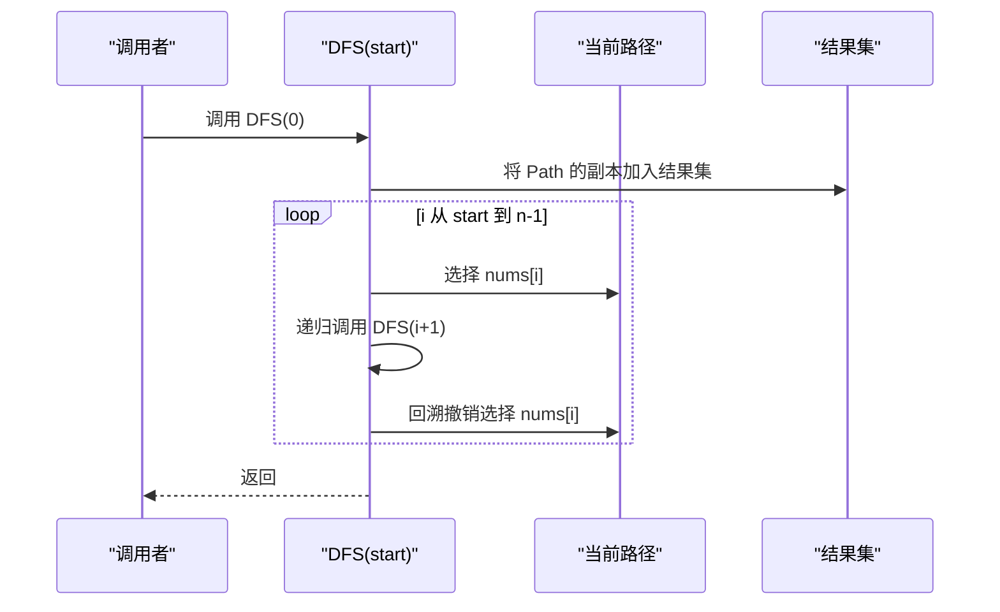
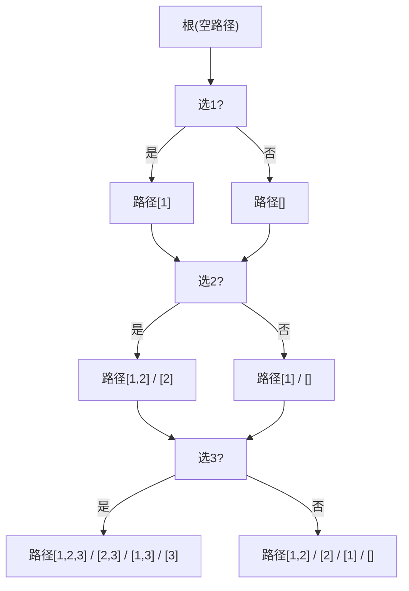
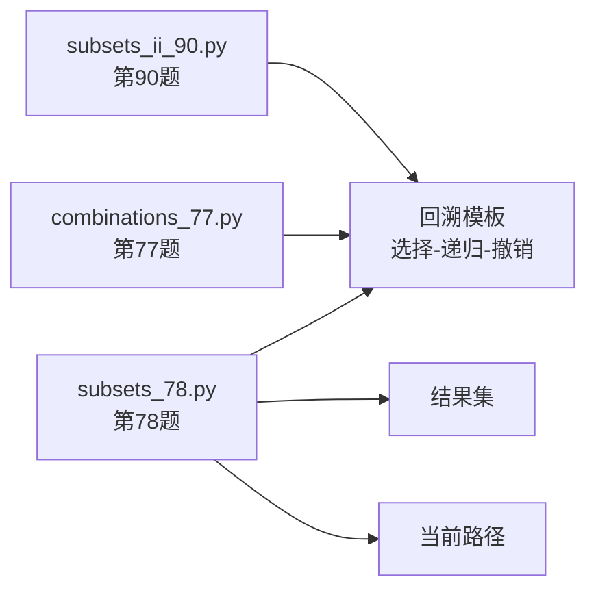

# 子集问题 - 第78题

<cite>
**本文引用的文件**   
- [solutions/stage3/backtracking/subsets_78.py](file://solutions/stage3/backtracking/subsets_78.py)
- [learning/stage3/subsets_ii_90_visual.md](file://learning/stage3/subsets_ii_90_visual.md)
</cite>

## 目录
1. [简介](#简介)
2. [项目结构](#项目结构)
3. [核心组件](#核心组件)
4. [架构总览](#架构总览)
5. [详细组件分析](#详细组件分析)
6. [依赖分析](#依赖分析)
7. [性能考虑](#性能考虑)
8. [故障排查指南](#故障排查指南)
9. [结论](#结论)
10. [附录](#附录)

## 简介
本学习文档围绕“子集问题（LeetCode 第78题）”展开，目标是帮助读者系统掌握如何生成给定集合的所有可能子集（包含空集与全集）。我们将深入剖析该问题的核心思想：每个元素都有“选或不选”两种状态，从而形成 2^n 个子集；并通过递归树/决策树的方式枚举所有可能的子集。文档将重点讲解以下方面：
- 递归树的构建过程与遍历顺序
- 使用索引控制可选范围、在递归过程中添加当前路径到结果集
- 元素的可选性处理与回溯技巧
- 具体执行示例，展示递归调用链与结果生成顺序
- 迭代法与递归法的对比分析（空间效率与可读性权衡）
- 常见变体问题与扩展应用（如含重复元素、长度限制等）

## 项目结构
本项目采用按主题分层的组织方式，本题解位于“回溯专题”的 stage3 目录下，配套的学习材料位于 learning/stage3 中。

图示来源
- [solutions/stage3/backtracking/subsets_78.py](file://solutions/stage3/backtracking/subsets_78.py)
- [learning/stage3/subsets_ii_90_visual.md](file://learning/stage3/subsets_ii_90_visual.md)

章节来源
- [solutions/stage3/backtracking/subsets_78.py](file://solutions/stage3/backtracking/subsets_78.py)
- [learning/stage3/subsets_ii_90_visual.md](file://learning/stage3/subsets_ii_90_visual.md)

## 核心组件
- 输入与输出
  - 输入：一个整数数组 nums（可含重复元素，但第78题不要求去重）
  - 输出：所有子集的列表，包含空集与全集
- 关键数据结构
  - 结果集：用于收集所有子集
  - 路径：当前正在构建的子集（通常以列表形式维护）
- 核心算法思想
  - 决策树：对每个位置 i 的元素，做“选/不选”两个分支
  - 索引控制：通过 start 索引限定后续可选范围，避免重复选择同一位置的元素
  - 回溯：在选择后进入下一层递归，返回时撤销选择，恢复状态以便尝试另一分支

章节来源
- [solutions/stage3/backtracking/subsets_78.py](file://solutions/stage3/backtracking/subsets_78.py)

## 架构总览
下图展示了第78题的典型递归回溯流程：从空路径开始，逐层决定每个元素是否加入当前路径，并在每一层将当前路径加入结果集。

图示来源
- [solutions/stage3/backtracking/subsets_78.py](file://solutions/stage3/backtracking/subsets_78.py)

## 详细组件分析

### 递归/回溯实现（第78题）
- 设计要点
  - 参数：start 表示当前可选范围的起始索引
  - 终止条件：无需显式终止，因为每层都会把当前路径加入结果集，且循环边界自然收敛
  - 选择与撤销：在循环中选择 nums[i]，递归进入下一层，返回时撤销选择
  - 结果收集：每次进入函数即把当前路径的副本加入结果集（保证记录所有中间状态）
- 复杂度
  - 时间复杂度：O(n·2^n)，共有 2^n 个节点，每个节点复制路径需 O(n)
  - 空间复杂度：O(n) 为递归栈深度，结果集不计入额外空间

图示来源
- [solutions/stage3/backtracking/subsets_78.py](file://solutions/stage3/backtracking/subsets_78.py)

章节来源
- [solutions/stage3/backtracking/subsets_78.py](file://solutions/stage3/backtracking/subsets_78.py)

### 决策树与执行示例
- 决策树视角
  - 根节点：空路径
  - 每层对应一个位置 i，两个分支：选/不选
  - 叶子节点：到达末尾或不再继续选择
- 示例说明（以 nums=[1,2,3] 为例）
  - 第一层：决定是否选 1
  - 第二层：决定是否选 2
  - 第三层：决定是否选 3
  - 每进入一层都将当前路径加入结果集，最终得到 2^3=8 个子集
- 生成顺序
  - 典型深度优先顺序：先尽可能多选，再逐步回溯减少选择，从而产生字典序风格的子集序列

图示来源
- [solutions/stage3/backtracking/subsets_78.py](file://solutions/stage3/backtracking/subsets_78.py)

### 迭代法与递归法对比
- 迭代法（位掩码）
  - 思路：用长度为 n 的二进制数表示每个元素是否被选中，共 2^n 种组合
  - 优点：代码简洁、易于理解
  - 缺点：需要显式构造每个子集，难以复用“前缀路径”的状态
- 递归/回溯法
  - 思路：通过决策树枚举“选/不选”，天然维护当前路径
  - 优点：便于扩展（如剪枝、约束条件），易于理解“前缀”概念
  - 缺点：递归开销与路径拷贝成本
- 空间与可读性权衡
  - 递归法空间主要为递归栈 O(n)，结果集不计入额外空间
  - 位掩码法同样需要存储结果集，但无递归栈；在某些语言中更直观

章节来源
- [solutions/stage3/backtracking/subsets_78.py](file://solutions/stage3/backtracking/subsets_78.py)

### 常见变体与扩展
- 含重复元素的子集（第90题）
  - 目标：去重后的所有子集
  - 关键技巧：排序 + 在同一层跳过相同值（避免重复分支）
  - 参考学习材料：[learning/stage3/subsets_ii_90_visual.md](file://learning/stage3/subsets_ii_90_visual.md)
- 固定长度的子集（第77题）
  - 目标：从 n 个数中选 k 个数的所有组合
  - 关键技巧：在递归中加入长度约束，提前剪枝
- 带约束的子集
  - 例如：子集和等于目标值、子集内元素满足单调性等
  - 关键技巧：在递归中添加可行性判断与剪枝

章节来源
- [learning/stage3/subsets_ii_90_visual.md](file://learning/stage3/subsets_ii_90_visual.md)

## 依赖分析
- 模块内依赖
  - 第78题实现主要依赖标准库列表操作与基础控制流，无外部第三方依赖
- 跨文件关联
  - 与第90题（子集II）共享“回溯模板”，区别在于是否排序与同层去重
  - 与第77题（组合）共享“长度约束”的剪枝模式

图示来源
- [solutions/stage3/backtracking/subsets_78.py](file://solutions/stage3/backtracking/subsets_78.py)

## 性能考虑
- 时间复杂度
  - 递归法：O(n·2^n)，每个子集复制一次路径
- 空间复杂度
  - 递归栈深度 O(n)
  - 结果集大小 O(2^n·n)（不计入额外空间）
- 优化建议
  - 若仅需计数，可在递归中直接计数而不保存路径
  - 对于大规模数据，优先考虑迭代法以减少递归开销
  - 合理剪枝（如长度限制、和值限制）可显著降低搜索空间

## 故障排查指南
- 常见问题
  - 忘记将当前路径的副本加入结果集，导致结果指向同一对象
  - 回溯时未撤销选择，导致路径污染
  - 索引越界：循环边界应为 start 到 n-1，递归传入 i+1
  - 重复元素未处理（针对第90题）：未排序或未同层去重
- 调试建议
  - 打印每层 start、i、当前路径与结果集变化
  - 在小规模输入上手动模拟决策树，核对生成顺序

章节来源
- [solutions/stage3/backtracking/subsets_78.py](file://solutions/stage3/backtracking/subsets_78.py)

## 结论
子集问题的本质是对每个元素进行“选/不选”的决策，形成一棵深度为 n 的决策树，共有 2^n 个节点。递归/回溯方法通过维护当前路径与索引控制，能够清晰表达这一过程，并便于扩展到各类约束与变体。在实际工程中，可根据场景在递归法与迭代法之间权衡：前者更易表达与扩展，后者更直观且无递归开销。

## 附录
- 相关题目
  - 第77题：组合（固定长度）
  - 第90题：子集II（含重复元素）
- 学习资源
  - 第90题可视化学习材料：[learning/stage3/subsets_ii_90_visual.md](file://learning/stage3/subsets_ii_90_visual.md)