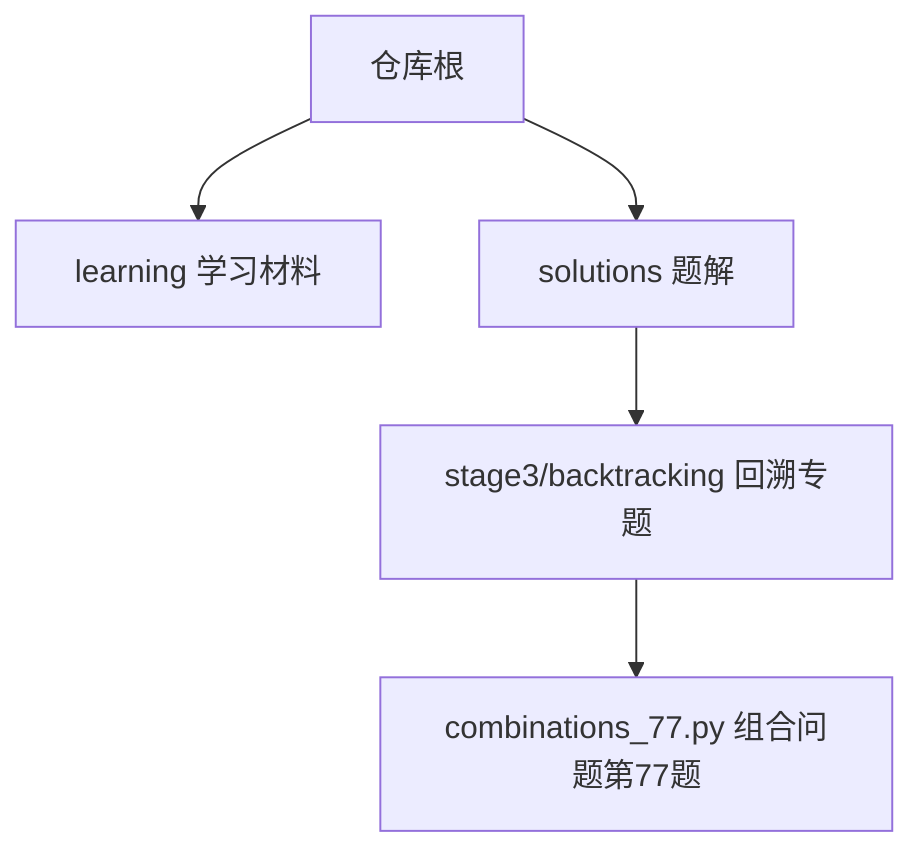
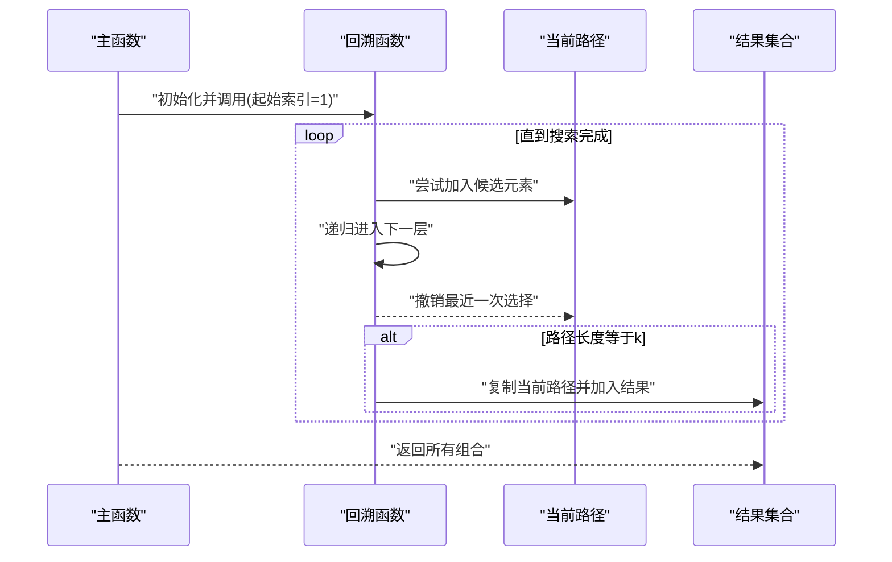
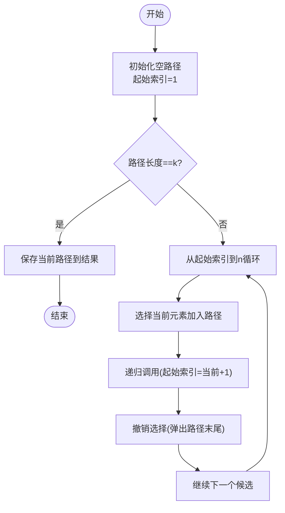
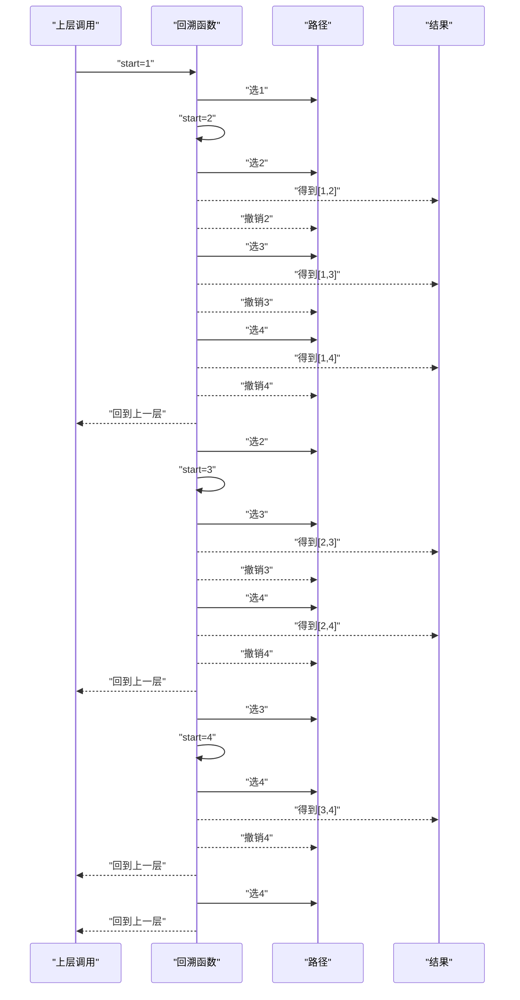
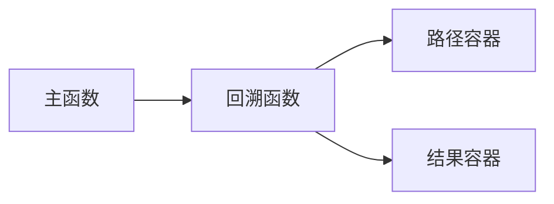

# 组合问题 - 第77题

<cite>
**本文引用的文件**   
- [combinations_77.py](file://solutions/stage3/backtracking/combinations_77.py)
</cite>

## 目录
1. [简介](#简介)
2. [项目结构](#项目结构)
3. [核心组件](#核心组件)
4. [架构总览](#架构总览)
5. [详细组件分析](#详细组件分析)
6. [依赖分析](#依赖分析)
7. [性能考虑](#性能考虑)
8. [故障排查指南](#故障排查指南)
9. [结论](#结论)
10. [附录](#附录)

## 简介
本学习文档围绕“从 n 个数中选取 k 个数的组合”这一经典回溯问题（LeetCode 第77题）展开，目标是帮助读者系统掌握：
- 递归树设计与状态空间建模
- 起始位置选择与去重策略
- 递归深度控制与终止条件
- 回溯过程中的状态维护与恢复
- 剪枝优化与复杂度分析
- 边界条件处理与测试调试技巧

通过逐步图解与代码级分析，读者将能独立实现高效、可维护的组合生成算法。

## 项目结构
本项目采用按主题/阶段组织的结构，组合问题的解位于回溯专题目录下。

**图示来源**
- [combinations_77.py:1-200](file://solutions/stage3/backtracking/combinations_77.py#L1-L200)

**章节来源**
- [combinations_77.py:1-200](file://solutions/stage3/backtracking/combinations_77.py#L1-L200)

## 核心组件
- 入口函数：接收参数 n 和 k，返回所有长度为 k 的组合列表。
- 回溯辅助函数：负责递归搜索、状态维护、结果收集与回溯恢复。
- 关键变量：
  - 当前路径：保存已选择的元素序列
  - 起始索引：用于避免重复选择并保证组合有序
  - 剩余可选数量：用于剪枝判断

**章节来源**
- [combinations_77.py:1-200](file://solutions/stage3/backtracking/combinations_77.py#L1-L200)

## 架构总览
下图展示了整体调用关系与数据流：主函数初始化状态后调用回溯函数；回溯函数在满足终止条件时收集结果，否则遍历候选集进行“选择—递归—撤销选择”。

**图示来源**
- [combinations_77.py:1-200](file://solutions/stage3/backtracking/combinations_77.py#L1-L200)

## 详细组件分析

### 递归树与状态空间
- 节点表示：每个节点代表一个“部分组合”，即当前路径。
- 分支含义：在当前起始索引之后，依次尝试加入未使用的更大元素。
- 叶子节点：当路径长度达到 k 时，记录为一个完整组合。
- 状态空间大小：C(n, k)，即从 n 个元素中选 k 个的组合数。

**图示来源**
- [combinations_77.py:1-200](file://solutions/stage3/backtracking/combinations_77.py#L1-L200)

**章节来源**
- [combinations_77.py:1-200](file://solutions/stage3/backtracking/combinations_77.py#L1-L200)

### 关键逻辑要点
- 避免重复的选择
  - 使用“起始索引”确保每次只向后选择，从而天然避免重复组合。
  - 该策略等价于要求组合内元素严格递增。
- 控制递归深度
  - 当路径长度等于 k 时停止深入，直接收集结果。
- 维护当前组合状态
  - 进入递归前“选择”，返回后“撤销选择”，保持路径始终正确。
- 剪枝优化
  - 若剩余可选元素不足以满足还需要选择的个数，则提前返回。
  - 具体而言，当 i + (k - len(path)) > n 时无需继续。

**章节来源**
- [combinations_77.py:1-200](file://solutions/stage3/backtracking/combinations_77.py#L1-L200)

### 执行过程图解（以 n=4, k=2 为例）
下图展示递归调用栈的变化与结果收集过程。为便于理解，省略了具体的数值细节，仅展示调用层次与分支走向。

**图示来源**
- [combinations_77.py:1-200](file://solutions/stage3/backtracking/combinations_77.py#L1-L200)

### 边界条件处理
- n < k：无法选出 k 个不同元素，直接返回空结果。
- k = 0：通常返回包含一个空组合的结果（视题目约定而定）。
- n = k：仅存在唯一组合，可直接构造返回。
- 输入校验：对 n、k 的合法性进行检查，避免无效计算。

**章节来源**
- [combinations_77.py:1-200](file://solutions/stage3/backtracking/combinations_77.py#L1-L200)

### 多种实现方式对比
- 基于起始索引的回溯（推荐）
  - 优点：简洁直观，天然去重，易于剪枝。
  - 适用性：通用性强，适合大多数组合类问题。
- 基于位掩码枚举
  - 优点：思路直接。
  - 缺点：需要额外检查位数与组合长度，常数开销较大。
- 基于迭代法（字典序生成）
  - 优点：无需递归栈，空间更稳定。
  - 缺点：实现复杂，易出错。

时间复杂度与空间复杂度
- 时间复杂度：O(C(n, k)·k)。生成每个组合需要 O(k) 拷贝或输出。
- 空间复杂度：O(k) 用于递归栈与当前路径；结果存储不计入额外空间。

**章节来源**
- [combinations_77.py:1-200](file://solutions/stage3/backtracking/combinations_77.py#L1-L200)

## 依赖分析
- 模块内部依赖
  - 主函数依赖回溯辅助函数。
  - 回溯函数依赖路径容器与结果容器。
- 外部依赖
  - 标准库数据结构（如列表）用于路径与结果管理。
- 耦合与内聚
  - 函数职责单一，内聚度高；对外暴露接口清晰，耦合度低。

**图示来源**
- [combinations_77.py:1-200](file://solutions/stage3/backtracking/combinations_77.py#L1-L200)

**章节来源**
- [combinations_77.py:1-200](file://solutions/stage3/backtracking/combinations_77.py#L1-L200)

## 性能考虑
- 剪枝优先
  - 尽早判断剩余元素是否足够，减少无效分支。
- 避免不必要的拷贝
  - 仅在到达叶子节点时复制路径，降低内存分配次数。
- 预分配与复用
  - 对于大规模输入，可考虑复用路径缓冲区以减少分配开销（高级优化）。
- 语言特性利用
  - 使用高效的内置数据结构与方法，减少手动操作带来的额外开销。

[本节为通用指导，不直接分析具体文件]

## 故障排查指南
- 常见问题
  - 重复组合：检查起始索引是否正确更新，确保只向后选择。
  - 漏掉组合：确认终止条件与路径长度判断是否准确。
  - 越界错误：循环上界应结合剪枝条件，避免访问非法索引。
  - 结果重复：确保只在路径长度等于 k 时复制并加入结果。
- 调试技巧
  - 打印日志：在每次选择与撤销选择前后输出路径与起始索引。
  - 小规模验证：先用 n≤5 的小样例手工推演，核对输出。
  - 断点跟踪：在递归入口与出口设置断点，观察调用栈变化。
  - 单元测试：覆盖边界条件与典型用例，持续回归验证。

**章节来源**
- [combinations_77.py:1-200](file://solutions/stage3/backtracking/combinations_77.py#L1-L200)

## 结论
组合问题第77题是回溯法的入门与基石。掌握“起始索引去重 + 路径长度终止 + 剪枝优化”的核心三要素，即可高效解决大量组合类问题。建议在实践中反复演练小样例，配合可视化与调试手段，逐步建立对递归树与状态空间的直觉。

[本节为总结性内容，不直接分析具体文件]

## 附录
- 参考实现路径
  - [combinations_77.py](file://solutions/stage3/backtracking/combinations_77.py)
- 相关学习资源
  - 回溯专题其他题目（子集、排列、分割等）可作为进阶练习，巩固同一套思维模型。

[本节为补充信息，不直接分析具体文件]