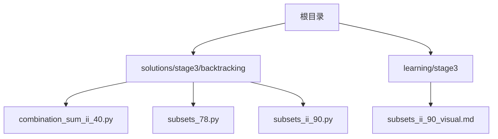
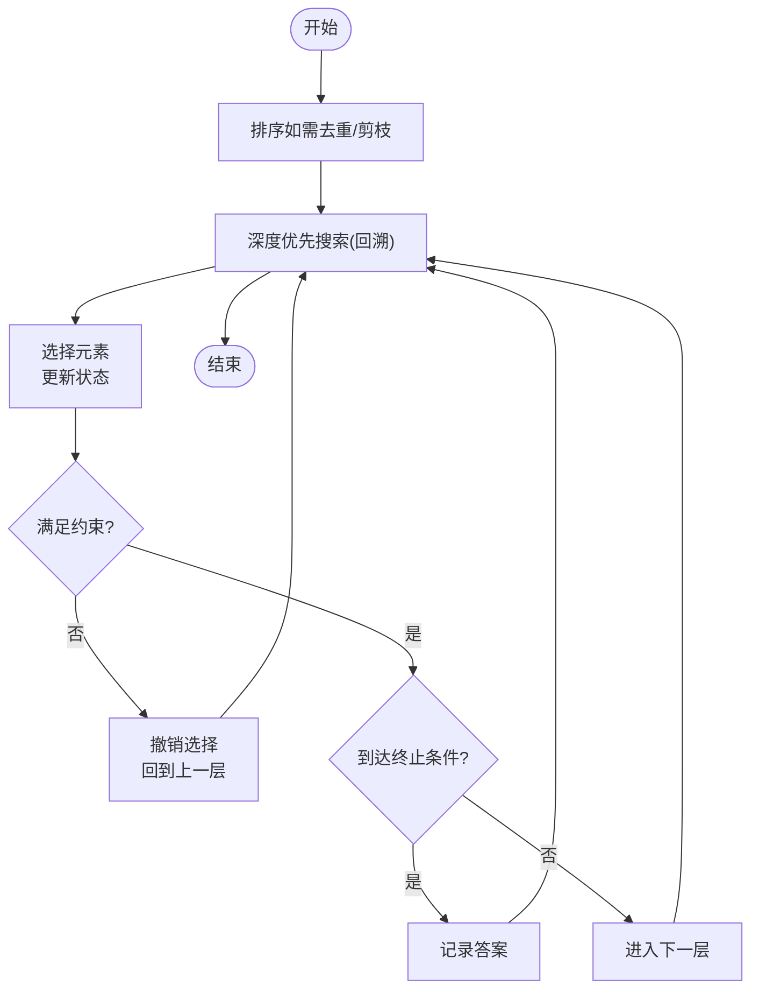
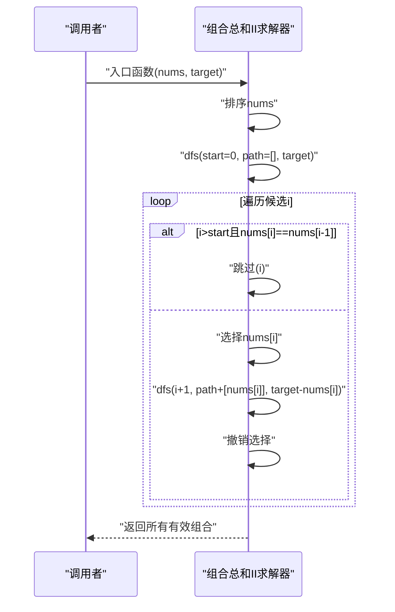
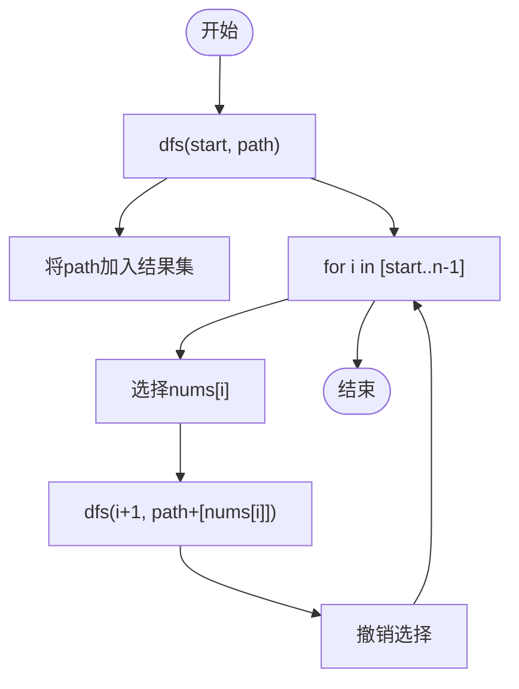
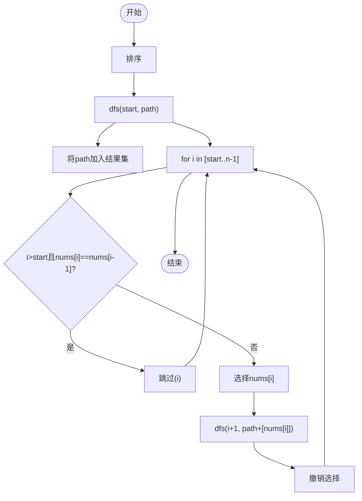
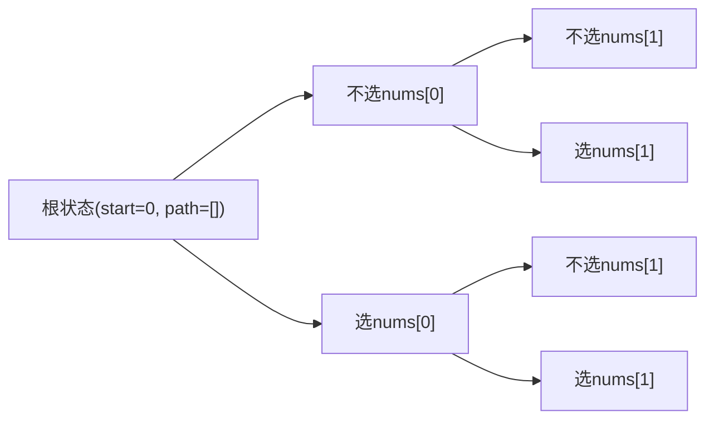
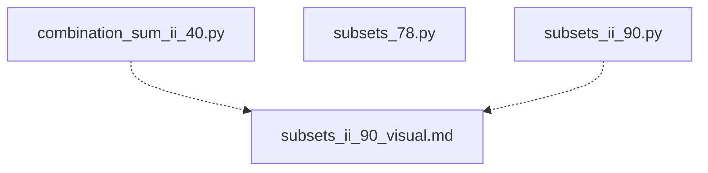

# 组合问题求解

<cite>
**本文引用的文件**   
- [solutions/stage3/backtracking/combination_sum_ii_40.py](file://solutions/stage3/backtracking/combination_sum_ii_40.py)
- [solutions/stage3/backtracking/subsets_78.py](file://solutions/stage3/backtracking/subsets_78.py)
- [solutions/stage3/backtracking/subsets_ii_90.py](file://solutions/stage3/backtracking/subsets_ii_90.py)
- [learning/stage3/subsets_ii_90_visual.md](file://learning/stage3/subsets_ii_90_visual.md)
</cite>

## 目录
1. [引言](#引言)
2. [项目结构](#项目结构)
3. [核心组件](#核心组件)
4. [架构总览](#架构总览)
5. [详细组件分析](#详细组件分析)
6. [依赖分析](#依赖分析)
7. [性能考虑](#性能考虑)
8. [故障排查指南](#故障排查指南)
9. [结论](#结论)
10. [附录](#附录)

## 引言
本学习文档围绕“组合问题”的系统性解法展开，聚焦以下目标：
- 掌握组合生成算法的设计模式：如何选择元素、如何避免重复、如何控制搜索深度。
- 通过“组合总和 II”和“子集（含重复）”的具体实现，展示不同场景下的组合生成策略。
- 重点解析去重处理方法：排序预处理、跳过相同元素与剪枝优化。
- 解释状态转移方程的建立过程，说明递归树的结构特点。
- 对比多种解法（递归回溯 vs 迭代），总结优缺点与适用场景。
- 结合实际应用场景，展示组合算法在数据分析与机器学习中的典型用途。

## 项目结构
仓库采用按主题分层的组织方式，组合相关代码集中在 stage3/backtracking 目录下，配套可视化材料位于 learning/stage3。

图示来源
- [solutions/stage3/backtracking/combination_sum_ii_40.py](file://solutions/stage3/backtracking/combination_sum_ii_40.py)
- [solutions/stage3/backtracking/subsets_78.py](file://solutions/stage3/backtracking/subsets_78.py)
- [solutions/stage3/backtracking/subsets_ii_90.py](file://solutions/stage3/backtracking/subsets_ii_90.py)
- [learning/stage3/subsets_ii_90_visual.md](file://learning/stage3/subsets_ii_90_visual.md)

章节来源
- [solutions/stage3/backtracking/combination_sum_ii_40.py](file://solutions/stage3/backtracking/combination_sum_ii_40.py)
- [solutions/stage3/backtracking/subsets_78.py](file://solutions/stage3/backtracking/subsets_78.py)
- [solutions/stage3/backtracking/subsets_ii_90.py](file://solutions/stage3/backtracking/subsets_ii_90.py)
- [learning/stage3/subsets_ii_90_visual.md](file://learning/stage3/subsets_ii_90_visual.md)

## 核心组件
- 组合总和 II（可重复使用数字但每个数字仅能使用一次，且输入可能包含重复值）
  - 关键点：排序 + 同层去重 + 剩余目标和剪枝。
  - 参考路径：[solutions/stage3/backtracking/combination_sum_ii_40.py](file://solutions/stage3/backtracking/combination_sum_ii_40.py)
- 子集（无重复元素）
  - 关键点：标准回溯模板；每层可选或不选当前元素。
  - 参考路径：[solutions/stage3/backtracking/subsets_78.py](file://solutions/stage3/backtracking/subsets_78.py)
- 子集 II（含重复元素）
  - 关键点：排序 + 同层去重；记录已在本层使用过的元素以避免重复子集。
  - 参考路径：[solutions/stage3/backtracking/subsets_ii_90.py](file://solutions/stage3/backtracking/subsets_ii_90.py)
- 可视化辅助
  - 参考路径：[learning/stage3/subsets_ii_90_visual.md](file://learning/stage3/subsets_ii_90_visual.md)

章节来源
- [solutions/stage3/backtracking/combination_sum_ii_40.py](file://solutions/stage3/backtracking/combination_sum_ii_40.py)
- [solutions/stage3/backtracking/subsets_78.py](file://solutions/stage3/backtracking/subsets_78.py)
- [solutions/stage3/backtracking/subsets_ii_90.py](file://solutions/stage3/backtracking/subsets_ii_90.py)
- [learning/stage3/subsets_ii_90_visual.md](file://learning/stage3/subsets_ii_90_visual.md)

## 架构总览
组合问题的通用回溯框架如下：
- 选择：从候选集中挑选一个元素加入路径。
- 约束：根据问题条件判断是否合法（如目标和、不越界）。
- 终止：达到目标或无法继续时收集结果并返回。
- 撤销：回溯到上一状态，尝试其他分支。

该流程适用于“子集”“组合总和II”等组合类问题，差异主要体现在约束与终止条件的定义上。

## 详细组件分析

### 组合总和 II（可重复数字但每个仅用一次，存在重复值）
- 设计要点
  - 排序：便于同层去重与提前剪枝。
  - 同层去重：在同一递归层级中，若当前元素与前一个相同且前一个未被使用于当前分支，则跳过，避免重复组合。
  - 剪枝：当剩余目标和小于等于0时，停止继续深入。
- 状态表示
  - 常用参数：起始索引 start、当前路径 path、剩余目标和 target。
- 复杂度
  - 时间：最坏 O(n·2^n)，实际因剪枝显著减少。
  - 空间：O(n) 递归栈与路径存储。
- 参考实现位置
  - [solutions/stage3/backtracking/combination_sum_ii_40.py](file://solutions/stage3/backtracking/combination_sum_ii_40.py)

图示来源
- [solutions/stage3/backtracking/combination_sum_ii_40.py](file://solutions/stage3/backtracking/combination_sum_ii_40.py)

章节来源
- [solutions/stage3/backtracking/combination_sum_ii_40.py](file://solutions/stage3/backtracking/combination_sum_ii_40.py)

### 子集（无重复元素）
- 设计要点
  - 标准回溯：对每个元素，选择“选/不选”两条分支。
  - 无需额外去重逻辑。
- 状态表示
  - 常用参数：起始索引 start、当前路径 path。
- 复杂度
  - 时间：O(n·2^n)。
  - 空间：O(n) 递归栈与路径存储。
- 参考实现位置
  - [solutions/stage3/backtracking/subsets_78.py](file://solutions/stage3/backtracking/subsets_78.py)

图示来源
- [solutions/stage3/backtracking/subsets_78.py](file://solutions/stage3/backtracking/subsets_78.py)

章节来源
- [solutions/stage3/backtracking/subsets_78.py](file://solutions/stage3/backtracking/subsets_78.py)

### 子集 II（含重复元素）
- 设计要点
  - 排序：使相同元素相邻，便于去重。
  - 同层去重：在同一层中，若当前元素与前一个相同且前一个未在当前层被使用，则跳过。
- 状态表示
  - 常用参数：起始索引 start、当前路径 path。
- 复杂度
  - 时间：O(n·2^n)，去重后实际更少。
  - 空间：O(n) 递归栈与路径存储。
- 参考实现位置
  - [solutions/stage3/backtracking/subsets_ii_90.py](file://solutions/stage3/backtracking/subsets_ii_90.py)
- 可视化辅助
  - [learning/stage3/subsets_ii_90_visual.md](file://learning/stage3/subsets_ii_90_visual.md)

图示来源
- [solutions/stage3/backtracking/subsets_ii_90.py](file://solutions/stage3/backtracking/subsets_ii_90.py)

章节来源
- [solutions/stage3/backtracking/subsets_ii_90.py](file://solutions/stage3/backtracking/subsets_ii_90.py)
- [learning/stage3/subsets_ii_90_visual.md](file://learning/stage3/subsets_ii_90_visual.md)

### 状态转移与递归树
- 状态转移方程（以“子集/组合”为例）
  - 设 f(i, state) 表示从下标 i 开始的状态转移：
    - 子集：f(i, state) = {state} ∪ f(i+1, state) ∪ f(i+1, state ∪ {nums[i]})
    - 组合总和II：f(i, state) 仅在 target - nums[i] ≥ 0 时扩展，并在同层去重条件下进行。
- 递归树特征
  - 子集：二叉树，深度 n，节点数 2^(n+1)-1。
  - 组合总和II：受 target 与去重影响，树更稀疏，剪枝显著。

图示来源
- [solutions/stage3/backtracking/subsets_78.py](file://solutions/stage3/backtracking/subsets_78.py)
- [solutions/stage3/backtracking/subsets_ii_90.py](file://solutions/stage3/backtracking/subsets_ii_90.py)

## 依赖分析
- 模块内聚与耦合
  - 各问题实现相互独立，无跨文件依赖，内聚度高，耦合度低。
- 外部依赖
  - 主要依赖语言标准库（如排序、列表操作），无第三方库强依赖。
- 循环依赖
  - 未发现循环依赖。

图示来源
- [solutions/stage3/backtracking/combination_sum_ii_40.py](file://solutions/stage3/backtracking/combination_sum_ii_40.py)
- [solutions/stage3/backtracking/subsets_78.py](file://solutions/stage3/backtracking/subsets_78.py)
- [solutions/stage3/backtracking/subsets_ii_90.py](file://solutions/stage3/backtracking/subsets_ii_90.py)
- [learning/stage3/subsets_ii_90_visual.md](file://learning/stage3/subsets_ii_90_visual.md)

章节来源
- [solutions/stage3/backtracking/combination_sum_ii_40.py](file://solutions/stage3/backtracking/combination_sum_ii_40.py)
- [solutions/stage3/backtracking/subsets_78.py](file://solutions/stage3/backtracking/subsets_78.py)
- [solutions/stage3/backtracking/subsets_ii_90.py](file://solutions/stage3/backtracking/subsets_ii_90.py)
- [learning/stage3/subsets_ii_90_visual.md](file://learning/stage3/subsets_ii_90_visual.md)

## 性能考虑
- 时间复杂度
  - 子集：O(n·2^n)。
  - 组合总和II：最坏 O(n·2^n)，经排序与剪枝后远小于最坏情况。
- 空间复杂度
  - 递归栈与路径存储 O(n)。
- 优化建议
  - 排序预处理：利于去重与剪枝。
  - 同层去重：避免同一层重复分支。
  - 提前剪枝：当剩余目标和为负或过小直接返回。
  - 迭代替代：对于大规模数据，可考虑基于位掩码的迭代方法（适用于无重复的子集）。

## 故障排查指南
- 常见错误
  - 未排序导致去重失败：需确保数组有序后再进行同层去重。
  - 去重条件写错：应比较当前元素与前一个元素，并确保前一个不在当前层被使用。
  - 忘记撤销选择：回溯后必须恢复状态，否则路径污染后续分支。
  - 边界处理不当：空输入、target 为 0、全负数等情况需单独验证。
- 定位方法
  - 打印递归树关键节点（start、path、target）。
  - 逐步注释去重与剪枝逻辑，观察输出变化。
  - 使用小规模样例（如 [1,1,2], target=3）验证去重效果。

## 结论
- 组合问题的核心在于“选择—约束—终止—撤销”的回溯范式。
- 去重的关键在于“排序 + 同层去重”，剪枝的关键在于“尽早发现不可行”。
- 子集问题体现基础回溯模板；组合总和II在此基础上增加约束与剪枝。
- 递归法直观易实现，迭代法在某些场景更高效，二者各有优劣，应根据问题特性选择。

## 附录
- 实战应用
  - 数据分析：特征组合筛选、超参数网格搜索、组合实验设计。
  - 机器学习：特征子集选择、模型集成中的组合策略、组合优化问题建模。
- 延伸阅读
  - 可视化理解：[learning/stage3/subsets_ii_90_visual.md](file://learning/stage3/subsets_ii_90_visual.md)