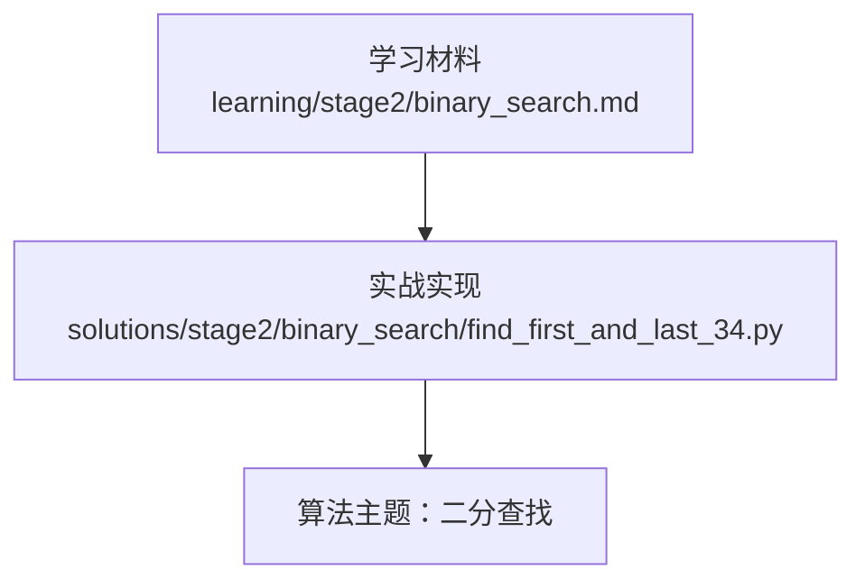
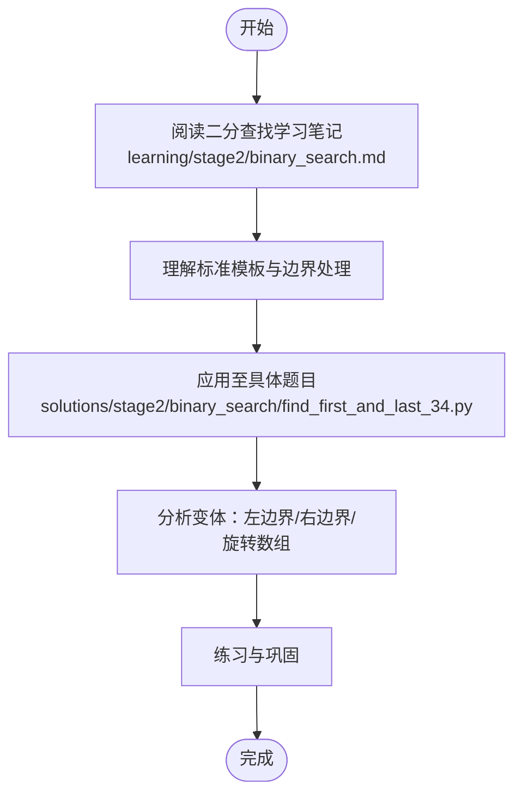
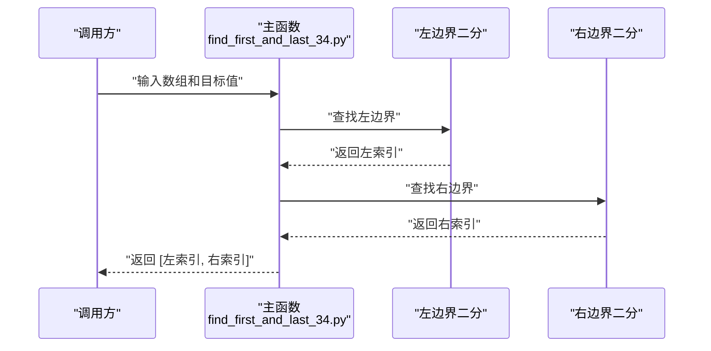
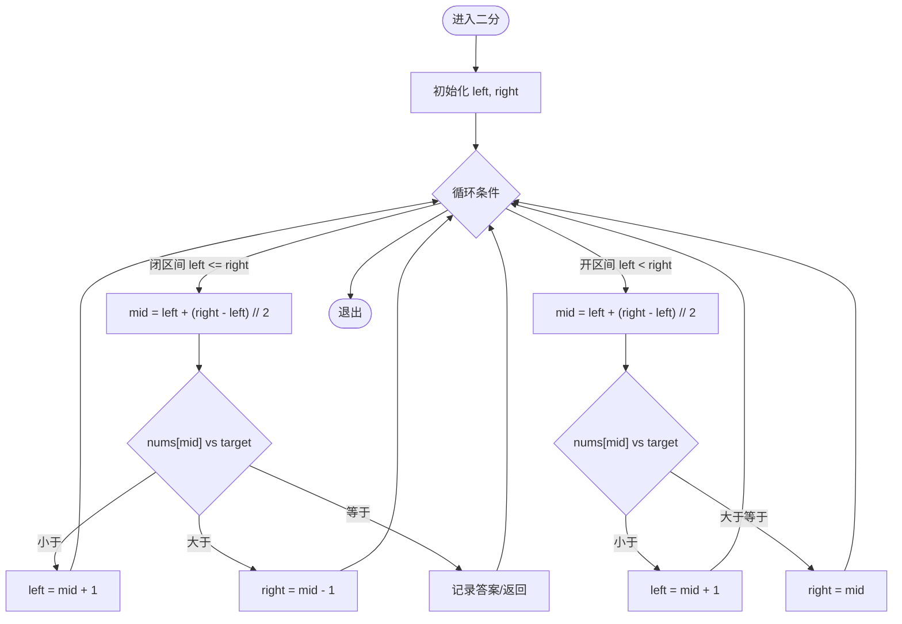
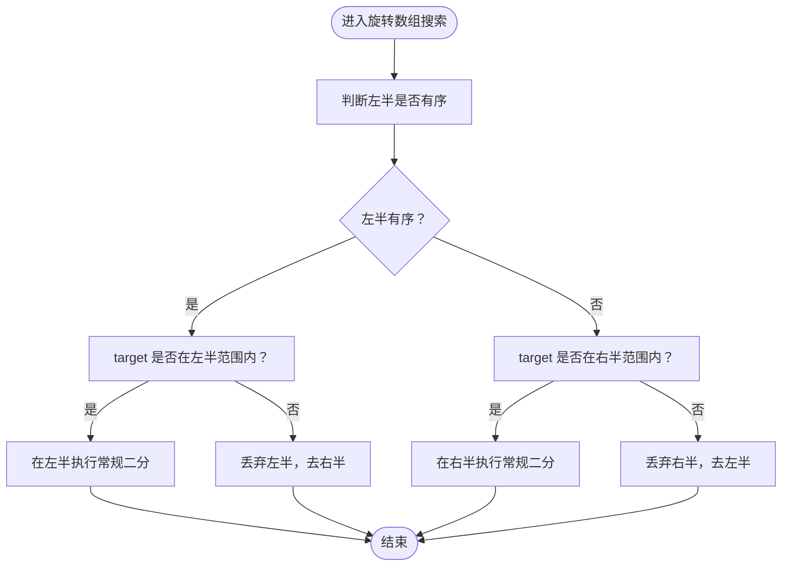

# 二分查找

<cite>
**本文引用的文件**   
- [find_first_and_last_34.py](file://solutions/stage2/binary_search/find_first_and_last_34.py)
- [binary_search.md](file://learning/stage2/binary_search.md)
</cite>

## 目录
1. [简介](#简介)
2. [项目结构](#项目结构)
3. [核心组件](#核心组件)
4. [架构总览](#架构总览)
5. [详细组件分析](#详细组件分析)
6. [依赖分析](#依赖分析)
7. [性能考虑](#性能考虑)
8. [故障排查指南](#故障排查指南)
9. [结论](#结论)
10. [附录](#附录)

## 简介
本学习文档围绕“二分查找”展开，目标是帮助读者系统掌握其核心思想、标准模板与边界处理，并深入理解常见变体问题（如寻找第一个/最后一个位置、旋转数组搜索等）。文档以仓库中的具体实现为切入点，结合图示与复杂度分析，提供可操作的调试方法与最佳实践。

## 项目结构
本项目按阶段组织学习内容与实践代码：
- learning/stage2/binary_search.md：二分查找的学习笔记与要点总结
- solutions/stage2/binary_search/find_first_and_last_34.py：LeetCode 第34题“在排序数组中查找元素的第一个和最后一个位置”的Python实现

图表来源
- [binary_search.md](file://learning/stage2/binary_search.md)
- [find_first_and_last_34.py](file://solutions/stage2/binary_search/find_first_and_last_34.py)

章节来源
- [binary_search.md](file://learning/stage2/binary_search.md)
- [find_first_and_last_34.py](file://solutions/stage2/binary_search/find_first_and_last_34.py)

## 核心组件
本节聚焦二分查找的核心要素与通用模板，便于后续对具体题目进行拆解与迁移。

- 基本思想
  - 在有序序列上通过不断折半缩小搜索空间，每次比较中间元素与目标值，从而将问题规模减半。
  - 关键：维护一个明确的“搜索区间”，并在每一步正确收缩该区间。

- 标准模板（闭区间）
  - 区间定义：[left, right]，左右指针均包含在内
  - 循环条件：left <= right
  - 更新策略：
    - mid = left + (right - left) // 2
    - 若 nums[mid] < target：left = mid + 1
    - 若 nums[mid] > target：right = mid - 1
    - 若相等：根据题意记录答案或继续收缩
  - 终止条件：left > right，搜索结束

- 标准模板（开区间）
  - 区间定义：(left, right)，左右指针均不包含在内
  - 循环条件：left < right
  - 更新策略：
    - mid = left + (right - left) // 2
    - 若 nums[mid] < target：left = mid + 1
    - 若 nums[mid] >= target：right = mid
  - 终止条件：left == right，最终候选为 left（或 right）

- 开区间与闭区间的差异
  - 闭区间更直观，适合“找到即返回”的场景；开区间更适合“找左边界/右边界”的变体，能自然收敛到插入点或边界点。
  - 开区间模板下，mid 取法与更新策略需保持一致，避免死循环。

- 常见变体思路
  - 寻找第一个等于 target 的位置（左边界）：当 nums[mid] >= target 时，right = mid - 1（闭区间）或 right = mid（开区间），并记录可能的答案。
  - 寻找最后一个等于 target 的位置（右边界）：当 nums[mid] <= target 时，left = mid + 1（闭区间）或 left = mid + 1（开区间），并记录可能的答案。
  - 旋转数组搜索：先判断哪一半是有序的，再决定在有序半段内做常规二分，或在无序半段继续折半。

章节来源
- [binary_search.md](file://learning/stage2/binary_search.md)

## 架构总览
从“学习材料”到“实战实现”的知识传递路径如下：

图表来源
- [binary_search.md](file://learning/stage2/binary_search.md)
- [find_first_and_last_34.py](file://solutions/stage2/binary_search/find_first_and_last_34.py)

## 详细组件分析

### 组件A：寻找第一个和最后一个位置（LeetCode 34）
本题要求在排序数组中找到目标值的起始与结束索引。典型解法是两次二分：一次找左边界，一次找右边界。

- 解题思路
  - 第一次二分：寻找“第一个不小于 target 的位置”（左边界）
    - 使用开区间模板或闭区间模板均可，关键在于当 nums[mid] >= target 时收缩右侧，并记录可能答案。
  - 第二次二分：寻找“最后一个不大于 target 的位置”（右边界）
    - 当 nums[mid] <= target 时收缩左侧，并记录可能答案。
  - 若左边界大于右边界，说明不存在目标值，返回 [-1, -1]。

- 重复元素与边界情况处理
  - 重复元素：通过“>=”或“<=”的比较方向确保不会错过边界。
  - 空数组：直接返回 [-1, -1]。
  - 目标值不在数组中：左边界会落在“插入点”，需要与右边界校验。

- 流程示意（基于实际实现的调用关系）

图表来源
- [find_first_and_last_34.py](file://solutions/stage2/binary_search/find_first_and_last_34.py)

- 复杂度分析
  - 时间复杂度：O(log n)，两次独立的二分查找
  - 空间复杂度：O(1)，仅使用常数级额外空间

章节来源
- [find_first_and_last_34.py](file://solutions/stage2/binary_search/find_first_and_last_34.py)

### 组件B：二分查找模板对比（概念性）
以下流程图展示两种常用模板的关键分支与更新策略，便于对照记忆与选择。

图表来源
- [binary_search.md](file://learning/stage2/binary_search.md)

章节来源
- [binary_search.md](file://learning/stage2/binary_search.md)

### 组件C：旋转数组中的搜索（概念性）
旋转数组搜索的关键在于“判定哪一半是有序的”，然后在有序半段内进行常规二分，否则向另一半继续折半。

图表来源
- [binary_search.md](file://learning/stage2/binary_search.md)

章节来源
- [binary_search.md](file://learning/stage2/binary_search.md)

## 依赖分析
- 学习材料与实现的关系
  - binary_search.md 提供模板与边界处理的理论支撑
  - find_first_and_last_34.py 将模板应用于具体场景，体现“左边界/右边界”的两次二分组合

图表来源
- [binary_search.md](file://learning/stage2/binary_search.md)
- [find_first_and_last_34.py](file://solutions/stage2/binary_search/find_first_and_last_34.py)

章节来源
- [binary_search.md](file://learning/stage2/binary_search.md)
- [find_first_and_last_34.py](file://solutions/stage2/binary_search/find_first_and_last_34.py)

## 性能考虑
- 时间复杂度
  - 标准二分：O(log n)
  - 双边界（如第34题）：仍为 O(log n)，因为两次独立二分相加仍是常数倍
- 空间复杂度
  - 迭代实现：O(1)
  - 递归实现：O(log n) 栈空间（一般不推荐用于大规模数据）
- 优化技巧
  - 优先使用迭代模板，避免递归开销
  - 统一 mid 计算方式，防止溢出
  - 明确区间语义（开/闭），保持更新策略一致，避免死循环
  - 对边界情况（空数组、无目标值）提前处理，减少无效计算

## 故障排查指南
- 常见陷阱
  - 区间语义不一致：例如用闭区间却写成 left < right，导致漏判或死循环
  - mid 计算不当：未使用 left + (right - left) // 2，存在溢出风险
  - 更新策略错误：在寻找左边界时将 left = mid + 1 误写为 left = mid，造成无法收敛
  - 忘记处理空数组或目标值不存在的情况
- 调试方法
  - 打印 left、right、mid 与比较结果，观察区间收缩是否正确
  - 针对边界用例（空数组、单元素、全部相同、目标值在两端）逐一验证
  - 将“开区间模板”与“闭区间模板”分别在小样例上手工推演，确认逻辑一致性

章节来源
- [binary_search.md](file://learning/stage2/binary_search.md)
- [find_first_and_last_34.py](file://solutions/stage2/binary_search/find_first_and_last_34.py)

## 结论
二分查找的核心在于“明确区间语义+一致的更新策略”。掌握闭区间与开区间两套模板后，可将大多数变体问题转化为“左边界/右边界”的固定套路。对于旋转数组等复杂场景，关键是“判定有序半段+在有序半段内做常规二分”。通过严格的边界测试与调试手段，可以显著降低出错概率并提升实现稳定性。

## 附录
- 快速自检清单
  - 我是否明确了区间是开区间还是闭区间？
  - 循环条件是否与区间语义匹配？
  - mid 的计算是否安全？
  - 更新策略是否会跳过目标或陷入死循环？
  - 是否覆盖了空数组、无目标值、全相同元素等边界用例？