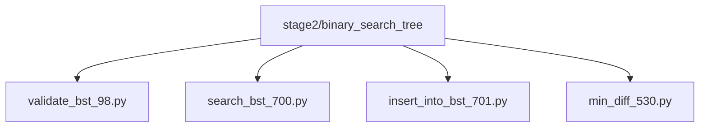
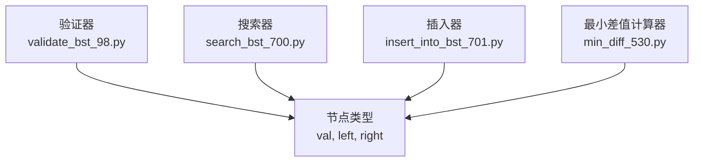
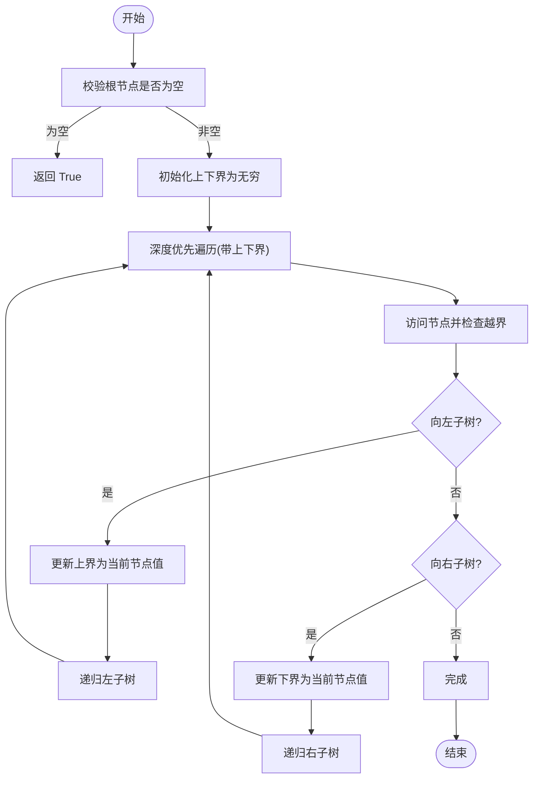
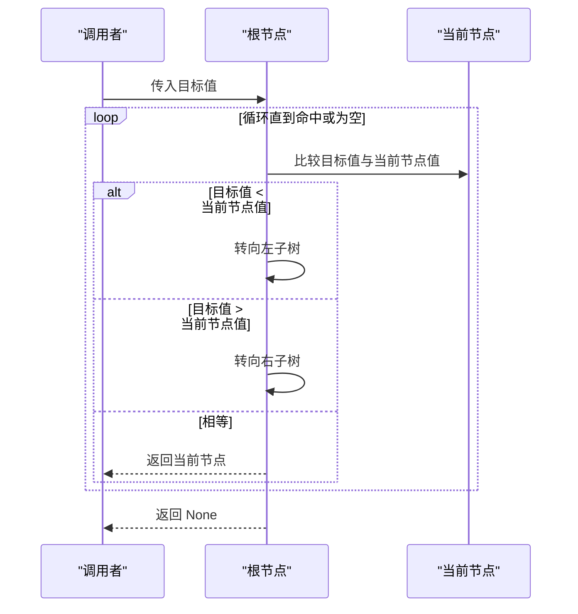
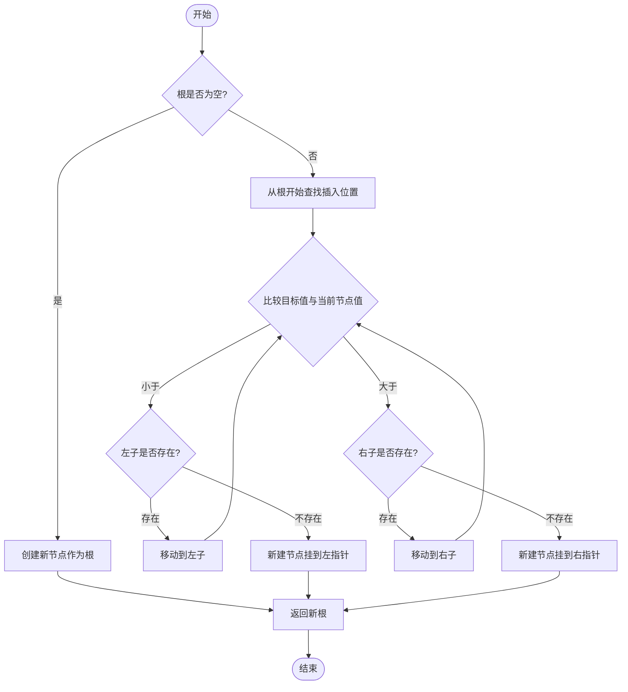
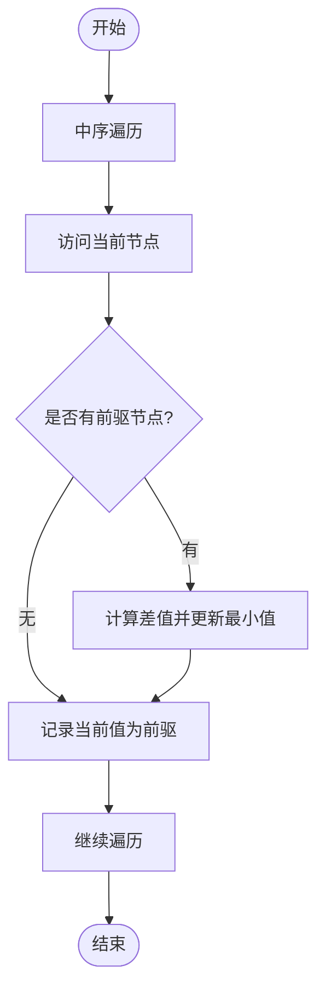
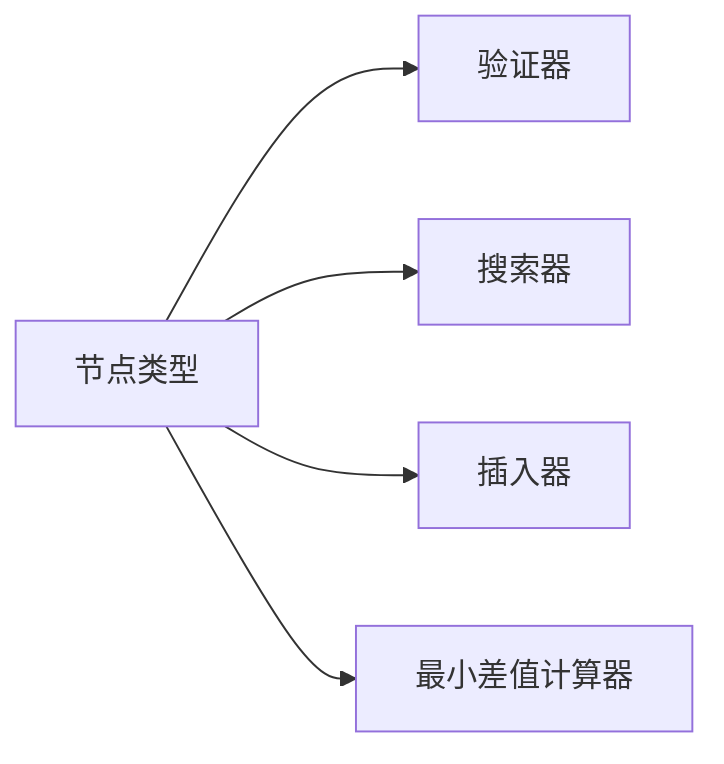

# 二叉搜索树

<cite>
**本文引用的文件**   
- [validate_bst_98.py](file://solutions/stage2/binary_search_tree/validate_bst_98.py)
- [search_bst_700.py](file://solutions/stage2/binary_search_tree/search_bst_700.py)
- [insert_into_bst_701.py](file://solutions/stage2/binary_search_tree/insert_into_bst_701.py)
- [min_diff_530.py](file://solutions/stage2/binary_search_tree/min_diff_530.py)
</cite>

## 目录
1. [简介](#简介)
2. [项目结构](#项目结构)
3. [核心组件](#核心组件)
4. [架构总览](#架构总览)
5. [详细组件分析](#详细组件分析)
6. [依赖分析](#依赖分析)
7. [性能考虑](#性能考虑)
8. [故障排查指南](#故障排查指南)
9. [结论](#结论)
10. [附录](#附录)

## 简介
本学习文档围绕二叉搜索树（BST）的核心性质与典型操作展开，重点讲解以下四个实现文件：
- 验证 BST 合法性（递归与迭代两种思路）
- 在 BST 中搜索节点（利用有序性剪枝）
- 向 BST 插入新节点（定位与链接）
- 计算 BST 的最小差值（中序遍历的单调性）

同时补充删除操作的三种情况处理、与其他树结构的对比以及实际应用的性能考量。

## 项目结构
本项目将 BST 相关题目按“阶段 + 主题”组织，本次关注 stage2/binary_search_tree 下的四个实现文件。

图表来源
- [validate_bst_98.py](file://solutions/stage2/binary_search_tree/validate_bst_98.py)
- [search_bst_700.py](file://solutions/stage2/binary_search_tree/search_bst_700.py)
- [insert_into_bst_701.py](file://solutions/stage2/binary_search_tree/insert_into_bst_701.py)
- [min_diff_530.py](file://solutions/stage2/binary_search_tree/min_diff_530.py)

章节来源
- [validate_bst_98.py](file://solutions/stage2/binary_search_tree/validate_bst_98.py)
- [search_bst_700.py](file://solutions/stage2/binary_search_tree/search_bst_700.py)
- [insert_into_bst_701.py](file://solutions/stage2/binary_search_tree/insert_into_bst_701.py)
- [min_diff_530.py](file://solutions/stage2/binary_search_tree/min_diff_530.py)

## 核心组件
- 节点定义：所有实现共用一个二叉树节点类型，包含值与左右子指针。该类型是后续所有算法的数据载体。
- 验证器：提供多种方法判断一棵二叉树是否满足 BST 性质。
- 搜索器：基于 BST 的有序性快速定位目标值。
- 插入器：在保持 BST 性质的前提下插入新节点。
- 最小差值计算器：利用中序遍历的递增序列特性求相邻元素最小差值。

章节来源
- [validate_bst_98.py](file://solutions/stage2/binary_search_tree/validate_bst_98.py)
- [search_bst_700.py](file://solutions/stage2/binary_search_tree/search_bst_700.py)
- [insert_into_bst_701.py](file://solutions/stage2/binary_search_tree/insert_into_bst_701.py)
- [min_diff_530.py](file://solutions/stage2/binary_search_tree/min_diff_530.py)

## 架构总览
下图展示了四个模块之间的职责分工与调用关系。它们都围绕同一节点类型工作，分别承担验证、搜索、插入与统计任务。

图表来源
- [validate_bst_98.py](file://solutions/stage2/binary_search_tree/validate_bst_98.py)
- [search_bst_700.py](file://solutions/stage2/binary_search_tree/search_bst_700.py)
- [insert_into_bst_701.py](file://solutions/stage2/binary_search_tree/insert_into_bst_701.py)
- [min_diff_530.py](file://solutions/stage2/binary_search_tree/min_diff_530.py)

## 详细组件分析

### 验证 BST 合法性（递归与迭代）
- 核心性质：对任意节点，其左子树所有节点值必须严格小于该节点值，右子树所有节点值必须严格大于该节点值。因此不能仅比较父子两节点，而需维护每个节点的取值范围（上界与下界）。
- 递归方法要点：
  - 自顶向下传递上下界，每进入左子树更新上界为当前节点值，进入右子树更新下界为当前节点值。
  - 空节点视为合法；遇到越界立即返回不合法。
- 迭代方法要点：
  - 使用显式栈模拟递归过程，或采用中序遍历的单调性检查（前驱值严格递增）。
  - 中序遍历法：维护上一个访问节点的值，若出现非递增则非法。
- 复杂度：时间 O(n)，空间最坏 O(n)（退化链），平均 O(log n)。

图表来源
- [validate_bst_98.py](file://solutions/stage2/binary_search_tree/validate_bst_98.py)

章节来源
- [validate_bst_98.py](file://solutions/stage2/binary_search_tree/validate_bst_98.py)

### 在 BST 中搜索节点（优化策略）
- 利用有序性：从根出发，若目标值小于当前节点值，则只搜索左子树；若大于，则只搜索右子树；等于则命中。
- 递归与迭代均可实现，迭代版本更省栈空间。
- 复杂度：平均 O(log n)，最坏 O(n)（退化为链表）。

图表来源
- [search_bst_700.py](file://solutions/stage2/binary_search_tree/search_bst_700.py)

章节来源
- [search_bst_700.py](file://solutions/stage2/binary_search_tree/search_bst_700.py)

### 向 BST 插入新节点（定位与链接）
- 定位路径：与搜索类似，沿大小关系决定走向，直至找到空位。
- 链接过程：创建新节点后，将其挂到父节点的左或右指针上。
- 返回值：通常返回新的根节点，以处理插入到空树的边界情况。
- 复杂度：平均 O(log n)，最坏 O(n)。

图表来源
- [insert_into_bst_701.py](file://solutions/stage2/binary_search_tree/insert_into_bst_701.py)

章节来源
- [insert_into_bst_701.py](file://solutions/stage2/binary_search_tree/insert_into_bst_701.py)

### 计算 BST 的最小差值（中序遍历）
- 关键性质：BST 的中序遍历结果是严格递增序列。最小差值必出现在相邻元素之间。
- 实现思路：
  - 中序遍历过程中维护上一个访问节点的值，计算与前驱的差值并更新全局最小值。
  - 可使用递归或迭代（显式栈）实现中序遍历。
- 复杂度：时间 O(n)，空间 O(h)（h 为树高）。

图表来源
- [min_diff_530.py](file://solutions/stage2/binary_search_tree/min_diff_530.py)

章节来源
- [min_diff_530.py](file://solutions/stage2/binary_search_tree/min_diff_530.py)

### BST 删除操作（三种情况）
说明：本节为概念性总结，未直接分析具体代码文件。
- 待删节点无子节点：直接断开引用即可。
- 待删节点仅有一个子节点：用其子节点替换该节点。
- 待删节点有两个子节点：
  - 常用策略：用后继节点（右子树最小值）或前驱节点（左子树最大值）的值覆盖当前节点，然后递归删除后继/前驱节点。
  - 注意：删除后继/前驱时，其最多只有一个子节点，从而退化为前两种情况。
- 复杂度：平均 O(log n)，最坏 O(n)。

[本节为概念性内容，无需图表来源]

## 依赖分析
四个模块均依赖统一的节点类型，彼此间无直接耦合，属于“同构数据 + 独立算法”的松耦合设计。

图表来源
- [validate_bst_98.py](file://solutions/stage2/binary_search_tree/validate_bst_98.py)
- [search_bst_700.py](file://solutions/stage2/binary_search_tree/search_bst_700.py)
- [insert_into_bst_701.py](file://solutions/stage2/binary_search_tree/insert_into_bst_701.py)
- [min_diff_530.py](file://solutions/stage2/binary_search_tree/min_diff_530.py)

章节来源
- [validate_bst_98.py](file://solutions/stage2/binary_search_tree/validate_bst_98.py)
- [search_bst_700.py](file://solutions/stage2/binary_search_tree/search_bst_700.py)
- [insert_into_bst_701.py](file://solutions/stage2/binary_search_tree/insert_into_bst_701.py)
- [min_diff_530.py](file://solutions/stage2/binary_search_tree/min_diff_530.py)

## 性能考虑
- 时间复杂度
  - 搜索/插入/删除：平均 O(log n)，最坏 O(n)（退化为单链）。
  - 验证：O(n)。
  - 最小差值：O(n)。
- 空间复杂度
  - 递归深度与树高 h 成正比，平均 O(log n)，最坏 O(n)。
  - 迭代版本可将额外空间降至 O(h)。
- 退化场景与缓解
  - 极端不平衡会导致性能退化。可通过平衡 BST（如 AVL、红黑树）或随机化插入顺序降低风险。
- 缓存与局部性
  - 中序遍历的连续访问模式有利于缓存命中。
- 并发与不可变
  - 在高并发读多写少场景，可考虑不可变树或读写分离策略。

[本节为通用指导，无需章节来源]

## 故障排查指南
- 验证失败常见原因
  - 仅比较父子节点而未维护全局上下界，导致形如“左子树中存在大于祖先”的情况未被捕获。
  - 边界条件：空树应视为合法；重复值的处理需与题目约定一致（严格不等或非严格不等）。
- 搜索异常
  - 忘记处理空指针导致空引用错误。
  - 比较逻辑方向写反导致死循环或遗漏分支。
- 插入问题
  - 未正确处理空树根节点，导致返回值不正确。
  - 链接时左右指针赋值错误。
- 最小差值错误
  - 未正确维护“前驱节点”，或在首次访问时误算差值。
  - 未使用严格递增假设，忽略重复值场景。

章节来源
- [validate_bst_98.py](file://solutions/stage2/binary_search_tree/validate_bst_98.py)
- [search_bst_700.py](file://solutions/stage2/binary_search_tree/search_bst_700.py)
- [insert_into_bst_701.py](file://solutions/stage2/binary_search_tree/insert_into_bst_701.py)
- [min_diff_530.py](file://solutions/stage2/binary_search_tree/min_diff_530.py)

## 结论
通过对验证、搜索、插入与最小差值四个典型操作的深入剖析，可以清晰看到 BST 的核心价值在于“有序性带来的剪枝能力”。掌握上下界约束、中序遍历单调性与分治思想，是高效实现与调试 BST 的关键。对于删除等复杂操作，理解后继/前驱替换策略能显著简化实现。结合平衡化与工程实践，BST 可在多数动态集合场景中提供稳定高效的性能。

[本节为总结性内容，无需章节来源]

## 附录
- 术语
  - 上界/下界：用于约束节点取值范围的数值边界。
  - 后继/前驱：在中序序列中的下一个/上一个节点。
- 扩展阅读
  - 平衡二叉搜索树（AVL、红黑树）
  - 区间查询与范围统计（线段树、树状数组）

[本节为概念性内容，无需章节来源]