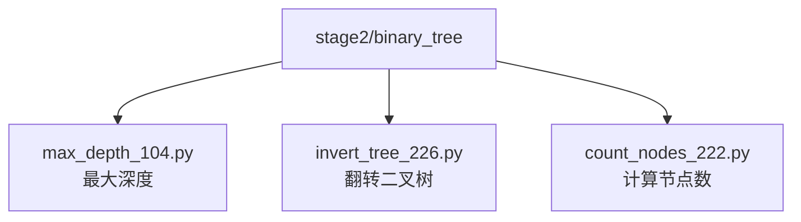
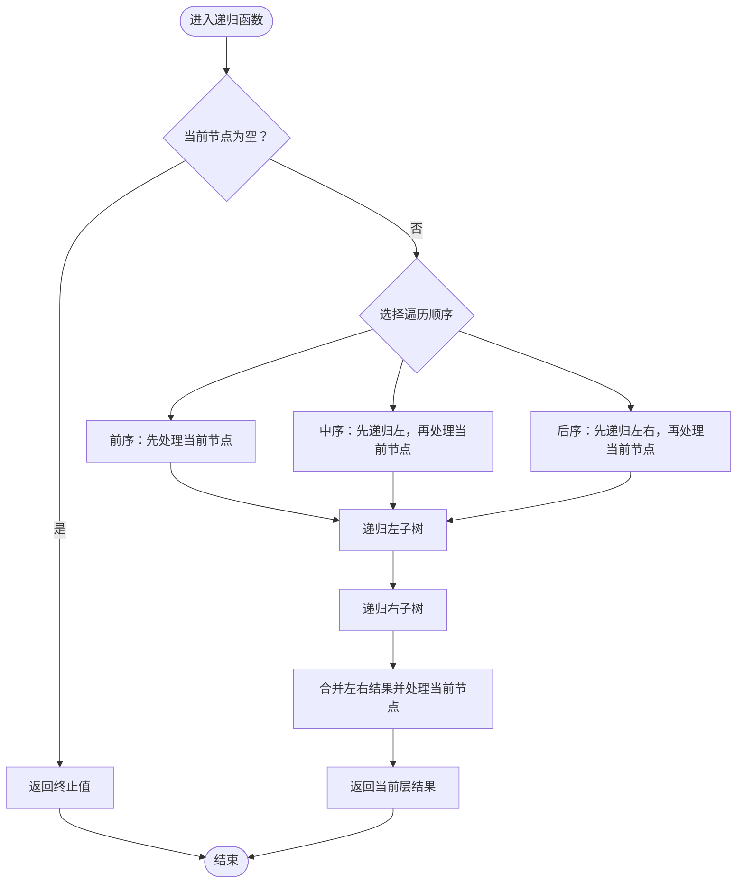
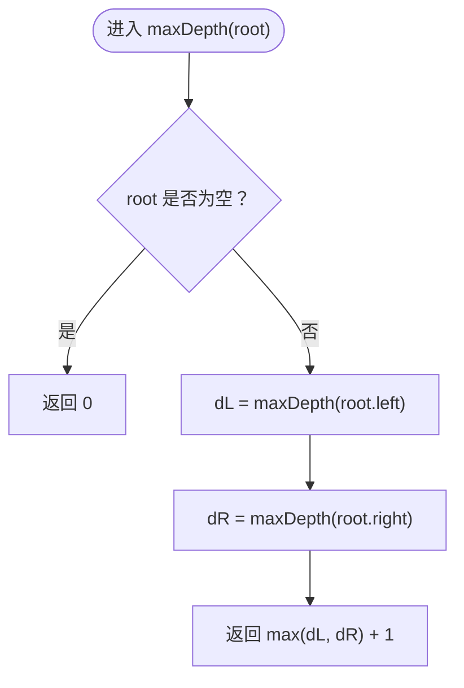
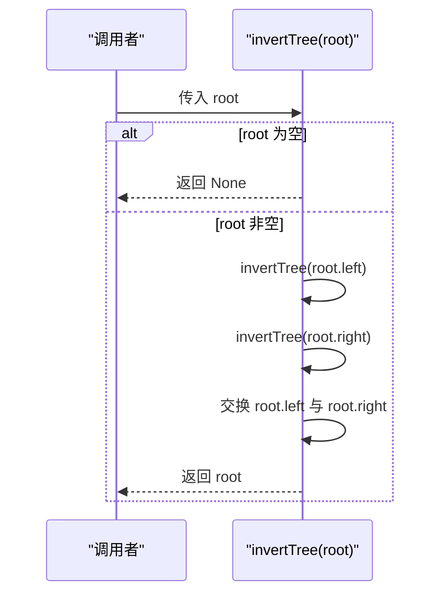
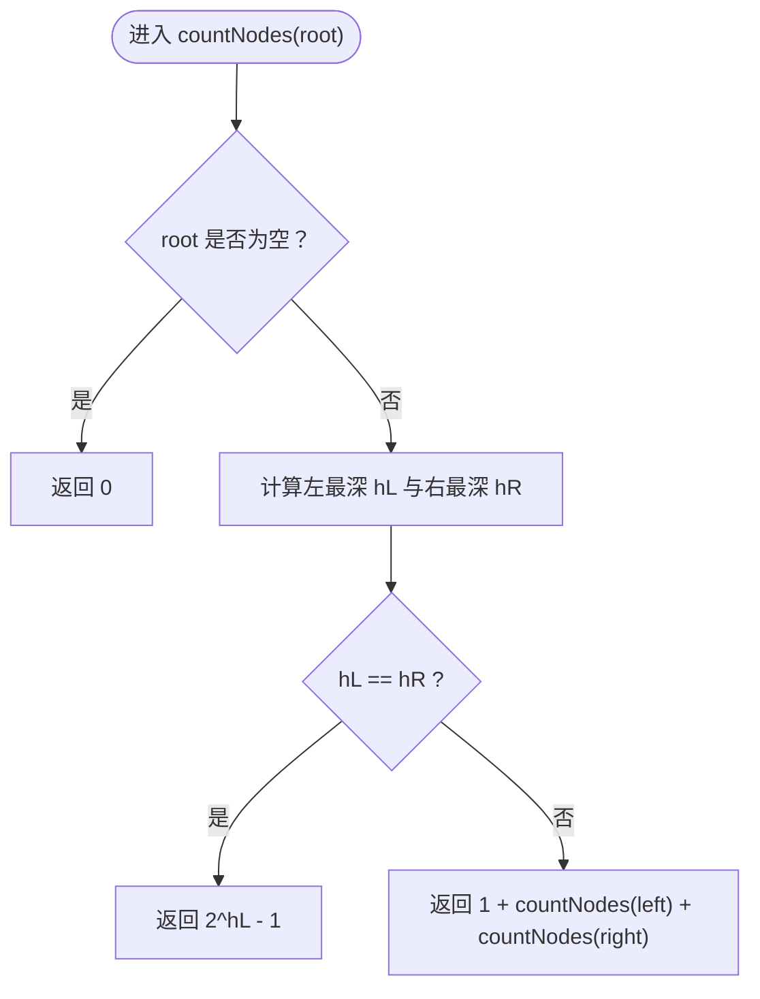
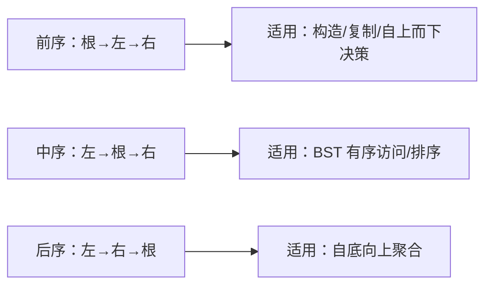
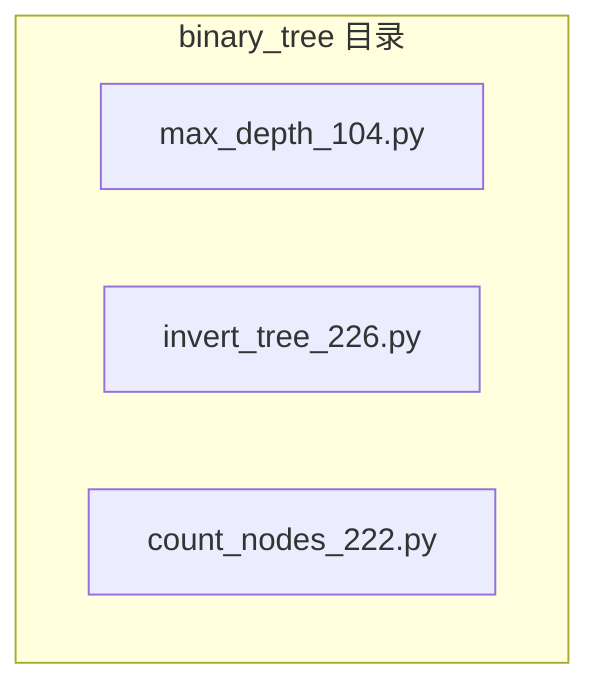

# 二叉树基础

<cite>
**本文引用的文件**   
- [max_depth_104.py](file://solutions/stage2/binary_tree/max_depth_104.py)
- [invert_tree_226.py](file://solutions/stage2/binary_tree/invert_tree_226.py)
- [count_nodes_222.py](file://solutions/stage2/binary_tree/count_nodes_222.py)
</cite>

## 目录
1. [简介](#简介)
2. [项目结构](#项目结构)
3. [核心组件](#核心组件)
4. [架构总览](#架构总览)
5. [详细组件分析](#详细组件分析)
6. [依赖分析](#依赖分析)
7. [性能考虑](#性能考虑)
8. [故障排查指南](#故障排查指南)
9. [结论](#结论)
10. [附录](#附录)

## 简介
本学习文档围绕二叉树的递归思维与基础操作展开，聚焦以下目标：
- 建立递归思维模式：如何定义递归函数、确定终止条件、设计返回值与状态传递。
- 掌握三种遍历（前序、中序、后序）的实现原理与应用场景。
- 通过三道典型题目深入理解递归在树结构中的应用：
  - 最大深度（求树高）
  - 翻转二叉树（镜像变换）
  - 计算节点数（含完全二叉树的优化）

## 项目结构
仓库中与二叉树相关的实现位于 stage2/binary_tree 目录下，包含三个独立脚本，分别对应三道经典题。每个脚本自包含一个函数式解法，便于单独阅读与调试。

**图示来源**
- [max_depth_104.py](file://solutions/stage2/binary_tree/max_depth_104.py)
- [invert_tree_226.py](file://solutions/stage2/binary_tree/invert_tree_226.py)
- [count_nodes_222.py](file://solutions/stage2/binary_tree/count_nodes_222.py)

**章节来源**
- [max_depth_104.py](file://solutions/stage2/binary_tree/max_depth_104.py)
- [invert_tree_226.py](file://solutions/stage2/binary_tree/invert_tree_226.py)
- [count_nodes_222.py](file://solutions/stage2/binary_tree/count_nodes_222.py)

## 核心组件
- 递归函数设计三要素
  - 参数：当前子树根节点（必要时携带额外状态）。
  - 返回值：对当前子树问题的答案（如高度、计数、布尔判定等）。
  - 终止条件：空节点或叶子节点的直接返回。
- 递归调用顺序
  - 前序：先处理当前节点，再递归左右子树。
  - 中序：先递归左子树，再处理当前节点，最后递归右子树。
  - 后序：先递归左右子树，再处理当前节点。
- 常见应用场景
  - 前序：复制/序列化/构造树、路径累加等“自上而下”的信息传递。
  - 中序：BST 有序访问、排序相关任务。
  - 后序：自底向上聚合信息（如高度、平衡性、最小公共祖先等）。

**章节来源**
- [max_depth_104.py](file://solutions/stage2/binary_tree/max_depth_104.py)
- [invert_tree_226.py](file://solutions/stage2/binary_tree/invert_tree_226.py)
- [count_nodes_222.py](file://solutions/stage2/binary_tree/count_nodes_222.py)

## 架构总览
从算法流程视角看，三个脚本各自封装了一个独立的递归过程，彼此无耦合。下图展示它们共用的“递归模板”抽象。

[此图为概念流程图，不直接映射具体源码文件]

## 详细组件分析

### 最大深度（max_depth_104.py）
- 问题本质：求以当前节点为根的子树的最大深度。
- 递归设计
  - 终止条件：空节点深度为 0。
  - 递归关系：当前节点深度 = max(左子树深度, 右子树深度) + 1。
  - 返回值：整数（子树深度）。
- 复杂度
  - 时间：O(n)，每个节点访问一次。
  - 空间：O(h)，h 为树高，最坏 O(n)，平均 O(log n)。
- 可视化理解
  - 将“深度”视为自底向上的“高度”，叶子节点高度为 1，逐层取最大值并上移。

**图示来源**
- [max_depth_104.py](file://solutions/stage2/binary_tree/max_depth_104.py)

**章节来源**
- [max_depth_104.py](file://solutions/stage2/binary_tree/max_depth_104.py)

### 翻转二叉树（invert_tree_226.py）
- 问题本质：交换每个节点的左右子树，得到原树的镜像。
- 递归设计
  - 终止条件：空节点直接返回。
  - 递归关系：先递归翻转左右子树，再交换当前节点的左右指针。
  - 返回值：通常返回新根（即原 root），便于链式调用。
- 关键点
  - 交换时机：可在“前序”或“后序”完成；若采用“前序”，需确保在交换后再递归左右子树，避免重复交换导致回退。
- 复杂度
  - 时间：O(n)。
  - 空间：O(h)。

**图示来源**
- [invert_tree_226.py](file://solutions/stage2/binary_tree/invert_tree_226.py)

**章节来源**
- [invert_tree_226.py](file://solutions/stage2/binary_tree/invert_tree_226.py)

### 计算节点数（count_nodes_222.py）
- 朴素思路：后序遍历统计左右子树节点数之和再加 1。
- 优化策略（针对完全二叉树）
  - 判断左右子树是否“满”：比较最左路径与最右路径的高度。
  - 若相等：整棵子树为满二叉树，节点数为 2^h - 1，可直接公式计算。
  - 若不等：递归统计左右子树节点数并相加。
- 复杂度
  - 普通二叉树：O(n)。
  - 完全二叉树：O((log n)^2)，因为每次可快速判定满树并剪枝。
- 关键细节
  - 高度计算：沿最左/最右路径向下计数即可。
  - 边界：空树返回 0。

**图示来源**
- [count_nodes_222.py](file://solutions/stage2/binary_tree/count_nodes_222.py)

**章节来源**
- [count_nodes_222.py](file://solutions/stage2/binary_tree/count_nodes_222.py)

### 三种遍历的对比与使用建议
- 前序（根-左-右）
  - 适合：构建/复制树、路径累加、先处理父节点再决定子节点行为。
- 中序（左-根-右）
  - 适合：BST 的升序访问、区间查询、按序处理。
- 后序（左-右-根）
  - 适合：自底向上聚合（高度、平衡性、最小公共祖先等）。

[此图为概念图，不直接映射具体源码文件]

## 依赖分析
三个脚本相互独立，均仅依赖语言内置数据结构与基本运算，不存在模块间耦合。

**图示来源**
- [max_depth_104.py](file://solutions/stage2/binary_tree/max_depth_104.py)
- [invert_tree_226.py](file://solutions/stage2/binary_tree/invert_tree_226.py)
- [count_nodes_222.py](file://solutions/stage2/binary_tree/count_nodes_222.py)

**章节来源**
- [max_depth_104.py](file://solutions/stage2/binary_tree/max_depth_104.py)
- [invert_tree_226.py](file://solutions/stage2/binary_tree/invert_tree_226.py)
- [count_nodes_222.py](file://solutions/stage2/binary_tree/count_nodes_222.py)

## 性能考虑
- 递归深度与栈空间
  - 树越不平衡，递归深度越大，可能引发栈溢出风险。极端情况下考虑迭代实现或显式栈。
- 剪枝与提前返回
  - 如完全二叉树判满后直接公式计算，显著降低时间复杂度。
- 尾递归优化
  - Python 不支持尾递归优化，应避免过深递归；必要时改用迭代或分治+记忆化。

[本节为通用指导，无需源码引用]

## 故障排查指南
- 常见问题
  - 忘记终止条件：导致无限递归或空指针异常。
  - 返回值语义不清：混淆“高度”和“深度”的定义，导致 +1/-1 错误。
  - 交换顺序错误：翻转时未正确保存临时变量或交换时机不当。
  - 完全二叉树判满逻辑错误：最左/最右路径高度计算不一致。
- 调试技巧
  - 打印日志：在进入/退出递归处输出当前节点值与返回结果。
  - 小规模用例：用单节点、双节点、退化链表型树逐步验证。
  - 可视化：借助 ASCII 树或绘图工具观察翻转前后结构变化。
  - 单元测试：覆盖空树、满树、完全二叉树、近似完全二叉树等边界。

[本节为通用指导，无需源码引用]

## 结论
- 递归是解决树问题的首选范式：明确“做什么、何时做、如何做”。
- 三种遍历各有侧重，选择合适顺序能简化问题建模。
- 利用树的结构特性（如完全二叉树）进行剪枝，可获得显著性能提升。
- 良好的终止条件与返回值设计是递归正确性的基石。

[本节为总结性内容，无需源码引用]

## 附录
- 术语速查
  - 深度：从根到该节点的路径长度。
  - 高度：从该节点到最深叶子的路径长度。
  - 满二叉树：所有内部节点都有两个子节点且所有叶子在同一层的二叉树。
  - 完全二叉树：除最后一层外其余层全满，最后一层从左到右连续填充。
- 推荐练习
  - 在前序/中序/后序框架下改写上述三题，体会不同顺序带来的差异。
  - 尝试用迭代（显式栈）重写，加深理解递归与栈的关系。

[本节为补充知识，无需源码引用]