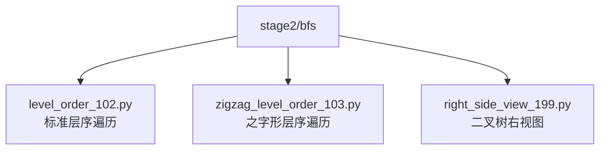
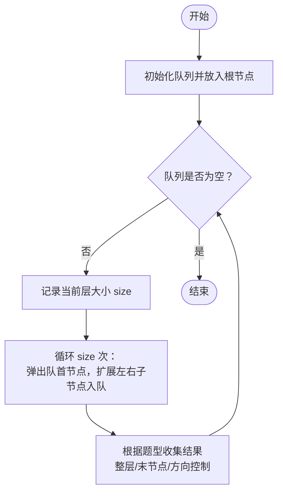
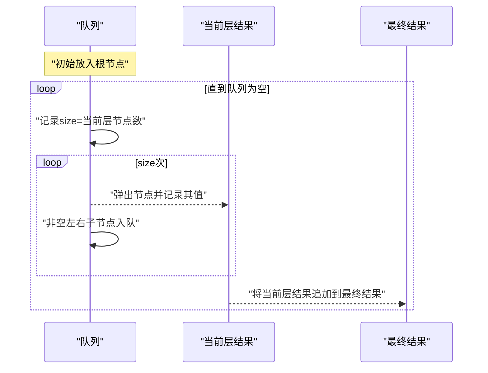
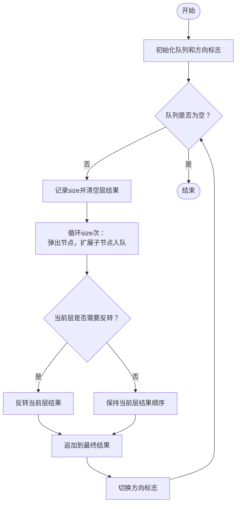
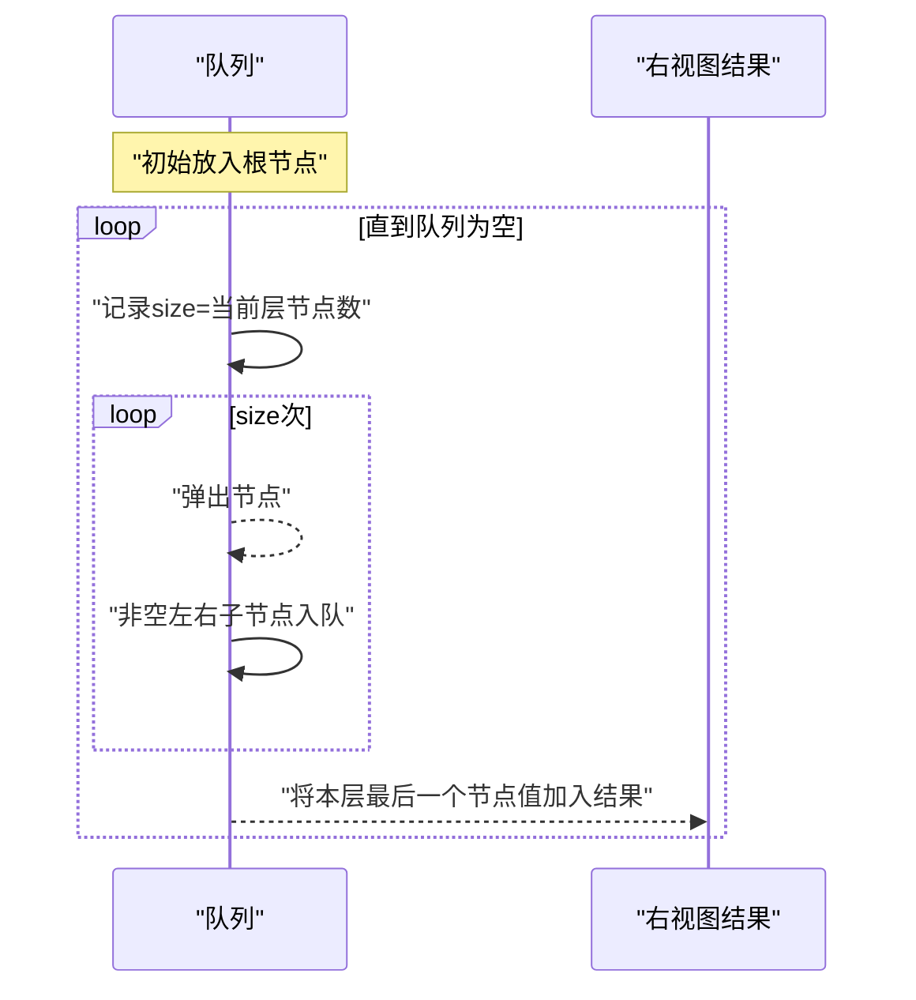
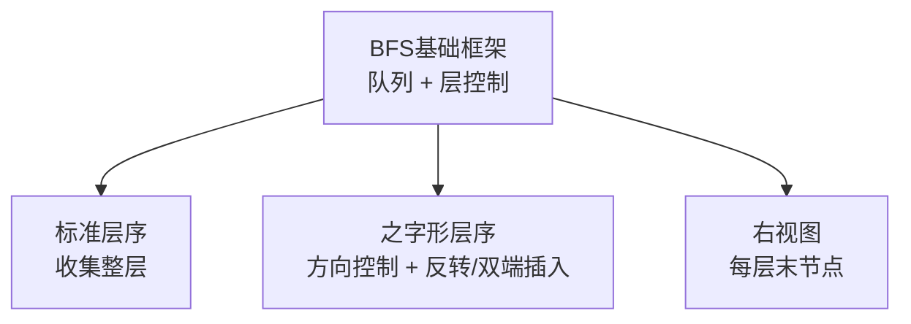
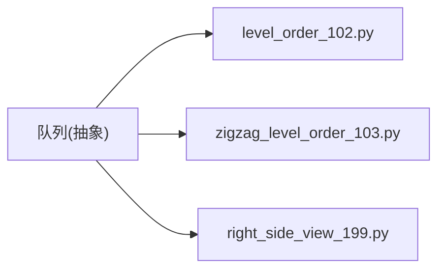

# 广度优先搜索(BFS)

<cite>
**本文引用的文件**   
- [level_order_102.py](file://solutions/stage2/bfs/level_order_102.py)
- [zigzag_level_order_103.py](file://solutions/stage2/bfs/zigzag_level_order_103.py)
- [right_side_view_199.py](file://solutions/stage2/bfs/right_side_view_199.py)
</cite>

## 目录
1. [简介](#简介)
2. [项目结构](#项目结构)
3. [核心组件](#核心组件)
4. [架构总览](#架构总览)
5. [详细组件分析](#详细组件分析)
6. [依赖分析](#依赖分析)
7. [性能考虑](#性能考虑)
8. [故障排查指南](#故障排查指南)
9. [结论](#结论)
10. [附录](#附录)

## 简介
本学习文档围绕二叉树的广度优先搜索（BFS）展开，重点讲解：
- BFS的核心思想与队列数据结构的应用
- 层次遍历的基本模式
- 三个典型实现的分析与对比：
  - 层序遍历（标准层序）
  - 之字形层序遍历（奇偶层方向不同）
  - 二叉树右视图（每层最后一个节点）
- BFS与DFS的对比、适用场景与性能特点
- 最短路径问题、连通分量等典型应用案例
- 优化技巧与常见陷阱

## 项目结构
本项目将BFS相关实现集中在 stage2/bfs 目录下，包含三个代表性题目：
- level_order_102.py：标准层序遍历
- zigzag_level_order_103.py：之字形层序遍历
- right_side_view_199.py：二叉树右视图

**图表来源**
- [level_order_102.py](file://solutions/stage2/bfs/level_order_102.py)
- [zigzag_level_order_103.py](file://solutions/stage2/bfs/zigzag_level_order_103.py)
- [right_side_view_199.py](file://solutions/stage2/bfs/right_side_view_199.py)

**章节来源**
- [level_order_102.py](file://solutions/stage2/bfs/level_order_102.py)
- [zigzag_level_order_103.py](file://solutions/stage2/bfs/zigzag_level_order_103.py)
- [right_side_view_199.py](file://solutions/stage2/bfs/right_side_view_199.py)

## 核心组件
- 队列（Queue）：BFS的核心数据结构，用于维护“当前层”待访问节点集合。
- 层控制：通过记录当前层节点数量，逐层推进，保证按层处理。
- 结果收集：根据题意在合适时机收集每层结果（如整层列表、每层最后一个元素）。

要点：
- 使用队列进行“先进先出”的扩展，确保从根到叶的最短距离优先。
- 每层开始时记录队列长度，作为该层的边界，避免跨层污染。
- 对于需要方向控制的变体（如之字形），可在层内对临时结果做翻转或双端队列操作。

**章节来源**
- [level_order_102.py](file://solutions/stage2/bfs/level_order_102.py)
- [zigzag_level_order_103.py](file://solutions/stage2/bfs/zigzag_level_order_103.py)
- [right_side_view_199.py](file://solutions/stage2/bfs/right_side_view_199.py)

## 架构总览
下图展示了三种BFS实现的共性流程与差异点：所有实现均基于“层控制+队列”的模式；之字形遍历在层内增加方向判断；右视图在每层结束时取最后一个节点。

[此图为概念性流程图，不直接映射具体源码文件]

## 详细组件分析

### 标准层序遍历（level_order_102.py）
目标：返回二叉树各层节点值的二维列表。

关键思路：
- 使用队列保存当前层节点。
- 每层开始前记录队列长度 size，作为该层边界。
- 依次弹出 size 个节点，将其值加入当前层结果，并将其非空子节点入队。
- 将该层结果追加到最终答案中。

复杂度：
- 时间：O(n)，每个节点入队出队一次。
- 空间：O(w)，w为最大宽度（最宽一层的节点数）。

**图表来源**
- [level_order_102.py](file://solutions/stage2/bfs/level_order_102.py)

**章节来源**
- [level_order_102.py](file://solutions/stage2/bfs/level_order_102.py)

### 之字形层序遍历（zigzag_level_order_103.py）
目标：按层遍历，但奇数层从左到右，偶数层从右到左（或相反，取决于约定）。

特殊处理逻辑：
- 在标准层序基础上，增加一个布尔标志表示当前层方向。
- 每层结束后切换方向标志。
- 若当前层需要反向，则在收集完该层结果后进行一次反转；或使用双端队列在对应侧插入。

复杂度：
- 时间：O(n)。若使用反转，额外开销为每层长度的线性时间，总体仍为O(n)。
- 空间：O(w)。

**图表来源**
- [zigzag_level_order_103.py](file://solutions/stage2/bfs/zigzag_level_order_103.py)

**章节来源**
- [zigzag_level_order_103.py](file://solutions/stage2/bfs/zigzag_level_order_103.py)

### 二叉树右视图（right_side_view_199.py）
目标：返回从右侧能看到的每层最后一个节点的值。

解决思路：
- 标准层序遍历，每层遍历时只保留最后一个节点的值。
- 由于队列是FIFO，当完成一层size次弹出后，最后弹出的节点即为该层最右侧可见节点。
- 将该值加入结果列表。

复杂度：
- 时间：O(n)
- 空间：O(w)

**图表来源**
- [right_side_view_199.py](file://solutions/stage2/bfs/right_side_view_199.py)

**章节来源**
- [right_side_view_199.py](file://solutions/stage2/bfs/right_side_view_199.py)

### 概念性概览
以下图展示BFS通用框架与三类题目的关系：三者共享“层控制+队列”的基础流程，差异在于结果收集策略与方向控制。

[此图为概念性架构图，不直接映射具体源码文件]

## 依赖分析
这三个实现均为独立脚本，彼此无相互导入依赖，主要依赖语言内置的队列抽象（例如列表模拟或双端队列）。它们共同依赖的数据结构为“队列”，并通过“层大小”变量控制遍历边界。

**图表来源**
- [level_order_102.py](file://solutions/stage2/bfs/level_order_102.py)
- [zigzag_level_order_103.py](file://solutions/stage2/bfs/zigzag_level_order_103.py)
- [right_side_view_199.py](file://solutions/stage2/bfs/right_side_view_199.py)

**章节来源**
- [level_order_102.py](file://solutions/stage2/bfs/level_order_102.py)
- [zigzag_level_order_103.py](file://solutions/stage2/bfs/zigzag_level_order_103.py)
- [right_side_view_199.py](file://solutions/stage2/bfs/right_side_view_199.py)

## 性能考虑
- 时间复杂度：三种实现均为 O(n)，n为节点总数。
- 空间复杂度：O(w)，w为树的最大宽度。极端情况下（完全二叉树）w≈n/2。
- 方向控制成本：之字形遍历若采用层内反转，额外开销为每层长度之和，总体仍为O(n)。
- 内存分配：频繁创建中间列表可能带来额外开销，可考虑复用缓冲区或在必要时就地修改。

[本节提供一般性指导，无需特定文件引用]

## 故障排查指南
常见问题与定位建议：
- 忘记记录每层大小：导致跨层污染，出现层级错乱。检查是否在每层开始时固定了size并在该层循环中使用它。
- 空树未处理：根为空时应直接返回空结果。确认入口条件分支。
- 之字形方向错误：方向标志未在层末切换，或反转时机不正确。检查方向切换位置与反转调用点。
- 右视图取值错误：应在每层最后一次弹出时取值，而非任意时刻。
- 子节点判空遗漏：可能导致空指针异常或无限入队。确保仅在非空子节点入队。

**章节来源**
- [level_order_102.py](file://solutions/stage2/bfs/level_order_102.py)
- [zigzag_level_order_103.py](file://solutions/stage2/bfs/zigzag_level_order_103.py)
- [right_side_view_199.py](file://solutions/stage2/bfs/right_side_view_199.py)

## 结论
- BFS以“层”为单位推进，天然适合求无权图/树的最短路径与按层处理的问题。
- 标准层序、之字形层序、右视图三题体现了同一框架下的不同结果收集策略。
- 掌握“队列+层大小”这一核心模式，即可快速迁移到更多BFS变体问题。

[本节为总结性内容，无需特定文件引用]

## 附录

### BFS与DFS对比
- 适用场景
  - BFS：最短路径（无权）、按层处理、连通分量计数、拓扑排序（配合入度表）。
  - DFS：路径存在性、回溯枚举、深度相关统计（如最大深度、路径总和）。
- 性能特点
  - 空间：BFS通常受限于最大宽度，DFS受限于最大深度。
  - 时间：两者均为O(V+E)量级，但常数因子与访问顺序不同。
- 选择建议
  - 需要“最近”或“最少步数”优先选BFS。
  - 需要“深搜到底”或回溯构造解集优先选DFS。

[本节为概念性内容，无需特定文件引用]

### 典型应用案例
- 最短路径问题
  - 无权图单源最短路径：从起点出发，首次到达某节点的路径即最短。
  - 迷宫最短步数：将格子视为节点，相邻可达边权重为1。
- 连通分量
  - 网格中的岛屿数量：从每个未访问节点发起BFS/DFS，标记同连通块。
- 其他
  - 单词接龙（最短变换序列）
  - 课程表（拓扑排序）

[本节为概念性内容，无需特定文件引用]

### 优化技巧与常见陷阱
- 优化技巧
  - 使用双端队列减少反转成本（之字形遍历）。
  - 预分配结果容器容量，减少动态扩容。
  - 在大规模图上使用原地标记代替visited集合以降低哈希开销。
- 常见陷阱
  - 忘记判空根节点。
  - 未限制每层边界导致越界或重复访问。
  - 双向边或环未标记已访问导致死循环。
  - 之字形方向标志更新时机错误。
  - 右视图误取每层第一个节点而非最后一个。

[本节为概念性内容，无需特定文件引用]