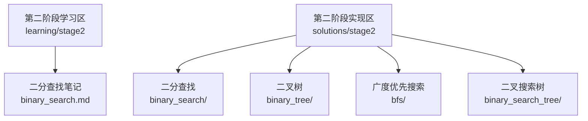
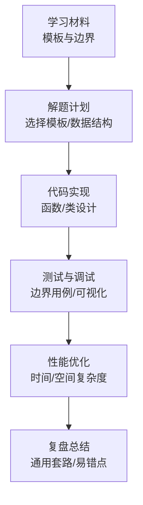
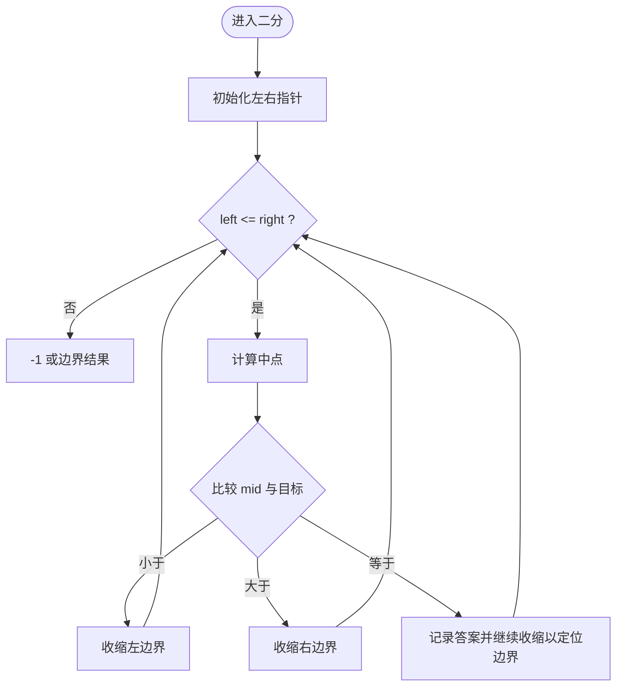
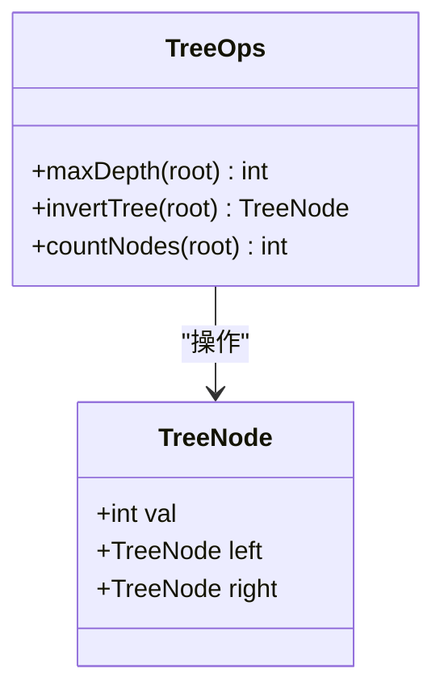
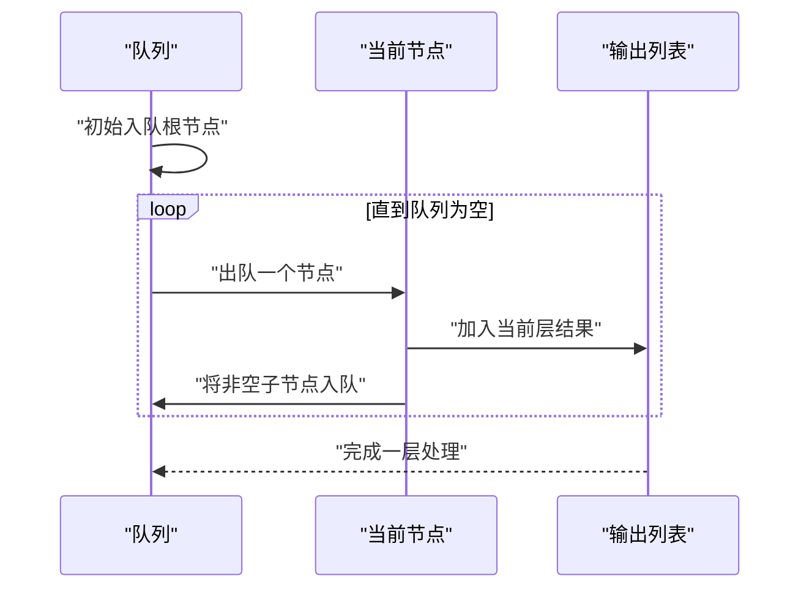
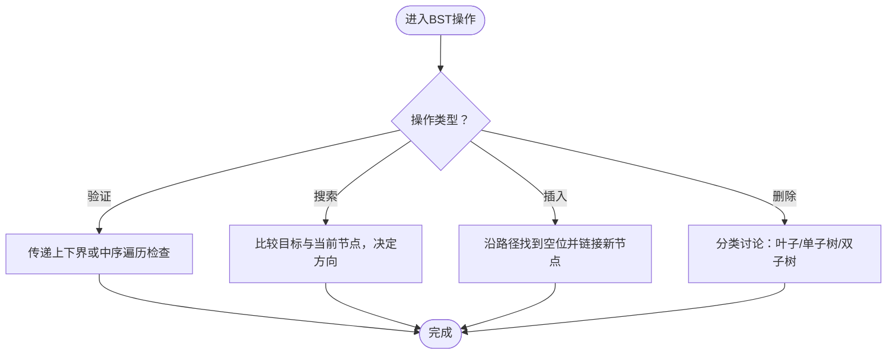
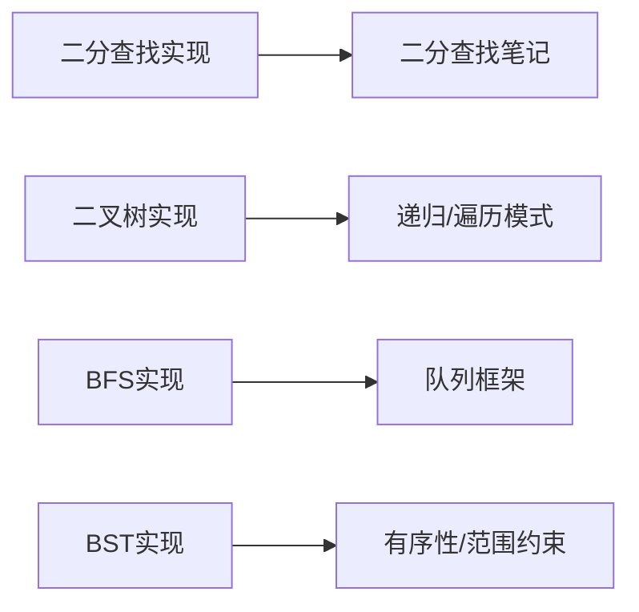

# 第二阶段：搜索算法

<cite>
**本文引用的文件**   
- [learning/stage2/binary_search.md](file://learning/stage2/binary_search.md)
- [solutions/stage2/binary_search/find_first_and_last_34.py](file://solutions/stage2/binary_search/find_first_and_last_34.py)
- [solutions/stage2/binary_tree/max_depth_104.py](file://solutions/stage2/binary_tree/max_depth_104.py)
- [solutions/stage2/binary_tree/invert_tree_226.py](file://solutions/stage2/binary_tree/invert_tree_226.py)
- [solutions/stage2/binary_tree/count_nodes_222.py](file://solutions/stage2/binary_tree/count_nodes_222.py)
- [solutions/stage2/bfs/level_order_102.py](file://solutions/stage2/bfs/level_order_102.py)
- [solutions/stage2/bfs/right_side_view_199.py](file://solutions/stage2/bfs/right_side_view_199.py)
- [solutions/stage2/bfs/zigzag_level_order_103.py](file://solutions/stage2/bfs/zigzag_level_order_103.py)
- [solutions/stage2/binary_search_tree/validate_bst_98.py](file://solutions/stage2/binary_search_tree/validate_bst_98.py)
- [solutions/stage2/binary_search_tree/search_bst_700.py](file://solutions/stage2/binary_search_tree/search_bst_700.py)
- [solutions/stage2/binary_search_tree/insert_into_bst_701.py](file://solutions/stage2/binary_search_tree/insert_into_bst_701.py)
- [solutions/stage2/binary_search_tree/min_diff_530.py](file://solutions/stage2/binary_search_tree/min_diff_530.py)
</cite>

## 目录
1. [简介](#简介)
2. [项目结构](#项目结构)
3. [核心组件](#核心组件)
4. [架构总览](#架构总览)
5. [详细组件分析](#详细组件分析)
6. [依赖分析](#依赖分析)
7. [性能考虑](#性能考虑)
8. [故障排查指南](#故障排查指南)
9. [结论](#结论)
10. [附录](#附录)

## 简介
本阶段聚焦“搜索算法”的系统学习，围绕以下主题展开：
- 二分查找模板与边界条件处理，覆盖常见变体问题
- 二叉树基础操作与递归思维模式建立，包括遍历与常用操作
- 广度优先搜索（BFS）的原理与应用，如层次遍历与最短路径思路
- 二叉搜索树（BST）的性质与核心操作：验证、搜索、插入、删除等
- 结合具体Python实现，逐题解析解题思路与性能优化策略
- 提供树结构可视化与调试技巧，帮助理解复杂递归过程
- 汇总面试高频树相关问题与解决方案

## 项目结构
本仓库按“学习材料 + 题目实现”组织。第二阶段内容主要分布在 learning/stage2 与 solutions/stage2 两个目录下：
- learning/stage2：二分查找的学习笔记与模板总结
- solutions/stage2：按专题划分的题目实现，包含二分查找、二叉树、BFS、BST四类

图示来源
- [learning/stage2/binary_search.md](file://learning/stage2/binary_search.md)
- [solutions/stage2/binary_search/find_first_and_last_34.py](file://solutions/stage2/binary_search/find_first_and_last_34.py)
- [solutions/stage2/binary_tree/max_depth_104.py](file://solutions/stage2/binary_tree/max_depth_104.py)
- [solutions/stage2/bfs/level_order_102.py](file://solutions/stage2/bfs/level_order_102.py)
- [solutions/stage2/binary_search_tree/validate_bst_98.py](file://solutions/stage2/binary_search_tree/validate_bst_98.py)

章节来源
- [learning/stage2/binary_search.md](file://learning/stage2/binary_search.md)
- [solutions/stage2/binary_search/find_first_and_last_34.py](file://solutions/stage2/binary_search/find_first_and_last_34.py)
- [solutions/stage2/binary_tree/max_depth_104.py](file://solutions/stage2/binary_tree/max_depth_104.py)
- [solutions/stage2/bfs/level_order_102.py](file://solutions/stage2/bfs/level_order_102.py)
- [solutions/stage2/binary_search_tree/validate_bst_98.py](file://solutions/stage2/binary_search_tree/validate_bst_98.py)

## 核心组件
- 二分查找模板与边界处理：统一区间定义、循环不变式、收敛策略、左右端点更新规则；针对“第一个/最后一个满足条件的元素”“上界/下界”等变体进行归纳
- 二叉树基础：递归三要素（终止条件、返回值、递归关系）、前中后序遍历、层序遍历、深度/翻转/计数等典型操作
- BFS框架：队列初始化、层级控制、状态扩展与去重、最短路径距离维护
- BST性质与操作：左小右大、有序性利用、范围约束传递、插入/删除的指针重构

章节来源
- [learning/stage2/binary_search.md](file://learning/stage2/binary_search.md)
- [solutions/stage2/binary_search/find_first_and_last_34.py](file://solutions/stage2/binary_search/find_first_and_last_34.py)
- [solutions/stage2/binary_tree/max_depth_104.py](file://solutions/stage2/binary_tree/max_depth_104.py)
- [solutions/stage2/bfs/level_order_102.py](file://solutions/stage2/bfs/level_order_102.py)
- [solutions/stage2/binary_search_tree/validate_bst_98.py](file://solutions/stage2/binary_search_tree/validate_bst_98.py)

## 架构总览
从“知识到实现”的整体流程如下：学习材料提供模板与要点，题目实现将模板落地为可运行的代码，并通过测试用例验证正确性与性能。

[本节为概念性流程图，不直接映射具体源码文件]

## 详细组件分析

### 二分查找：模板与边界
- 关键要点
  - 明确区间定义（闭区间/半开区间），保证循环不变式
  - 中点计算避免溢出（使用整除或无符号右移思想）
  - 根据目标与 mid 的关系收缩边界，确保收敛
  - 变体：找第一个/最后一个满足条件的索引、上界/下界、旋转数组等
- 典型实现参考
  - 在已排序数组中寻找目标值的起始和结束位置
    - 参考路径：[solutions/stage2/binary_search/find_first_and_last_34.py](file://solutions/stage2/binary_search/find_first_and_last_34.py)
- 常见错误与修复
  - 边界更新遗漏导致死循环
  - 未处理空数组或单元素情况
  - 返回索引越界或未找到时的默认值处理不当

图示来源
- [solutions/stage2/binary_search/find_first_and_last_34.py](file://solutions/stage2/binary_search/find_first_and_last_34.py)

章节来源
- [learning/stage2/binary_search.md](file://learning/stage2/binary_search.md)
- [solutions/stage2/binary_search/find_first_and_last_34.py](file://solutions/stage2/binary_search/find_first_and_last_34.py)

### 二叉树：递归思维与基础操作
- 递归三要素
  - 终止条件：空节点返回
  - 返回值：子问题的解（如深度、是否平衡、翻转后的根等）
  - 递归关系：如何组合左右子树的解得到当前节点的解
- 遍历方法
  - 前序/中序/后序：注意访问顺序与栈/递归调用栈的关系
  - 层序遍历：借助队列，按层收集节点
- 典型实现参考
  - 求二叉树的最大深度
    - 参考路径：[solutions/stage2/binary_tree/max_depth_104.py](file://solutions/stage2/binary_tree/max_depth_104.py)
  - 翻转二叉树
    - 参考路径：[solutions/stage2/binary_tree/invert_tree_226.py](file://solutions/stage2/binary_tree/invert_tree_226.py)
  - 统计完全二叉树的节点数
    - 参考路径：[solutions/stage2/binary_tree/count_nodes_222.py](file://solutions/stage2/binary_tree/count_nodes_222.py)

图示来源
- [solutions/stage2/binary_tree/max_depth_104.py](file://solutions/stage2/binary_tree/max_depth_104.py)
- [solutions/stage2/binary_tree/invert_tree_226.py](file://solutions/stage2/binary_tree/invert_tree_226.py)
- [solutions/stage2/binary_tree/count_nodes_222.py](file://solutions/stage2/binary_tree/count_nodes_222.py)

章节来源
- [solutions/stage2/binary_tree/max_depth_104.py](file://solutions/stage2/binary_tree/max_depth_104.py)
- [solutions/stage2/binary_tree/invert_tree_226.py](file://solutions/stage2/binary_tree/invert_tree_226.py)
- [solutions/stage2/binary_tree/count_nodes_222.py](file://solutions/stage2/binary_tree/count_nodes_222.py)

### 广度优先搜索（BFS）：原理与应用
- 适用场景
  - 无权图的最短路径
  - 树的层次遍历、按层处理
  - 多源BFS（多个起点同时入队）
- 标准框架
  - 初始化队列与访问集合
  - 循环出队，扩展邻居，更新距离/状态
  - 遇到目标立即返回（最短路径）
- 典型实现参考
  - 二叉树层序遍历
    - 参考路径：[solutions/stage2/bfs/level_order_102.py](file://solutions/stage2/bfs/level_order_102.py)
  - 二叉树右侧视图
    - 参考路径：[solutions/stage2/bfs/right_side_view_199.py](file://solutions/stage2/bfs/right_side_view_199.py)
  - 二叉树锯齿形层序遍历
    - 参考路径：[solutions/stage2/bfs/zigzag_level_order_103.py](file://solutions/stage2/bfs/zigzag_level_order_103.py)

图示来源
- [solutions/stage2/bfs/level_order_102.py](file://solutions/stage2/bfs/level_order_102.py)
- [solutions/stage2/bfs/right_side_view_199.py](file://solutions/stage2/bfs/right_side_view_199.py)
- [solutions/stage2/bfs/zigzag_level_order_103.py](file://solutions/stage2/bfs/zigzag_level_order_103.py)

章节来源
- [solutions/stage2/bfs/level_order_102.py](file://solutions/stage2/bfs/level_order_102.py)
- [solutions/stage2/bfs/right_side_view_199.py](file://solutions/stage2/bfs/right_side_view_199.py)
- [solutions/stage2/bfs/zigzag_level_order_103.py](file://solutions/stage2/bfs/zigzag_level_order_103.py)

### 二叉搜索树（BST）：性质与核心操作
- 性质
  - 左子树所有节点值小于根节点
  - 右子树所有节点值大于根节点
  - 中序遍历结果为严格递增序列
- 核心操作
  - 验证BST：传递上下界或使用中序遍历检查单调性
  - 搜索：根据大小关系决定向左或向右
  - 插入：沿路径找到空位插入
  - 删除：分情况处理（叶子、单子树、双子树用后继替换）
- 典型实现参考
  - 验证二叉搜索树
    - 参考路径：[solutions/stage2/binary_search_tree/validate_bst_98.py](file://solutions/stage2/binary_search_tree/validate_bst_98.py)
  - 搜索二叉搜索树
    - 参考路径：[solutions/stage2/binary_search_tree/search_bst_700.py](file://solutions/stage2/binary_search_tree/search_bst_700.py)
  - 向二叉搜索树插入值
    - 参考路径：[solutions/stage2/binary_search_tree/insert_into_bst_701.py](file://solutions/stage2/binary_search_tree/insert_into_bst_701.py)
  - 二叉搜索树的最小绝对差
    - 参考路径：[solutions/stage2/binary_search_tree/min_diff_530.py](file://solutions/stage2/binary_search_tree/min_diff_530.py)

图示来源
- [solutions/stage2/binary_search_tree/validate_bst_98.py](file://solutions/stage2/binary_search_tree/validate_bst_98.py)
- [solutions/stage2/binary_search_tree/search_bst_700.py](file://solutions/stage2/binary_search_tree/search_bst_700.py)
- [solutions/stage2/binary_search_tree/insert_into_bst_701.py](file://solutions/stage2/binary_search_tree/insert_into_bst_701.py)
- [solutions/stage2/binary_search_tree/min_diff_530.py](file://solutions/stage2/binary_search_tree/min_diff_530.py)

章节来源
- [solutions/stage2/binary_search_tree/validate_bst_98.py](file://solutions/stage2/binary_search_tree/validate_bst_98.py)
- [solutions/stage2/binary_search_tree/search_bst_700.py](file://solutions/stage2/binary_search_tree/search_bst_700.py)
- [solutions/stage2/binary_search_tree/insert_into_bst_701.py](file://solutions/stage2/binary_search_tree/insert_into_bst_701.py)
- [solutions/stage2/binary_search_tree/min_diff_530.py](file://solutions/stage2/binary_search_tree/min_diff_530.py)

## 依赖分析
- 模块内聚与耦合
  - 各专题相对独立，便于按主题学习与练习
  - 题目实现之间无直接依赖，复用通过“模板/思路”而非代码引用
- 外部依赖
  - Python标准库（如队列、列表等）用于实现BFS与遍历
- 潜在风险
  - 递归深度过大可能导致栈溢出（可通过迭代或尾递归优化思路规避）
  - BFS中未做访问标记会导致重复入队与指数级膨胀

图示来源
- [learning/stage2/binary_search.md](file://learning/stage2/binary_search.md)
- [solutions/stage2/binary_search/find_first_and_last_34.py](file://solutions/stage2/binary_search/find_first_and_last_34.py)
- [solutions/stage2/binary_tree/max_depth_104.py](file://solutions/stage2/binary_tree/max_depth_104.py)
- [solutions/stage2/bfs/level_order_102.py](file://solutions/stage2/bfs/level_order_102.py)
- [solutions/stage2/binary_search_tree/validate_bst_98.py](file://solutions/stage2/binary_search_tree/validate_bst_98.py)

章节来源
- [learning/stage2/binary_search.md](file://learning/stage2/binary_search.md)
- [solutions/stage2/binary_search/find_first_and_last_34.py](file://solutions/stage2/binary_search/find_first_and_last_34.py)
- [solutions/stage2/binary_tree/max_depth_104.py](file://solutions/stage2/binary_tree/max_depth_104.py)
- [solutions/stage2/bfs/level_order_102.py](file://solutions/stage2/bfs/level_order_102.py)
- [solutions/stage2/binary_search_tree/validate_bst_98.py](file://solutions/stage2/binary_search_tree/validate_bst_98.py)

## 性能考虑
- 二分查找
  - 时间复杂度 O(log n)，空间复杂度 O(1)（迭代）或 O(log n)（递归）
  - 注意边界更新与收敛，避免死循环
- 二叉树
  - 递归遍历时间 O(n)，空间 O(h)（h为树高）
  - 层序遍历时间 O(n)，空间 O(w)（w为最大宽度）
- BFS
  - 时间 O(V+E)，空间取决于队列规模
  - 多源BFS常用于最短路径，首次到达即最优
- BST
  - 平均操作 O(log n)，退化时 O(n)
  - 插入/删除需小心指针重构，保持有序性

[本节为通用指导，不直接分析具体文件]

## 故障排查指南
- 二分查找常见问题
  - 死循环：检查 mid 计算与边界更新是否保证收敛
  - 越界：确认返回索引是否在合法范围内
  - 未处理空输入：在进入循环前判断
- 二叉树递归问题
  - 忘记终止条件：空节点应返回
  - 返回值不一致：左右子树返回值类型与合并逻辑要一致
  - 栈溢出：对深树考虑迭代实现
- BFS问题
  - 未去重：导致重复入队与超时
  - 层级控制错误：锯齿形或右侧视图需要按层收集
- BST问题
  - 验证时未传递范围：仅比较父子不够，需全局范围约束
  - 删除节点后继选择错误：应选右子树最小或左子树最大

章节来源
- [solutions/stage2/binary_search/find_first_and_last_34.py](file://solutions/stage2/binary_search/find_first_and_last_34.py)
- [solutions/stage2/binary_tree/max_depth_104.py](file://solutions/stage2/binary_tree/max_depth_104.py)
- [solutions/stage2/bfs/level_order_102.py](file://solutions/stage2/bfs/level_order_102.py)
- [solutions/stage2/binary_search_tree/validate_bst_98.py](file://solutions/stage2/binary_search_tree/validate_bst_98.py)

## 结论
- 二分查找的关键在于“区间定义+循环不变式+收敛策略”，掌握后可快速迁移至各类变体
- 二叉树的核心是“递归三要素”，配合遍历模板能解决大多数树问题
- BFS适用于“最短路径/层次处理”，关键在于“队列+去重+层级控制”
- BST充分利用“有序性”，通过范围约束与中序遍历简化验证与查询
- 建议以“模板→实现→测试→优化→复盘”的闭环方式持续精进

[本节为总结性内容，不直接分析具体文件]

## 附录
- 树结构可视化与调试技巧
  - 打印层序序列：有助于直观观察树结构与BFS过程
  - 递归轨迹打印：在递归入口/出口打印节点值与深度，辅助定位问题
  - 断点与单元测试：针对边界用例（空树、单节点、链状树）编写用例
- 面试高频问题清单
  - 二分：寻找峰值、旋转数组最小值、平方根、第k个缺失正整数
  - 二叉树：对称树、路径总和、最近公共祖先、重建二叉树
  - BFS：岛屿数量、单词接龙、腐烂橘子、打开转盘锁
  - BST：BST中的插入/删除、Kth最小/最大元素、两数之和IV（BST版）

[本节为概念性补充，不直接分析具体文件]