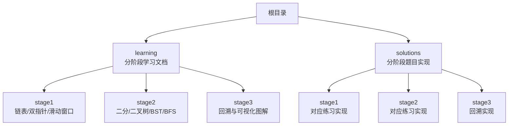
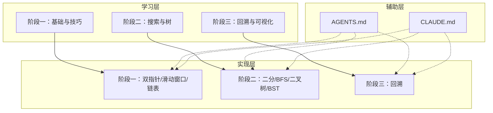
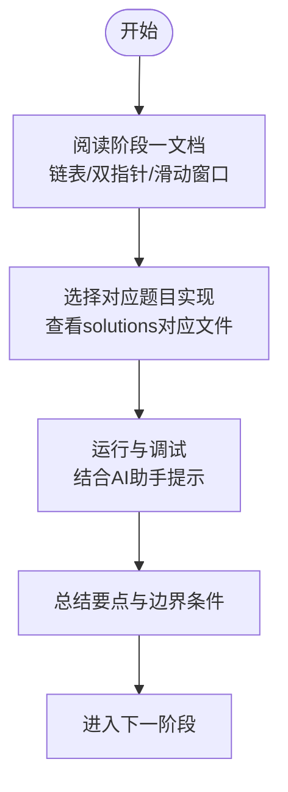
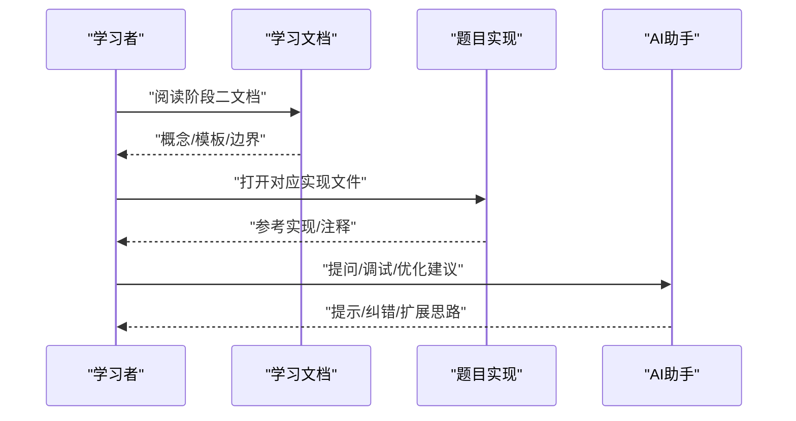
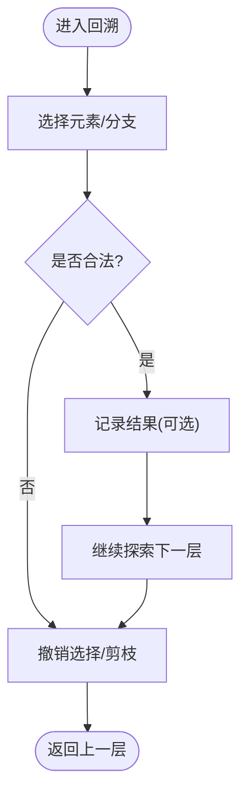
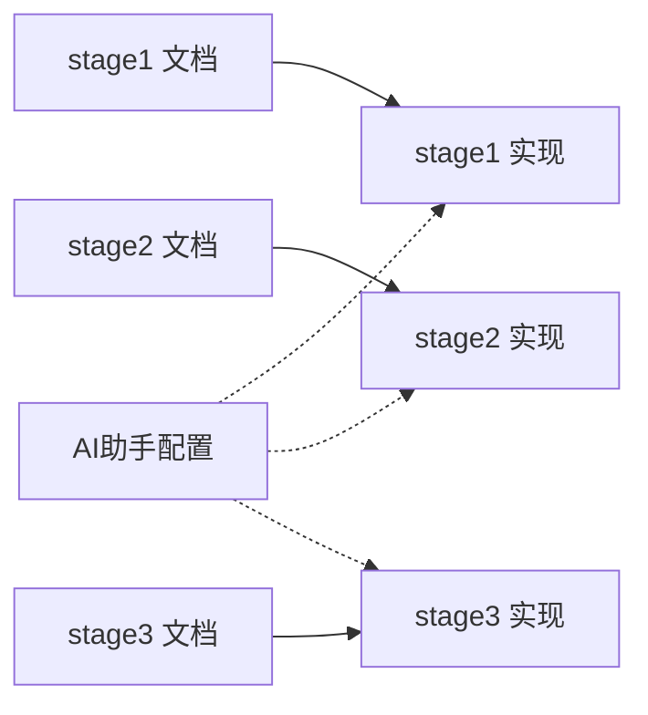

# 项目概述

<cite>
**本文引用的文件**   
- [README.md](file://README.md)
- [learning/README.md](file://learning/README.md)
- [learning/syllabus.md](file://learning/syllabus.md)
- [learning/stage1/linked_list.md](file://learning/stage1/linked_list.md)
- [learning/stage1/sliding_window.md](file://learning/stage1/sliding_window.md)
- [learning/stage1/two_pointers.md](file://learning/stage1/two_pointers.md)
- [learning/stage2/binary_search.md](file://learning/stage2/binary_search.md)
- [learning/stage3/palindrome_partitioning_131_visual.md](file://learning/stage3/palindrome_partitioning_131_visual.md)
- [learning/stage3/permutations_46_visual.md](file://learning/stage3/permutations_46_visual.md)
- [learning/stage3/subsets_ii_90_visual.md](file://learning/stage3/subsets_ii_90_visual.md)
- [solutions/stage1/sliding_window/find_all_anagrams_438.py](file://solutions/stage1/sliding_window/find_all_anagrams_438.py)
- [solutions/stage1/sliding_window/min_size_subarray_sum_209.py](file://solutions/stage1/sliding_window/min_size_subarray_sum_209.py)
- [solutions/stage1/two_pointers/container_with_most_water_11.py](file://solutions/stage1/two_pointers/container_with_most_water_11.py)
- [solutions/stage1/two_pointers/linked_list_cycle_141.py](file://solutions/stage1/two_pointers/linked_list_cycle_141.py)
- [solutions/stage1/two_pointers/two_sum_ii_167.py](file://solutions/stage1/two_pointers/two_sum_ii_167.py)
- [solutions/stage2/bfs/level_order_102.py](file://solutions/stage2/bfs/level_order_102.py)
- [solutions/stage2/bfs/right_side_view_199.py](file://solutions/stage2/bfs/right_side_view_199.py)
- [solutions/stage2/bfs/zigzag_level_order_103.py](file://solutions/stage2/bfs/zigzag_level_order_103.py)
- [solutions/stage2/binary_search/find_first_and_last_34.py](file://solutions/stage2/binary_search/find_first_and_last_34.py)
- [solutions/stage2/binary_tree/count_nodes_222.py](file://solutions/stage2/binary_tree/count_nodes_222.py)
- [solutions/stage2/binary_tree/invert_tree_226.py](file://solutions/stage2/binary_tree/invert_tree_226.py)
- [solutions/stage2/binary_tree/max_depth_104.py](file://solutions/stage2/binary_tree/max_depth_104.py)
- [solutions/stage2/binary_search_tree/insert_into_bst_701.py](file://solutions/stage2/binary_search_tree/insert_into_bst_701.py)
- [solutions/stage2/binary_search_tree/min_diff_530.py](file://solutions/stage2/binary_search_tree/min_diff_530.py)
- [solutions/stage2/binary_search_tree/search_bst_700.py](file://solutions/stage2/binary_search_tree/search_bst_700.py)
- [solutions/stage2/binary_search_tree/validate_bst_98.py](file://solutions/stage2/binary_search_tree/validate_bst_98.py)
- [solutions/stage3/backtracking/combinations_77.py](file://solutions/stage3/backtracking/combinations_77.py)
- [solutions/stage3/backtracking/combinations_ii_40.py](file://solutions/stage3/backtracking/combinations_ii_40.py)
- [solutions/stage3/backtracking/palindrome_partitioning_131.py](file://solutions/stage3/backtracking/palindrome_partitioning_131.py)
- [solutions/stage3/backtracking/permutations_46.py](file://solutions/stage3/backtracking/permutations_46.py)
- [solutions/stage3/backtracking/subsets_78.py](file://solutions/stage3/backtracking/subsets_78.py)
- [solutions/stage3/backtracking/subsets_ii_90.py](file://solutions/stage3/backtracking/subsets_ii_90.py)
- [AGENTS.md](file://AGENTS.md)
- [CLAUDE.md](file://CLAUDE.md)
</cite>

## 目录
1. [简介](#简介)
2. [项目结构](#项目结构)
3. [核心组件](#核心组件)
4. [架构总览](#架构总览)
5. [详细组件分析](#详细组件分析)
6. [依赖关系分析](#依赖关系分析)
7. [性能与学习建议](#性能与学习建议)
8. [故障排查指南](#故障排查指南)
9. [结论](#结论)
10. [附录：快速开始](#附录快速开始)

## 简介
本项目是一个面向LeetCode算法学习的结构化课程仓库，采用“三阶段渐进式”学习体系，帮助学习者从基础数据结构与双指针、滑动窗口等入门技巧，逐步过渡到搜索（BFS）、二分查找、二叉树与二叉搜索树，最终进入回溯等高级算法主题。项目将“学习文档”与“代码实现”一一对应，形成“学-练-查”的闭环路径，并配套AI助手配置，便于在本地或IDE中获取即时指导。

适用人群
- 准备面试或系统提升算法能力的初学者与进阶者
- 希望以结构化路径进行刷题与复盘的学习者
- 希望在本地获得AI辅助讲解与提示的开发者

前置知识要求
- 熟悉至少一种编程语言（Python示例为主）
- 了解基本的数据结构与时间复杂度概念
- 具备基本的命令行与版本控制使用经验

预期学习成果
- 掌握链表、数组、队列、栈、树与图的基本操作
- 熟练运用双指针、滑动窗口、二分查找、BFS等常用范式
- 理解回溯思想并能解决组合、子集、排列与分割类问题
- 建立“读题-建模-设计-编码-验证-复盘”的完整解题流程

## 项目结构
仓库采用“学习文档 + 代码实现”的双目录组织方式：
- learning：按阶段划分的教程与可视化材料，提供概念、思路与步骤说明
- solutions：按阶段与专题划分的题目实现，文件名包含题号以便检索

章节来源
- [README.md](file://README.md)
- [learning/README.md](file://learning/README.md)
- [learning/syllabus.md](file://learning/syllabus.md)

## 核心组件
- 三阶段学习体系
  - 阶段一：基础数据结构与常见技巧（链表、双指针、滑动窗口）
  - 阶段二：搜索与分治（BFS、二分查找、二叉树与BST）
  - 阶段三：回溯与组合枚举（组合、子集、排列、分割），配合可视化图解加深理解
- 学习文档与代码实现的映射
  - learning 下的每个专题与 solutions 下同名/同编号的实现相互对照，便于“先学后练、边学边练”
- AI助手配置
  - 通过 AGENTS.md 与 CLAUDE.md 定义助手行为与交互约定，支持在开发环境中获得提示、思路引导与错误诊断

章节来源
- [learning/stage1/linked_list.md](file://learning/stage1/linked_list.md)
- [learning/stage1/two_pointers.md](file://learning/stage1/two_pointers.md)
- [learning/stage1/sliding_window.md](file://learning/stage1/sliding_window.md)
- [learning/stage2/binary_search.md](file://learning/stage2/binary_search.md)
- [learning/stage3/palindrome_partitioning_131_visual.md](file://learning/stage3/palindrome_partitioning_131_visual.md)
- [learning/stage3/permutations_46_visual.md](file://learning/stage3/permutations_46_visual.md)
- [learning/stage3/subsets_ii_90_visual.md](file://learning/stage3/subsets_ii_90_visual.md)
- [AGENTS.md](file://AGENTS.md)
- [CLAUDE.md](file://CLAUDE.md)

## 架构总览
本项目的“学习-实现-辅助”三层架构如下：
- 学习层（learning）：提供概念、步骤、图示与注意事项
- 实现层（solutions）：提供可运行的参考实现，便于调试与对比
- 辅助层（AI助手）：基于配置文件提供交互式提示与排错

图表来源
- [learning/README.md](file://learning/README.md)
- [learning/syllabus.md](file://learning/syllabus.md)
- [AGENTS.md](file://AGENTS.md)
- [CLAUDE.md](file://CLAUDE.md)

## 详细组件分析

### 阶段一：基础数据结构与技巧
- 学习目标
  - 掌握链表基本操作与环检测
  - 熟练使用双指针解决两数之和II、盛水容器等问题
  - 理解滑动窗口思想，应用于最小覆盖子串、变位词分组等场景
- 学习文档
  - 链表：[learning/stage1/linked_list.md](file://learning/stage1/linked_list.md)
  - 双指针：[learning/stage1/two_pointers.md](file://learning/stage1/two_pointers.md)
  - 滑动窗口：[learning/stage1/sliding_window.md](file://learning/stage1/sliding_window.md)
- 典型实现
  - 双指针：[solutions/stage1/two_pointers/two_sum_ii_167.py](file://solutions/stage1/two_pointers/two_sum_ii_167.py)、[solutions/stage1/two_pointers/container_with_most_water_11.py](file://solutions/stage1/two_pointers/container_with_most_water_11.py)、[solutions/stage1/two_pointers/linked_list_cycle_141.py](file://solutions/stage1/two_pointers/linked_list_cycle_141.py)
  - 滑动窗口：[solutions/stage1/sliding_window/find_all_anagrams_438.py](file://solutions/stage1/sliding_window/find_all_anagrams_438.py)、[solutions/stage1/sliding_window/min_size_subarray_sum_209.py](file://solutions/stage1/sliding_window/min_size_subarray_sum_209.py)

章节来源
- [learning/stage1/linked_list.md](file://learning/stage1/linked_list.md)
- [learning/stage1/two_pointers.md](file://learning/stage1/two_pointers.md)
- [learning/stage1/sliding_window.md](file://learning/stage1/sliding_window.md)
- [solutions/stage1/two_pointers/two_sum_ii_167.py](file://solutions/stage1/two_pointers/two_sum_ii_167.py)
- [solutions/stage1/two_pointers/container_with_most_water_11.py](file://solutions/stage1/two_pointers/container_with_most_water_11.py)
- [solutions/stage1/two_pointers/linked_list_cycle_141.py](file://solutions/stage1/two_pointers/linked_list_cycle_141.py)
- [solutions/stage1/sliding_window/find_all_anagrams_438.py](file://solutions/stage1/sliding_window/find_all_anagrams_438.py)
- [solutions/stage1/sliding_window/min_size_subarray_sum_209.py](file://solutions/stage1/sliding_window/min_size_subarray_sum_209.py)

### 阶段二：搜索与树
- 学习目标
  - 掌握BFS模板与层次遍历应用
  - 熟练二分查找的边界处理与变形
  - 理解二叉树与BST的性质与递归/迭代解法
- 学习文档
  - 二分查找：[learning/stage2/binary_search.md](file://learning/stage2/binary_search.md)
- 典型实现
  - BFS：[solutions/stage2/bfs/level_order_102.py](file://solutions/stage2/bfs/level_order_102.py)、[solutions/stage2/bfs/right_side_view_199.py](file://solutions/stage2/bfs/right_side_view_199.py)、[solutions/stage2/bfs/zigzag_level_order_103.py](file://solutions/stage2/bfs/zigzag_level_order_103.py)
  - 二分查找：[solutions/stage2/binary_search/find_first_and_last_34.py](file://solutions/stage2/binary_search/find_first_and_last_34.py)
  - 二叉树：[solutions/stage2/binary_tree/max_depth_104.py](file://solutions/stage2/binary_tree/max_depth_104.py)、[solutions/stage2/binary_tree/invert_tree_226.py](file://solutions/stage2/binary_tree/invert_tree_226.py)、[solutions/stage2/binary_tree/count_nodes_222.py](file://solutions/stage2/binary_tree/count_nodes_222.py)
  - BST：[solutions/stage2/binary_search_tree/search_bst_700.py](file://solutions/stage2/binary_search_tree/search_bst_700.py)、[solutions/stage2/binary_search_tree/insert_into_bst_701.py](file://solutions/stage2/binary_search_tree/insert_into_bst_701.py)、[solutions/stage2/binary_search_tree/validate_bst_98.py](file://solutions/stage2/binary_search_tree/validate_bst_98.py)、[solutions/stage2/binary_search_tree/min_diff_530.py](file://solutions/stage2/binary_search_tree/min_diff_530.py)

章节来源
- [learning/stage2/binary_search.md](file://learning/stage2/binary_search.md)
- [solutions/stage2/bfs/level_order_102.py](file://solutions/stage2/bfs/level_order_102.py)
- [solutions/stage2/bfs/right_side_view_199.py](file://solutions/stage2/bfs/right_side_view_199.py)
- [solutions/stage2/bfs/zigzag_level_order_103.py](file://solutions/stage2/bfs/zigzag_level_order_103.py)
- [solutions/stage2/binary_search/find_first_and_last_34.py](file://solutions/stage2/binary_search/find_first_and_last_34.py)
- [solutions/stage2/binary_tree/max_depth_104.py](file://solutions/stage2/binary_tree/max_depth_104.py)
- [solutions/stage2/binary_tree/invert_tree_226.py](file://solutions/stage2/binary_tree/invert_tree_226.py)
- [solutions/stage2/binary_tree/count_nodes_222.py](file://solutions/stage2/binary_tree/count_nodes_222.py)
- [solutions/stage2/binary_search_tree/search_bst_700.py](file://solutions/stage2/binary_search_tree/search_bst_700.py)
- [solutions/stage2/binary_search_tree/insert_into_bst_701.py](file://solutions/stage2/binary_search_tree/insert_into_bst_701.py)
- [solutions/stage2/binary_search_tree/validate_bst_98.py](file://solutions/stage2/binary_search_tree/validate_bst_98.py)
- [solutions/stage2/binary_search_tree/min_diff_530.py](file://solutions/stage2/binary_search_tree/min_diff_530.py)

### 阶段三：回溯与可视化
- 学习目标
  - 理解回溯框架与剪枝策略
  - 能解决组合、子集、排列与分割问题
  - 借助可视化图解强化对搜索空间的理解
- 学习文档
  - 回文分割可视化：[learning/stage3/palindrome_partitioning_131_visual.md](file://learning/stage3/palindrome_partitioning_131_visual.md)
  - 全排列可视化：[learning/stage3/permutations_46_visual.md](file://learning/stage3/permutations_46_visual.md)
  - 子集II可视化：[learning/stage3/subsets_ii_90_visual.md](file://learning/stage3/subsets_ii_90_visual.md)
- 典型实现
  - 组合与子集：[solutions/stage3/backtracking/combinations_77.py](file://solutions/stage3/backtracking/combinations_77.py)、[solutions/stage3/backtracking/combinations_ii_40.py](file://solutions/stage3/backtracking/combinations_ii_40.py)、[solutions/stage3/backtracking/subsets_78.py](file://solutions/stage3/backtracking/subsets_78.py)、[solutions/stage3/backtracking/subsets_ii_90.py](file://solutions/stage3/backtracking/subsets_ii_90.py)
  - 排列与分割：[solutions/stage3/backtracking/permutations_46.py](file://solutions/stage3/backtracking/permutations_46.py)、[solutions/stage3/backtracking/palindrome_partitioning_131.py](file://solutions/stage3/backtracking/palindrome_partitioning_131.py)

章节来源
- [learning/stage3/palindrome_partitioning_131_visual.md](file://learning/stage3/palindrome_partitioning_131_visual.md)
- [learning/stage3/permutations_46_visual.md](file://learning/stage3/permutations_46_visual.md)
- [learning/stage3/subsets_ii_90_visual.md](file://learning/stage3/subsets_ii_90_visual.md)
- [solutions/stage3/backtracking/combinations_77.py](file://solutions/stage3/backtracking/combinations_77.py)
- [solutions/stage3/backtracking/combinations_ii_40.py](file://solutions/stage3/backtracking/combinations_ii_40.py)
- [solutions/stage3/backtracking/subsets_78.py](file://solutions/stage3/backtracking/subsets_78.py)
- [solutions/stage3/backtracking/subsets_ii_90.py](file://solutions/stage3/backtracking/subsets_ii_90.py)
- [solutions/stage3/backtracking/permutations_46.py](file://solutions/stage3/backtracking/permutations_46.py)
- [solutions/stage3/backtracking/palindrome_partitioning_131.py](file://solutions/stage3/backtracking/palindrome_partitioning_131.py)

## 依赖关系分析
- 学习文档与实现文件的对应关系
  - stage1：双指针/滑动窗口/链表文档 → 对应 solutions/stage1 下的实现
  - stage2：二分/树/BFS文档 → 对应 solutions/stage2 下的实现
  - stage3：回溯可视化文档 → 对应 solutions/stage3/backtracking 下的实现
- AI助手与学习流程的耦合
  - AGENTS.md 与 CLAUDE.md 为AI助手提供行为约束与交互约定，贯穿各阶段学习与调试过程

图表来源
- [learning/README.md](file://learning/README.md)
- [learning/syllabus.md](file://learning/syllabus.md)
- [AGENTS.md](file://AGENTS.md)
- [CLAUDE.md](file://CLAUDE.md)

章节来源
- [learning/README.md](file://learning/README.md)
- [learning/syllabus.md](file://learning/syllabus.md)
- [AGENTS.md](file://AGENTS.md)
- [CLAUDE.md](file://CLAUDE.md)

## 性能与学习建议
- 时间复杂度优先：在阶段一与阶段二中，优先掌握O(n)与O(log n)的常见模式（双指针、滑动窗口、二分）
- 空间复杂度权衡：回溯与BFS可能引入额外空间，注意剪枝与状态压缩
- 模板化思维：将BFS、二分、回溯抽象为模板，减少重复思考成本
- 可视化辅助：阶段三的可视化图解有助于构建搜索空间心智模型，提高泛化能力

## 故障排查指南
- 无法定位题目实现
  - 检查 solutions 下对应阶段与专题目录，确认文件名中的题号是否正确
- 运行报错或逻辑错误
  - 结合 AI 助手配置（AGENTS.md、CLAUDE.md）获取提示；逐行比对学习文档的步骤与边界条件
- 学习进度不清晰
  - 依据 learning/syllabus.md 的阶段目标逐项核对完成度

章节来源
- [AGENTS.md](file://AGENTS.md)
- [CLAUDE.md](file://CLAUDE.md)
- [learning/syllabus.md](file://learning/syllabus.md)

## 结论
本项目以“三阶段渐进式”为主线，将学习文档与代码实现紧密耦合，辅以AI助手提升学习效率。通过“先学后练、边学边练、复盘巩固”的闭环，学习者可以稳步构建算法思维与工程化解题能力。

## 附录：快速开始
- 环境准备
  - 安装Python解释器与编辑器（VS Code等）
  - 根据 AGENTS.md 与 CLAUDE.md 配置AI助手，启用提示与调试功能
- 学习路径
  - 从 learning/README.md 与 learning/syllabus.md 了解整体规划
  - 按阶段顺序阅读学习文档，并在 solutions 中对照实现
- 每日计划建议
  - 每天1个专题：阅读文档→尝试独立实现→对照参考实现→用AI助手复盘
- 常见问题
  - 如何找到某题的实现？在 solutions 目录下按阶段与专题查找，文件名包含题号
  - 如何获得提示？在编辑器中调用已配置的AI助手，描述当前卡点与期望输出

章节来源
- [README.md](file://README.md)
- [learning/README.md](file://learning/README.md)
- [learning/syllabus.md](file://learning/syllabus.md)
- [AGENTS.md](file://AGENTS.md)
- [CLAUDE.md](file://CLAUDE.md)