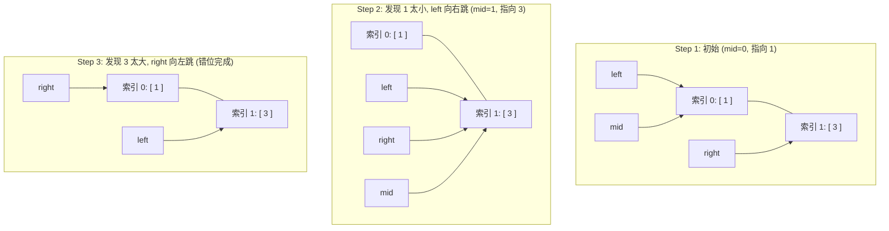

# 第二阶段：降维打击的艺术 —— 二分搜索 (Binary Search)

如果说第一阶段是在“跑马拉松”（一个个看），第二阶段就是在“指挥交通”（通过排除法瞬间干掉一半的可能性）。

## 1. 核心思维：为什么它快得惊人？

想象你在字典里找一个单词。你不会从第一页翻到最后，你会先从中间切一刀。
- **核心逻辑**：当你确定答案在左边时，整个右半区间对你而言就**不再存在**了。
- **复杂度**：这种“砍半”的力量能让 $O(N)$ 瞬间降级到 $O(\log N)$。对于 40 亿个数字，你只需要找 **32 次**！

## 2. 模式识别：二分搜索的“温床”

二分搜索不是什么时候都能用的。它需要这几个关键词：
- **有序**：这是地基。没有顺序，你就没法确定该扔掉哪一半。
- **范围（边界）**：你必须知道搜索的起点 `left` 和终点 `right`。
- **单调性**：当你增加某个值，结果也必须单调变化。

## 3. 通用代码模板 (Python)

二分查找的逻辑最容易在“边界处理”上栽跟头。我们统一采用 **“最稳健写法”**：

```python
def binary_search(nums, target):
    left, right = 0, len(nums) - 1 # 搜索区间 [left, right] 是个闭区间
    
    while left <= right: # 退出条件是 left > right
        mid = left + (right - left) // 2 # 防止 (left + right) // 2 溢出的小技巧
        
        if nums[mid] == target:
            return mid # 撞个满怀
        elif nums[mid] < target:
            left = mid + 1 # 目标在右边，扔掉左半边
        else:
            right = mid - 1 # 目标在左边，扔掉右半边
            
    return -1 # 找了个寂寞
```

## 4. 大脑模拟引导：找数字的游戏

假设数组 `[1, 3, 5, 7, 9]`，求 `target = 3`。

1. **初始**：`left=0`, `right=4`。中间位置 `mid=2` (值是 `5`)。
2. **比较**：`5 > 3`。既然 `5` 都比 `3` 大，那么 `5` 右边的那些 (`7, 9`) 肯定都嫌大。**全扔了！**
3. **收缩**：`right` 移动到 `mid - 1 = 1`。
4. **下一轮**：新的 `mid` 计算出来指向 `1` (值是 `3`)。刚好相等，收工！

## 5. 核心直觉：两墙挤压模型

这是二分搜索中最有“物理美感”的地方。我们可以把 `left` 和 `right` 想象成两堵往中间**挤压**的墙。

### 角色分配：
1. **`right` 墙**：拦截所有**“太大的数”**。任何在它右边的数都必然大于目标。
2. **`left` 墙**：拦截所有**“太小的数”**。任何在它左边的数都必然小于目标。

### 动态演变 (以 nums=[1, 3], target=2 为例)：



### 终局解析：
当循环在 **Step 3** 错位停止时：
- **`right` 指向 0**：它是“小于 2”的最后防线。
- **`left` 指向 1**：它是“大于 2”的第一道关卡。
- **插入逻辑**：2 应该插在第一个比它大的数（即索引 1 的 3）的位置。所以返回 **`left`**。

**金句总结**：
- `left` 永远是 **“第一个 >= target”** 的滩头阵地。
- `right` 永远是 **“最后一个 < target”** 的撤退边界。

## 6. 进阶预警

二分不仅能找“某个数”，还能找“第一个大于等于 X 的数”或者“最接近的数”。关键就在于：当 `left` 和 `right` 相遇时，你的逻辑该如何平滑落地。

## 7. 模式应用与实战意义

| 题目/技巧 | 核心思维模型 | 可以解决哪类问题？ |
| :--- | :--- | :--- |
| **704. 二分查找** | **一刀两断** (中点排除) | 在有序序列中快速定位一个确定的单一目标。 |
| **35. 搜索插入位置** | **滩头阵地** (左边界意义) | 当目标不存在时，寻找“第一个大于等于目标”的物理位置。 |
| **34. 查找范围** | **记录并挤压** (边界逼近) | 处理数组中有重复元素的情况，寻找目标值的起始和终止位置。 |

## 8. 学术语对照：大纲里的关键词都在哪？

| 大纲关键词 | 我们的实战模型 | 对应你代码中的动作 |
| :--- | :--- | :--- |
| **一刀两断** | **中点排除** | 依靠 `mid` 的比较结果，瞬间舍弃掉 50% 的区域。 |
| **错位定界** | **挤压终局** | `while left <= right` 结束后，两指针刚好在目标边界处错位。 |
| **排除法** | **单调性决策** | 基于“有序”这个事实，断定另一半不可能有答案。 |

---
*当你理解了这种“一刀两断”的排除快感，请告诉我。我们将开始阶段二的开胃菜：**704. 二分查找****。*
