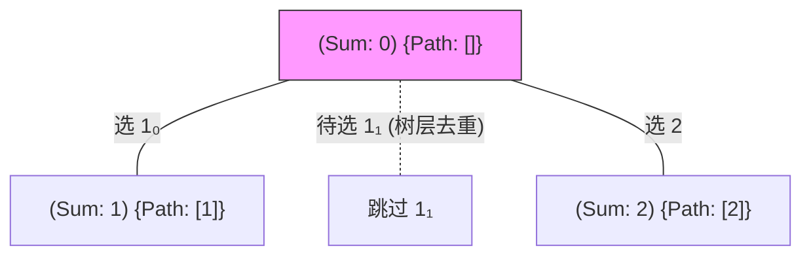
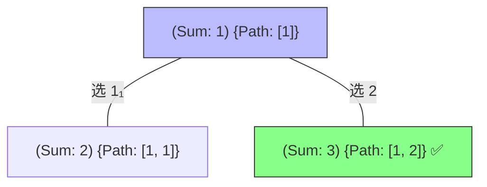
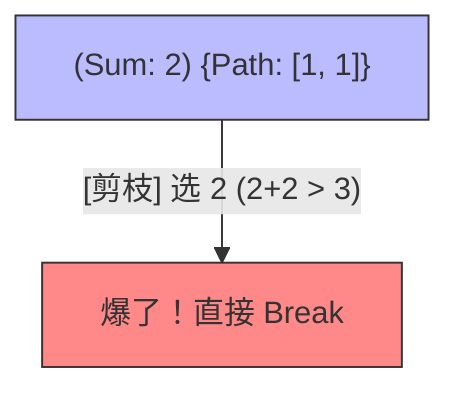
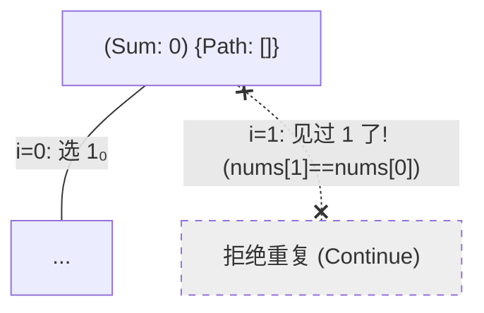
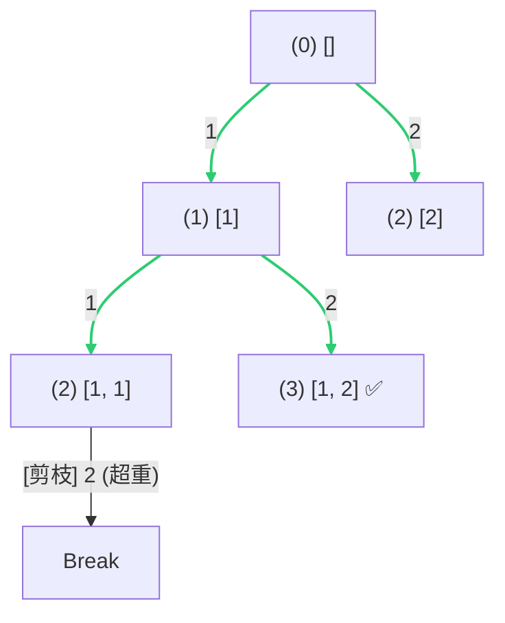

# 组合总和 II：决策树全景解析 (平铺版)

为了彻底理解 **“树层去重 (Duplicate Removal)”** 和 **“总和剪枝 (Sum-based Pruning)”**，我们以 `nums = [1, 1, 2], target = 3` 为例进行深度拆解。

> [!NOTE]
> 为了区分，我们将两个 `1` 分别标注为 `1₀` 和 `1₁`。数组排序后为 `[1₀, 1₁, 2]`。

---

## 阶段 1：起始态与第一层决策

空路径开始，我们站在树的顶端。

**逻辑解析**：
- 我们可以选择 `1₀`（第一个 `1`）。
- 我们可以选择 `2`。
- **关键点**：在同一层中，如果选了 `1₀` 之后再选 `1₁`，搜出来的结果必然重复，所以我们将它置灰。

---

## 阶段 2：纵向深入 (选了 1₀ 之后)

来到第二层，我们在 `[1]` 的基础上继续搜选。

**逻辑解析**：
- 深度优先搜索 (DFS)：先看 `[1, 1]` 这一路，还没满。
- 选 `2` 时，总和正好等于 `3`，**记录一个答案！**

---

## 阶段 3：总和剪枝 (Sum Pruning)

在 `[1, 1]` 的基础上继续尝试。

**逻辑解析**：
- 尝试加上 `2`，总和变为 `4`。
- 因为数组有序，如果 `2` 加上去超了，后面更大的数由于更超，所以我们直接 **`break`**。这是最强力的剪枝。

---

## 阶段 4：树层去重 (同层不选双胞胎)

回到第一层，面对第二个 `1` (即 `1₁`)。

**逻辑解析**：
- `for` 循环轮到索引 `i=1`。
- 此时 `i > start_index` (1 > 0)。
- `nums[1] == nums[0]`，说明本层之前已经有一个 `1` 领头搜过了。
- 为了防止产生重复组合 `[[1, 2]]`（从 `1₁` 开始搜也会搜到这个），我们果断 **`continue`**。

---

## 阶段 5：总结与全景图

剪枝后的决策树长这样，非常清爽：

---
*你可以直接在 IDE 中打开此文件预览效果。*
