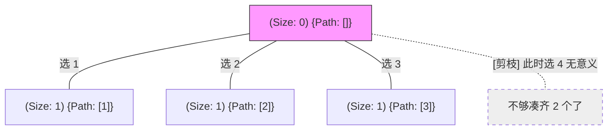
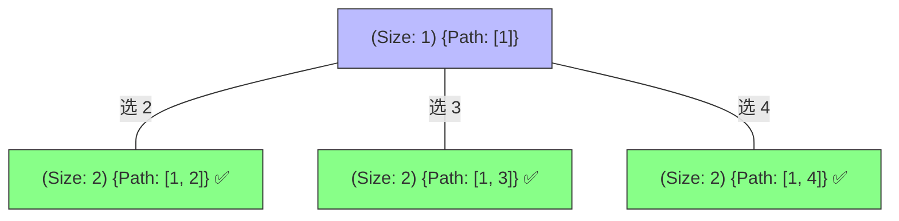
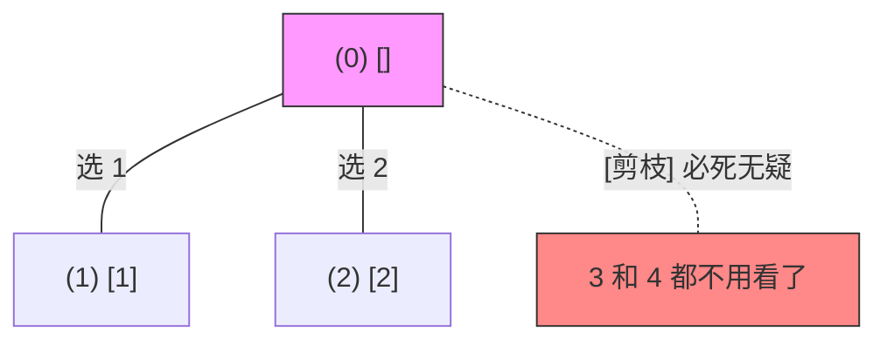

# 77. 组合问题：决策树全景解析

为了彻底理解 **“startIndex 顺序去重”** 和 **“搜索范围剪枝 (Range Pruning)”**，我们以 `n=4, k=2` 为例进行深度拆解。

---

## 阶段 1：起始态与第一层决策

起始 `start_index = 1`，我们面临 `1, 2, 3, 4` 四个选择。

**逻辑解析**：
- **startIndex**：如果我们选了 `1`，后续只能从 `[2, 3, 4]` 选；选了 `2`，只能从 `[3, 4]` 选。
- **搜索范围剪枝**：当 `k=2` 时，如果我们站在第一层选 `4`，后面由于已经没有数可以选了，导致无法凑齐 2 个，所以 `4` 这个分支直接被剪掉。

---

## 阶段 2：纵向深入 (以 [1] 为例)

来到第二层，我们在 `[1]` 的基础上继续搜选，`start_index = 2`。

**逻辑解析**：
- 此时 `len(path) == k`，满足终止条件，记录答案并回溯。

---

## 阶段 3：剪枝案例说明 (n=4, k=3)

假设我们要选 3 个数，看看剪枝如何工作：

**逻辑解析**：
- 如果要在 `[1, 2, 3, 4]` 选 3 个，选 `3` 会由于后面只剩一个 `4` 而无法凑齐。
- 所以第一层我们只需要尝试 `1` 和 `2` 即可。

---

## 总结：剪枝公式的第一性原理

> **`range(start_index, n - (k - len(path)) + 2)`**

- `k - len(path)`：代表我们**还需要**几个数。
- `n - (...) + 1`：代表为了凑齐剩下的数，我们**最晚**必须从哪开始选。
- 这个公式将“无效路径”在进入递归前直接砍掉，避免了海量的函数调用开销。

---
*你可以直接在 IDE 中打开此文件预览效果。*
