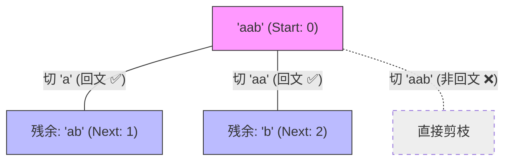
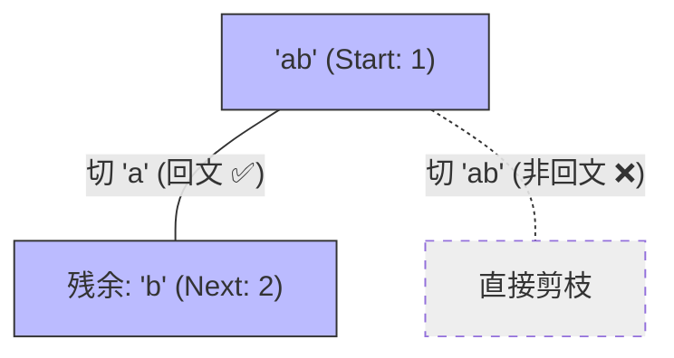
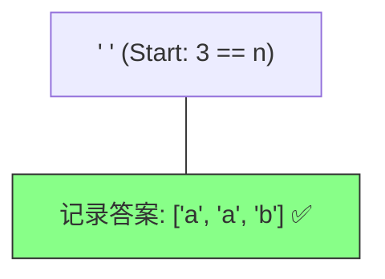

# 131. 分割回文串：决策树与“放隔板”艺术

为了理解 **“分割问题如何转化成组合问题”**，我们以 `s = "aab"` 为例进行分频拆解。

---

## 核心思维：隔板模型 (The Cutting Board)

想象字符串是放在案板上的条状物，回溯的过程就是决定**在哪个缝隙砍一刀**。

*   `a ^ a ^ b` ：有 2 个潜在缝隙（索引 1 之前和索引 2 之前），加上最后的一刀，共 3 个选点。

---

## 阶段 1：第一刀的选择 (Level 1)

从 `startIndex = 0` 开始，我们尝试所有可能的“第一段”。

**逻辑解析**：
- **startIndex**：代表当前这一刀的起点。
- **i**：代表这一刀切在哪个位置。
- 第一层我们可以切出 `a`（剩余 `ab`）或者 `aa`（剩余 `b`）。

---

## 阶段 2：纵向深入 (以 [a] 为起点)

在切了第一个 `a` 之后，我们面对剩余的 `ab`。

**逻辑解析**：
- 在 `[a]` 的基础上，我们又切了一个 `a`。
- 然后再切剩下的 `b`，最终得到 `[a, a, b]`。

---

## 阶段 3：成功收割的瞬间

**逻辑解析**：
- **终止条件**：当 `startIndex >= n` 时，说明我们已经把字符串**切完了**。
- 因为由于剪枝逻辑的存在，能“切完”的路径必然代表每一段都是回文。

---

## 总结：切割问题的套路

1.  **startIndex** 就是切割线的起始点。
2.  **for 循环的 i** 就是切割线的终止点。
3.  **s[startIndex:i+1]** 就是切下来的那块肉。
4.  **回文检查** 就是质检员，不合格的肉块直接整条生产线（分支）报废。

---
*你可以直接在 IDE 中打开此文件预览效果。*
