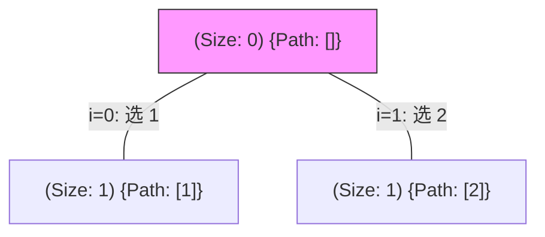
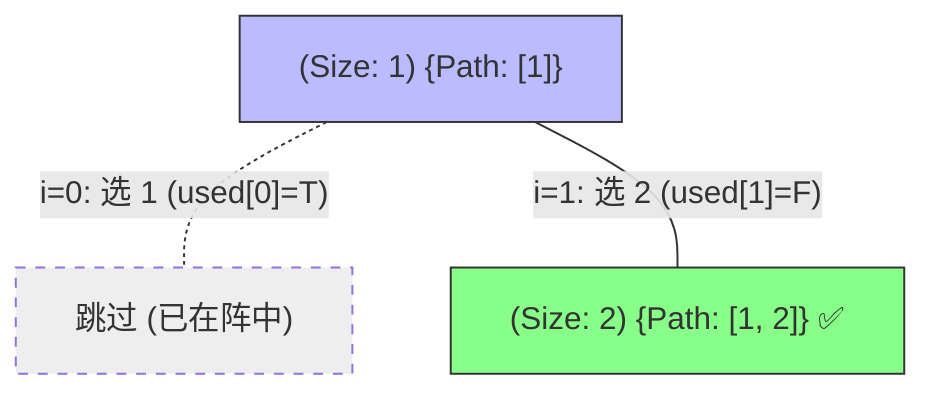
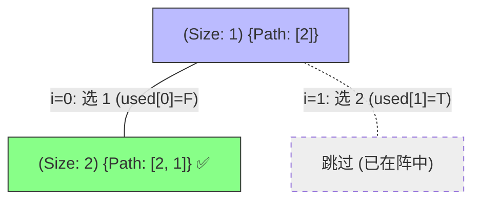

# 46. 全排列问题：决策树全景解析

为了区分 **“无序搜索 (Unordered Search)”** 与 **“状态标记 (Used Array)”** 的核心作用，我们以 `nums = [1, 2]` 为例进行动态拆解。

---

## 阶段 1：起始态与第一层决策

与组合问题强制“只能向右看”不同，排列问题是平等的：我们可以先选 `1`，也可以先选 `2`。

**逻辑解析**：
- **全员搜索**：每一层递归的 `for` 循环都从索引 `0` 开始。
- **状态同步**：如果我们进入了 `1` 的分支，我们会悄悄把 `used[0]` 设为 `True`。

---

## 阶段 2：纵向深入 (以 [1] 为主线)

来到第二层，程序再次从索引 `0` 开始尝试，但“雷达”会起作用。

**逻辑解析**：
- 虽然 `for` 循环想选 `1`，但 `used[0]` 挡住了它。
- 选 `2` 时，路径填满，获得第一个全排列：`[1, 2]`。

---

## 阶段 3：纵向深入 (以 [2] 为主线 —— 允许回头)

这就是排列与组合最大的区别：**在选了 2 之后，我们依然可以回头选 1。**

**逻辑解析**：
- 如果此处有 `startIndex` 限制（i 必须从 2 开始），那么我们永远选不到 `1`。
- **正例**：因为没有索引限制，且 `used[0]` 此时为 `False`，我们成功拿到了：`[2, 1]`。

---

## 总结：used 数组的物理意义

> **“我可以随时回头看整支队伍，但我不能选已经入队的战友。”**

- **无序性**：不设 `startIndex`，让每一层都有机会看到所有元素。
- **唯一性**：通过 `used` 数组，在“全员搜索”的大背景下实现精准的占位检查。

---
*你可以直接在 IDE 中打开此文件预览效果。*
