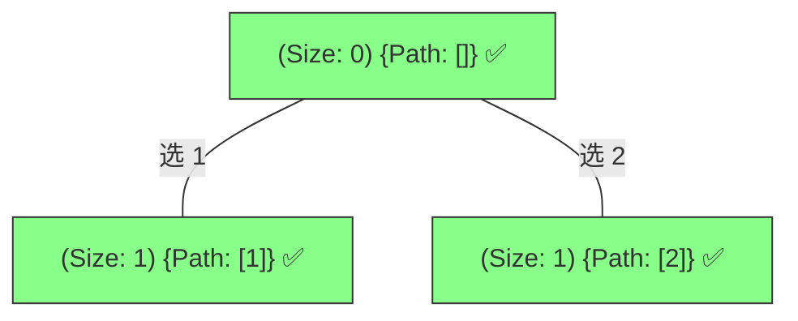
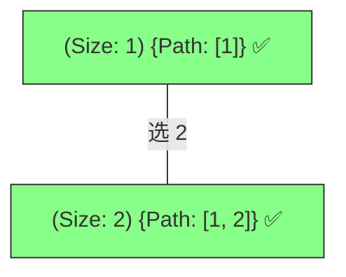

# 78. 子集问题：决策树全景解析

为了区分 **“全节点收获 (All-Node Collection)”** 与 **“组合问题 (Leaf-only Collection)”** 的核心区别，我们以 `nums = [1, 2]` 为例进行动态拆解。

---

## 阶段 1：起始态与空集收获

子集问题的第一个重要认知是：**即使还没做任何选择，空集 `[]` 也是一个有效的子集。**

**逻辑解析**：
- **进入即拍照**：代码中 `result.append(path[:])` 位于 `for` 循环之前。这保证了无论树长到哪一层，当前的节点都会被记录。
- **背景颜色**：所有节点均为绿色，代表它们都是合法的答案。

---

## 阶段 2：纵向深入 (以 [1] 为主线)

在 `[1]` 的基础上继续向后搜索。

**逻辑解析**：
- 沿着 `1` 的分支继续，我们拿到了 `[1, 2]`。
- 注意：由于 `startIndex` 的存在，我们在 `1` 的分支下无法看到它之前的元素。

---

## 阶段 3：决策树对比

为了加深理解，我们对比一下它和“组合问题 (k=2)”的区别：

| 维度 | 组合问题 (k=2) | 子集问题 |
| :--- | :--- | :--- |
| **收获时机** | 仅叶子节点 (长度为 2 时) | **所有节点** (进入函数即记录) |
| **结果数量** | 只有 1 个答案 `[1, 2]` | 共有 4 个答案 `[], [1], [2], [1, 2]` |
| **树的形态** | 树的枝干只是中间态 | 整个树的每一个“落脚点”都是果实 |

---

## 总结：子集树的物理意义

> **“在决策树的每一层，每一个节点处都插上一面旗帜。”**

- **startIndex**：依然必不可少，它确保了我们不会搜出重复组合（如 `[1, 2]` 和 `[2, 1]`）。
- **无终止条件**：虽然代码中没有显式的 `if len == k`，但 `for` 循环的边界（`startIndex == n`）自然构成了递归的终点。

---
*你可以直接在 IDE 中打开此文件预览效果。*
