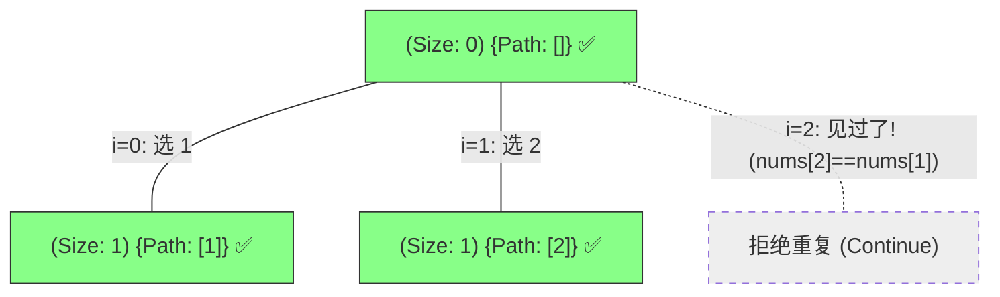
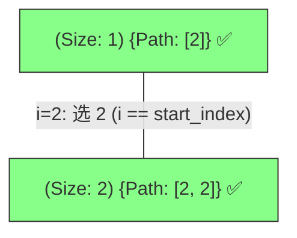

# 90. 子集 II 问题：决策树去重全景解析

为了区分 **“树层去重 (Tree-Layer Deduplication)”** 与 **“树枝生长 (Branch Expansion)”** 的核心逻辑，我们以 `nums = [1, 2, 2]` 为例进行动态拆解。

---

## 阶段 1：起始态与第一层决策

起始 `start_index = 0`，数组已排序为 `[1, 2, 2]`。

**逻辑解析**：
- **树层去重**：在第一个 `2` 开启的分支里，已经包含了所有以一个 `2` 开头的子集。
- **判断句式**：当 `i=2` 时，`i > start_index` 且 `nums[2] == nums[1]`。这说明这一轮决策中，同样的“妃子”我们刚才已经选过一个一模一样的了，此时果断 `continue`。

---

## 阶段 2：纵向深入 (以 [2] 为主线 —— 选第二个 2)

在第一个 `2` 的分支下继续深入。**注意：此时树层去重不生效，因为 `i == start_index`。**

**逻辑解析**：
- 虽然 `nums[2] == nums[1]`，但由于当前的 `i` 就是起始位 `start_index`，这代表我们在向“深处”走（这一层还没选过任何人）。
- 所以 `[2, 2]` 是合法的子集。这就是所谓的**“树枝可以重复，树层不能重复”**。

---

## 总结：去重的“第一性规则”

> **“在同一排队伍里，不选双胞胎里的弟弟；但在前后排的队伍里，双胞胎可以同台。”**

- **排序**：这是所有去重的基石，让双胞胎紧紧站在一起。
- **i > start_index**：这个条件锚定了我们处于“同一排”（水平方向）还是“前后排”（垂直方向）。
- **nums[i] == nums[i-1]**：这是识别双胞胎的唯一信号。

---
*你可以直接在 IDE 中打开此文件预览效果。*
